import useBaseUrl from '@docusaurus/useBaseUrl';
import ThemedImage from '@theme/ThemedImage';
import Tabs from '@theme/Tabs';
import TabItem from '@theme/TabItem';
---
draft: true
---
# Démarrage et planification 📅

## Démarrage de Windows

Pour l'administrateur d'un système (serveur et/ou pc), connaître et comprendre les différents processus sous-jacents au démarrage est primordial. Cela vous aidera à établir des diagnostics justes et fondés. 

### Firmware

Lorsqu'un ordinateur démarre, le premier programme exécuté est stocké sur une puce mémoire soudée sur la carte mère. Ce programme s'appelle un *firmware*. Aujourd'hui, il existe deux types de *firmware*: 
- Le BIOS (*Basic Input/Output System*)

- Le UEFI (*Unified Extensible Firmware Interface*)

Le rôle du BIOS et du UEFI consiste, ni plus ni moins, à exécuter dans un ordre déterminé, les étapes nécessaires au bon démarrage de l'ordinateur. De plus, ils peuvent stocker certaines configurations de bas niveau du système.  **Par exemple:** l'activation de certains ports USB ou encore l'ordre de démarrage des périphériques.

#### Le BIOS

> *C'est quoi le BIOS Gabriel ?*
>
> *-Les étudiants*

Le BIOS (*Basic Input Output System*) est un *firmware* datant des premiers PC (années 80). Fonctionnant en mode 16 bits, avec seulement plus ou moins ~ 1 Mo d'espace adressable, le BIOS offre une interface texte très basique pour l'administrateur. Pour démarrer un système d'exploitation, le BIOS nécessite que le stockage en place utilise une table de partition de type `MBR` limité à 4 partitions (3 primaires et 1 étendue). De plus, la table de partition de type `MBR` est incapable d'adresser des disques durs de plus de 2,2 To.  ([Besoin d'un rappel sur les tables de partition ?](./11-Disques%20et%20partitions.md#la-table-de-partition--mbr-vs-gpt))

Lors du démarrage, le BIOS effectue d'abord et avant tout le **POST** (*Power On Self-Test*) qui assurera une série de tests sur les différentes composantes du PC. Une fois cette série de tests effectuée, le *firmware* chargera en mémoire le contenu de la table de partition `MBR` et localisera la partition active sur le disque dur avant de charger celle-ci à son tour et de lancer le chargeur du système d'exploitation.

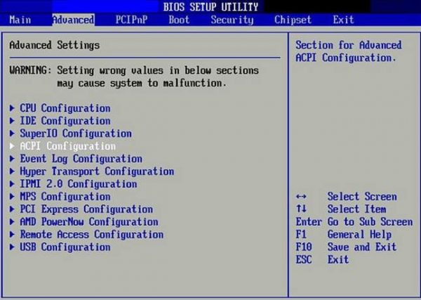

#### Le UEFI

Le UEFI (*Unified Extensible Firmware Interface*) est le successeur du BIOS. Ce dernier a été standardisé à partir des années 2000. Ce type de *firmware* possède une interface graphique (souris/clavier). L'UEFI a été conçu pour apporter de nouvelles fonctionnalités absentes du BIOS. Par exemple, l'UEFI supporte la technologie *Secure Boot* et le réseau nativement.

L'interface UEFI permet également la lecture de la table de partition `GPT` sur laquelle plus de 128 partitions peuvent être créées et qui supporte des disques durs de très grandes tailles.

Lors du démarrage, le UEFI effectue lui aussi un **POST**. Ensuite, le **firmware** montera la partition `.EFI` correspondant à l'entrée trouvée dans la *nvram*. Dans cette partition se trouve le chargeur d'amorce du système d'exploitation.

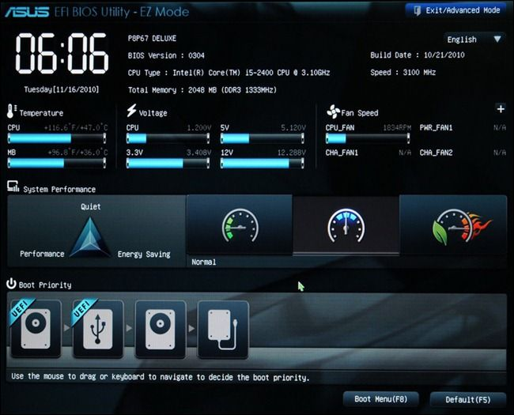

#### Comparatif

| **Caractéristique** | **BIOS** | **UEFI** |
|---------------------|----------|----------|
| Mode | 16 bits | 32/64 bits |
| Interface | Texte | Graphique |
| Disques supportés | MBR(≤ 2.2 To) | GPT (≥ 9 Zettaoctets) |
| Emplacement bootloader | MBR (secteur 0) | Partition EFI (.efi) |
| Secure Boot | Non | Oui |

### Étapes de l'amorçage

L'amorçage d'un système d'exploitation est une véritable symphonie où tous les musiciens doit suivre le rythme pour que cela fonctionne. Analysons cela de plus près:

- **Phase 1 : Préamorçage**
    - Exécution du POST par le BIOS/UEFI (*Power-On Self Test*)
    - Identification de l'information pour l'amorçage:
        - **BIOS**: Lit la table de partition `MBR` du disque dur et charge le gestionnaire de démarrage de Windows.
        - **UEFI**: Lit l'entrée contenue dans la `NVRAM` et charge le gestionnaire de démarrage de Windows.

- **Phase 2 : Amorçage**
    - Le gestionnaire de démarrage lit le magasin BCD pour connaître les options de démarrage disponibles.
    - Si plus d'un système d'exploitation est repéré, le système peut offrir un choix d'OS. C'est ce que l'on nomme le *multi-boot*.

- **Phase 3 : Chargement du noyau**
    - Le gestionnaire de démarrage exécute ensuite le chargeur d'amorce:
        - **BIOS**: C:\Windows\System32\winload.exe
        - **UEFI**: C:\Windows\System32\winload.efi
    - Le chargeur d'amorce démarre le noyau:
        - Les pilotes essentiels sont chargés
        - Le gestionnaire de session **SMSS.exe** est lancé
        - Les services sont lancés
        - **Winlogon** affiche l'écran d'ouverture de session

- **Phase 4 : Ouverture de session**
    - Authentification de l'utilisateur via le processus `lsass.exe`
    - Explorer.exe initialise le bureau, le menu démarrer, la barre des tâches et les tâches de démarrage.

### Schéma de l'amorçage

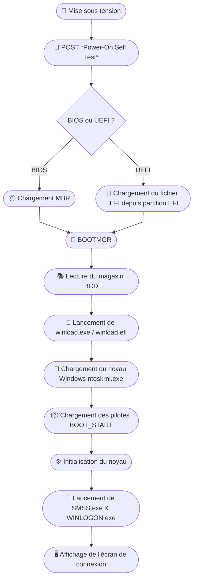

### Récupération (WinRE)

**WinRE** est un environnement de récupération offrant diverses options pour les utilisateurs et les administrateurs qui voudraient tenter de résoudre divers problèmes avec leur système d'exploitation, dont des problèmes en lien avec le démarrage du système.

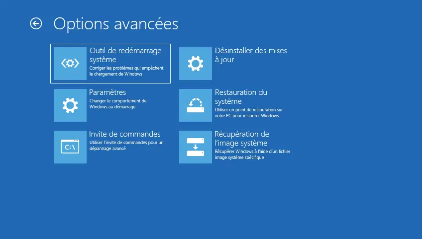

Il existe plusieurs méthodes pour accéder à l'environnement de récupération **WinRE**:

    - Redémarrez le système en maintenant la touche <kbd>Shift</kbd>
    - En accédant au menu `Paramètres` > `Système` > `Récupération`
    - À l'aide d'une clé USB d'installation
    - En redémarrant 3 fois consécutivement

#### Outils disponibles

- **Réparation du démarrage (Startup Repair)** : analyse et corrige automatiquement certains problèmes courants de démarrage (par exemple un secteur de boot corrompu ou un fichier BCD manquant).

- **Invite de commande (Command Prompt)** : permets d'exécuter des commandes avancées pour diagnostiquer et réparer le système (ex. : bootrec, chkdsk, sfc, etc.).

- **Restaurer le système (System Restore)** : retourne l’ordinateur à un état antérieur en utilisant un point de restauration (utile après une mise à jour ou un pilote problématique).

- **Paramètres de démarrage (Startup Settings)** : permets de redémarrer Windows en activant des options spéciales comme le mode sans échec, le débogage, ou la désactivation de la vérification des signatures de pilotes.

- **Désinstaller des mises à jour (Uninstall Updates)** : option pour supprimer la dernière mise à jour de qualité ou de fonctionnalité si celle-ci empêche Windows de démarrer correctement.

- **Paramètres du micrologiciel UEFI (UEFI Firmware Settings)** : permets de redémarrer directement dans les paramètres UEFI de la carte mère afin de modifier l’ordre de démarrage ou d’activer des fonctionnalités comme Secure Boot.

#### Mode sans échec

Le mode sans échec peut être utilisé lorsque Windows n'arrive pas à démarrer. Ce mode démarre Windows avec un minimum de dépendances afin d'augmenter les probabilités de réussir un démarrage du système d'exploitation. Une fois le système démarré, on peut alors essayer de repérer la source du problème dans les journaux.

Le mode sans échec est offert en 3 saveurs:

- Sans réseau
- Avec réseau
- Sans interface graphique (invite de commande)

Pour passer en mode sans échec, accédez à **WinRE**, puis cliquez sur `Paramètres` dans le menu des `Options avancées`.

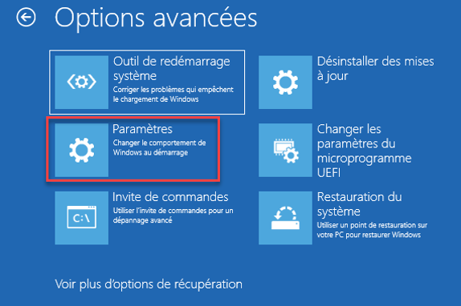

### Programmes au démarrage

Il existe différentes façons de lancer des logiciels au démarrage de Windows:

- Via le dossier démarrage d'un utilisateur
- Via le dossier démarrage commun
- Via le registre (que vous avez expérimenté)
- Via les tâches planifiées

#### Dossier démarrage

Il existe un dossier de démarrage par utilisateur, qui peut s'avérer utile dans le cas où nous voudrions programmer le démarrage automatique d'un logiciel ou d'un script pour un utilisateur particulier. Le chemin de ce dossier est le suivant : 

`C:\Users\%USERNAME%\AppData\Roaming\Microsoft\Windows\Start Menu\Programs\Startup`

Tous les logiciels et/ou scripts qui y seront déposés seront systématiquement lancés à l'ouverture de session de l'utilisateur concerné.

Dans le cas où vous auriez besoin de lancer un même logiciel pour tous les utilisateurs d'un PC, vous pourriez alors utiliser le dossier de démarrage commun situé à l'emplacement suivant:

`C:\ProgramData\Microsoft\Windows\Start Menu\Programs\StartUp`

La méthode de fonctionnement est exactement la même avec ce dossier. Vous y déposez vos scripts ou vos logiciels et ils seront lancés à l'ouverture de session d'un utilisateur.

#### Registre

Il est tout à fait possible d'utiliser le registre pour lancer des logiciels ou des scripts au démarrage de Windows. Vous l'avez d'ailleurs expérimenté lors de votre dernier exercice. Néanmoins, tout comme avec les dossiers de démarrage, là encore, il y a moyen de cibler un utilisateur ou plusieurs utilisateurs.

`HKCU:\SOFTWARE\Microsoft\Windows\CurrentVersion\Run`

Les entrées effectuées dans cette clé de registre servent à lancer des scripts ou des logiciels à l'ouverture de session de l'utilisateur concerné par la ruche **HKCU**.

`HKCU:\SOFTWARE\Microsoft\Windows\CurrentVersion\RunOnce`

À la différence de la clé `Run`, la clé `RunOnce` permet de lancer un logiciel ou un script automatiquement aussi à l'ouverture de session, mais ce ne sera fait qu'**une seule fois**. Cela permet de lancer une opération sans nécessairement la répéter à chaque ouverture de session. À titre d'exemple, l'installation d'un logiciel se prêterait très bien à cette façon de procéder puisqu'on ne l'installera qu'une seule fois.

De la même façon, nous pouvons utiliser des clés de registre similaires aux précédentes pour mettre en place des démarrages automatiques pour **tous les utilisateurs du système.** Pour ce faire, nous utiliserons les clés de registre suivantes:

`HKLM:\SOFTWARE\Microsoft\Windows\CurrentVersion\Run`

`HKLM:\SOFTWARE\Microsoft\Windows\CurrentVersion\RunOnce`

Ces dernières s'utilisent exactement de la même façon que celles dont nous avons discuté précédemment, mais elles auront une incidence sur tous les utilisateurs plutôt qu'un seul.

#### Tâches planifiées

Les tâches planifiées permettent non seulement de programmer le lancement de scripts et de logiciels lorsque certaines conditions sont remplies, mais elles permettent également de lancer des exécutables au démarrage de Windows. Nous analyserons de plus près le planificateur de tâches dans la prochaine section de cette page.

## Planification de tâches ⏲

Le planificateur de tâches est un composant Windows qui permet de lancer automatiquement des programmes, des scripts ou des commandes à des moments précis ou selon certains événements système.

Voici quelques exemples d'utilisation:

- Lancer un script de sauvegarde tous les jours à 2h du matin
- Nettoyer les fichiers temporaires au démarrage du système
- Exécuter une tâche administrative lors de la connexion d'un utilisateur
- Réinitialiser un service s'il venait à échouer

### Interface et accès

Vous pouvez accéder au planificateur de tâches via le menu démarrer ou en tapant la commande `taskschd.msc` via la fenêtre `Exécuter`.

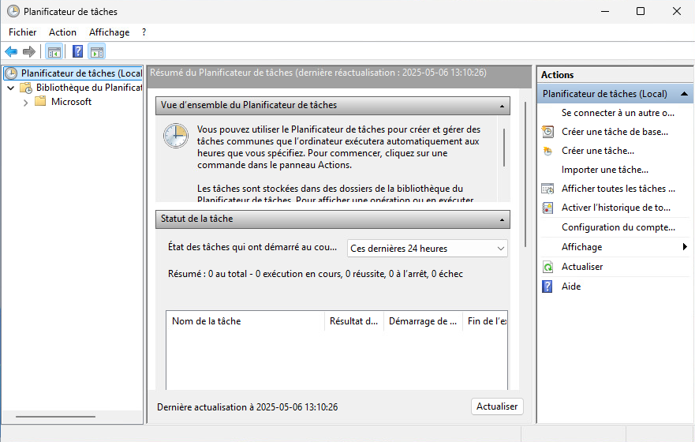

### Structure d'une tâche

Les tâches sont constituées de plusieurs éléments. Chacun de ces éléments doit être analysé et configuré au besoin pour assurer l'exécution de la tâche au moment opportun.

#### Le déclencheur (*trigger*)

Le déclencheur est un événement qui provoquera l'exécution de la tâche planifiée. Il peut s'agir simplement d'une date ou d'une heure, mais cela peut également être un élément plus complexe tel que l'apparition d'un événement particulier dans les journaux Windows.

#### L'action

Définit qu'est-ce que la tâche doit accomplir. Il s'agit généralement de lancer un script ou un logiciel. Le script contiendre l'ensemble des actions à effectuer.

#### Les conditions 

Les conditions permettent d'ajouter des contraintes supplémentaires. Lorsque que le déclencheur tentera de lancer l'exécution de la tâche, les contraintes devront elles aussi, être respectées pour que la tâche puis être lancée. Exemple:

- **Déclencheur:** Tous les jours à 2h00 du matin
- **Action:** Lancer le script *sauvegarde.ps1*
- **Conditions:** Uniquement si le PC est branché sur l'alimentation électrique (portable)

#### Paramètres

Les paramètres sont des options additionnelles pour affiner le comportement d'une tâche dans des circonstances et des contextes précis. Voici quelques exemples:

- Arrêter la tâche si elle dépasse un temps donné.
- Recommencer la tâche si elle échoue.
- Exécuter la tâche même si l'utilisateur concerné n'est pas connecté.

### Création d'une tâche

Ouvrez le planificateur de tâche et cliquez sur *Créer une tâche...*

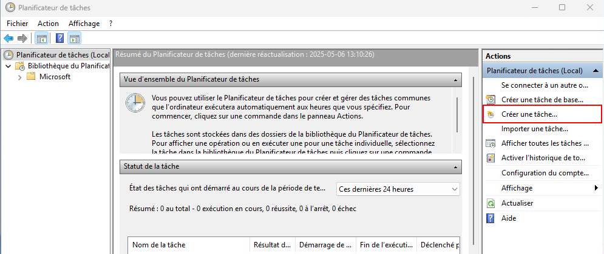

Dans l'onglet « **Général** », vous devrez donner un nom à votre tâche, une petite description ainsi que configurer quelques options de sécurité:

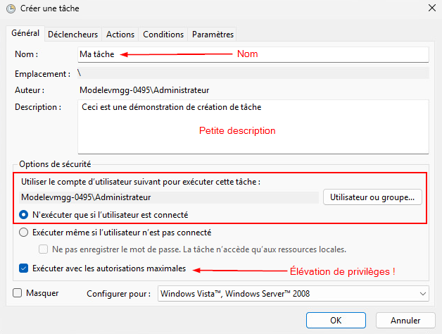

Dans l'onglet « **Déclencheurs** », vous devrez configurer <u>au moins un déclencheur.</u>(il peut y en avoir plusieurs!) Les déclencheurs peuvent posséder des propriétés spécifiques comme *répétition de la tâche*, *arrêt après x temps*, etc.

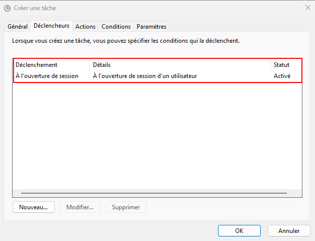

Évidemment, il nous faudra définir l'action à entreprendre dans l'onglet « **Actions** ». Pour l'exemple, je ne ferai qu'afficher un peu de texte dans une fenêtre Powershell.

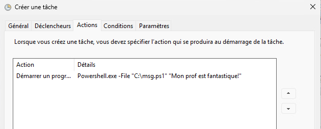

:::caution
Remarquez que pour lancer un script *PowerShell*, je dois lancer `PowerShell.exe`, puis préciser le fichier à exécuter avec l'argument `-File`.
:::

Validez les conditions de la tâche et ajoutez celles dont vous avez besoin:

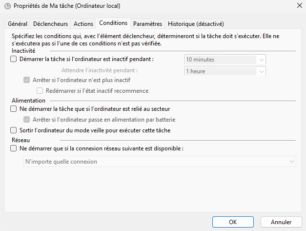

Faites de même pour les paramètres:

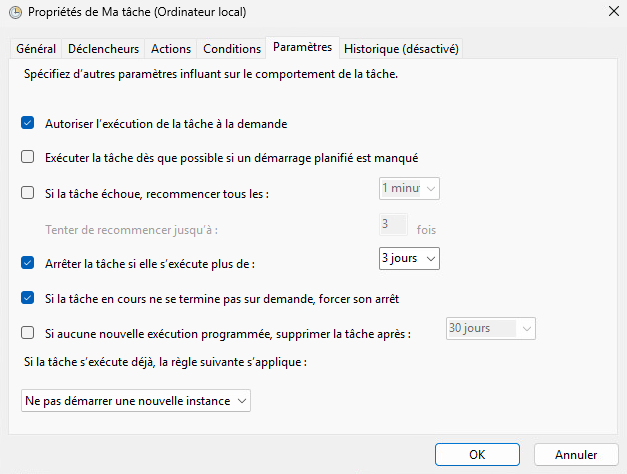

### Tests et validation

Dans la section « *Paramètres* », vous pouvez cocher l'option « *Autoriser l'exécution de la tâche à la demande* ». Cela vous permettra de lancer l'exécution de la tâche et de valider l'exécution de celle-ci:

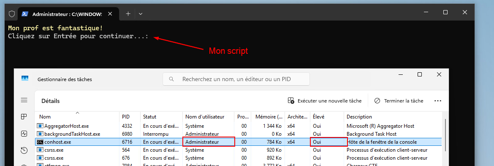

:::info
Vous souvenez-vous m'avoir vu cocher la case « *Exécuter avec les autorisations maximales* » lorsque j'ai créé la tâche ? Remarquez que celle-ci s'est exécutée avec des privilèges élevés.
:::