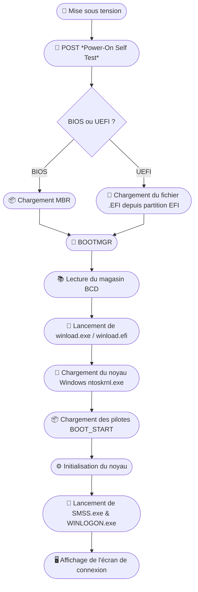

import useBaseUrl from '@docusaurus/useBaseUrl';
import ThemedImage from '@theme/ThemedImage';
import Tabs from '@theme/Tabs';
import TabItem from '@theme/TabItem';

# Démarrage et planification 📅

## Démarrage de Windows

Pour l'administrateur d'un système (serveur et/ou pc), connaître et comprendre les différents processus sous-jacents au démarrage est primordiale. Cela vous aidera à établir des diagnostics justes et fondés. 

### Firmware

Lorsqu'un ordinateur démarre, le premier programme exécuté est stocké sur une puce mémoire soudée sur la carte mère. Ce programme s'appelle un *firmware*. Aujourd'hui, il existe deux type de *firmware*: 
- Le BIOS (*Basic Input/Output System*)

- Le UEFI (*Unified Extensible Firmware Interface*)

Le rôle du BIOS et du UEFI consiste, ni plus ni moins, à exécuter dans un ordre déterminé, les étapes nécessaires au bon démarrage de l'ordinateur. De plus, ils peuvent stocker certaines configurations de bas niveau du système.  **Par exemple:** l'activation de certains ports USB ou encore l'ordre de démarrage des périphériques.

#### Le BIOS

> *C'est quoi le BIOS Gabriel ?*
>
> *-Les étudiants*

Le BIOS (*Basic Input Output System*) est un *firmware* datant des premiers PC (années 80). Fonctionnant en mode 16 bits, avec seulement plus ou moins ~ 1 Mo d'espace adressable, le BIOS offre une interface texte très basique pour l'administrateur. Pour démarrer un système d'exploitation, le BIOS nécessite que le stockage en place utilise une table de partition de type `MBR` limité à 4 partititons (3 primaires et 1 étendue). De plus, la table de partition de type `MBR` est incapable d'adresser des disques durs de plus de 2,2 To.  ([Besoin d'un rappel sur les tables de partition ?](./11-Disques%20et%20partitions.md#la-table-de-partition--mbr-vs-gpt))

Lors du démarrage, le BIOS effectue d'abord et avant tout le **POST** (*Power On Self-Test*) qui assurera une série de tests sur les différentes composantes du PC. Une fois cette série de tests effectuées, le *firmware* chargera en mémoire le contenu de la table de partition `MBR` et localisera la partition active sur le disque dur avant de charger celle-ci à son tour et de lancer le chargeur du système d'exploitation.

#### Le UEFI

Le UEFI (*Unified Extensible Firmware Interface*) est le successeur du BIOS. Ce dernier a été standardisé à partir des années 2000. Ce type de *firmware* possède une interface graphique (souris/clavier). L'UEFI a été conçu pour apporter de nouvelles fonctionnalités absentes du BIOS. Par exemple, l'UEFI supporte la technologie *Secure Boot* et le réseau nativement.

L'interface UEFI permet également la lecture de la table de partition `GPT` sur laquelle plus de 128 partitions peuvent être créées et qui supporte des disques dur de très grandes tailles.

Lors du démarrage, le UEFI effectue lui aussi un **POST**. Ensuite, le **firmware** montera la partition `.EFI` correspondant à l'entrée trouvée dans la *nvram*. Dans cette partition, se trouve le chargeur d'amorce du système d'exploitation.

#### Comparatif

| **Caractéristique** | **BIOS** | **UEFI** |
|---------------------|----------|----------|
| Mode | 16 bits | 32/64 bits |
| Interface | Texte | Graphique |
| Disques supportés | MBR(≤ 2.2 To) | GPT (≥ 9 Zettaoctets) |
| Emplacement bootloader | MBR (secteur 0) | Partition EFI (.efi) |
| Secure Boot | Non | Oui |

### Étapes de l'amorçage

L'amorçage d'un système d'exploitation est une véritable symphonie où tous les musiciens doit suivre le rythme pour que cela fonctionne. Analysons cela de plus près:

- **Phase 1 : Pré-amorçage**
    - Exécution du POST par le BIOS/UEFI (*Power-On Self Test*)
    - Identification de l'information pour l'amorçage:
        - **BIOS**: Lit la table de partition `MBR` du disque dur et charge le gestionnaire de démarrage de Windows.
        - **UEFI**: Lit l'entrée contenue dans la `NVRAM` et charge le gestionnaire de démarrage de Windows.

- **Phase 2 : Amorçage**
    - Le gestionnaire de démarrage lit le magasin BCD pour connaître les options de démarrage disponibles.
    - Si plus d'un système d'exploitation est repéré, le système peut offrir un choix d'OS. C'est ce que l'on nomme le *multi-boot*.

- **Phase 3 : Chargement du noyau**
    - Le gestionnaire de démarrage exécute ensuite le chargeur d'amorce:
        - **BIOS**: C:\Windows\System32\winload.exe
        - **UEFI**: C:\Windows\System32\winload.efi
    - Le chargeur d'amorce démarre le noyau:
        - Les pilotes essentiels sont chargés
        - Le gestionnaire de session **SMSS.exe** est lancé
        - Les services sont lancés
        - **Winlogon** affiche l'écran d'ouverture de session

- **Phase 4 : Ouverture de session**
    - Authentification de l'utilisateur via le processus `lsass.exe`
    - Explorer.exe initialise le bureau, le menu démarrer, la barre des tâches et les tâches de démarrage.

### Schéma de l'amorçage

```mermaid
%%{ init: { "flowchart": { "curve": "linear" } } }%%
flowchart TD
    A([🔌 Mise sous tension]) --> B([🧪 POST *Power-On Self Test*])
    B --> C{BIOS ou UEFI ?}
    C -- BIOS --> D([📦 Chargement MBR])
    C -- UEFI --> E([📂 Chargement du fichier .EFI depuis partition EFI])

    D --> F([🧠 BOOTMGR])
    E --> F

    F --> G([📚 Lecture du magasin BCD])
    G --> H([🚀 Lancement de winload.exe / winload.efi])
    H --> I([🧠 Chargement du noyau Windows ntoskrnl.exe])
    I --> J([📦 Chargement des pilotes BOOT_START])
    J --> K([⚙️ Initialisation du noyau])
    K --> L([🧍 Lancement de SMSS.exe & WINLOGON.exe])
    L --> M([🖥️ Affichage de l'écran de connexion])
```

### Récupération (WinRE)

**WinRE** est un environnement de récupération offrant diverses options pour les utilisateurs et les administrateurs qui voudraient tenter de résoudre divers problèmes avec leur système d'exploitation, dont des problèmes en lien avec le démarrage du système.

Il existe plusieurs méthodes pour accéder à l'environnement de récupération **WinRE**:

    - Redémarrez le système en maintenant la touche <kbd>Shift</kbd>
    - En accédant au menu `Paramètres` > `Système` > `Récupération`
    - À l'aide d'une clé USB d'installation
    - En redémarrant 3 fois consécutivement

#### Outils disponibles

- **Réparation du démarrage (Startup Repair)** : analyse et corrige automatiquement certains problèmes courants de démarrage (par exemple un secteur de boot corrompu ou un fichier BCD manquant).

- **Invite de commandes (Command Prompt)** : permet d'exécuter des commandes avancées pour diagnostiquer et réparer le système (ex. : bootrec, chkdsk, sfc, etc.).

- **Restaurer le système (System Restore)** : retourne l’ordinateur à un état antérieur en utilisant un point de restauration (utile après une mise à jour ou un pilote problématique).

- **Paramètres de démarrage (Startup Settings)** : permet de redémarrer Windows en activant des options spéciales comme le mode sans échec, le débogage, ou la désactivation de la vérification des signatures de pilotes.

- **Désinstaller des mises à jour (Uninstall Updates)** : option pour supprimer la dernière mise à jour de qualité ou de fonctionnalité si celle-ci empêche Windows de démarrer correctement.

- **Paramètres du micrologiciel UEFI (UEFI Firmware Settings)** : permet de redémarrer directement dans les paramètres UEFI de la carte mère afin de modifier l’ordre de démarrage ou d’activer des fonctionnalités comme Secure Boot.

#### Mode sans échec

### Programmes au démarrage