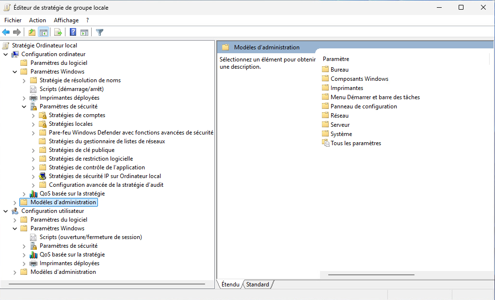
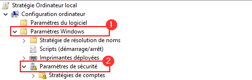
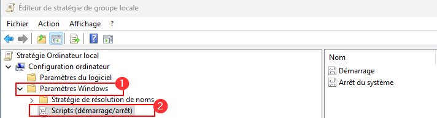
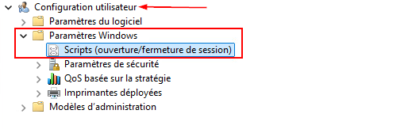
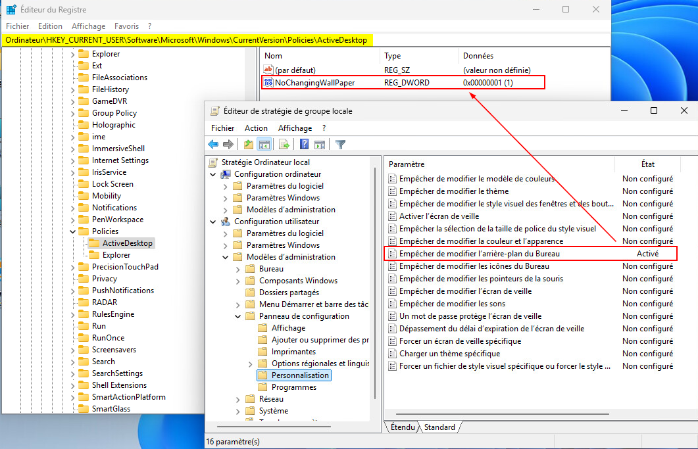
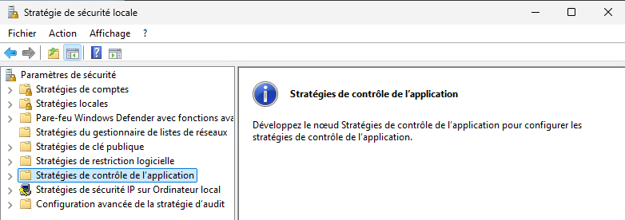
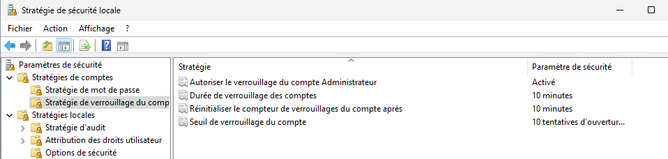
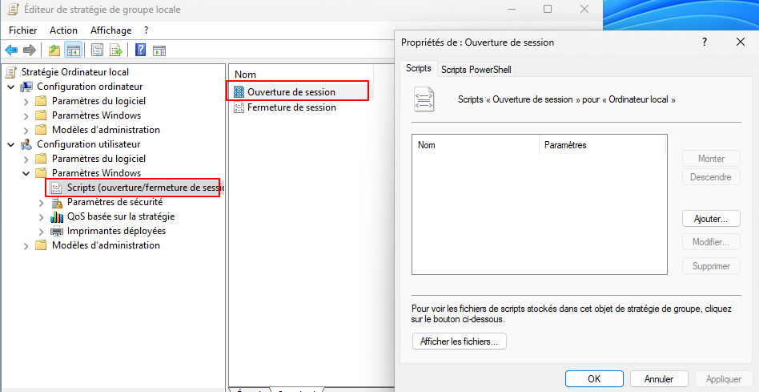
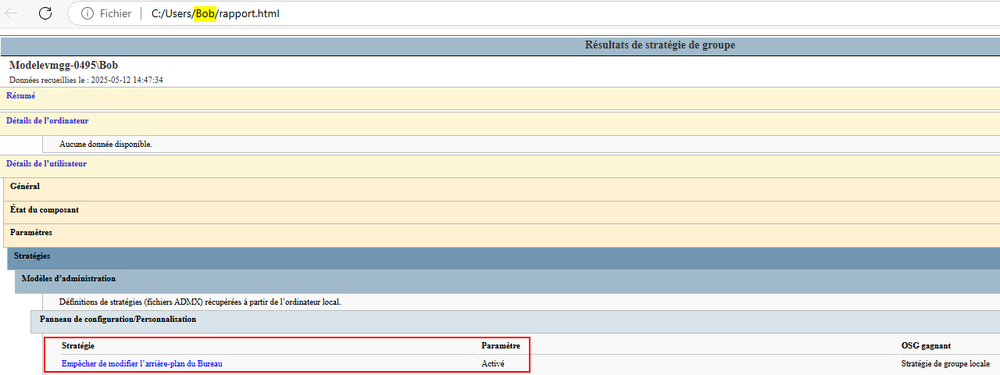
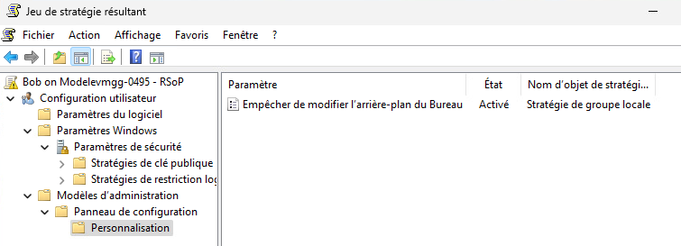

import useBaseUrl from '@docusaurus/useBaseUrl';
import ThemedImage from '@theme/ThemedImage';
import Tabs from '@theme/Tabs';
import TabItem from '@theme/TabItem';
---
draft: true
---
# Stratégies de groupe 🧪

## Définition des stratégies de groupe

Les stratégies de groupe (*GPO*) sont des mécanismes de gestion de la configuration et de la sécurité du système d'exploitation Windows. Elles permettent aux administrateurs système de contrôler le comportement des ordinateurs et des utilisateurs dans un environnement Windows en appliquant des règles et des configurations à échelle locale.

Les stratégies de groupe permettent de définir des paramètres qui affecteront:
 - **La sécurité** (exigences de mot de passe, verrouillage du poste, etc.)
 - **Les paramètres système**
 - **Les paramètres des utilisateurs** (restrictions d'accès aux applications, redirection de dossiers, etc.)
 - **La gestion de ressources** (lecteurs réseau, imprimantes, etc.)

 :::caution[Stratégies locales et Active Directory]
Les stratégies de groupes **locales** sont appliquées directement à une machine. Ils ne font pas les confondre avec les stratégies de groupe d'un domaine **Active Directory** qui peuvent s'appliquer sur l'ensemble d'un réseau.
 :::

 ## Versions de Windows compatibles

 Bien qu'elles soient accessibles dans la plupart des versions de Windows, leur accessibilité varie légèrement selon les éditions du système d'exploitation:

 - **Windows XP (PRO) et versions ultérieures:**
 Les stratégies de groupe locales sont disponibles dans les versions "Professionnelle" et ultérieures des systèmes Windows (XP Pro, Vista, 7 Pro, 8 Pro, 10 Pro, etc.).

 - **Windows Familiale:**
 Les versions **Familiale** de Windows (*Home*) ne disposent pas de l'éditeur des stratégies de groupe. Il existe des moyens de l'activer manuellement, mais malgré cela, certaines fonctionnalités en lien avec les stratégies de groupes demeureront non fonctionnelles.

 - **Windows Serveur:**
 Les versions de Windows Serveur prennent en charque les stratégies de groupe locales, mais on les utilisera surtout pour les stratégies de groupe de domaine.

 ## Vue d'ensemble

 La gestion des stratégies de groupe passe par **l'éditeur de stratégie de groupe locale (gpedit.msc)**.

 

 Cet outil permet de modifier les paramètres de configuration à travers deux grandes sections:

 1. **Configuration de l'ordinateur:** Affecte les paramètres qui s'appliquent aux ordinateurs, quel que soit l'utilisateur qui se connecte. Par exemple, la configuration des services, des processus système, ou des politiques de sécurité.

 2. **Configuration de l'utilisateur:** Affecte les paramètres qui sont appliqués à l'utilisateur connecté, indépendamment de la machine sur laquelle il se trouve. Cela inclut la gestion des profils, des applications et des restrictions d'accès.

 ## Ordinateur versus Utilisateur

 ### Ordinateur

 La configuration de **l'ordinateur** contient des paramètres qui s'appliquent à **l'ensemble de la machine**, indépendamment de l'utilisateur connecté. Voici quelques exemples de paramètres disponibles dans cette section:

 - **Paramètres Windows \> Paramètres de sécurité**

    - Exigences sur les mots de passe (longueur minimale, complexité).
    - Politiques de verrouillage de compte.
    - Contrôle des droits d’accès utilisateur.

    

- **Paramètres Windows \> Scripts (Dmarrage/Arrêt)**

    - Exécution de scripts à chaque démarrage ou arrêt du système.

    

- **Modèles d'administration \> Système, Réseau, etc.**

    - Désactivation de certains services.
    - Définition des emplacements de stockage.
    - Restriction sur les mises à jour automatiques.

    

:::important
Les stratégies de configuration de l'ordinateur sont appliquées au démarrage de la machine, avant la connexion de l'utilisateur.
:::

### Utilisateur

La configuration de l'utilisateur contient des paramètres qui s'appliquent à **un utilisateur spécifique**. Voici quelques exemples de paramètres disponibles dans cette section:

- **Paramètres Windows \> Scripts (Ouverture/Fermeture de session)**
    
    - Exécution de scripts lors de la connexion ou de la déconnexion.

        

- **Modèles d'administration \> Menu Démarrer, Bureau, Panneau de configuration, etc.**

    - Cacher certains éléments de l'interface graphique
    - Empêcher l'accès à certaines fonctionnalités (Ex: <kbd>ctrl</kbd>+<kbd>alt</kbd>+<kbd>del</kbd>)

:::important
Les stratégies de configuration de l'utilisateur sont appliquées au moment de la connexion de l'utilisateur.
:::

### Tableau comparatif

|Élément|Configuration de l'ordinateur|Configuration de l'utilisateur|
|-------|-----------------------------|------------------------------|
|**Moment d'application**|Au démarrage du système|À la connexion de l'utilisateur|
|**Portée**|Tous les utilisateurs de l'ordinateur|Uniquement l'utilisateur concerné|
|**Exemples typiques**|Mots de passe, services, scripts de boot|Menu démarrer, scripts de session, Bureau|
|**Utilité principale**|Sécuriser et configurer la machine|Adapter l'environnement de travail|
|**Méthode de traitement**|Avant le login|Après le login|

## Stratégies de groupe et registre

En réalité, les stratégies de groupe modifient des valeurs dans le registre Windows. Cela permet au système d'exploitation de lire et d'appliquer les politiques à chaque démarrage et/ou connexion.

### Rappel sur le registre

Le registre Windows est une base de données hiérarchique contenant les paramètres de configuration du système d'exploitation. Il est divisé en plusieurs **ruches**, dont les principales sont:
 - `HKEY_LOCAL_MACHINE` (*HKLM*) : paramètres liés à la machine, accessible par tous les utilisateurs.
 - `HKEY_CURRENT_USER` (*HKCU*): paramètres liés à l'utilisateur actuellement connecté.

 ### Où sont les stratégies dans le registre ?

 Principalement deux emplacements:

 |Type de stratégie|Emplacement dans le registre|
 |-----------------|----------------------------|
 |**Configuration de l'ordinateur**|`HKLM\Software\Policies` et<br/> `HKLM\Software\Microsoft\Windows\CurrentVersion\Policies`
 |**Configuration de l'utilisateur**| `HKCU\Software\Policies` et<br/> `HKCU\Software\Microsoft\Windows\CurrentVersion\Policies`

La modification d'une stratégie de groupe entraine automatiquement une modification du registre:

 

:::tip
Pour savoir quelle stratégie de groupe modifie quoi dans le registre, je vous recommande d'utiliser le site **[GPSearch](https://gpsearch.azurewebsites.net/)**. Ce site vous permet de rechercher des stratégies de groupe spécifiques et même de savoir comment celles-ci s'appliquent.
:::

> *Donc si je comprends bien Gabriel; je n'ai qu'à modifier une valeur dans le registre lorsqu'une GPO m'incommode au Cégep ou sur mon lieu de travail ?*
>
> *-Les étudiants*

Oui, et non... Pour modifier le registre, il vous faudra minimalement être administrateur local de la machine, ce qui n'est déjà pas garanti. Ensuite, il faudra que la stratégie de groupe que vous tentez de modifier s'y prête (*Emplacement, effets sur le système, etc*). Qui plus est, dès que vous vous déconnecterez ou que vous redémarrerez le PC, les stratégies de groupe se réappliqueront dans le registre. Bref, outrepasser une stratégie de groupe n'est non seulement pas recommandé, ce n'est pas garanti de fonctionner non plus.

## Les stratégies de sécurité 

Les stratégies de sécurité locales font partie intégrante des stratégies de groupe locales. Elles permettent à un administrateur de contrôler en détail les comportements liés à la sécurité d'un poste Windows : exigences des mots de passe, droits d'accès, audit, verrouillage, etc.

Ces paramètres sont configurables via :

- `gpedit.msc` (éditeur de stratégie de groupe locale)
- `secpol.msc` (console dédiée à la stratégie de sécurité locale)



### Catégories principales

1. Politiques de compte

    - Politique de mot de passe
        - Longueur minimale du mot de passe
        - Complexité requise
        - Durée de vie maximale/minimale
        - Historique des mots de passe

    - Politique de verrouillage de compte
        - Nombre de tentatives échouées avant le verrouillage
        - Durée de verrouillage
        - Réinitialisation du compteur

        

2. Politiques locales

    - Attribution des droits d'utilisateur
        - Qui peut se connecter localement, accéder à distance, fermer le système, etc.
    
    - Options de sécurité
        - Divers paramètres sensibles:
            - UAC
            - Restrictions d'accès administrateur
            - Partage de fichiers non sécurisé
            - Élévation de privilèges

    - Audit de la sécurité
        -Journalisation des actions sensibles
            - Connexions réussies ou échouées
            - Accès aux objets (fichiers, dossiers)
            - Changements de stratégie

## Scripts via stratégies de groupe

Les stratégies de groupe locales permettent de configurer des **scripts automatisés** à différents moments:

|Moment du script|Ciblé par...|S'applique à...|Emplacement dans gpedit.msc|
|:-------------:|----------------|----------------|--------------------------|
|**Démarrage**|Configuration ordinateur|Avant l'ouverture de session|`Configuration ordinateur > Paramètres Windows > Scripts`|
|**Arrêt**|Configuration ordinateur|Lorsqu'on éteint l'ordinateur|Idem|
|**Ouverture de session**|Configuration utilisateur|Quand un utilisateur ouvre une session|`Configuration utilisateur > Paramètres Windows > Scripts`|
|**Fermeture de session**|Configuration utilisateur|Lorsque l'utilisateur se déconnecte|Idem|

L'utilisation des scripts est utile pour toutes sortes d'objectifs:

- Brancher un lecteur réseau à l'ouverture de session.
- Journaliser un arrêt ou un démarrage de l'ordinateur.
- Lancer ou arrêter certains programmes automatiquement.

:::important
Pour lancer des scripts à l'aide des stratégies de groupe, vous devez utiliser l'un des langages de *scripting* pris en charge:
- **.BAT / .CMD** (Batch)
- **.VBS** (VBScript)
- **.PS1** (Powershell)
:::



## Dépannage

Il peut arriver que vous éprouviez des difficultés à faire fonctionner une stratégie de groupe pour toutes sortes de raisons. Heureusement, il existe certains outils très efficace pour auditer et vérifier quelles sont les stratégies qui fonctionnent et celles qui semblent problématiques:

|Outil|Description|
|-------|---------------------------|
|`gpresult`| Affiche les stratégies effectives appliquées|
|`rsop.msc`| Vue graphique des stratégies réellement appliquées|
|`Event Viewer`| Permets de consulter les erreurs lors de l'application de stratégies|
|`regedit`| Permets de vérifier directement les clés modifiées|

### gpresult

La commande `gpresult` vous permettra de générer un rapport sur les stratégies appliquées à l'utilisateur ou à l'ordinateur. Ce rapport peut même être effectué sous format HTML pour une meilleure lisibilité:

```batch
gpresult /r
```

ou

```batch
gpresult /h rapport.html
```



### rsop

La commande `rsop.msc` ouvre une interface graphique permettant de visualiser les stratégies appliquées à l'utilisateur ou à l'ordinateur (*si permission pour ordinateur*):



### registre

Comme nous l'avons vu un peu plus haut, les stratégies de groupe modifient différentes clés et valeurs du registre Windows. Fouiller dans celui-ci à la recherche des clés correspondantes aux politiques que vous avez mis en place peut donc s'avérer utile dans votre investigation.