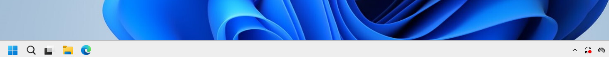
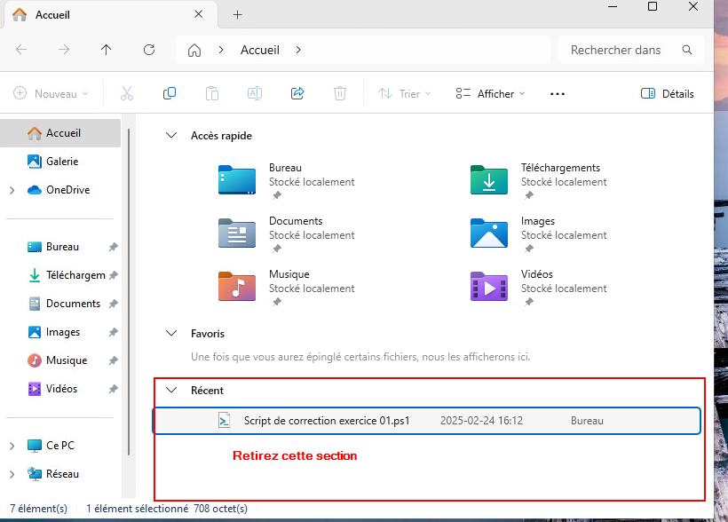
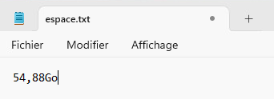
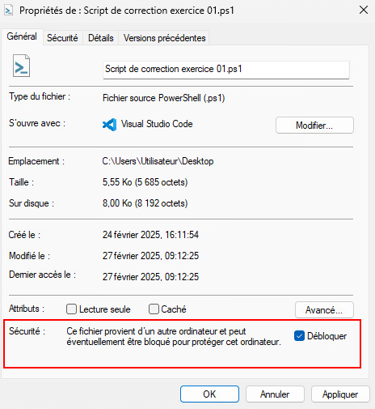
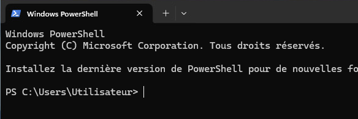
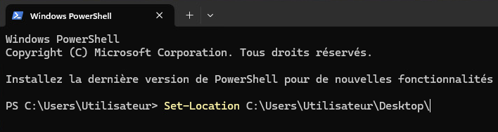
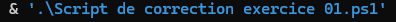
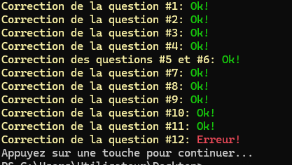

import useBaseUrl from '@docusaurus/useBaseUrl';
import ThemedImage from '@theme/ThemedImage';
import Tabs from '@theme/Tabs';
import TabItem from '@theme/TabItem';

# Exercice 01

## Interface graphique & Architecture

L'Objectif de cet exercice est de vous familiariser avec l'environnement de Windows 11. À travers les différentes questions qu'il propose, vous devrez naviguer à travers le système, utiliser différents menus et entreprendre différentes actions.

Si une question vous laisse perplexe ou si vous ne savez tout simplement pas comment exécuter une action particulière, faites quelques recherches sur le web pour arriver à vos fins.

:::caution[Utilisation d'IA]
Je ne vous recommande pas l'utilisation de l'intelligence artificielle pour la réalisation de cet exercice. Dans certains exercices, l'IA peut être utile, mais pas dans celui-ci puisque l'objectif est de vous faire apprendre à repérer les différents menus et paramètres de Windows. Évidemment, je ne peux pas vérifier si vous utilisez l'IA ou non, mais je vous demande de me faire confiance et de suivre mes conseils, car autrement, cela pourrait vous jouer des tours éventuellement.
:::

## Préalables

- Vous devez évidemment posséder une VM Windows 11 prête à être utilisée

## Étapes de réalisation

### Question 1

Trouvez le moyen de changer l'alignement de la barre des tâches afin que vous puissiez avoir votre menu démarrer à gauche tel que sur l'image ci-dessous:

    

### Question 2 
Faites afficher les icônes suivantes sur le bureau:
    - Ce PC
    - Panneau de configuration
    - Corbeille
    - Fichiers de l'utilisateur

    
    :::caution
    Il ne s'agit pas de créer des raccourcis mais bien de faire afficher les icônes via les paramètres du système.
    :::

### Question 3
Trouvez comment il est possible de faire afficher les extensions de fichiers. C'est-à-dire le suffixe à la fin d'un fichier. (Exemple: **.txt**, **.docx**, **.jpg**, etc.)

### Question 4
Dans l'explorateur Windows, il est possible de repérer une section « Récent ». Trouvez comment ne plus afficher cette section:

### Question 5
À la racine de votre disque dur (C:), créez les dossiers et les fichiers suivants: 

:::caution[Fautes typographiques]
Attention aux fautes typographiques! Le script de correction vous retournera des erreurs si un nom de dossier ou de fichier n'est pas bien épelé par exemple.
:::

    <ThemedImage
        alt="Schéma"
        sources={{
            light: useBaseUrl('/img/Windows/Exercices/StructureDossier_W.svg'),
            dark: useBaseUrl('/img/Windows/Exercices/StructureDossier_D.svg'),
        }}
    />

### Question 6

- Renommez le fichier « **Exercice_Triangles.txt** » pour « **Exercice_Trigonométrie.txt** ».
- Renommez le dossier « **Français** » pour « **Littérature** ».
- Déplacez le fichier « **Gameplay.mp4** » dans le dossier « **Overwatch** ».
- Déplacez le dossier « **Sauvegardes** » dans le dossier « **Solitaire** ».
- Créez un fichier dans le dossier « **Littérature** » nommé « **Roman.txt** ».
- Créez un dossier dans le dossier « **Mathématiques**» nommé « **Algèbre** ».
- Supprimez le dossier « **Sauvegardes** »
- Supprimez le fichier « **Poésie.txt** »

### Question 7

Trouvez l'emplacement du fichier **calc.exe**. Il s'agit du programme de la calculatrice Windows. Créez un raccourci directement sur le bureau vous permettant de lancer celle-ci directement. Nommé ce raccourci « **Calcultarice** ».

### Question 8

Appuyez simultanément sur les touches du clavier <kbd>&#8862; win</kbd> et <kbd>r</kbd> pour lancer la fenêtre « **Exécuter** » et entrez la commande `ncpa.cpl` suivi de la touche <kbd>Entrée</kbd>.

Dans la fenêtre qui s'ouvre, renommez votre carte réseau à l'aide du nom « **Local** ».

### Question 9

Appuyez simultanément sur les touches du clavier <kbd>&#8862; win</kbd> et <kbd>r</kbd> pour lancer la fenêtre « **Exécuter** » et entrez la commande `sysdm.cpl` suivie de la touche <kbd>Entrée</kbd>.

Dans la fenêtre qui s'ouvre, trouvez comment renommer votre ordinateur et baptisez-le « **W11** ». Il se peut qu'un redémarrage soit nécessaire.

### Question 10

Créez un fichier texte que vous nommerez « **espace.txt** » sur votre bureau. À l'intérieur de ce fichier, inscrivez en Giga-octet <mark>l'espace disque utilisé</mark> sur votre disque dur principal. Par exemple, pour inscrire 15,72 Giga-octets, inscrivez 15,72Go <u>(attention à la virgule et à la typographie)</u>

### Question 11

Trouvez comment désactiver complètement les notifications sur le système et procédez à la désactivation.

### Question 12

Trouvez comment vous pouvez faire en sorte que l'application « **OneDrive** » ne démarre pas automatiquement lors du démarrage de l'ordinateur et désactivez-le.

:::caution
Il y a plus d'une réponse valable à cette question.
:::

## Correction

1. Commencez par télécharger [le script de correction](../Assets/Exercices/01/Script_de_correction_exercice_01.ps1) sur votre machine virtuelle.

2. Lorsque le script sera sur votre PC, consultez les propriétés du fichier et cochez la case « Débloquer ce fichier »:

    

3. Appuyez simultanément sur les touches du clavier <kbd>&#8862; win</kbd> et <kbd>r</kbd> pour lancer la fenêtre « **Exécuter** » et entrez la commande `Powershell.exe -ExecutionPolicy Unrestricted` suivie de la touche <kbd>Entrée</kbd>. 

    

4. Dans la fenêtre de Powershell qui s'ouvre, utilisez la commande `set-location` suivi du chemin où le script se situe dans votre PC. Par exemple, si vous avez téléchargé le script dans votre dossier téléchargement, il vous faudrait entrez la commande `Set-Location C:\Users\Utilisateur\Downloads`

    

5. Entrez maintenant la commande suivante pour exécuter le script:

    

6. L'exécution devrait ressembler à ceci:

    

