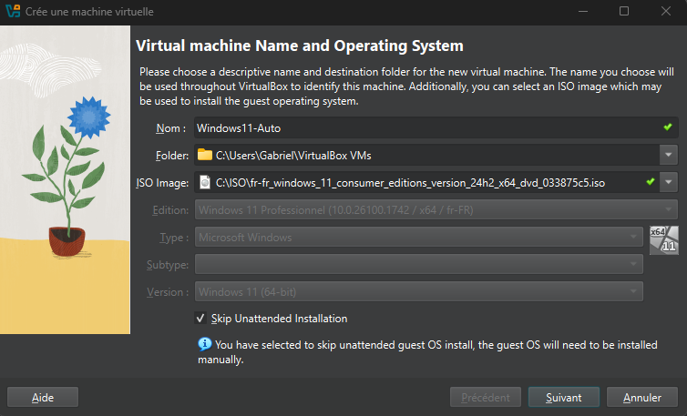
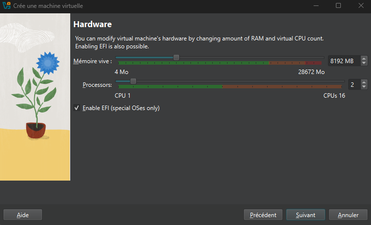
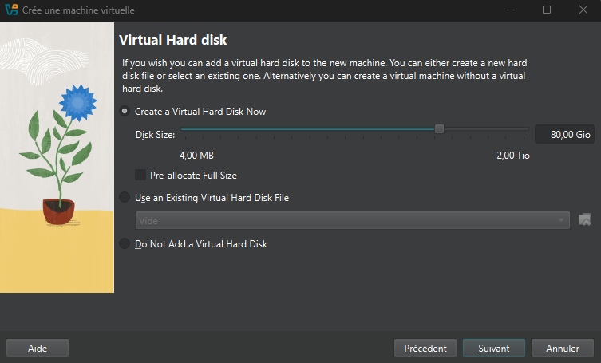
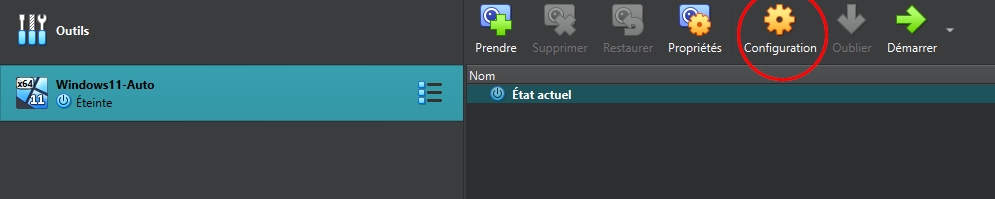
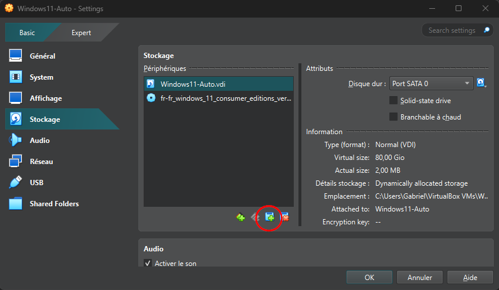
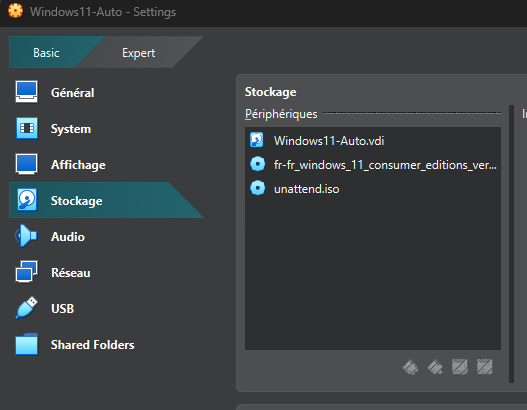
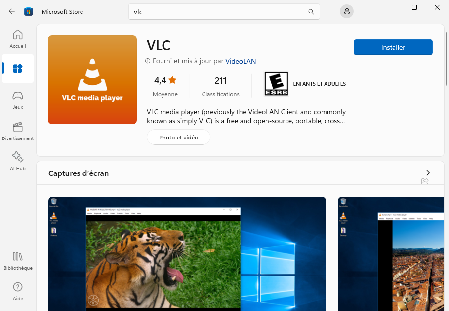
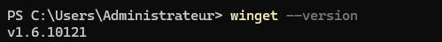
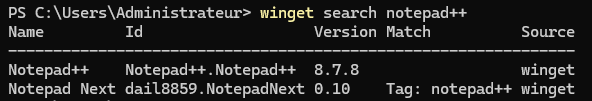
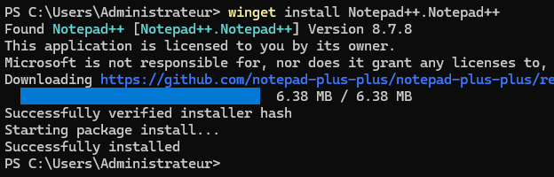

import useBaseUrl from '@docusaurus/useBaseUrl';
import ThemedImage from '@theme/ThemedImage';
import Tabs from '@theme/Tabs';
import TabItem from '@theme/TabItem';

# Exercice 03

## Installation et désinstallation de Logiciels

Dans cet exercice, vous aurez l'occasion d'installer et de désinstaller des logiciels ou des applications en expérimentant diverses méthodes d'installation et de désinstallation.

## Préalables

### Windows 11 (24H2) - Custom ✅

Pour les besoins de ce laboratoire, je vais vous fournir une nouvelle version de Windows 11 (24h2 - Pro). Je vais également vous fournir des instructions d'installation qui automatiseront l'installation de Windows.

#### Préparation

- Débuter par vous procurer le nouveau fichier ISO. Idéalement, demandez à l'enseignant de vous en fournir une copie en classe. Autrement, il est possible de le télécharger à partir de [ce lien](https://sh.tonprof.ca/w11)

- Vous aurez besoin d'un second fichier ISO un peu spécial. Ce deuxième ISO permet d'automatiser l'installation de Windows 11 en exécutant certains scripts et en vous évitant d'avoir à répondre à toutes sortes de questions. Encore une fois, demandez une copie à l'enseignant ou téléchargez-le [depuis ce lien.](https://sh.tonprof.ca/unattend)

#### Configuration de la VM

Créez une nouvelle machine virtuelle comme vous le feriez habituellement:

- Donnez un nom à la machine
- Sélectionnez l'iso de Windows que je vous ai fourni
- Sélectionnez Windows 11 pro
- <mark>Cochez *Skip Unattended Installation* </mark>



À l'étape suivante, précisez les ressources que vous attribuez à votre machine virtuelle:



Finalement, vous pouvez laisser l'espace disque attribué tel qu'il l'est par défaut:



Une fois la machine virtuelle créée, il nous restera quelques modifications à lui apporter. Sélectionnez-la et dirigez-vous dans le menu des configurations de la VM.



Sélectionnez la section « Stockage » puis cliquez sur « Ajouter un périphérique ».



Dans la nouvelle fenêtre qui s'ouvrira, utilisez le bouton « Ajouter » l'iso *spécial* vous permettant d'automatiser l'installation



Votre machine virtuelle est désormais prête à être démarrée. Vous devrez appuyer sur une touche pour démarrer l'installation, puis c'est tout. Le reste de l'installation devrait se faire de manière entièrement autonome.

:::caution
Certaines étapes peuvent s'avérer plus longues. **Soyez patient!** La machine redémarrera à quelques reprises également. Sachez également qu'il vous faudra installer les additions de VirtualBox manuellement si vous désirez bénéficier d'une résolution d'écran optimal et de la fonction copier-coller entre la VM et votre machine physique. Une fois la machine prête, je vous recommande également de l'exporter. Il pourrait s'avérer utile d'en avoir une copie de type *fresh install*
:::

:::important
Le mot de passe du compte Administrateur est **Passw0rd**
:::

## Étapes de réalisation

### Installation d'un logiciel avec le Windows Store

Débutez par confirmer que vous avez bien accès au Windows Store de Microsoft depuis votre nouvelle machine virtuelle. Une fois celui-ci lancé, explorez les menus et les différentes catégories afin de vous familiariser avec l'interface.

Sélectionnez une application gratuite (par exemple, une application de productivité ou un petit jeu simple) et tentez de procéder à son installation.



Une fois votre installation installé, confirmez son bon fonctionnement.

**Quelques pistes de réfléxion pour votre journal de cours:**

- Quels avantages présente l’installation via le Windows Store (mise à jour automatique, sécurité, etc.) ?
- Quelles limitations ou contraintes peut-on rencontrer avec le Windows Store ?

### Gestion des logiciels avec Winget

**WinGet** est un outil utilisable sous forme de commandes. Vous devrez donc valider, d'abord et avant tout que vous êtes en mesure de l'utiliser. Entrez donc la commande suivante dans PowerShell pour confirmer que **WinGet** est bien prêt et disponible pour l'utilisation:

<div className="tabsborder">
    <Tabs>
        <TabItem value="VersionWinGet" label="Commande" default>
            ```Powershell
            winget --version
            ```
        </TabItem>
        <TabItem value="ResultatVersionWinGet" label="Résultat">
           
        </TabItem>
    </Tabs>
</div><br/>

Une fois que vous avez confirmé que **WinGet** fonctionne bien, suivez les mêmes étapes que moi pour installer votre première application avec cette interface, soit Notepad++. Vous pouvez rechercher des applications directement avec **WinGet** en utilisant le paramètre *search* suivi du nom d'un application. Par exemple: `winget search notepad++`

<div className="tabsborder">
    <Tabs>
        <TabItem value="WinGetSearch" label="Commande" default>
            ```Powershell
            winget search notepad++
            ```
        </TabItem>
        <TabItem value="ResultatWinGetSearch" label="Résultat">
           
        </TabItem>
    </Tabs>
</div><br/>

Pour procéder à l'installation d'un application avec **WinGet**, on utilisera le paramètre *install* suivi du nom de l'application ou de son ID:

<div className="tabsborder">
    <Tabs>
        <TabItem value="WinGetInstall" label="Commande" default>
            ```Powershell
            winget install Notepad++.Notepad++
            ```
        </TabItem>
        <TabItem value="ResultatWinGetInstall" label="Résultat">
           
        </TabItem>
    </Tabs>
</div><br/>

:::note
On procédera sensiblement de la même façon pour désinstaller un logiciel avec **WinGet**. Cela dit, nous utiliserons le paramètre *uninstall* plutôt que le paramètre *install*
:::

**Quelques pistes de réfléxion pour votre journal de cours:**

- Comment Winget facilite-t-il la gestion des logiciels en ligne de commande ?
- Dans quelles situations l’utilisation de Winget peut être plus avantageuse que le Windows Store ?

### Gestion manuelle des logiciels

Évidemment, la méthode manuelle de gestion des logiciels reste une méthode encore très utilisée de nos jours. Elle consiste à télécharger un logiciel depuis le site du développeur ou de l'éditeur et de procéder à son installation.

Pour cette partie de l'exercice, je vous propose deux volets:

 - Les installateurs au format *.exe*
 - Les installateurs au format *.msi*

#### Le format .exe

Les installateurs au format *.exe* sont compilés et ne peuvent être traités autrement qu'en étant tout simplement lancé. Autrement dit, lorsque votre installateur possède cette extension de fichier, tout ce que vous pouvez faire, c'est le lancer. Trouvez un installateur au format *.exe* et procédez à son installation sur votre machine virtuelle.

:::tip
Si vous n'avez pas d'idée de logiciel, vous pouvez installer **VLC** ou **Audacity**. Dans les deux cas, les installateurs sont offerts au format *.exe*
:::

#### Le format .msi

Le format *.msi* est particulier. En effet, ces installateurs peuvent être lancés via l'invite de commande de manière totalement silencieuse et invisible pour l'utilisateur final. Pour réaliser ce petit exploit, vous aurez besoin de la commande `msiexec`.

Consultez la [documentation officielle de Microsoft](https://learn.microsoft.com/fr-ca/windows-server/administration/windows-commands/msiexec) au sujet de cette commande et tentez d'installer silencieusement l'utilitaire [7-zip](https://www.7-zip.org/download.html) dont l'un des installateurs est offert au format *.msi*

**Quelques pistes de réfléxion pour votre journal de cours:**

- Quels sont les avantages et les risques d’installer des logiciels via des exécutables ou des packages MSI téléchargés ?
- Comment vérifier l’authenticité et la sécurité d’un fichier d’installation ?