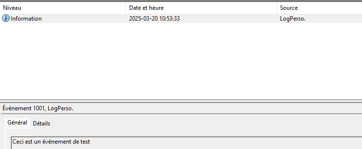
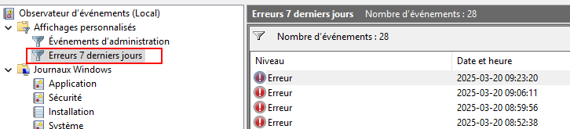

import useBaseUrl from '@docusaurus/useBaseUrl';
import ThemedImage from '@theme/ThemedImage';
import Tabs from '@theme/Tabs';
import TabItem from '@theme/TabItem';

# Exercice 04

## Processus, services et journalisation

Dans cet exercice, vous aurez l'occasion de mettre en pratique les éléments que nous avons vu dans la théorie du cours sur les processus, les services et la journalisation Windows.

## Prélables

Vous devez posséder une machine virtuelle sous Windows 11 **24H2** opérationnelle.

## Étapes de réalisation

### Partie 1 : Processus

1. Ouvrez le gestionnaire de tâche sous Windows et trouvez quel utilisateur est propriétaire du processus *explorer.exe*. Notez également son *PID*.

2. Ouvrez une fenêtre PowerShell et arrêter ce processus. Qu'est-ce qui se passe lorsque vous l'arrêtez ?

3. Trouvez comment vous pourriez créer un nouveau processus pour `notepad.exe`

4. Utilisez la méthode de votre choix pour récupérer la quantité de mémoire utilisée par le processus que vous avez lancé.

* * *

### Partie 2 : Services

5. Déterminez l'état du service de spouleur d'impression avec PowerShell. [(indice)](https://learn.microsoft.com/fr-ca/powershell/module/microsoft.powershell.management/get-service?view=powershell-7.5)

6. Toujours avec PowerShell, trouvez comment modifier le type de démarrage de ce service. [(indice)](https://learn.microsoft.com/fr-ca/powershell/module/microsoft.powershell.management/set-service?view=powershell-7.5#exemple-2-modifier-le-type-de-d-marrage-des-services)

7. Trouvez le numéro du processus du service de spouleur d'impression.

8. En analysant cette commande PowerShell ainsi qu'en l'expérimentant, que fait-elle selon-vous ?
    ```Powershell
    (Get-Service | Where-Object {$_.StartType -eq 'Manual'}).Count
    ```

* * *

### Partie 3 : Journalisation

9. Ouvrez l'observateur d'événements Windows et repérez l'entrée concernant votre dernière ouverture de session. Quel est l'id de l'événement ?

10. Outre les journaux et les événements créés par le système, il est possible de se créer des journaux personnels. Ces journaux peuvent être utilisés pour toutes raisons (Se souvenir de l'installation d'un logiciel, enregistrer la date d'une sauvegarde, etc...)

    Ouvrez PowerShell et créez d'abord un nouveau journal pour y enregistrer vos événements:
    ```Powershell
    New-EventLog -LogName MonJournal -Source "LogPerso."
    ```

    Ensuite, créez votre événement dans le nouveau journal préalablement créé:
    ```Powershell
    Write-EventLog -LogName MonJournal -Source "LogPerso." -EventID 1001 -EntryType Information -Message "Ceci est un événement test." 
    ```

    Dirigez-vous maintenant dans l'observateur d'événements pour récupérer votre événement:

    


11. Dans l'observateur d'événements, il est possible de créer des vues personnalisées. Il s'agit ni plus ni moins d'un filtre que vous pourrez appeler quand bon vous semble. Créez donc une vue personnalisée qui vous affichera les événements de type `erreur` pour tous les journaux Windows des 7 derniers jours:

    

12. Trouvez que représente l'événement 8198 dans l'observateur d'événements sous Windows 11.