import useBaseUrl from '@docusaurus/useBaseUrl';
import ThemedImage from '@theme/ThemedImage';
import Tabs from '@theme/Tabs';
import TabItem from '@theme/TabItem';

# Exercice 06

## Disques et partitions

Dans cet exercice, vous vous pratiquerez à administrer les stockages sous Windows à l'aide de différents outils

## Prélables

Vous devez posséder une machine virtuelle sous Windows 11 24H2 opérationnelle. Importez un modèle au besoin.

## Étapes de réalisation

Pour réaliser les différentes étapes qui suivront, vous aurez besoin d'ajouter <mark>trois</mark> disques durs à votre machine virtuelle. Vous devez ajouter ces périphériques <span class='red-text'>**lorsque la machine virtuelle est éteinte.**</span> Pour ce faire, dirigez-vous dans les configurations de votre machine virtuelle, sous l'onglet stockage, puis cliquez sur *Ajouter un périphérique*:

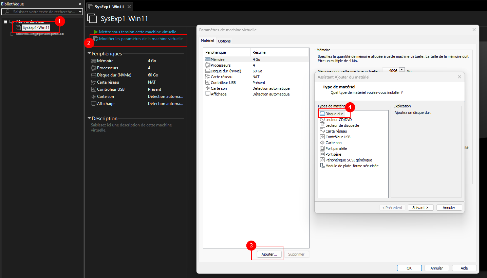

Vous devez évidemment sélectionner **Disque Dur**. Lorsque ce sera fait, une nouvelle fenêtre apparaitra afin que vous puissiez sélectionner le nouveau disque à ajouter. Or, il faudra plutôt le créer.


Vous serez alors amené à choisir le type de fichier à créer pour votre nouveau stockage (*laissez l'option par défaut*), à définir le type d'allocation (*pre-allocate Full Size*) et finalement la taille (Un disque de 15Go et deux autres de 10Go).


Finalement, ajouter le disque nouvèlement créé à votre configuration de machine virtuelle:

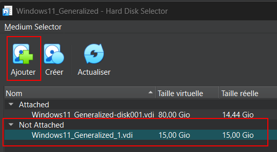

**<u>Répétez ces étapes pour les trois disques durs à ajouter, sois un disque dur de 15Go et deux de 10Go</u>**

### Configuration du disque dur supplémentaire de 15 Go

Lorsque que vous ajoutez des disques durs neufs au système d'exploitation Windows, ceux-ci ne seront pas détectés par le système puisqu'ils ne possèdent pas de table de partition. La première étape, lorsque nous ajoutons un disque dur neuf au système, est donc de mettre en place une table de partition.

#### Création de la table de partition

*A priori*, il vous faudra obtenir les numéros d'identification de vos disques durs avant d'entreprendre une quelconque action. Pour ce faire, utilisez la commande `Get-Disk` dans un terminal PowerShell en tant qu'Administrateur. Vous obtiendrez la liste des disques détectés dans votre pc.

<div className="tabsborder">
    <Tabs>
        <TabItem value="GetDisk" label="Commande" default>
            ```Powershell
            Get-Disk
            ```
        </TabItem>
        <TabItem value="ResultatGetDisk" label="Résultat">
           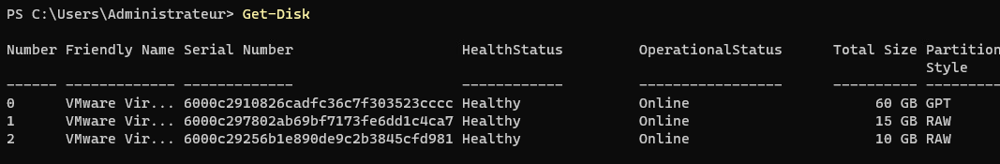
        </TabItem>
    </Tabs>
</div><br/>

Une fois que vous aurez déterminé quel est le numéro du disque dur de 15Go (*dans mon cas c'est le disque 1*), nous utiliserons la commande `initialize-disk` pour créer la table de partition sur ce disque.

<div className="tabsborder">
    <Tabs>
        <TabItem value="InitializeDisk" label="Commande" default>
            ```Powershell
            Initialize-Disk -Number 1 -PartitionStyle GPT
            ```
        </TabItem>
        <TabItem value="ResultatInitializeDisk" label="Résultat">
           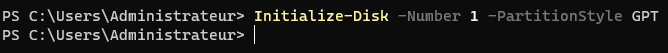
        </TabItem>
    </Tabs>
</div><br/>

#### Création de partitions

Notre disque dur est désormais prêt à accueillir des partitions. Nous allons créer deux partitions et séparer l'espace disque équitablement (*approximativement*). Pour créer une première partition avec PowerShell, procédez comme suit:

<div className="tabsborder">
    <Tabs>
        <TabItem value="NewPartition" label="Commande" default>
            ```Powershell
            New-Partition -DiskNumber 1 -Size 7500 MB
            ```
        </TabItem>
        <TabItem value="ResultatNewPartition" label="Résultat">
           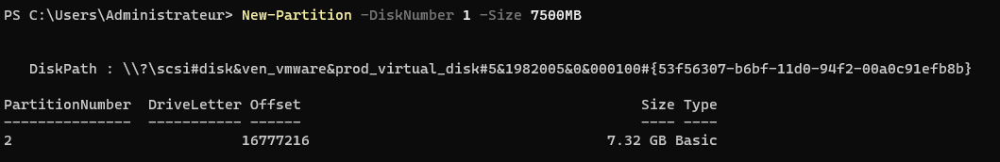
        </TabItem>
    </Tabs>
</div><br/>

:::caution[Où sont passé mes Giga-Octets ?]
Lorsque vous créez une partition avec un outil comme DiskPart ou PowerShell, vous risquez de constater une petite différence entre la taille demandée et la taille obtenue. Lorsque nous avons créer notre première partition par exemple, nous avons obtenue une partition de 7.32 GB au lieu de 7500 MB. 🤔 Pourquoi ?

**Explication :**

MB (MegaBytes) = 1 000 000 octets (base 10)

MiB (MebiBytes) = 1 048 576 octets (base 2)

Windows affiche souvent la taille en GiB, mais l’étiquette « GB » demeure.

👉 Donc 7500 MB (base 10) = ~7152 MiB ≈ ~6.98 GiB

En plus, une petite portion est réservée pour le système :

- Alignement des partitions
- Système de fichiers (MFT, journaux, métadonnées, etc.)
- Table de partition

Résultat :
La taille finale affichée sera donc toujours un peu plus petite que celle demandée, ce qui est normal.
:::

À tout moment, vous pouvez lister les partitions d'un disque à l'aide de la commande `Get-Partition`. Dans notre cas, si nous voulons voir la partition que nous venons tout juste de créer, nous procéderons comme suit:

<div className="tabsborder">
    <Tabs>
        <TabItem value="GetPartition" label="Commande" default>
            ```Powershell
            Get-Partition -DiskNumber 1
            ```
        </TabItem>
        <TabItem value="ResultatGetPartition" label="Résultat">
           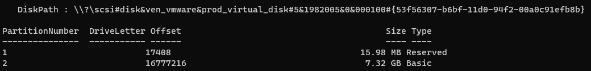
        </TabItem>
    </Tabs>
</div><br/>

Pour créer la seconde partition, nous allons procéder légèrement différemment. Il serait très difficile de créer une partition en ne sachant pas exactement (à l'octet près) combien d'espace il reste sur le disque. Nous allons donc utiliser un paramètre qui précisera à Windows de prendre tout le reste de l'espace disponible:

<div className="tabsborder">
    <Tabs>
        <TabItem value="NewPartition2" label="Commande" default>
            ```Powershell
            New-Partition -DiskNumber 1 -UseMaximumSize
            ```
        </TabItem>
        <TabItem value="ResultatNewPartition2" label="Résultat">
           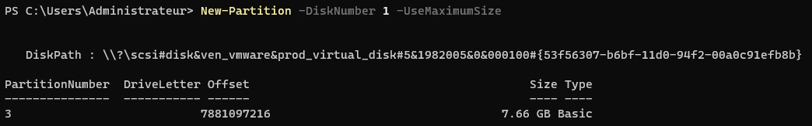
        </TabItem>
    </Tabs>
</div><br/>

#### Formatage des partitions

Le formatage est l'opération qui consiste à installer un système de fichiers sur une partition. Sans système de fichiers, nos partitions demeurent complètement inutilisables. Pour formater nos partitions, nous devrons d'abord leur attribuer une racine (une lettre). Attribuez les lettres *x* et *y* à vos deux partitions comme suit:

<div className="tabsborder">
    <Tabs>
        <TabItem value="AssignLetter" label="Commande" default>
            ```Powershell
            Get-Partition -DiskNumber 1 -PartitionNumber 2 | Set-Partition -NewDriveLetter X
            ```
        </TabItem>
        <TabItem value="ResultatAssignLetter" label="Résultat">
           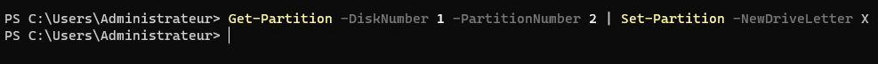
        </TabItem>
    </Tabs>
</div><br/>

Une fois les lettres assignés, il ne nous reste plus qu'à procéder au formatage des partitions. On utilisera alors la commande `format-volume` comme suit:

<div className="tabsborder">
    <Tabs>
        <TabItem value="FormatVolume" label="Commande" default>
            ```Powershell
            Format-Volume -DriveLetter X -FileSystem NTFS
            ```
        </TabItem>
        <TabItem value="ResultatFormatVolume" label="Résultat">
           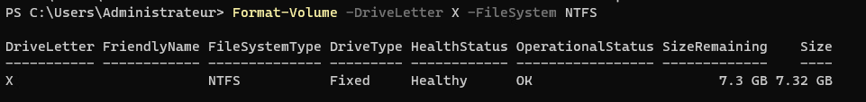
        </TabItem>
    </Tabs>
</div><br/>

Après cette étape, vous devriez être en mesure d'utiliser vos deux partitions directement depuis l'explorateur Windows:

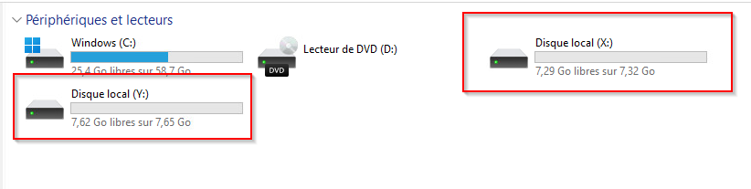

### Configuration des deux disques durs supplémentaires de 10Go

Pour les deux disques durs restant, nous allons utiliser l'interface graphique de Windows, question de changer le mal de place. Ouvrez la console de gestion des disques. Dès son ouverture, Windows vous proposera d'initialiser les deux disques durs qui ne le sont pas encore:

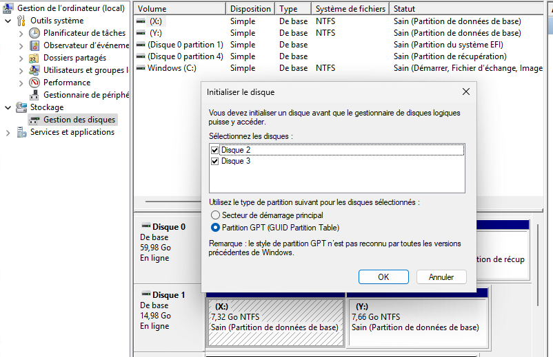

Cliquez simplement sur « OK » pour initialiser les disques.

#### Création de disques dynamiques

Les disques dynamiques permettent des configurations de stockage des données plus avancées. Nous allons expérimenter la mise en place d'une telle solution. Faites un clic à l'aide du bouton de droite de la souris sur l'un des disques que vous venez tout juste d'initialiser et cliquez sur *Convertir en disque dynamique*

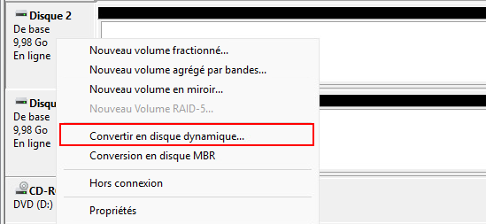

Vous pourrez alors sélectionner tous les disques que vous désirez convertir:

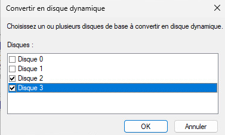

Cliquez ensuite sur « OK »

#### Mise en place d'un volume fractionné

Un volume fractionné est une unité de stockage qui s'étend sur plus d'un disque dur. C'est l'une des configurations avancées que l'on peut mettre en place avec des disques dynamiques. Cela peut être très avantageux dans le cas ou un utilisateur possède plus d'un disque dur de petite taille qu'il désir combiner pour créer un espace de stockage plus grand.

Faites donc de nouveau un clic-droit sur l'espace non-alloué de l'un de vos disques dynamiques et sélectionnez *Nouveau volume fractionné...*


Dans l'assistant qui s'ouvre, sélectionnez vos deux disques dur de 10Go. Ensemble, ils formeront un seul bloc de stockage de 20Go:

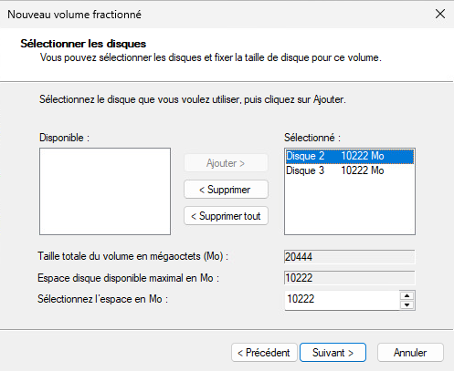

À la page suivante, attribuez la lettre Z: à cette unité de stockage. Finalement, formatez le stockage en NTFS et donnez le libellé `VolumeFractionné` à votre stockage:

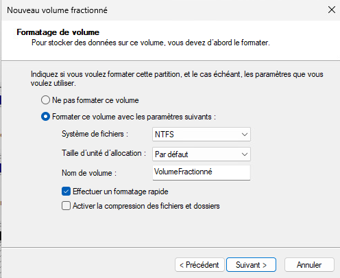

Une fois l'assistant terminé, vous serez en mesure de repérer votre nouveau volume qui sera répertorié aux côtés des volumes X et Y que nous avons créé plus tôt:

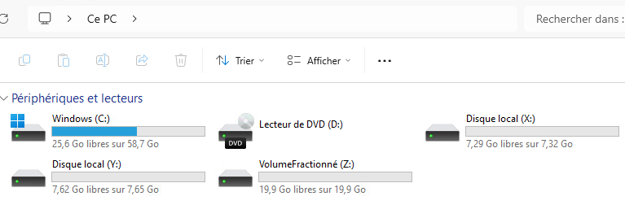