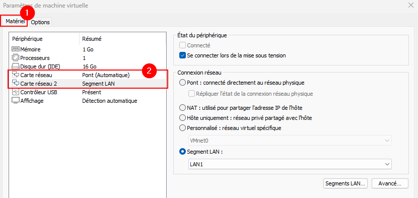
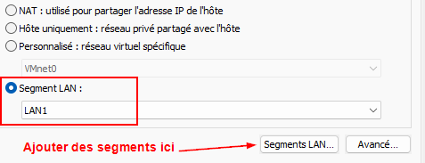
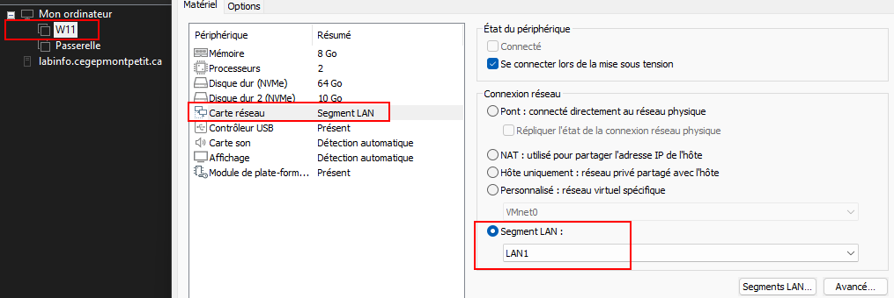

import useBaseUrl from '@docusaurus/useBaseUrl';
import ThemedImage from '@theme/ThemedImage';
import Tabs from '@theme/Tabs';
import TabItem from '@theme/TabItem';

# Exercice 07

## Mise en réseau de machines virtuelles

Dans cet exercice, nous mettrons en place le nécessaire pour que vous puissiez mettre en réseau un ordinateur sous Windows 11.

## Préalables

Vous aurez évidemment d'une première machine virtuelle sous Windows 11. Vous aurez également besoin d'une seconde machine virtuelle qui fera office de passerelle pour votre réseau. Je peux vous fournir cette machine directement via [ce lien](https://cloud.tonprof.ca/index.php/s/in3n5MDqcHSqSt4/download/Passerelle.ova), ou en classe.

## Schéma

    <ThemedImage
        alt="Schéma"
        sources={{
            light: useBaseUrl('/img/Windows/Exercices/Exercice07_W.svg'),
            dark: useBaseUrl('/img/Windows/Exercices/Exercice07_D.svg'),
        }}
    />

## Mise en place

D'abord, importez les deux machines virtuelles dans votre hyperviseur. Une fois les machines virtuelles bien importées, nous aurons quelques modifications à faire sur celles-ci.

## Configuration de la passerelle

Dirigez-vous dans les configurations de votre machine virtuelle (passerelle). Passez en mode expert, puis cliquez sur Réseau:

Ici, vous remarquerez qu'une machine virtuelle sous VirtualBox peut posséder jusqu'à 4 cartes réseau. Pour notre passerelle, nous aurons besoin de deux cartes réseaux:

        	👉 Une première carte branchée au Web. 
            👉 La seconde pour notre réseau interne.

:::tip[Rappelez-vous!]
**N'oubliez pas!** La passerelle agit comme un échangeur entre deux autoroutes. Elle permet au traffic de passer d'une route à l'autre. Pour y arriver, la passerelle a forcémment besoin d'être reliée à ces deux routes.
:::

### Interface 1 - *Accès par pont*

L'interface #1 est notre lien vers le web. Utilisez donc le mode d'accès réseau nommé « Accès par pont ». Ce mode d'accès permet de relier une machine virtuelle directement sur le même réseau que votre machine physique. Dans le cas présent, c'est comme si vous reliiez votre passerelle directement sur le réseau du cégep. Une fois le mode d'accès réseau choisi, assurez-vous que le nom de la carte réseau juste au-dessous ait du sens. Je crois que vous n'avez qu'une seule interface réseau sur les PC du cégep donc vous ne pourrez pas vous tromper. ⚠️ **Ne modifiez pas les champs:** <u> Type d'interface, Mode promiscuité et Adresse MAC ⚠️</u>

### Interface 2 - *Réseau interne*

Pour l'interface #2, nous utiliserons le mode d'accès réseau nommé « Réseau interne ». Ce mode crée un commutateur (*switch*) virtuel au sein de votre ordinateur. Cela permet de créer des réseaux virtuels que seuls vos machines virtuelles pourront joindre. Vous devrez donner un nom à cette interface, dans mon cas, je l'ai nommé *vswitch*:

À partir d'ici, votre passerelle est prête. Allons maintenant configurer votre machine virtuelle sous Windows 11.

## Configuration de votre client

Dirigez-vous dans les mêmes configurations expertes de votre machine virtuelle sous Windows 11. Faites passer l'interface réseau en mode d'accès « Réseau Interne » et utilisez **<u>exactement le même nom que vous avez utilisé sur la carte du même type de votre passerelle</u>**. Pour rappel, j'avais utilisé le nom *vswitch* dans mon cas.

⚠️**Encore une fois ne modifiez pas les autres champs.**⚠️

## Démarrage des machines

Nous sommes désormais prêts à démarrer nos machines virtuelles. Démarrez donc celles-ci. Prenez note qu'il est normal que vous n'ayez pas d'interface graphique dans votre passerelle car il s'agit d'un serveur Linux. Néanmoins, lorsque le serveur aura terminé de démarrer, il vous affichera des informations essentielles. Prenez en note l'adresse du serveur vis-à-vis la ligne **LAN**

## Configuration Windows

Vous n'obtiendrez pas de configuration IP automatiquement lorsque vous démarrerez Windows...Il fallait bien que je vous fasse travailler un peu 😉. Par contre, dans la théorie, nous avons vu comment configurer une adresse IP manuellement dans Windows. C'est donc à vous de jouer maintenant. Voici les informations que vous avez en mains:

|Item|Valeur|
|----|------|
| Adresse de la passerelle | Vous l'avez obtenu sur l'écran de démarrage de la passerelle |
| Adresse IP | Il vous faut la déterminer. Vous avez l'adresse de la passerelle et le masque pour vous aider. |
| Masque de sous-réseau | 255.255.255.0 |
| Dns Primaire | La passerelle sera aussi votre serveur DNS |
| Dns Secondaire | Aucun |

:::tip[Bonus]
Vous avez terminé et ça fonctionne ? Excellent travail! Et si vous mettiez en place un deuxième client sous Windows 11 ? Pensez-vous être capable de faire en sorte que les deux clients puissent s'envoyer des paquets de type *PING* ? 🔥
:::