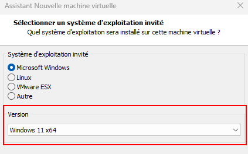
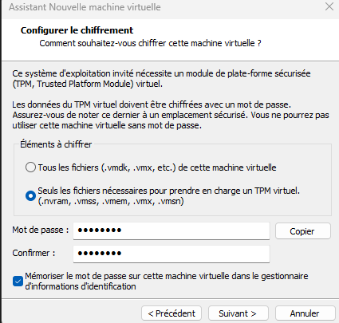

import useBaseUrl from '@docusaurus/useBaseUrl';
import ThemedImage from '@theme/ThemedImage';
import Tabs from '@theme/Tabs';
import TabItem from '@theme/TabItem';

# Exercice 07

## Exploration de divers éléments de sécurité sur Windows

Ce laboratoire a pour objectif de vous faire parcourir et découvrir certains éléments associés à la sécurité du système d'exploitation Windows 11. Nous n'aurons évidemment pas le temps de couvrir l'ensemble des fonctionnalités et des paramètres de sécurité car il y en a énormément. Nous nous concentreront sur certains d'entre eux seulement.

## Préalabales

Pour ce laboratoire, vous n'aurez d'autre choix que d'installer Windows 11 à neuf, sous Workstation. Cependant, vous devrez procéder autrement pour cette fois. **<span class="red-text">Vous devez préciser à Vmware Workstation que vous installez Windows 11</span>**. Ce n'est seulement qu'ainsi qu'il émulera une puce TPM pour votre machine virtuelle.



:::danger[Mot de passe TPM]
VMWare vous demandera de configurer un mot de passe pour votre TPM. Si vous oubliez ce-dernier, **vous ne pourrez plus utiliser votre machine virtuelle!** Assurez-vous de noter ce mot de passe et de ne pas l'égarer en aucune circonstance.


:::

## Étapes de réalisation

### Partie 1 - Sécurité matérielle

1. Appuyez sur les touches <kbd>&#8862; win</kbd>+<kbd>r</kbd> et tapez la commande `tpm.msc` suivi de la touche <kbd>enter</kbd>. À l'aide de la console qui s'ouvre, répondez aux questions suivantes:

    - Quelle est la version du TPM ?
    - Quelles seraient les conséquences si je cliquais sur `Effacer le module de plateforme sécurisée...`?

2. Appuyez sur les touches <kbd>&#8862; win</kbd>+<kbd>r</kbd> et tapez la commande `msinfo32` suivi de la touche <kbd>enter</kbd>. À l'aide de la console qui s'ouvre, répondez aux questions suivantes:

    - Quel est le mode du BIOS utilisé ? Pourquoi ?
    - Quel est l'état du démarrage sécurisé (*secure boot*) ? Où devrais-je aller pour modifier son état ?

3. Appuyez sur les touches <kbd>&#8862; win</kbd>+<kbd>r</kbd> et tapez la commande `windowsdefender:` suivi de la touche <kbd>enter</kbd>. Cliquez sur `Sécurité des périphériques`. Consultez les détails de l'isolation du noyau

    - L'intégrité de la mémoire est-elle activée ? Si non, est-ce que Windows affiche un avertissement ?

### Partie 2 - Bitlocker

:::caution
Pour cette portion du laboratoire, vous devez ajouter un disque dur secondaire à votre machine virtuelle. La taille importe peu, 10 ou 20Go, pas plus. Référez-vous aux cours précédents si vous avez oublié comment procéder.
:::

    - Ouvrez l'explorateur de fichiers et faites un clic droit sur votre disque dur secondaire. Cliquez ensuite sur `Activer Bitlocker`.
    - Choisissez la méthode de verrouillage par mot de passe.
    - Définissez un mot de passe (et ne l'oubliez pas 😉).
    - Enregistrez votre clé de récupération *Bitlocker* sur votre bureau Windows.
    - Choisissez de ne chiffrer que l'espace disque utilisé (ce sera plus rapide).
    - Utilisez le nouveau mode de chiffrement (XTS-AES).
    - Puis démarrez le chiffrement.

Une fois ces actions effectuées, répondez aux questions suivantes:

    4. Ouvrez le fichier de récupération sauvegardé sur le bureau. Combien de caractère comporte la clé ? Pourquoi est-il crucial de sauvegarder cette clé dans un endroit sûr et séparé de l'appareil ?

    5. Redémarrez votre PC. Que se passe-t-il si vous essayez d'ouvrir votre disque dur secondaire dans l'explorateur Windows ?

    6. **Avant de déverrouiller votre disque dur**, entrez la commande PowerShell suivante:
        ```powershell
        manage-bde -status D: #Remplacez la lettre D: par la lettre de votre disque dur secondaire
        ```
        Portez attention à la sortie de la commande.

    7. Déverrouillez votre disque dur secondaire à l'aide du mot de passe que vous avez configuré et relancez la commande précédente. Remarquez-vous des différences ?

### Partie 3 - Windows Hello :)

- Accédez aux paramètres de Windows en appuyant simultanémment sur les touches <kbd>&#8862; win</kbd>+<kbd>i</kbd>.
- Allez dans Comptes, puis options de connexion.
- Cliquez sur PIN (Windows Hello) et cliquez sur `Configurer`.
- Définissez un PIN à 6 chiffres.

8. Avant de définir votre PIN, Windows vous a demandé votre mot de passe. Pourquoi cette étape est nécessaire ?

### Partie 4 - Test EICAR
Le fichier **EICAR** (*European Institute for Computer Antivirus Research*) est un fichier texte standardisé reconnu par tous les antivirus comme un « virus de test ». Il est totalement inoffensif mais déclenche les mêmes alertes qu'un vrai *malware*.

- Ouvrez le Bloc-notes (Notepad).
- Copiez exactement la chaîne suivante (une seule ligne, sans espace avant ou après):

    ```
    X5O!P%@AP[4\PZX54(P^)7CC)7}$EICAR-STANDARD-ANTIVIRUS-TEST-FILE!$H+H*
    ```

- Sauvegardez le fichier sur votre bureau sous le nom `test-eicar` et changez l'extension de `.txt` en `.com`

- Observez ce qui se passe une fois le fichier sauvegardé et répondez à la question suivante:

9. Ouvrez Sécurité Windows → Protection contre les virus et menaces → Historique de protection. Trouvez l'entrée correspondant au fichier EICAR. Relevez : le nom de la menace détectée et l'action effectuée par Defender.

## Correction

Il n'y a malheureusement pas de script de correction pour cet exercice. La raison est fort simple, Microsoft est très frileux avec le scripting autour des éléments de sécurité. Je vous fais donc entièrement confiance sur la réalisation de ce laboratoire.

N'oubliez pas d'ajouter le contenu appris dans votre journal de cours 😉