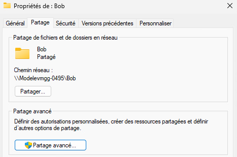
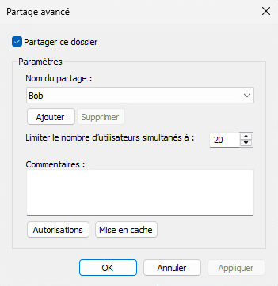
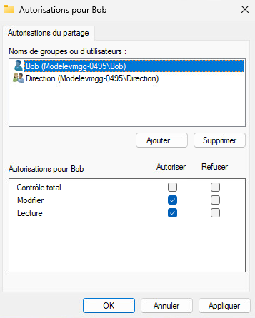
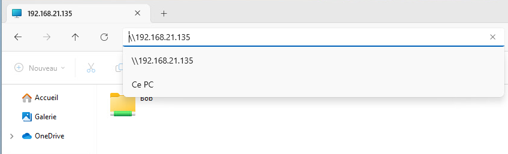
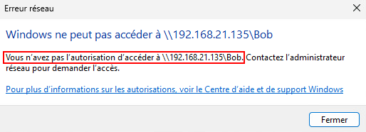
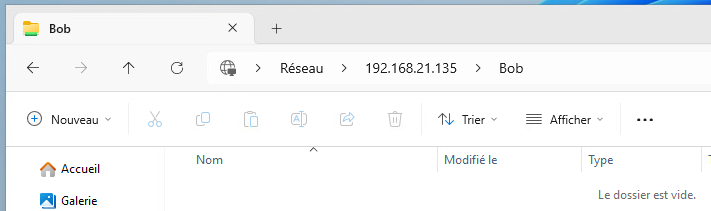

import useBaseUrl from '@docusaurus/useBaseUrl';
import ThemedImage from '@theme/ThemedImage';
import Tabs from '@theme/Tabs';
import TabItem from '@theme/TabItem';

# Exercice 08

## Partage de ressources entre PC Windows

Dans cet exercice, nous effectuerons des partages SMB entre deux PC sous Windows 11

## Préalables

Avoir complété l'exercice 07 puisque nous réutiliserons celui-ci.

## Schéma

<div style={{textAlign: 'center'}}>
    <ThemedImage
        alt="Schéma"
        sources={{
            light: useBaseUrl('/img/Windows/Exercices/Exercice08_W.svg'),
            dark: useBaseUrl('/img/Windows/Exercices/Exercice08_D.svg'),
        }}
    />
</div>

## Étapes de réalisation

La première étape de ce laboratoire consistera à déployer une seconde machine virtuelle sous Windows 11, tel que présenté dans le schéma ci-dessus. N'oubliez pas configurer son interface réseau, tel que vous l'avez fait pour votre premier client dans l'exercice précédent.

## Création d'utilisateurs et des dossiers

Évidemment, comme nous allons mettre en place des partages, nous aurons besoin d'utilisateurs et de dossiers. Vous trouverez ci-dessous la liste des utilisateurs et des groupes à créer. Un peu plus bas, vous trouverez la liste des dossiers à créer ainsi que leur ACL respectives.

:::caution
**Aucune autre permission que celle qui sont dans le tableau des dossiers ne doit être présente!** Les groupes **<u>utilisateurs authentifiés ou utilisateurs</u>** ne devraient jamais apparaitre en aucune circonstance dans les permissions de vos dossiers à moi que cela ne soit spécifiquement précisé.
:::

### Tableau des utilisateurs

| Type | Nom | Membres |
|------|-----|---------|
| Utilisateur | Bob | N/A |
| Utilisateur | Paul | N/A |
| Utilisateur | Rita | N/A |
| Utilisateur | Claude | N/A |
| Utilisateur | Amanda | N/A |
| Groupe | Techniciens | Bob, Paul |
| Groupe | Finances | Rita, Claude |
| Groupe | Direction | Amanda |
| Groupe | TLM | Bob, Paul, Rita, Claude, Amanda |

### Tableau des dossiers

>**Légende:** <br/>
> 🟢 CT : Contrôle total <br/>
> 🟡 Modif : Modification <br/>
> 🟠 RX : Lecture et Exécution

| Nom du dossier | Emplacement | Permissions |
|:----------------:|-------------------------|---------------------------------------------------|
| Bob | C:\Exercice08\Utilisateurs\ | <ul><li>Administateurs (CT)</li><li>Système (CT)</li><li>Bob (Modif)</li><li>Direction (Modif)</li></ul>
| Paul | C:\Exercice08\Utilisateurs\ | <ul><li>Administateurs (CT)</li><li>Système (CT)</li><li>Paul (Modif)</li><li>Direction (Modif)</li></ul>
| Rita | C:\Exercice08\Utilisateurs\ | <ul><li>Administateurs (CT)</li><li>Système (CT)</li><li>Rita (Modif)</li><li>Direction (Modif)</li></ul>
| Claude | C:\Exercice08\Utilisateurs\ | <ul><li>Administateurs (CT)</li><li>Système (CT)</li><li>Claude (Modif)</li><li>Direction (Modif)</li></ul>
| Amanda | C:\Exercice08\Utilisateurs\ | <ul><li>Administateurs (CT)</li><li>Système (CT)</li><li>Amanda (Modif)</li></ul>
| Techniciens | C:\Exercices08\Groupes\ | <ul><li>Administateurs (CT)</li><li>Système (CT)</li><li>Techniciens (RX)</li><li>Direction (Modif)</li><li>Bob (Modif)</li></ul>
| Finances | C:\Exercices08\Groupes\ | <ul><li>Administateurs (CT)</li><li>Système (CT)</li><li>Finances (RX)</li><li>Direction (Modif)</li><li>Rita (Modif)</li></ul>
| Direction | C:\Exercices08\Groupes\ | <ul><li>Administateurs (CT)</li><li>Système (CT)</li><li>Direction (Modif)</li></ul>
| TLM | C:\Exercices08\Groupes\ | <ul><li>Administateurs (CT)</li><li>Système (CT)</li><li>Finances (RX)</li><li>Direction (RX)</li><li>Techniciens (RX)</li></ul>

## Mise en place des partages

L'objectif est de faire en sorte que les utilisateurs puissent accéder à leurs ressources à distance, soit depuis PC0002. Préalablement, il vous faudra évidemment partager les dossiers créés ci-dessus. Je vous présente ci-dessous un exemple avec le dossier de l'utilisateur Bob. Vous devrez répétez ces étapes, tout en ajustant les permissions à chaque fois, pour tous les dossiers de groupe et d'utilisateur.

### Partage avancé

Faites un clic à l'aide du bouton de droite de la souris sur l'un des dossiers que vous avez créé, puis sélectionnez *Propriétés*. Dans l'onglet *Partage*, cliquez sur *Partage Avancé...*:



Cochez *Partager ce dossier* et définissez un nom pour le partage. Ce nom n'a pas forcémment à avoir de lien avec le nom du dossier, mais c'est tout de même recommandé:



:::tip
C'est ici, à la fin du nom, qu'il faut ajouter le fameux « $ » si vous désirez rendre le partage invisible.
:::

Cliquez ensuite sur *Autorisations*. C'est dans cette fenêtre que vous pourrez définir les permissions de partage pour vos utilisateurs.



:::important[N'OUBLIEZ PAS]
Un utilisateur ou un groupe se verra toujours octroyer les permissions minimum entre les permissions de partage et les permissions locales.
:::

## Accéder à un partage depuis un autre PC

Ouvrez une session sur votre client #2, comme vous le feriez normalement. Ouvrez l'explorateur Windows et tapez le chemin UNC vers votre client #1 comme suit:



Vous devriez voir apparaitre vos différents partages. Double-cliquez sur l'un d'entre eux... Alors ?...Ça fonctionne ? Non ? **C'est normal!** Nous ne nous sommes pas identifié. Le client #1 nous refuse donc l'accès car il ne sait pas qui tente d'accéder au dossier partagé que vous tentez d'ouvrir.



Pour vous identifier, ouvre une invite de commande Windows et entrez la commande suivante en prenant soin d'y indiquer les bonnes informations ( ip et utilisateur ) :

```batch
net use \\192.168.12.X /u:Bob
```

:::danger[En cas d'erreur]

**Erreur 64:**<br/>
L'erreur 64 se produit si la machine sur laquelle vous avez effectué les partages tombe en veille. 💤 Assurez-vous donc qu'elle ne tombe pas dans ce mode, quitte à désactiver la mise en veille.

**Erreur 1219:**<br/>
L'erreur 1219 se produit si des identifiants (peu importe s'ils sont bons ou mauvais) ont déjà été stockés pour la communication avec l'autre PC. Même si vous n'avez pas spécifiquement entré des identifiants, si vous avez seulement tentez d'ouvrir un dossier à distance par exemple, vos identifiants de session sont utilisés. Pour supprimer les identifiants stockés en mémoire, utilisez la commande `net use * /delete` et supprimez les connexions en cours. Ensuite, réutilisez la commande `net use` vu ci-dessus pour vous identifier.
:::

Une fois que vous vous serez identifié, vous devriez pouvoir accéder aux dossiers partagés via l'UNC:



Chaque fois que vous devrez vous authentifier avec un compte différent pour accéder à un dossier, vous devrez:

1. Déconnecter le compte actuel avec la commande `net use * /delete`

2. Vous authentifier avec le nouveau compte à l'aide de la commande vue un peu plus haut.


