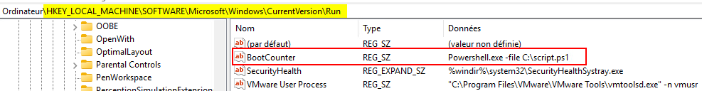

import useBaseUrl from '@docusaurus/useBaseUrl';
import ThemedImage from '@theme/ThemedImage';
import Tabs from '@theme/Tabs';
import TabItem from '@theme/TabItem';

# Exercice 09

## Manipulation du registre

L'objectif de cet exercice est de créer un petit script PowerShell qui se lancera à chaque démarrage de l'ordinateur pour inscrire une valeur dans le registre. Cette valeur consistera en un nombre représentant le nombre de fois où l'ordinateur a démarré.

## Prélables

Vous devez posséder une machine virtuelle sous Windows 11 24H2 opérationnelle. Importez un modèle au besoin.

## Étapes de réalisation

1. Commencez d'abord par créer un fichier nommé `script.ps1` à la racine de votre disque dur C:\

2. Le script d'abord vérifié si la clé de registre dans laquelle nous désirons changer une valeur existe, sans quoi, le script devra créer cette clé. Nous allons donc vérifier l'existence de la clé HKLM:\Exerice09

    ```Powershell title='C:\script.ps1' showLineNumbers
    # Vérifie si la clé de registre HKLM:\SOFTWARE\Exercice09 existe.
    # Dans le cas où cette clé n'existerait pas, on l'a crée.
    
    #highlight-start
    if (-not(Test-Path -Path HKLM:\SOFTWARE\Exercice09)){
        New-Item -Path HKLM:\SOFTWARE -Name Exercice09 | Out-Null
    }
    #highlight-end
    ```

3. Ensuite, nous devons valider l'existence d'une valeur dans notre clé de registre. Cette valeur doit se nommer `BootCounter`.

    ```Powershell title='C:\script.ps1' showLineNumbers
    # Vérifie si la clé de registre HKLM:\SOFTWARE\Exercice09 existe.
    # Dans le cas où cette clé n'existerait pas, on l'a crée.
    
    if (-not(Test-Path -Path HKLM:\SOFTWARE\Exercice09)){
        New-Item -Path HKLM:\SOFTWARE -Name Exercice09 | Out-Null
    }

    # On essaie de vérifier le contenu de la valeur concerncée dans notre clé de registre.
    # En cas d'erreur, on sait que notre valeur n'existe pas et qu'on doit la créer.
    # Dans le cas où nous la créons, nous devrons également définir la valeur à 1.

    #highlight-start
    try{
        Get-ItemProperty -Path HKLM:\SOFTWARE\Exercice09 -Name BootCounter -ErrorAction Stop | Out-Null
    } catch {
        New-ItemProperty -Path HKLM:\SOFTWARE\Exercice09 -Name BootCounter -Value 1
    }
    #highlight-end
    ```

4. À cette étape du script, nous sommes certains que la clé de registre `Exercice09` et la valeur `BootCounter` sont belles et bien existantes. Il nous faut maintenant consulter la donnée stockée dans `BootCounter` et l'incrémenter. Pour ce faire, nous utiliserons une variable du même nom:


    ```Powershell title='C:\script.ps1' showLineNumbers
    # Vérifie si la clé de registre HKLM:\SOFTWARE\Exercice09 existe.
    # Dans le cas où cette clé n'existerait pas, on l'a crée.
    
    if (-not(Test-Path -Path HKLM:\SOFTWARE\Exercice09)){
        New-Item -Path HKLM:\SOFTWARE -Name Exercice09 | Out-Null
    }

    # On essaie de vérifier le contenu de la valeur concerncée dans notre clé de registre.
    # En cas d'erreur, on sait que notre valeur n'existe pas et qu'on doit la créer.
    # Dans le cas où nous la créons, nous devrons également définir la valeur à 0.

    try{
        Get-ItemProperty -Path HKLM:\SOFTWARE\Exercice09 -Name BootCounter -ErrorAction Stop | Out-Null
    } catch {
        New-ItemProperty -Path HKLM:\SOFTWARE\Exercice09 -Name BootCounter -Value 0
    }

    # On récolte la donnée de la valeur BootCounter qu'on stocke dans une variable.
    # On incrémente le nombre stocké dans la variable puis on enregistre la nouvelle
    # valeur dans le registre.

    #highlight-start
    $BootCounter = GetItemPropertyValue -Path HKLM:\SOFTWARE\Exercice09 -Name BootCounter
    $BootCounter++
    Set-ItemProperty -Path HKLM:\SOFTWARE\Exercice09 -Name BootCounter -Value $BootCounter
    #highlight-end
    ```

5. Notre script est maintenant terminé. Il nous fait maintenant faire en sorte qu'il soit lancé automatiquement à chaque démarrage du PC. Pour ce faire, nous devrons faire deux choses:

    - Autoriser l'exécution de scripts sur le PC
    - Mettre en place le démarrage du script automatique

Pour autoriser l'exécution de scripts PowerShell sur l'ordinateur, nous devons tout simplement modifier la politique d'exécution dans l'ordinateur. Ouvrez un terminal PowerShell en tant qu'administrateur et entrez la commande suivante:

```Powershell
Set-ExecutionPolicy -ExecutionPolicy Unrestricted
```

En ce qui concerne l'exécution du script à chaque démarrage, nous allons ajouter une clé de registre un peu spécial. Cela dit, je vais vous faire passer par l'interface graphique cette fois. Ouvrez donc l'éditeur de registre en appuyant sur les touches <kbd>&#8862; win</kbd>+<kbd>r</kbd> et tapez l'expression `regedit`. Dans l'éditeur de registre, dirigez-vous dans:

`HKLM:\SOFTWARE\Microsoft\Windows\CurrentVersion\Run`

Tout ce qui se trouve dans cette clé de registre est exécuté au démarrage. D'ailleurs, il y a fort à parier que certains éléments y soient déjà. Ajoutez donc une valeur de type `REG_SZ` au nom de `BootCounter` et dont la donnée sera `Powershell.exe -file C:\script.ps1`.



Voilà! 😎 Redémarrez votre ordinateur et consultez votre clé de registre `Exercice09` pour observer la valeur `BootCounter` s'incrémenter à chaque redémarrage.

:::tip[pssst!]
Au lieu d'ouvrir l'interface graphique à chaque fois, vous pouvez utiliser PowerShell pour interroger le contenu de la valeur:
```Powershell
Get-ItemProperty -Path HKLM:\SOFTWARE\Exercice09 -Name BootCounter
```
:::