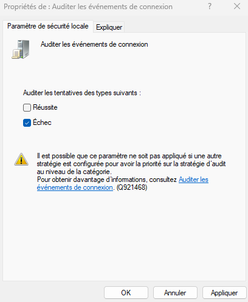

import useBaseUrl from '@docusaurus/useBaseUrl';
import ThemedImage from '@theme/ThemedImage';
import Tabs from '@theme/Tabs';
import TabItem from '@theme/TabItem';

# Exercice 10

## Exploitation du planificateur de tâches

Dans cet exercice, vous serez amené à exploiter le planificateur de tâches afin de développer vos compétences à:

- Créer des tâches planifiées simples et avancées
- Utiliser des déclencheurs variés (temps, ouverture de session, événement)
- Comprendre les niveaux de privilèges requis
- Diagnostiquer et valider l'exécution des tâches

## Prélables

Vous devez posséder une machine virtuelle sous Windows 11 24H2 opérationnelle. Importez un modèle au besoin.

## Étapes de réalisation

Suivez les étapes en fonction des différentes tâches planifiées à mettre en place.

### Tâche de nettoyage automatique

1. Créez un script nommé `nettoyage_temp.ps1` qui supprime les fichiers localisés dans le dossier `C:\Temp`. Ce script doit être stocké dans le dossier `C:\Scripts\`

2. Créez une tâche planifiée nommée **NettoyageTemp** avec les propriétés suivantes:
    - **Déclencheur:** Tous les jours à 22h
    - **Action:** Exécute `powershell.exe` avec l'argument `-File "C:\Scripts\nettoyage_temp.ps1"`
    - **Conditions:** Uniquement si l'ordinateur est branché au réseau électrique
    - **Privilèges:** Exécuter avec les **autorisations maximales**

* * *

### Tâche pour afficher un message de bienvenue

1. Créez un script nommé `bienvenue.ps1` dans `C:\Scripts` avec le contenu suivant:

    ```powershell title="bienvenue.ps1" showLineNumbers
    Add-Type -AssemblyName PresentationFramework
    [System.Windows.MessageBox]::Show("Bienvenue dans votre session $env:USERNAME !", "Bonjour")
    ```
    Ce script présentera une fenêtre avec un message de bienvenue.

2. Créez une tâche planifiée nommée **MessageBienvenue** avec les propriétés suivantes:
    - **Déclencheur:** À l'ouverture de session de l'utilisateur courant
    - **Action:** Exécute `powershell.exe` avec l'argument `-File "C:\Scripts\bienvenue.ps1"`
    - **Conditions:** Aucune
    - **Privilèges:** <span class='red-text'> **Ne pas** </span> exécuter avec les **autorisations maximales**

* * *

### Tâche pour journaliser les échecs d'ouverture de session

1. Créer un script PowerShell nommé `log_echec_connexion.ps1` dans `C:\Scripts` avec le contenu suivant:

    ```powershell title='log_echec_connexion.ps1' showLineNumbers
    $timestamp = Get-Date -Format "yyyy-MM-dd HH:mm:ss"
    Add-Content -Path "C:\Logs\echecs_connexion.txt" -Value "$timestamp : Échec d'ouverture de session détecté pour un utilisateur"
    ```

    Ce script enregistrera la date et l'heure dans un fichier texte à chaque fois qu'une tentative d'ouverture de session échouera. N'oubliez pas de créer le dossier `C:\Logs` si celui-ci n'existe pas déjà.

2. Pour que ce script fonctionne, nous devrons paramétrer Windows pour que celui-ci reste à l'affût des échecs de connexion. Depuis la fenêtre `Exécuter`, tapez la commande `secpol.msc`. Dans la fenêtre qui s'ouvrira, dirigez-vous dans **Stratégies locales** \> **Stratégie d'audit** et activer l'audit des événements de connexion en précisant que vous souhaitez auditer les échecs.

    

3. Créez une tâche planifiée nommée **LogEchecConnexion** avec les propriétés suivantes:
    - **Déclencheur:** Lors de l'apparition de l'événement suivant:
        - **Journal:** `Sécurité`
        - **ID de l'événement:** `4625`
        - **Source:** `Microsoft Windows security auditing.`
    - **Action:** Exécute `powershell.exe` avec l'argument `-File "C:\Scripts\log_echec_connexion.ps1"`
    - **Conditions:** Aucune
    - **Paramètres:** Réessayer si échec
    - **Privilèges:** Exécuter avec les **autorisations maximales**