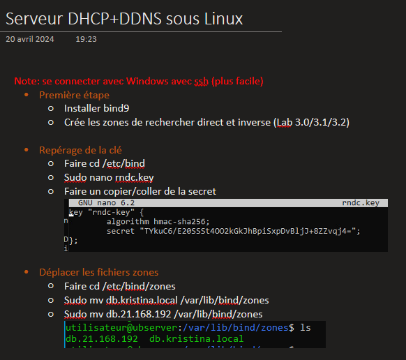
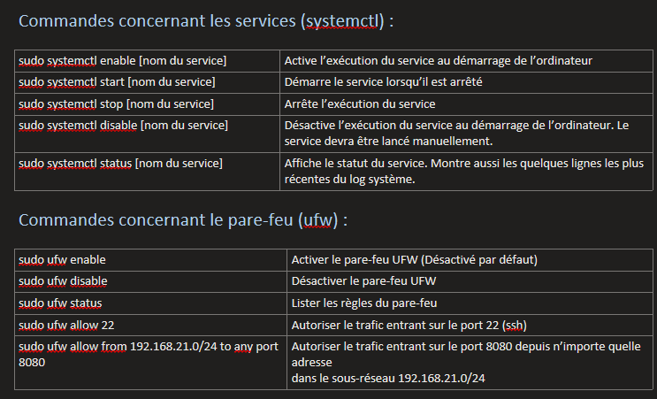

# Journal de cours

Le journal de cours est un travail à faire individuellement. Il compte pour **15%** de la note finale du cours. La remise se fera à la quinzième et dernière semaine de la session sur un dépôt que je créerai en temps et lieu sur Teams. Entre temps, je ferai régulièrement des rappels à l'oral et à l'écrit.

## Mandat

Tout au long de la session, vous apprendrez différentes notions en lien avec les serveurs locaux. Certaines de ces notions seront très théoriques et d'autres plus pratiques. Une foule d'informations vous sera transmise à travers des lectures, des laboratoires et des présentations magistrales. Pour chacun des cours, vous devrez prendre des notes sur ce que vous jugerez pertinent pour vous et votre méthodologie de travail. À la fin de la session, ces notes de cours seront évaluées.

### Format des notes

Les notes de cours doivent être remises dans un format texte. Il peut s'agir d'un document word, pdf, onenote ou même sur une plateforme numérique en ligne. Vous pouvez y ajouter des images, des photos, des captures d'écran ou même des mémos audio et vidéos.

:::caution
Les notes de cours doivent rester des notes. Il ne doit pas y avoir plus d'images ou plus d'enregistrements audio que de notes écrites. Priorisez donc l'écriture et utilisez les autres formats pour combler les éléments manquants. Évidemment, si vous n'ajoutez pas d'image, pas d'audio ni de vidéo, vous devrez compenser à l'écrit. Bref, tout est une question d'équilibre des contenus.
:::

### Consignes de remise

Un dépôt sera créé sur Teams afin que vous puissiez déposer votre journal. Dans le cas où votre journal aurait un format particulier ou dans le cas où celui-ci serait en ligne, communiquez avec moi pour que nous puissions prendre des dispositions de remise.

### Quelques exemples

Voici quelques exemples de journaux remis par les étudiants des sessions précédentes:

**Exemple 1:**

**Exemple 2:**

## Critères d'évaluation

|Critère|Pondération|
|-----|:------:|
| Couverture d'une grande majorité des sujets | 10 points |
| Pertinence des notes du journal| 5 points |
| Propreté, clarté et lisibilité | 3 points |
| Français écrit | 2 points |
| **Total** | **20 points** |

Voici les détails ce qui sera évalué pour chacun des critères:
- Couverture d'une grande majorité des sujets (*10 points*)
    - Les notes de cours abordent presque tous les sujets abordés en classe.
    - Certains sujets sont plus approfondies car ils sont plus complexes.
- Pertinences des notes du journal (*5 points*)
    - Les notes au sein du journal abordent les notions vues en classe dans leur contexte respectif. Les notes comprises dans le journal démontrent une compréhension du sujet et ne contiopennent pas d'erreur théorique ou de pratique.
- Propreté, clarté et lisibilité (*3 points*)
    - Les sujets sont bien identifiés et séparés par section ou thème.
    - Le texte est claire et facile à lire.
    - Le texte est aéré et se lit par petite portion.
- Francais écrit (*2 points*)
    - Référez-vous à la grille d'évaluation du français écrit dans le plan de cours.