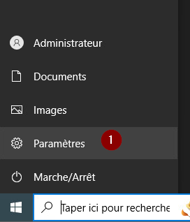
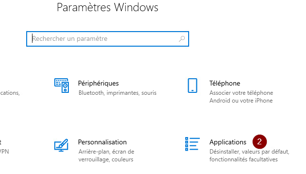

import useBaseUrl from '@docusaurus/useBaseUrl';
import ThemedImage from '@theme/ThemedImage';


# Enrichissement
* * *
## Administration via SSH

## Préalable(s)
- Vous devez impérativement avoir complété le [Laboratoire 1](./01-Laboratoire1.md)

## Objectif(s)
- Installer une fonctionnalité facultative sur Windows Serveur
- Utiliser l'invite de commande de votre ordinateur client pour administrer le serveur à distance.
* * *
## Schéma

<ThemedImage
    alt="Schéma"
    sources={{
        light: useBaseUrl('/img/Serveurs1/Laboratoire1_W.svg'),
        dark: useBaseUrl('/img/Serveurs1/Laboratoire1_D.svg'),
    }}
/>
* * *

## Étapes de réalisation

### Installation de la fonctionnalité OpenSSH Server

1. Dans votre serveur 2022, ouvrez le panneau des paramètres et cliquez sur « applications ».<br/><br/>
<br/><br/>


2. Dans le menu des applications, cliquez sur « Applications et fonctionnalités », puis sur « Fonctionnalités facultatives ».<br/><br/>


3. Dans la fenêtre des fonctionnalités facultatives, sélectionnez « Ajouter une fonctionnalité », sélectionnez « Serveur OpenSSH » puis cliquez sur « Installer ».

### Démarrage du service OpenSSH Server

1. Dans votre serveur Windows 2022, ouvre un terminal PowerShell et entrez les commandes suivantes:

Mettre le service en mode « démarrage automatique » :

```Powershell
Get-Service sshd | Set-Service -StartupType Automatic
```

Démarrez le service:

```Powershell
Get-Service sshd | Start-Service
```

### Connexion à distance

1. Depuis votre poste de travail sous Windows 10, ouvrez un terminal Powershell et entrez la commande suivante:

```Powershell
ssh Administrateur@192.168.21.10
```

:::note
Il se peut que vous ayez un message d'avertissement vous demandant de valider l'identité du serveur à la première connexion. Il s'agit d'un contrôle de sécurité. Pour le moment, contentez-vous de répondre « yes » pour valider l'identité du serveur.
:::

2. Une fois branché, vous vous retrouverez sur la ligne de commande du serveur. Tous les fichiers et les dossiers que vous créerez se retrouveront sur le serveur.