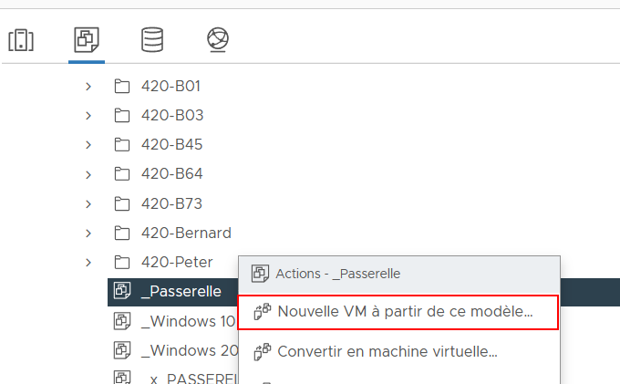
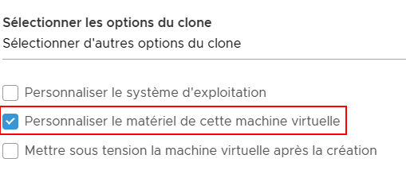
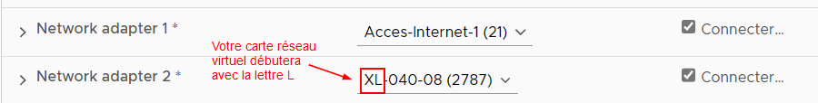
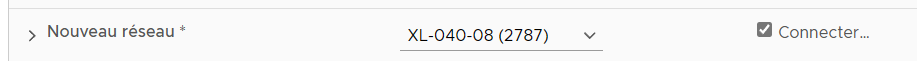
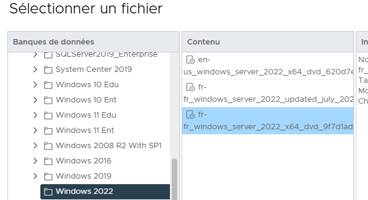
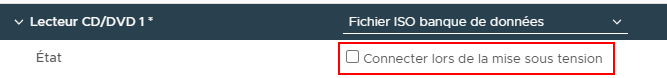
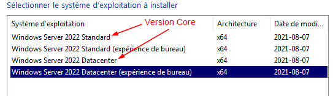
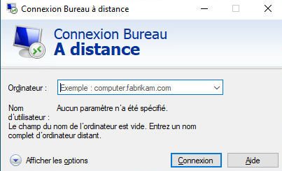
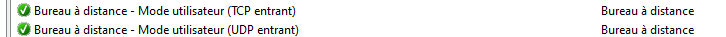

import useBaseUrl from '@docusaurus/useBaseUrl';
import ThemedImage from '@theme/ThemedImage';

# Laboratoire 1
* * *
## Installation de Windows Serveur 2022

## Préalable(s)

- Aucun

## Objectif(s)
- Mettre en place une passerelle grâce au modèle fourni (PfSense)
- Installer Windows Serveur 2022
- Installer Windows 10
* * *
## Schéma

    <ThemedImage
        alt="Schéma"
        sources={{
            light: useBaseUrl('/img/Serveurs1/Laboratoire1_W.svg'),
            dark: useBaseUrl('/img/Serveurs1/Laboratoire1_D.svg'),
        }}
    />

* * *

## Étapes de réalisation

### Mise en place de la passerelle PfSense

1. Dirigez-vous sur [labinfo](labinfo.cegepmontpetit.ca) et ouvrez votre session.

2. Recherchez le modèle nommé « _Passerelle » et faites-en une machine virtuelle:

3. Donnez un nom à votre passerelle en respectant la nomenclature suivante: 2S5-XY-Passerelle ou « XY » représente vos initiales. Chaque machine créée dans le cadre de ce cours devra posséder un nom respectant ce format.

4. Lorsque viendra le temps de sélectionner les options de votre machine virtuelle, sélectionnez « Personnaliser le matériel de cette machine virtuelle »:  

5. Une fois dans la section "Personnaliser le matériel", vous constaterez que la machine possède deux cartes réseau. Assurez-vous que la première carte réseau soit bien configurée en accès internet (Acces-Internet-1, Acces-Internet-2 ou Acces-Internet-3). La seconde carte réseau, quant à elle, devra être configurée sur l'un de vos réseaux virtuels personnels. Chacun d'entre vous possédez 10 réseaux virtuels sur vos profils labinfo respectif. Ces réseaux virtuels sont nommés comme suit : **L-123-01**  
**L :** signifie "Large" (C'est la taille de votre profil) 
**123 :** Il s'agit de votre numéro de profil, 123 n'est qu'un exemple. 
**01 :** Il s'agit du numéro de votre réseau virtuel, vous devriez retrouver les numéros de 01 à 10.  
Voici un exemple de configuration valable:  

:::important[important - Vos réseaux virtuels]
Chacun d'entre vous bénéficie d'une dizaine de réseaux virtuels dans Labinfo. Tout au long de votre avancement dans votre parcours académique, vous serez appelé à créer divers laboratoires qui nécessiteront parfois plusieurs interconnexions. C'est pourquoi vous avez accès à ces réseaux virtuels. Chacun de ces réseaux virtuels est un peu comme un commutateur auquel vous pouvez brancher un ordinateur ou un serveur dans labinfo.
:::

6. Lorsque votre passerelle sera cloné et prête, démarrez-la. Votre serveur Windows et votre poste de travail devront être branchés sur le même réseau virtuel afin de rejoindre cette dernière.

### Installation de Windows Serveur 2022

1. Créez une nouvelle machine virtuelle dans « Labinfo ». Nommez la "2S5-XY-Serveur2022" (XY représente vos initiales).

2. Lorsque vous serez dans la section "Personnaliser le matériel", configurez votre carte réseau pour utiliser l'un de vos réseaux virtuels. **Attention:** Vous devez utiliser le même réseau virtuel que vous avez utilisé plus tôt pour votre passerelle.  

3. Une fois la machine créé, vous devrez insérez le DVD d'installation virtuel de Windows Serveur 2022. Pour ce faire, cliquez sur le menu « Actions » dans LabInfo et sélectionnez « Modifier les paramètres...»  

    Dans les paramètres de votre ordinateur, recherchez le lecteur DVD puis modifiez son état de « Périphérique client » à « Fichier iso banque de données ». Dans la fenêtre qui s'ouvrira, sélectionnez la banque de données Logiciels > MS > Windows 2022 puis sélectionnez le fichier au bas de la liste.  

    

    Finalement, n'oubliez pas de cocher la case « Connecter lors de la mise sous tension »

    

4. Démarrez votre machine virtuelle et suivez les instructions d'installation. Sélectionnez l'édition "Datacenter (Expérience de bureau)" lorsque vous aurez à choisir parmi les éditions:  

5. Vous serez amené à définir un mot de passe pour l'administrateur de votre serveur. Comme vous êtes derrière une passerelle PfSense, personne ne risque de se connecter à distance sur votre serveur. Je vous recommande donc d'inscrire un mot de passe assez simple pour le moment, tel que <mark>« Passw0rd »</mark>. Évidemment, c'est une pratique que l'on tente d'éviter en entreprise, mais dans le cadre d'un laboratoire comme celui-ci, le risque est minime.

6. Une fois que votre session sera ouverte, vous devriez obtenir une configuration IP de la part de votre passerelle. Or, comme nous l'avons vu dans la théorie, un serveur doit <u>**toujours**</u> posséder une adresse IP statique. Configurez donc l'adresse IP de votre serveur comme suit:
    - IP : 192.168.21.10
    - Masque: 255.255.255.0
    - Passerelle : 192.168.21.1
    - DNS: 8.8.8.8

7. À partir de VMWare Workstation ou directement depuis « Labinfo », procédez à l'installation des outils VmWare. Cet ensemble d'outils vous permettra une meilleure fluidité au niveau de l'interface graphique en plus de vous offrir une gamme d'outils supplémentaires en lien avec la virtualisation.

8. Changez le nom de votre serveur depuis le gestionnaire de serveur ou en tapant la commande "sysdm.cpl". Donnez un nom simple et intuitif à votre serveur.

9. Activez le bureau à distance dans votre serveur Windows. Consultez [cette section](00-Cours1.md#gestion-à-distance) au besoin.

### Installation d'un client sous Windows 10

1. Procédez à l'installation d'un poste de travail avec Windows 10 tel que vous l'avez appris dans le cadre du cours Système d'exploitation. Ce poste vous servira à effectuer vos opérations sur les différents serveurs que nous mettrons en place, le tout, à distance. Dans le langage courant, nous appelons cela un « jump box ». Un « jump box » est une machine qui nous permet de gérer les différents serveurs à distance, comme vous le ferez dans le cadre de ce cours.

2. Utilisez la commande `Rename-Computer -NewName`*`NouveauNom`* dans PowerShell pour renommer votre ordinateur. Donnez-lui un nom significatif.

3. Une fois votre ordinateur prêt, utilisez l'utilitaire de bureau à distance pour tenter d'ouvrir une session sur votre serveur Windows 2022.  
  Alors ? Ça fonctionne ? Ça ne devrait pas 😉. Il faut d'abord apporter quelques modifications au pare-feu du serveur avant.

4. Dans le serveur, ouvrez les paramètres avancés du pare-feu en tapant la commande `wf.msc`. En activant les deux règles ci-dessous, vous devriez pouvoir accéder à votre serveur via le bureau à distance.  

* * *