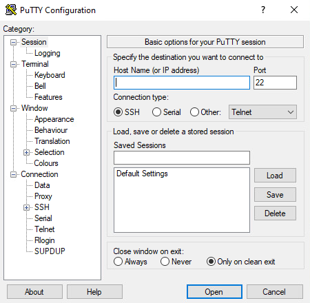
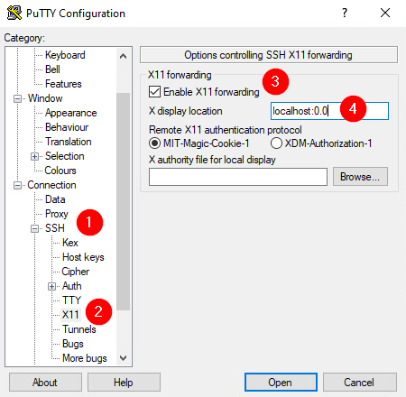
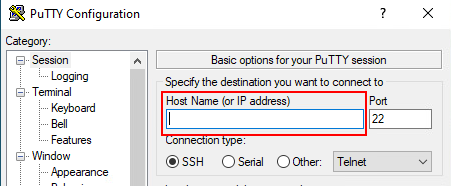

import useBaseUrl from '@docusaurus/useBaseUrl';
import ThemedImage from '@theme/ThemedImage';

# Enrichissement

* * *
## Déport d'affichage via SSH
Vous savez désormais qu'Ubuntu Serveur n'offre pas d'interface graphique. Cela dit, il n'est pas rare que certaines applications fonctionnent à l'aide d'une interface graphique. C'est le cas par exemple d'un navigateur web qui a besoin d'une fenêtre pour vous retourner le résultat d'une page web. Il est tout à fait possible d'installer un navigateur web sur votre serveur et d'en déporter l'affichage sur un poste de travail.

## Préalable(s)

- Avoir complété le laboratoire # 3

## Objectif(s)
- Utiliser un navigateur web à distance.

* * *
## Schéma

<ThemedImage
    alt="Schéma"
    sources={{
        light: useBaseUrl('/img/Serveurs1/Laboratoire3_W.svg'),
        dark: useBaseUrl('/img/Serveurs1/Laboratoire3_D.svg'),
    }}
/>

* * *

## Étapes de réalisation

### Modification de la configuration SSH sur Linux

Nous devons d'abord apporter quelques modifications à la configuration SSH de votre serveur Linux afin d'autoriser l'utilisation du système graphique X11. X11 fonctionne selon un modèle client-serveur. Le serveur X11 est responsable de l'affichage sur l'écran tandis que les applications envoient des demandes d'affichage au serveur.

Dans votre serveur linux, ouvrez le fichier `/etc/ssh/sshd_config` et éditez les lignes suivantes:

```bash
87 #AllowAgentForwarding yes
88 AllowTcpForwarding yes   # <----Cette ligne
89 #GatewayPorts no
90 X11Forwarding yes   # <------Cette ligne
91 #X11DisplayOffset 10
92 X11UseLocalHost yes # <-------Cette Ligne
93 #PermitTTY yes
```
Une fois ces modifications apportées, enregistrez votre fichier et redémarrez le service:

```bash
sudo systemctl restart ssh.service
```

### Installation de Xming (Windows)
Xming est un logiciel client pour X11. En gros, il attendra sagement de recevoir une demande de connexion de la part d'une application distante, comme firefox par exemple. Vous pouvez télécharger Xming en [cliquant directement sur ce lien.](https://downloads.sourceforge.net/project/xming/Xming/6.9.0.31/Xming-6-9-0-31-setup.exe?ts=gAAAAABnROC5kwARbhwLC3uhgRD-0I-wLVoGPxUliYQYTpSM71UryVjjevOrYwV9srMqmXdmQdb7Y7pkYyI2KBMPF-nYAy1v8g%3D%3D&r=https%3A%2F%2Fsourceforge.net%2Fprojects%2Fxming%2Ffiles%2Flatest%2Fdownload) Pour l'installer, suivez tout simplement les étapes. Il n'y pas de configuration particulière à mettre en place. **Une fois installé, assurez-vous que le logiciel soit bien démarré.**

### Installation de Putty (Windows)
Putty est un client SSH, tout comme celui que vous avez utilisé dans l'invite de commandes Windows. « Pourquoi doit-on en installer un autre client SSH s'il y en a déjà un dans Windows ? » me demanderez-vous. Eh bien le client SSH de Windows nous permet de nous débrouiller mais il est beaucoup moins configurable que Putty. De plus, Putty nous permet de sauvegarder nos sessions. Vous pouvez le [télécharger à partir d'ici.](https://www.chiark.greenend.org.uk/~sgtatham/putty/latest.html) Une fois le logiciel installé, vous devriez retrouver une fenêtre semblable à celle-ci:



#### Configuration
Pour que notre petit tour de magie fonctionne comme il se doit, nous devons apporter quelques modifications à la configuration de base de Putty.

 1. Dans les catégories de gauche, cliquez sur « SSH »
 2. Cliquez sur X11
 3. Cochez la case « Enable X11 forwarding »
 4. Dans le champ « X display location », entrez « localhost:0.0 »

 

 ### Ouvrez une session en SSH

 Retournez maintenant au haut des catégories dans Putty et cliquez sur « Session ». Dans le champ approprié, entrez l'adresse IP de votre serveur et connectez-vous:



### Installez Firefox <FAIcon icon="fa-brands fa-firefox-browser" size="1x"/>

Profitez du fait que vous avez ouvert une session sur votre serveur Ubuntu à l'aide de Putty pour installer Firefox.

```bash
sudo apt install firefox
```

### Lancez le navigateur à distance!

Entrez la commande suivante dans Putty, si tout est bien configuré une fenêtre de firefox s'ouvrira. Cela dit, détrompez-vous. Firefox s'exécute bien sur votre serveur et non pas sur votre poste de travail Windows.

```bash
XAUTHORITY=$HOME/.Xauthority /snap/bin/firefox &
```