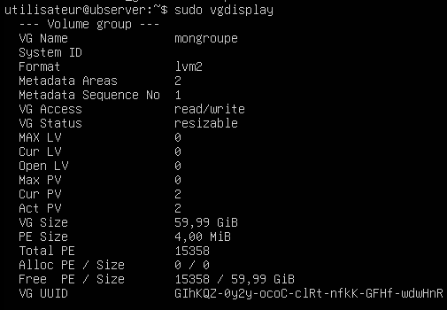
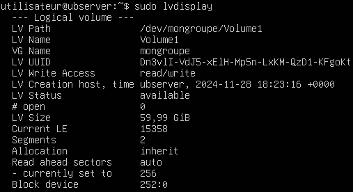
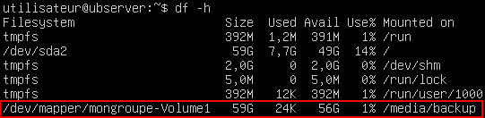

import useBaseUrl from '@docusaurus/useBaseUrl';
import ThemedImage from '@theme/ThemedImage';

# Laboratoire 4

* * *
## Mise en place d'une structure LVM

## Préalable(s)

- Avoir complété le laboratoire # 3

## Objectif(s)
- Installer des stockages supplémentaires
- Créer la structure LVM

* * *
## Schéma

<ThemedImage
    alt="Schéma"
    sources={{
        light: useBaseUrl('/img/Serveurs1/Laboratoire4_W.png'),
        dark: useBaseUrl('/img/Serveurs1/Laboratoire4_D.png'),
    }}
/>

* * *

## Étapes de réalisation

### Ajoutez les stockages
Assurez-vous que votre serveur Ubuntu soit bien arrêté et ajoutez-lui deux stockages distincts.

1. Un premier stockage de 20Go
2. Un deuxième stockage de 40Go

Au total, vous devriez donc avoir un total de trois disques durs: le disque du système ainsi que les deux que vous venez tout juste d'ajouter. Vous pouvez confirmer que vos trois disques sont bien visibles dans le système en utilisant la commande suivante:

```bash
lsblk | grep -P '^sd'
```

### Création des partitions
Même si nous avons l'intention d'utiliser la totalité des deux disques durs que nous venons d'ajouter, il est fortement recommandé d'utiliser des partitions avec LVM, même si ces partitions prennent tout l'espace du disque qui les héberge. Nous utiliserons donc l'utilitaire `parted` sous Linux pour partitionner nos deux stockages. Commencez donc par créer la table de partition sur un premier disque en utilisant la commande suivante:

```bash
sudo parted /dev/sdb mklabel gpt
```

puis, créer une partition qui prendra la totalité du disque:

```bash
sudo parted /dev/sdb mkpart primary ext4 1024KiB 100%
```

<mark>Répétez ces actions pour votre disque dur sdc également.</mark>

### Initialisation des *PV* pour LVM
LVM doit initialiser les stockages avant de pouvoir les utiliser dans ses groupes de volume. Pour ce faire, nous utiliserons la commande `pvcreate` en identifiant les partitions concernées par la suite. Par exemple, pour ma partition 1 sur mon disque sdb, j'utiliserai la commande:

```bash
sudo pvcreate /dev/sdb1
```

<mark>Répétez cette action pour votre partition sdc1 également.</mark>

### Création d'un groupe de volumes
La création d'un groupe de volumes nous permettra de rassembler nos deux disques durs ajoutés en un seul bloc.
> *Pourquoi n'avons tout simplement pas inséré un seul gros disque dur dans le serveur Gabriel ?*
>
> *-Les étudiants*

Je sais bien que nous aurions pu mettre qu'un seul gros disque dur. Il importe de contextualiser ici. Dans une entreprise, vous pourriez vous retrouver avec un serveur possédant plusieurs disques durs que vous désirez administrer comme un seul bloc. L'objectif du laboratoire est simplement de vous faire voir comment ce serait possible de réaliser une telle chose.

Pour créer notre groupe de volume, nous utiliserons la commande `vgcreate` avec les arguments suivants dans l'ordre: *Nom du groupe* + *Noms des volumes physiques à intégrer*

```bash
sudo vgcreate mongroupe /dev/sdb1 /dev/sdc1
```

Une fois votre groupe créé, vous pouvez afficher les informations de celui-ci en utilisant la commande `vgdisplay`. La taille du groupe devrait correspondre à la somme des disques durs qui s'y trouvent.

```bash
sudo vgdisplay
```
Exemple:



### Création d'un volume logique
Nous y voici, nous allons créer un volume logique. Cet espace occupera l'entièreté des deux disques durs que nous avons ajoutée. Le système d'exploitation quant à lui n'y verra que du feu et croira qu'il s'agit d'un seul espace. La gestion des données entre les deux disques durs sera tout à fait invisible.

Pour créer ce volume logique, nous utiliserons la commande `lvcreate` avec trois arguments: le nom du volume logique, la taille ainsi que le nom du groupe sur lequel on crée ce volume logique.

```bash
sudo lvcreate -n Volume1 -L 60g mongroupe
```

Une fois votre volume logique créé, vous pouvez afficher les informations de celui-ci (ou de ceux-ci) en utilisant la commande `lvdisplay`.

```bash
sudo lvdisplay
```
Exemple:



### Système de fichiers et montage
À cette étape, nous sommes prêts à formater notre stockage et lui donner un point de montage dans le système afin de pouvoir l'utiliser. Nous utiliserons donc la commande `mkfs` pour formater en premier lieu, suivi de la commande `mount` pour attribuer un point de montage au stockage.

:::caution
Normalement les stockages se situent directement dans `/dev` sous Linux. Or, dans le cas des lecteurs logiques utilisant LVM, on retrouvera également le nom du groupe de volumes. Par exemple: `/dev/mongroupe/Volume1`. Vous pouvez d'ailleurs constater cela dans l'image présentée ci-dessus.
:::

Formatage du volume en ext4:

```bash
sudo mkfs.ext4 /dev/mongroupe/Volume1
```

Montage du volume dans le dossier /media/backup:

```bash
sudo mount /dev/mongroupe/Volume1 /media/backup
```
Vous pouvez confirmer le bon montage de votre volume en utilisant la commande `df -h`

Exemple:



Voilà! Tout ce que vous déposerez dans le dossier `/media/backup` sera dorénavant disposé entre les deux stockages de 20Go et 40Go que nous avons ajouté au début de ce laboratoire. Vos deux disques ne forment plus qu'un seul bloc de 60 Go.