import useBaseUrl from '@docusaurus/useBaseUrl';
import ThemedImage from '@theme/ThemedImage';

# Cours 6

## Retour sur les services <FAIcon icon="fa-solid fa-gears" size="1x"/>
Lors du cours *systèmes d'exploitation*, vous avez appris ce qu'était un service dans le contexte d'un système d'exploitation. Pour rappel, un service est un programme qui s'exécute en arrière-plan. Ce type de programme n'a généralement pas été écrit pour favoriser l'interaction humaine. Parmi ces services, on retrouve certains des éléments clés du système.

:::tip[Le saviez-vous ?]
Sous Linux, les services sont parfois appelés « *daemons* ». C'est un nom d'origine grecque qui signifie divinité. C'est pourquoi on retrouve souvent la lettre « d » à la fin de leur nom: sshd, httpd, etc.
:::

### Windows Serveur <FAIcon icon="fa-brands fa-windows" size="1x"/>
Sous Windows Serveur, les services du système d'exploitation s'administrent exactement de la même façon que sur un poste Windows standard. Si vous avez besoin de vous rafraichir la mémoire quant à la gestion des services sous Windows, [consultez cette section.](/docs/OS/Windows/07-Services.md)

### Serveur Linux <FAIcon icon="fa-brands fa-linux" size="1x"/>
Il en va de même pour les services sous Linux. Qu'il s'agisse d'un système Ubuntu *desktop* ou d'un système serveur, l'administration des services se fait de la même façon. Vous avez besoin de vous rafraichir la mémoire quant à la gestion des services sous Linux ? [Consultez cette section.](/docs/OS/Linux/08-Services.md)

## Retour sur la journalisation <FAIcon icon="fa-solid fa-newspaper" size="1x"/>
La journalisation permet d'effectuer le suivi des services et des processus du système. Comme les processus et les services n'offrent généralement pas d'interface pour interagir avec eux, en faire le suivi et l'administration peut devenir un enjeu. La journalisation permet donc de conserver les traces du bon, ou du mauvais fonctionnement de ces services et de ces processus.

### Windows Serveur <FAIcon icon="fa-brands fa-windows" size="1x"/>
Sous Windows Serveur, tout comme sur les postes de travail, la majorité des journaux sont rapportés dans l'observateur d'événements. L'Observateur d'événements offre une interface graphique conviviale et permet de manipuler les différents journaux assez aisément. Si vous avez besoin de vous remémorer le fonctionnement de la journalisation sous Windows, je vous invite à [consulter cette section](/docs/OS/Windows/08-Journalisation.md).

### Serveur Linux <FAIcon icon="fa-brands fa-linux" size="1x"/>
Sous Linux, les journaux ont longtemps été sauvegardés sous forme de fichier texte et disparates. D'ailleurs, beaucoup de journaux sous Linux fonctionnent de la sorte. Cela dit, l'arrivée de `systemd` a changé les choses, une centralisation des journaux semble s'installer. En effet, la commande `journalctl` semble nous permettre d'atteindre à peu près n'importe quel journal stocké au sein du système. Si vous avez besoin de vous rafraichir la mémoire quant au fonctionnement de la journalisation sous Linux, je vous invite à [consulter cette section](/docs/OS/Linux/09-Journalisation.md).

## Pare-feu <FAIcon icon="fa-solid fa-fire" size="1x"/>

Qu'il s'agisse du pare-feu sous Windows ou sous Linux, le pare-feu a toujours le même objectif: filtrer le trafic entrant et sortant.

>*Oui, mais Gabriel, à quoi ça sert de filtrer le trafic d'un ordinateur ?*
>
>*-Les étudiants*

C'est une question légitime! En gros c'est surtout une méthode de protection supplémentaire. Disons que votre maison possède 3 portes permettant d'y entrer. Peut-être que vous partagerez votre clé de maison avec certaines personnes, alors que vous demanderez à d'autres de cogner et d'attendre une réponse. C'est un peu l'équivalent avec votre ordinateur, mais au lieu de ne posséder que 3 portes, votre PC en possède 65 535 🤯 (Oui, je suis sérieux.)

Ça fait beaucoup de portes à surveiller, j'en conviens. Ces portes, on les appelle, en fait, des ports réseau. Chacun de ces ports permet de laisser entrer, ou sortir, des paquets de votre PC vers le réseau et vice-versa. La grande majorité de ces ports sont fermés et le resteront. Toute tentative d'accéder à votre PC via ses ports sera vouée à l'échec. Néanmoins, nous aurons besoin de laisser d'autres ports ouverts afin d'utiliser un service, comme le SSH par exemple. Généralement, un service est associé à un port. Voici quelques exemples:

- Port 80 : HTTP (Navigation web sans chiffrement)
- Port 443 : HTTPS (Navigation web sécurisée)
- Port 22 : SSH (Accès au terminal à distance)
- Port 21 : FTP (Transfert de fichier d'un PC à un autre)
- Port 53 : DNS (Résolution de noms)

Les configurations d'un pare-feu permettront donc d'autoriser ou de refuser le trafic sur un port (une porte 🚪)  de votre PC.

### Windows Serveur <FAIcon icon="fa-brands fa-windows" size="1x"/>

Sous Windows, le pare-feu se nomme « Pare-Feu Windows Defender » et il comporte 3 profils par défaut:

| Profil                | Type de réseau | Utilisation principale                                    |
|-----------------------|----------------|-----------------------------------------------------------|
| **Domaine**           | Réseau d'entreprise |Sécurisation des appareils dans un environnement contrôlé. |
| **Privé**             | Réseau domestique |Sécurisation des connexions dans un environnement de confiance. |
| **Public**            | Réseau ouvert |Protection maximale contre les menaces sur des réseaux non sécurisés. |

À chacun de ces profils, des règles par défaut seront appliquées. Évidemment, plus le réseau est considéré insécure, plus les règles seront strictes. Toutes ces règles, peu importe le profil dans lequel vous vous trouvez, sont modifiables.

#### Récupérer votre profil de connexion

Il est possible de connaître le profil de connexion dans lequel vous vous trouvez à l'aide d'une petite commande PowerShell:

```Powershell
Get-NetConnectionProfile
```
Vous obtiendrez alors un résultat similaire à celui-ci:

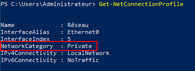

#### Modifier votre profil de connexion

Un peu de la même façon, vous pouvez modifier votre profil de connexion à l'aide de la commande PowerShell `Set-NetConnectionProfile`:

```Powershell
Set-NetConnectionProfile -NetworkCategory "Public"
```
Voici le résultat:

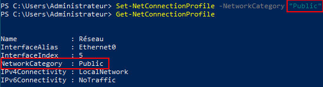

#### Accéder aux règles
Pour accéder rapidement aux règles du pare-feu sous Windows, ouvrez la fenêtre « Exécuter » à l'aide du raccourci clavier <kbd>&#8862; win</kbd>+<kbd>r</kbd> et tapez la commande `wf.msc`

Une fois là, vous serez à un clic de voir les règles du pare-feu Windows:

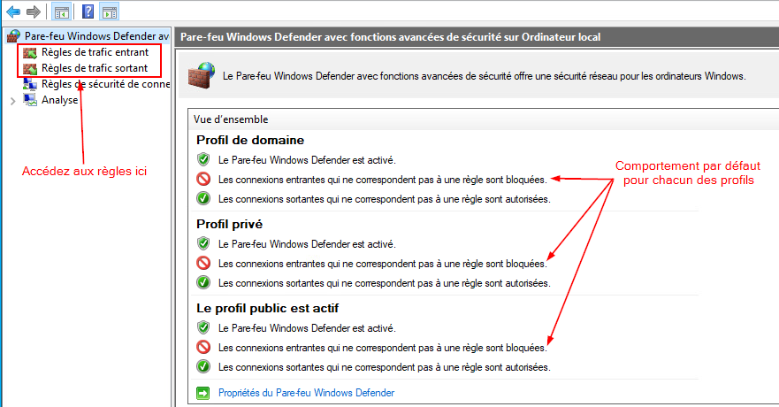

:::caution
Pour savoir si c'est une règle entrante ou sortante que vous devez modifier, il faut se demander si c'est vous qui offrez un service (entrant) ou si vous voulez plutôt rejoindre un service qui est offert par un autre PC/serveur (sortant).
:::

Que vous alliez voir les règles entrantes ou sortantes, vous devriez avoir un affichage similaire à celui-ci:

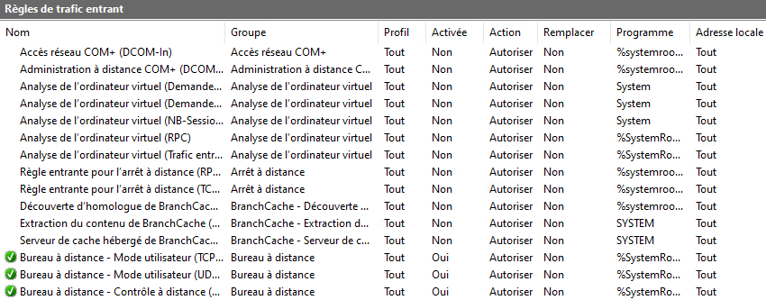

Je vous résume les différentes informations affichées dans ce tableau:

| Colonne | Description |
|---------|-------------|
| Crochet vert ✅ | Si vous repérez un crochet vert avant le nom de la règle, cela signifie que la règle est active et que le filtrage du trafic en question s'exécute. |
| Nom | C'est le nom de la règle, tout simplement. |
| Groupe | Certaines règles peuvent être regroupées ensemble par logique. C'est le cas notamment du partage de fichiers et d'imprimantes. On regroupe les règles qui ont un lien entre elles pour en faciliter la gestion.|
| Profil | Il s'agit du ou des profils sur lesquels la règle concernée s'applique. Si le mot « tout » est inscrit, cela veut dire que la règle affectera les 3 profils.|
| Activée | C'est l'équivalent du crochet vert. Cette colonne indique si la règle s'applique actuellement.|
| Action | L'action que la règle applique. Celle-ci doit être en concordance avec le comportement par défaut du pare-feu. Par exemple, si le comportement par défaut du Pare-Feu est de bloquer tous les paquets à l'exception de ce qui est spécifiquement autorisé, il est inutile de créer des règles dont l'action est de bloquer puisque c'est déjà ce que fera le pare-feu par défaut.|
| Remplacer | La colonne remplacer indique si le remplacement de la règle est autorisé lorsqu'une seconde correspondant aux mêmes critères est créée. |
| Etc... | Plusieurs autres colonnes vous affiche de l'information concernant chacune des règles, à vous des les consulter 😉 |

:::note
Une règle de pare-feu, quel que soit le système d'exploitation sur lequel celle-ci agit, possède toujours certains éléments clés:
- **Une cible:** C'est à dire un élément que surveille la règle. Cela peut être un programme, un port ou même une adresse IP par exemple.
- **Une action:** La règle appliquera cette action lorsque nécessaire.
:::

#### Créer une règle

La grande majorité du temps, il existe une règle prédéfinie pour répondre à un besoin. Dès lors, tout ce qu'il vous reste à faire, c'est activé la règle en effectuant un clic à l'aide du bouton de droite de la souris et en cliquant sur « Activer la règle ». Ceci étant dit, il pourrait arriver que vous ayez à créer une règle de pare-feu de toutes pièces. Voici comment y arriver:

1. Déterminez d'abord si votre règle doit traiter le trafic entrant ou le trafic sortant. En général, surtout lorsque cela concerne un serveur, on veut autoriser une connexion entrante.

2. Cliquez à l'aide du bouton de droite de la souris sur les règles de trafic correspondantes (entrant ou sortant). Sélectionnez « Nouvelle règle... »

3. Vous devrez choisir parmi les quatre cibles disponibles:

    | Cible | Description |
    |------|---------------|
    | Programme | Cette cible permet d'appliquer une règle en fonction d'un programme. Tout le trafic en provenance, ou à destination, de ce programme sera autorisé à traverser le pare-feu. |
    | Port | On appliquera l'action d'une règle directement sur un port, qui agira à titre de cible. |
    | Prédéfinie | Cette option permet d'activer une règle ou un ensemble de règles prédéfinies. Ces règles possèdent différentes cibles et actions prédéterminées. |
    | Personnalisée | Cette option vous permet de créer une règle en fonction d'une combinaison d'éléments (cibles et actions) que vous déterminez vous-même. |

    <br/>*Représentation des types (cibles) de règles lors de la création d'une nouvelle règle*

4. Une fois le type de règle sélectionné, vous devrez en déterminer les paramètres (par exemple d'indiquer le programme concerné dans le cas d'une règle par programme).

    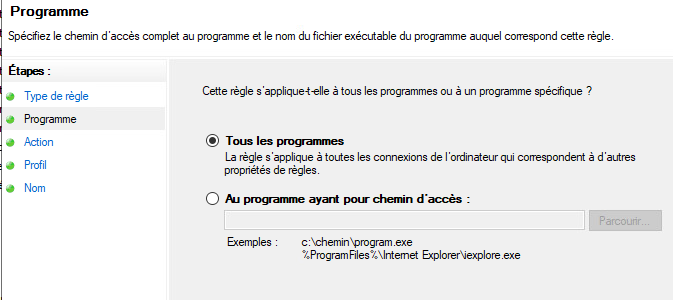<br/>*Les paramètres de la règle en cours de création*

5. Sélectionnez ensuite l'action à effectuer lorsque les paramètres de la règle sont respectés. Par exemple, lorsque du trafic réseau correspond au programme que vous avez identifié, que voulez-vous faire ? Le bloquer ou l'autoriser ?

    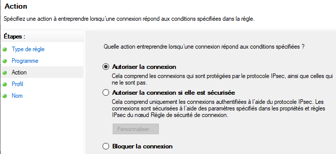<br/>*Détermination de l'action à entreprendre.*

6. Vous devrez déterminer sur quels profil(s) de connexion votre nouvelle règle devra s'appliquer.

    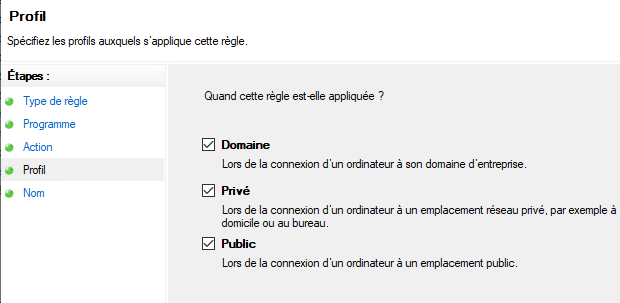<br/>*Profil(s) d'application de la nouvelle règle.*

7. Finalement, donnez un nom à cette nouvelle règle et une description au besoin.

:::tip
Il est tout à fait possible de créer de nouvelles règles du pare-feu en utilisant PowerShell. À cet effet, je vous invite à consulter [cette page](https://learn.microsoft.com/en-us/powershell/module/netsecurity/new-netfirewallrule?view=windowsserver2025-ps) où vous serez en mesure d'apprendre avec quelle commande nous pouvons y arriver, en plus d'y trouver plusieurs exemples pratiques.
:::

#### Désactiver ou supprimer une règle

Sous Windows, il est possible de désactiver une règle. Celle-ci ne s'appliquera donc plus, mais il sera toujours possible de la réactiver. Dans le cas d'une suppression de règle, non seulement la règle ne s'appliquera plus, mais en plus, elle sera complètement supprimée du listing des règles dans le pare-feu. Dans tous les cas, ces actions sont disponibles depuis le menu contextuel (clic droit) de la règle en question.

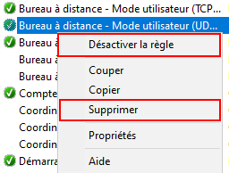

#### Journalisation

Pour chacun des profils de connexion (public, privé ou domaine), il est possible d'enregistrer les paquets ignorés par le pare-feu et/ou les connexions réussies. C'est un outil très précieux lorsque vous voulez savoir si le pare-feu vous empêche d'établir une connexion par exemple. Dans la fenêtre du pare-feu Windows, sélectionnez « Pare-feu Windows Defender avec fonctions avancées de sécurité » :

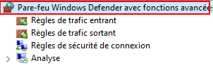

Dans le volet central de la fenêtre, cliquez sur « Propriétés du Pare-Feu Windows Defender ».

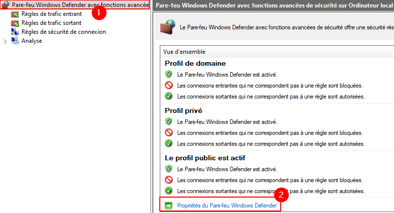

Dans la fenêtre qui s'ouvre, vous retrouverez les paramètres de journalisation pour chacun des profils de connexion:

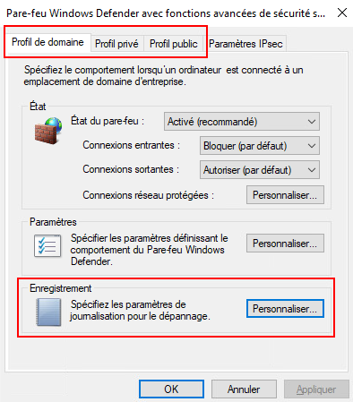

En cliquant sur « Personnaliser... » dans la section « Enregistrement », vous pourrez déterminer ce que vous désirez journaliser ou non. De plus, vous serez en mesure de voir dans quel fichier sont enregistrés ces événements.

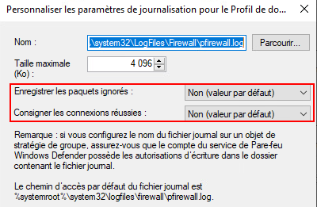

### Serveur Linux <FAIcon icon="fa-brands fa-linux" size="1x"/>

Sous Ubuntu, le pare-feu par défaut est *iptables*. Ce dernier est très puissant et hautement paramétrable. Le problème, c'est que sa configuration peut rapidement devenir complexe pour un utilisateur moyen ou même un administrateur possédant peu d'expérience. C'est pourquoi on y a ajouté une couche supplémentaire pour plus de facilité à le configurer. Cette couche, c'est *UFW* ( *Uncomplicated Firewall* ).

#### Comportement par défaut

Par défaut, *UFW* est **désactivé** sous Ubuntu. Il est possible de le constater en tapant la commande suivante:

```bash
sudo ufw status
```

:::danger
Cela signifie que la machine ne bénéficie d'aucune protection de base suite à son installation. Évidemment, c'est une configuration à ne jamais laisser ainsi en entreprise. **Activez le pare-feu dès que possible!**
:::

Pour activer le pare-feu, il vous suffira d'entrer la commande suivante:

```bash
sudo ufw enable
```

:::important
Par défaut, lorsque vous activerez le pare-feu, toutes les connexions entrantes seront bloquées alors que les sortantes seront autorisées.
:::

#### Créer une règle

Au même titre qu'il existe plusieurs types de cible pour les règles du pare-feu Windows, il en existe également plusieurs pour le pare-feu *UFW* sous Linux.

    | Cible | Description |
    |------|-------------|
    | Programme | Cette cible permet d'appliquer une règle en fonction d'un programme. Tout le traffic en provenance, ou à destination, de ce programme sera autorisé à traverser le pare-feu. |
    | Adresse IP | Ce type de règle utilisera une adreses IP à titre de cible. |
    | Port | On appliquera l'action d'une règle directement sur un port, qui agira à titre de cible. |
    | Interfaces | Ce sont des règles qui s'appliquent en fonction d'une interface réseau. |

Malgré certaines similitudes avec les règles de Windows, il y a aussi des différences notables. C'est le cas notamment des actions que peuvent réaliser les règles sous Linux. Alors que les actions des règles de Windows sont de deux (autoriser ou interdire), nous en retrouverons quatre chez Linux.

1. **Autoriser** (*allow*) - Sans surprise, il s'agit d'une règle qui autorise tout simplement le trafic.
2. **Interdire** (*deny*) - Cette règle permet d'interdire le trafic.
3. **Rejeter** (*reject*) - C'est l'équivalent d'interdire, cependant un message d'erreur sera renvoyé au destinataire.
4. **Limiter** (*limit*) - Cette action autorise la connexion, mais avec certaines restrictions: Pas plus de 6 tentatives de connexion au cours des 30 dernières secondes.

Pour ajouter une règle au pare-feu dans Ubuntu, on utilisera la syntaxe suivante:

```bash
sudo ufw [action] [cible]
```

Voici quelques exemples:

**Cible:** *Programme*
```bash
sudo ufw allow OpenSSH
```

**Cible:** *Adresse IP*
```bash
sudo deny from 192.168.21.200
```
:::caution
L'ordre dans laquelle vous ajoutez les règles est très important sous Linux puisque ces règles ont un ordre de priorité. Les règles supérieures ont priorité sur les règles inférieures. Par exemple, si vous entrez une première règle pour interdire l'utilisation du port 22 (associé au service SSH), puis une seconde règle pour autoriser le service OpenSSH, vous ne serez pas en mesure d'utiliser un service SSH à moins de l'utiliser sur un autre port que celui par défaut.

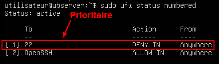
:::

#### Supprimer une règle

La façon la plus efficace de supprimer une règle dans *UFW* est sans doute de l'identifier par son numéro puis de la supprimer. Pour identifier les règles par leur numéro, vous pouvez utiliser la commande suivante:

```bash
sudo ufw status numbered
```

Une fois la règle à supprimer identifiée, vous n'avez qu'à la supprimer en utilisant la commande suivante:

```bash
sudo ufw delete 6 #Le chiffre 6 est utilisé à titre d'exemple
```

:::caution
Lorsque vous supprimez une règle par son numéro, les règles qui la suivent seront décrémentées. À titre d'exemple, en supprimant la règle #6, la règle #7 deviendra la nouvelle règle #6. La règle #8 deviendra la #7 et ainsi de suite.
:::

#### Journalisation

Le pare-feu *UFW* d'Ubuntu possède cinq niveaux de journalisation. À chacun de ces nivaux, le taux d'information et le niveau de détails amassé augmentent. Pour vérifier le niveau de journalisation sur lequel vous êtes, vous pouvez utiliser la commande suivante:

```bash
sudo ufw status verbose
```

Vous verrez alors le niveau suivant le terme *logging*:

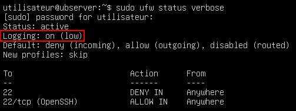

Les niveaux de journalisation possibles sont les suivants:

| Niveau | Description |
|:--------:|-------------|
| off | Aucune journalisation |
| low | Enregistre les paquets bloqués qui correspondent à la politique par défaut ainsi que les paquets bloqués qui correspondent aux règles définis par l'administrateur |
| medium | Enregistre ce que le niveau *low* enregistre, en plus d'enregistrer les paquets autorisés qui correspondent à la politique par défaut, les paquets invalides et toutes les nouvelles connexions. |
| high | Enregistre ce que le niveau *medium* sans limitation en plus des paquets avec limitation. |
| full | Enregistre ce que le niveau *high* enregistre sans aucune limitation. |

Les événements de *UFW* sont enregistrés dans le fichier `/var/log/ufw.log`. Voici ce à quoi cela peut ressembler (cliquez pour zoomer):

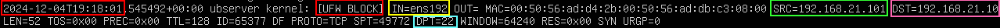

- Encadrés **<span class="red-text"> rouges: </span>** Dans les encadrés rouges sur l'image, vous pourrez repérer la date & l'heure à laquelle l'événement s'est produit ainsi que le type d'événement (ici le blocage d'un paquet).

- Encadré **<span class="yellow-text"> jaune: </span>** Dans l'encadré jaune, vous pourrez repérer le sens du paquet (entrant / *in*) ainsi que l'interface réseau sur laquelle ce paquet a été intercepté.

- Encadré **<span class="green-text"> vert: </span>** Dans l'encadré vert, on peut repérer l'adresse IP d'où provient le paquet qui a été bloqué.

- Encadré **<span class="pink-text"> rose: </span>** Dans l'encadré rose, il est possible de voir l'adresse IP à qui était destiné le paquet, c'est-à-dire notre propre adresse.

- Encadré **<span class="cyan-text"> turquoise: </span>** Dans cet encadré, nous pouvons voir sur quel port ce paquet tentait de traverser. Ici, il s'agit du port 22, le port associé au service SSH.

## Références

- [Retrouvez le PowerPoint du cours ici](../Assets/06/06-420-2X5-H26%20(Services%20Journalisation%20FW).pdf)