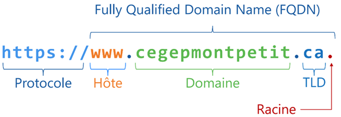
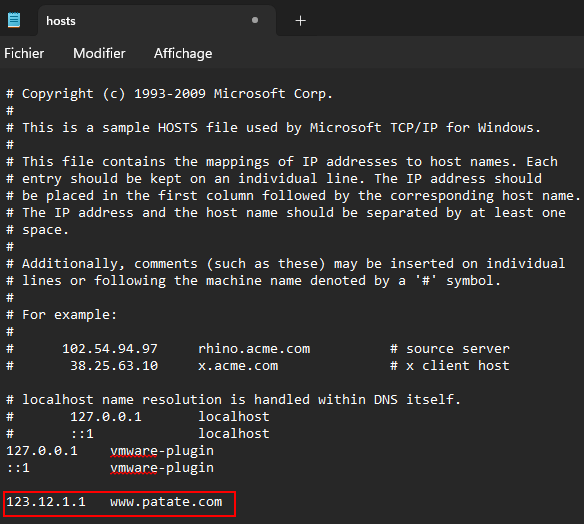
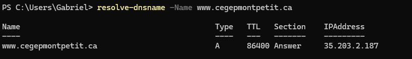
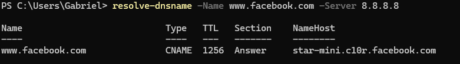
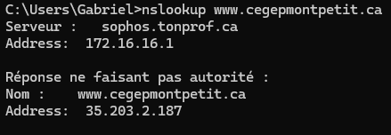
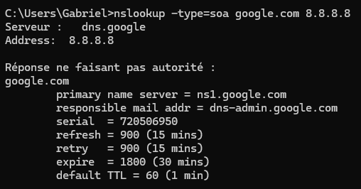
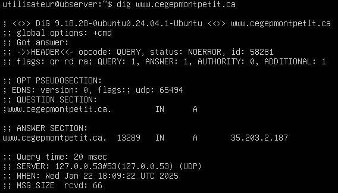
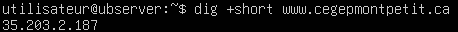
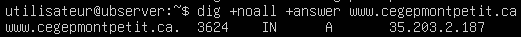

# Cours 7

## Domain Name System

Depuis quelques cours maintenant, vous vous familiarisez avec l'utilisation d'adresses IP. Vous avez configuré des adresses IP sur vos serveurs par exemple. Cela dit, comment se fait-il que vous deviez utiliser des adresses IP pour envoyer un *ping* d'une machine à l'autre par exemple ? Ne serait-il pas plus facile d'envoyer un *ping* à une adresse comme `serveur.patate.com`?

Qu'en est-il lorsque vous naviguez sur le web ? Est-il plus facile de retenir www.cegepmontpetit.ca ou 35.203.2.187 ? La question est vite répondue. Imaginez un monde où vous devriez vous souvenir de toutes les adresses IP des serveurs web que vous interrogez. Imaginez devoir vous souvenir des adresses IP suivantes:

- Vos réseaux sociaux (chacun d'entre eux ayant un IP différente)
- L'adresse IP d'Omnivox
- L'adresse IP de Spotify si vous écoutez de la musique
- L'adresse IP de YouTube
- L'adresse IP de Google
- L'adresse IP de ChatGPT
- Etc.

## Problématiques avec les adresses IP 🤔

Les adresses IP ne sont pas pratiques pour plusieurs raisons:

- Elles ne sont pas évidentes à retenir, du moins lorsque nous en avons plusieurs à retenir.
- Elles peuvent changer. Un serveur ou un ordinateur n'a pas toujours la même adresse IP.
- Une même adresse IP pourrait héberger plus d'un site web ou plus d'une application.

## La résolution de noms 💡
L'être humain étant ce qu'il est, il a plus de facilité à retenir les noms que les numéros. D'ailleurs, c'est pourquoi vous portez un nom et non pas un numéro (sauf si votre père est Elon Musk). Nous avons donc créé un mécanisme nous permettant de donner des noms à des ordinateurs (eh oui, on leur donne des noms...). Ce mécanisme, c'est le DNS ou le *Domain Name System*.

En analogie à ce principe, nous pourrions penser au répertoire téléphonique dans votre cellulaire. Aujourd'hui, je ne connais plus beaucoup de gens qui se souviennent du numéro de téléphone de leurs proches. On se contente plutôt d'appuyer sur leur nom dans notre répertoire téléphonique. C'est un peu comme cela que fonctionne la résolution de noms également.


## Un nom oui, mais de domaine !?

De quoi parle-t-on lorsqu'on parle de nom de domaine exactement ? Et puis c'est quoi un domaine ? Allons-y donc avec quelques définitions avant d'aller plus loin:

- **Domaine:** <br/>Un domaine est un ensemble d'ordinateurs et de périphériques interconnectés les uns aux autres à travers un réseau local. Au cégep, par exemple, les ordinateurs et les imprimantes sont tous reliés entre eux grâce au réseau de l'établissement. Au lieu de simplement parler du réseau du cégep, on parlera du domaine du cégep. Ce domaine porte un nom: cegepmontpetit.ca. Le nom d'un domaine est généralement représentatif de l'entreprise ou l'institution qui le possède (mais pas obligatoirement).

- **FQDN (Fully Qualified Domain Name):** <br/> Alors, le domaine porte un nom: cegepmontpetit.ca par exemple. Or, chaque appareil membre de ce domaine porte également un nom, que l'on appellera le nom d'hôte (*hostname*). Il y a généralement une logique dans la nomenclature des appareils. Un exemple parmi d'autres pourrait être d'inclure le numéro d'un local suivi d'un numéro associé à l'emplacement de l'ordinateur. Pour le poste 07 du local D-0226, on pourrait obtenir quelque chose comme d0226-07 comme nom d'hôte. Ensuite, on ajoutera le nom de domaine au nom de l'ordinateur pour un nom complet. Par exemple: d0226-07.cegepmontpetit.ca. Ce dernier exemple est ce que l'on nomme FQDN (*Fully Qualified Domain Name*). C'est le nom complet d'un poste dans un domaine. On pourrait facilement en faire l'analogie avec votre propre prénom et votre nom de famille. Votre prénom vous identifie en tant qu'individu unique, puis votre nom de famille indique votre appartenance à un groupe. C'est exactement le même principe avec les noms de domaine.

    <br/>
    *Chaque caractère d'un nom de domaine a une utilité et nous nous y attarderons très prochainement*

### Comment ça fonctionne ?

Une résolution de nom comporte un bon nombre d'étapes. Néanmoins, le processus a tellement bien été ficelé au fil du temps, que le processus prend moins de temps qu'il en faut pour cligner des yeux. Alors que se passe-t-il exactement lorsque vous tapez [www.patate.com](https://img.freepik.com/photos-gratuite/autocollant-drole-pomme-terre-visage_23-2148740793.jpg?t=st=1733952670~exp=1733956270~hmac=59caf559765b6cbfdec48d165d9b78632d30d6c9c08fcf3447ef69766d3d0e3d&w=1380) dans votre navigateur internet ? Analysons cela:

#### Étape 1 : Le fichier hosts

Votre ordinateur commencera par vérifier s'il possède l'adresse IP correspondante à l'adresse que vous avez tapée dans son fichier `hosts`. Le fichier `hosts` est présent dans **tous** les ordinateurs. Ce fichier possède des associations nom:adresse IP et il possède la priorité absolue lorsque vient le temps de résoudre un nom. Voici la représentation du fichier `hosts` sous Windows par exemple:



Vous vous en doutez surement, j'ai moi-même ajouté la ligne concernant patate.com. Quelle en sera l'incidence ? Eh bien c'est assez simple, s'il vient un moment où je tente de joindre le site concerné, mon ordinateur communiquera immédiatement avec l'adresse IP qui lui est associée dans le fichier, c'est à dire `123.12.1.1`.

> *Mais Gabriel, pourquoi n'utilisons tout simplement pas le fichier hosts pour résoudre toutes nos adresses IP ?*
>
>-Les étudiants

En fait, ce serait très complexe de fonctionner ainsi. En 2022, on estimait à près de deux milliards le nombre de sites web présent sur le web. On estimait également le nombre d'utilisateurs à plus de cinq milliards. Si nous utilisions les fichiers `hosts` pour résoudre les noms de domaine, nous aurions plusieurs milliards de fichiers à mettre à jour régulièrement. Cela générerait un trafic épouvantable sur les différents réseaux qui soutiennent internet, en plus de ne pas être efficace.


#### Étape 2 : Mémoire cache du client

Dans le cas où le nom de domaine que vous tentez de résoudre ne fait pas partie du fichier `hosts`, l'ordinateur vérifiera si vous avez déjà visité le site web recherché par le passé. Par exemple, il n'est pas rare d'accéder au site de Google plusieurs fois par jour. Lorsqu'un nom de domaine est résolu, le client conservera en mémoire l'adresse IP qui est associée à ce nom de domaine durant un certain temps. Ce type de mémoire est appelé, la mémoire cache. Ainsi, lorsque vous tenterez de résoudre une deuxième fois le même nom de domaine, la résolution du nom en adresse IP sera pratiquement instantanée.

:::caution[La mémoire qui joue des tours]
Bien qu'elle accélère grandement la résolution de certains noms de domaine, la mémoire cache peut parfois nous jouer des tours. En effet, comme les adresses IP peuvent changer, l'association entre un nom et une IP peut être vraie à un certain moment et ne plus être valide quelques heures plus tard. Or, si la mémoire n'est pas mise à jour assez régulièrement, elle peut se retrouver avec une mauvaise association entre un nom et une adresse. C'est pourquoi il faudra parfois vider la cache du navigateur et/ou du PC.
:::

#### Étape 3 : Votre propre serveur DNS

Après avoir vérifié dans son fichier `hosts` ainsi que dans sa mémoire cache, si votre ordinateur n'est toujours pas en mesure de traduire le nom de domaine en adresse IP, il enverra une requête à votre propre serveur DNS. 

:::tip[Le saviez-vous ?]
Nous avons tous un serveur DNS à la maison. À moins que vous en ayez configuré un spécifique, il s'agit de votre modem-routeur. En effet, c'est à lui que sont transférées les requêtes DNS que votre ordinateur n'arrive pas à résoudre par lui-même. On appelle ce serveur le **redirecteur DNS** (*Forwarder en anglais*). Son travail est simplement de vérifier s'il possède l'adresse IP associée au nom de domaine qu'il reçoit dans sa mémoire cache, sinon il redirigera la requête vers un autre serveur DNS.
:::

<div style={{textAlign: 'center'}}>
    <ThemedImage
        alt="Schéma"
        sources={{
            light: useBaseUrl('/img/Serveurs1/3PremieresEtapes_W.gif'),
            dark: useBaseUrl('/img/Serveurs1/3PremieresEtapes_D.gif'),
        }}
    />
</div>

Que fera votre modem/routeur avec cette requête DNS ? Deux choses:
 
1. Votre modem/routeur possède, lui aussi, une mémoire cache. Il se peut que quelqu'un sur le réseau local ait déjà demandé à résoudre le nom de domaine que vous tentez de récupérer. Dans le cas échéant, le modem-routeur aura stocké le résultat de cette traduction dans sa mémoire et pourra donc vous fournir l'information adéquate.

2. Dans le cas où le modem-routeur n'aurait pas l'information recherchée dans sa mémoire. Il redirigera la requête vers un autre serveur DNS, habituellement le serveur DNS récursif situé chez le FSI (*Fournisseur de Service Internet*).

#### Étape 4 : Serveur DNS récursif

Jusqu'à maintenant, toutes les étapes vues précédemment impliquaient une tentative de résolution du nom puis un relais de l'information vers un autre serveur en cas d'échec. Or, le serveur DNS récursif prendra en charge la résolution d'un nom d'un bout à l'autre. Autrement dit, le serveur DNS récursif vérifiera dans sa mémoire cache s'il a déjà l'adresse IP qui correspond au nom de domaine recherché. Si ce n'est pas le cas, le serveur DNS récursif entamera un processus de résolution itératif.

:::important
Il existe deux types de requête DNS:

- **Requêtes récursives:**
    Lorsqu'un ordinateur ou un serveur émet une requête récursive, il attend une réponse finale. Par exemple, l'ordinateur qui émet une requête récursive pour le nom *www.patate.com* s'attend à recevoir l'adresse IP associée à ce nom.

- **Requêtes itératives:**
    Lorsqu'un ordinateur ou un serveur émet une requête itérative, il attend une réponse finale ou une portion de la réponse. Nous verrons ci-dessous comment il est possible d'obtenir une portion de la réponse.

Cela dit, il est important de bien distinguer les deux types de requêtes.
:::

<div style={{textAlign: 'center'}}>
    <ThemedImage
        alt="Schéma"
        sources={{
            light: useBaseUrl('/img/Serveurs1/4PremieresEtapes_W.gif'),
            dark: useBaseUrl('/img/Serveurs1/4PremieresEtapes_D.gif'),
        }}
    />
</div>

#### Étape 5 : Serveurs DNS racines

Lorsque nous avons abordé le FQDN un peu plus haut, vous avez peut-être remarqué que le nom de domaine se terminait par un point. Ce point est omniprésent, il représente la racine d'un nom DNS. Il s'agit du plus haut point de la hiérarchie DNS, rien n'existe au-dessus. On pourrait comparer ce point à la racine du système d'exploitation Windows par exemple (la lettre C:). Tout découle de la lettre `C:` dans le système Windows. Eh bien dans la structure DNS, tout découle de la racine aussi, représenté par un point.

Le serveur DNS récursif communiquera donc avec l'un des serveurs racines près de sa situation géographique. Le serveur racine ne sera pas en mesure de lui donner l'adresse IP correspondant à `www.patate.com.`. Cela dit, il saura quel serveur DNS contient les enregistrements se terminant par `.com` et lui indiquera l'adresse. Ce sera donc une première réponse partielle que le serveur DNS récursif obtiendra.

:::tip[Le saviez-vous ?]
Les serveurs DNS racines maintiennent littéralement l'internet en vie. Ils sont administrés par 13 organisations mondiales, publiques et privées. Parmi ces organisations, on retrouve la NASA, le département de la défense américaine ainsi que de grandes universités. Consultez [cette page](https://root-servers.org/) pour voir où sont situés les différents serveurs DNS Racine et qui les administrent.
:::

<div style={{textAlign: 'center'}}>
    <ThemedImage
        alt="Schéma"
        sources={{
            light: useBaseUrl('/img/Serveurs1/5PremieresEtapes_W.gif'),
            dark: useBaseUrl('/img/Serveurs1/5PremieresEtapes_D.gif'),
        }}
    />
    *\*\*Les flèches roses désignent des requêtes itératives alors que les blanches représentent les récursives*\*\*
</div>


#### Étape 6 : Serveurs DNS de haut niveau (TLD)

Le DNS Racine n'a pas offert de réponse complète lorsqu'il a reçu votre requête pour `www.patate.com` (il n'en offre jamais d'ailleurs). Cependant il nous a renvoyé une adresse IP: l'adresse du serveur DNS détenant les enregistrements se terminant par `.com`. Les serveurs DNS s'occupant de ces zones (.com, .ca, .org, etc...) se nomment les serveurs DNS de haut niveau ou *Top Level Domain*. Lorsque le serveur DNS récursif ira consulter le serveur TLD vers lequel le serveur DNS racine l'a envoyé, il n'obtiendra toujours pas une réponse complète. Néanmoins, le serveur TLD le renverra vers un autre serveur DNS, le serveur ANS.

<div style={{textAlign: 'center'}}>
    <ThemedImage
        alt="Schéma"
        sources={{
            light: useBaseUrl('/img/Serveurs1/6PremieresEtapes_W.gif'),
            dark: useBaseUrl('/img/Serveurs1/6PremieresEtapes_D.gif'),
        }}
    />
    *\*\*Les flèches roses désignent des requêtes itératives alors que les blanches représentent les récursives*\*\*
</div>


#### Étape 7 : Serveurs DNS Autoritaire (ANS)

Nous avons maintenant l'adresse du serveur DNS autoritaire. Le serveur DNS autoritaire porte très bien son nom (*Authoritative Name Server*). C'est lui qui a autorité sur la zone DNS qui nous intéresse. Nous reviendrons très prochainement sur les concepts de zones DNS. En attendant, sachez qu'une zone DNS contient l'ensemble des enregistrements DNS d'un nom DNS donné. Par exemple, pour le nom de domaine `patate.com`, une zone pourrait contenir des enregistrements comme *www*, *cloud* ou même *voip*. C'est donc ce serveur qui pourra, finalement, nous donner l'adresse IP correspondant au non de domaine que l'on essaie d'obtenir.

>*Pourquoi l'appelle-t-on le serveur DNS autoritaire ?*
>
>*-Les étudiants*

Bonne question! Simplement parce que c'est le seul serveur autorisé à modifier la zone des enregistrements, nous étudierons les zones plus en profondeur très prochainement. Ceci étant dit, une fois que le serveur DNS récursif aura obtenu une correspondance entre le nom de domaine recherché et une adresse IP, celle-ci sera stockée dans sa mémoire cache. Il en va de même pour votre modem/routeur ainsi que votre ordinateur personnel.

<div style={{textAlign: 'center'}}>
    <ThemedImage
        alt="Schéma"
        sources={{
            light: useBaseUrl('/img/Serveurs1/7PremieresEtapes_W.gif'),
            dark: useBaseUrl('/img/Serveurs1/7PremieresEtapes_D.gif'),
        }}
    />
    *\*\*Les flèches roses désignent des requêtes itératives alors que les blanches représentent les récursives*\*\*
</div>

## Pour en finir avec la cache

À travers les différentes étapes d'une résolution de nom DNS, nous avons souvent parlé de mémoire cache. En effet, plusieurs mémoires caches sont réparties à travers tout le processus. Par exemple, votre ordinateur possède une mémoire cache pour le DNS, de même que votre navigateur (non, ce n'est pas la même!). Votre modem/routeur possède aussi une cache DNS, etc. L'Objectif de mettre en cache les correspondances noms : IP à plusieurs étapes du processus est d'accélérer et d'optimiser la résolution de nom au maximum. En 2020, on estimait qu'il y avait entre 10 et 15 milliards de requêtes DNS par jour dans le monde. Imaginez si chacune de ces requêtes devait traverser le processus de résolution en entier à chaque fois (DNS Racine, TLD puis ANS...). Cela ralentirait le web en entier. Les différentes mémoires caches éparpillées aux différentes étapes de résolution jouent donc un rôle essentiel.

## Quelques commandes en matière de DNS

Plusieurs commandes peuvent vous aider à résoudre des problèmes de DNS. Nous allons les analyser ensemble.

### Résoudre un nom de domaine sous Windows

#### Avec PowerShell
Nul besoin d'ouvrir votre navigateur web si vous désirez tester le serveur DNS en place, il vous suffit d'utiliser la commande `resolve-dnsname` de PowerShell. Par exemple, si désire résoudre le nom www.cegepmontpetit.ca, je pourrais procéder comme suit:

<div className="tabsborder">
    <Tabs>
        <TabItem value="Resolve-DnsName" label="Commande" default>
            ```Powershell
            resolve-dnsname -Name www.cegepmontpetit.ca
            ```
        </TabItem>
        <TabItem value="Resultat-Resolve-DnsName" label="Résultat">
            
        </TabItem>
    </Tabs>
</div><br/>

Il est également possible d'utiliser la même commande tout en précisant le serveur DNS que l'on désire interroger:

<div className="tabsborder">
    <Tabs>
        <TabItem value="Resolve-DnsName-Server" label="Commande" default>
            ```Powershell
            resolve-dnsname -Name www.facebook.com -Server 8.8.8.8
            ```
        </TabItem>
        <TabItem value="Resultat-Resolve-DnsName-Server" label="Résultat">
            
        </TabItem>
    </Tabs>
</div>

#### Avec nslookup
La commande `nslookup` permet aussi d'interroger un serveur DNS. Cela dit, c'est une commande standard, elle n'appartient pas à la famille des commandes PowerShell. Néanmoins, elle demeure très intéressante puisqu'elle s'utilise autant sous Linux que sous Windows.

<div className="tabsborder">
    <Tabs>
        <TabItem value="nslookup" label="Commande" default>
            ```batch
            nslookup www.cegepmontpetit.ca
            ```
        </TabItem>
        <TabItem value="Resultat-nslookup" label="Résultat">
            

            :::caution
            La réponse retournée comporte deux blocs:

            - Le bloc du haut contient des informations sur le serveur DNS qui nous a répondu (son nom & son adresse).
            - Le bloc du bas, quant à lui, contient la réponse que nous attendions, soit l'adresse IP correspondant à `www.cegepmontpetit.ca`. Avez-vous remarqué la mention **« réponse ne faisant pas autorité »** ? Cela signifie que la réponse nous provient d'un serveur DNS qui n'a pas l'autorité sur la zone cegepmonpetit.ca. Il peut s'agir d'un serveur secondaire ou tout simplement d'une réponse provenant de la cache d'un autre serveur.
            :::
         </TabItem>
    </Tabs>
</div><br/>

Il a tout fait possible d'interroger des enregistrements DNS particuliers ou même des serveurs DNS particuliers avec la commande `nslookup` en ajoutant ces options aux bons endroits:

<div className="tabsborder">
    <Tabs>
        <TabItem value="nslookup_opt" label="Commande" default>
            ```batch
            nslookup -type=soa google.com 8.8.8.8
            ```
        </TabItem>
        <TabItem value="Resultat-nslookup_opt" label="Résultat">
            
        </TabItem>
    </Tabs>
</div>


### Résoudre un nom de domaine sous Linux

Sous Linux, nous utiliserons la commande `dig` pour résoudre des noms DNS. Cette commande possède beaucoup de paramètres possibles. Vous pourrez retrouver l'ensemble de ces paramètres assez aisément sur le web. En ce qui nous concerne, nous nous contenterons d'utiliser quelques-uns des paramètres seulement.

À la base, vous pouvez utiliser la commande simplement en y ajoutant un nom de domaine. Vous obtiendrez alors une réponse très détaillée:

<div className="tabsborder">
    <Tabs>
        <TabItem value="Dig-None" label="Commande" default>
           ```bash
            dig www.cegepmontpetit.ca
            ```
        </TabItem>
        <TabItem value="Resultat-Dig-None" label="Résultat">
           
        </TabItem>
    </Tabs>
</div><br/>

Les informations que retourne la commande sont très pertinentes bien que trop nombreuses. Heureusement, certains commutateurs nous seront très pratiques. Commençons par le commutateur `+short` qui nous permettra d'obtenir uniquement l'adresse IP correspondante au nom recherché.

<div className="tabsborder">
    <Tabs>
        <TabItem value="Dig-Short" label="Commande" default>
           ```bash
            dig +short www.cegepmontpetit.ca
            ```
        </TabItem>
        <TabItem value="Resultat-Dig-Short" label="Résultat">
           
        </TabItem>
    </Tabs>
</div><br/>

Sans commutateur, la commande `dig` nous retournait trop d'informations, alors qu'avec le commutateur `+short` nous en avons très peu, voire pas suffisamment. Il y a toutefois moyen d'obtenir un entre-deux. Pour y arriver, nous utiliserons le commutateur `+noall` qui stipule de ne rien retourner à l'écran. Évidemment, nous utiliserons un deuxième commutateur, soit `+answer` celui qui nous retournera uniquement la section concernant la résolution du nom. Au final, nous obtenons quelque chose comme suit:

<div className="tabsborder">
    <Tabs>
        <TabItem value="Dig-Mid" label="Commande" default>
           ```bash
            dig +noall +answer www.cegepmontpetit.ca
            ```
        </TabItem>
        <TabItem value="Resultat-Dig-Mid" label="Résultat">
           
        </TabItem>
    </Tabs>
</div><br/>


## Vidéos et références

- [Explication du DNS en vidéo du youtubeur Cookie connecté](https://youtu.be/qzWdzAvfBoo?si=KS5brGyet4w4dgrs)
- [Explication du DNS en vidéo par DNS made easy (*Anglais*)](https://youtu.be/72snZctFFtA?si=d0YqaTTBYybJZIY_)
- [Qu'est-ce que le DNS du groupe It-Connect](https://youtu.be/tyDxzzdKnsU?si=2IXJLleFfWdjLzaP)
- [Présentation PowerPoint du cours](../Assets/07/07-420-2X5-H26-Introduction%20DNS.pdf)