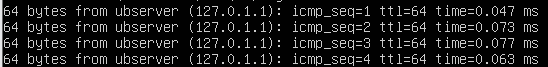
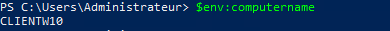
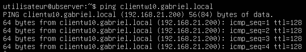

import useBaseUrl from '@docusaurus/useBaseUrl';
import ThemedImage from '@theme/ThemedImage';
import Tabs from '@theme/Tabs';
import TabItem from '@theme/TabItem';

# Laboratoire 7
* * *
## Installation d'un premier serveur DNS

## Préalable(s)

- Avoir complété le laboratoire # 6

## Objectif(s)
- Installer et configurer un premier serveur DNS.
- Interroger un serveur DNS.

* * *
## Schéma

<div style={{textAlign: 'center'}}>
    <ThemedImage
        alt="Schéma"
        sources={{
            light: useBaseUrl('/img/Serveurs1/Laboratoire7_W.svg'),
            dark: useBaseUrl('/img/Serveurs1/Laboratoire7_D.svg'),
        }}
    />
</div>

* * *

## Étapes de réalisation

Tel que nous en avons discuté en classe, le DNS est un système permettant de traduire les adresses IP en nom, vice-versa. Dans ce laboratoire et les suivants, vous aurez l'occasion d'expérimenter la mise en place de serveurs DNS et d'observer leur comportement dans différentes situations.

### Mise en place du schéma

Mettez en place le schéma du réseau présenté ci-dessus. Assurez-vous que le client sous Windows 10 et que le serveur Ubuntu possèdent un accès internet via votre passerelle. Au besoin, faites les mises à jour sur le serveur Ubuntu.

### Configuration de l'adresse IP d'Ubuntu

Dans les cours précédents, nous avons étudié comment configurer une adresse IP statique sous Ubuntu Server. Comme il s'agit d'un serveur également dans ce laboratoire, assurez-vous de configurer une adresse IP statique au serveur Ubuntu. 

**Recommandation: 192.168.21.10**

### Configuration du nom d'hôte d'Ubuntu

Le nom d'hôte est tout simplement le nom que l'on donne à un ordinateur ou un serveur. Par défaut, tout ordinateur (sous Windows ou sous Linux) en possède un qui a été attitré à l'installation. Dans la version serveur d'Ubuntu, on peut retrouver le nom d'hôte situé après le caractère « @ » dans la ligne de commande:


Entrez la commande `ping` suivie du nom de votre ordinateur:

<div className="tabsborder">
    <Tabs>
        <TabItem value="Ping-Home" label="Commande" default>
           ```bash
            ping ubserver
            ```
        </TabItem>
        <TabItem value="Resultat-Ping-Home" label="Résultat">
           
        </TabItem>
    </Tabs>
</div><br/>

Appuyez simultanément sur les touches <kbd>ctrl</kbd>+<kbd>c</kbd> pour mettre fin à la commande `ping`. Remarquez-vous quelque chose d'étrange dans la réponse aux requêtes ping ? Observez l'adresse IP : 127.0.1.1

:::tip[L'adresse de boucle locale]
L'adresse IP `127.0.0.1` est ce que l'on nomme l'adresse de boucle locale (*loopback* en anglais). C'est une *fausse* adresse IP au sens où celle-ci renvoie vers votre propre machine. En gros, l'adresse `127.0.0.1` est un synonyme pour dire « ma propre machine ». Ceci est valable à travers tous les systèmes d'exploitation. Cependant, prenez le temps d'observer de nouveau le résultat de votre commande `ping`... Voyez-vous la différence ? L'adresse que l'on retrouve dans le résultat est 127.0.**1.1** et non pas 127.0.**0.1**. Quelle est la différence ? La différence est assez mineure. Sous Ubuntu Serveur 127.0.0.1 signifie `localhost` et 127.0.1.1 retourne le nom d'hôte.
:::

Bien que votre machine possède son propre nom, elle ne possède pas, pour l'instant, de nom de domaine auquel elle pourrait appartenir. Pour faire une analogie, disons que le nom de domaine pourrait être comparable à votre nom de famille. Plusieurs personnes d'une même famille se partagent ce nom. Cela distingue un « bob » d'un autre « bob ».

Les noms de domaines DNS (les noms de famille) sont constitués d'un nom suivi d'un suffixe:
 - exemple.com
 - patate.net
 - gabriel.local
 - ti-jo.patate
    
Pour la suite de ce laboratoire, j'utiliserai le nom de domaine *gabriel.local*. Vous pouvez suivre mon exemple si vous le désirez.
Je dois donc informer mon serveur que non seulement il possède un nom, qu'il connait déjà, mais qu'il possède également un nom de famille (un nom de domaine.)
Pour ce faire, je vais donc éditer le fichier "hosts". Oui, oui, le fichier "hosts" dont on a parlé en classe. 

À l'aide d'un éditeur de texte, je vais donc ouvrir ce fichier:

```bash title='/etc/hosts (Fichier original)' showLineNumbers
127.0.0.1 localhost
127.0.1.1 ubserver

# The following are desirable for IPv6 capable hosts
::1 ip6-localhost ip6-loopback
fe00::0 ip6-localnet
ff00::0 ip6mcastprefix
ff02::1 ip6-allnodes
ff02::2 ip6-allrouters
```

Dans le cadre du cours, nous travaillerons en IPv4, c'est donc dans la section du haut que nous devons apporter des modifications. Dans l'encadré ci-dessous, vous retrouverez les modifications apportées à la section du haut du fichier:

```bash title='/etc/hosts (Modification)' showLineNumbers
127.0.0.1 localhost
# highlight-next-line
127.0.1.1 ubserver.gabriel.local ubserver

# The following are desirable for IPv6 capable hosts
::1 ip6-localhost ip6-loopback
fe00::0 ip6-localnet
ff00::0 ip6mcastprefix
ff02::1 ip6-allnodes
ff02::2 ip6-allrouters
```
Comme vous pouvez le constater, j'ai ajouté le nom de domaine au nom de ma machine. Ensuite, j'ai entré un espace et j'ai à nouveau le nom de ma machine. Cela permet de distinguer le nom complet (FQDN) et le nom d'hôte (hostname). Enregistrez vos modifications et quittez l'éditeur de texte.

Validez vos modifications en entrant les commandes suivantes:

<div className="tabsborder">
    <Tabs>
        <TabItem value="HostnameCommand" label="Commande" default>
           ```bash
            hostname
            ```
        </TabItem>
        <TabItem value="ResultatHostnameCommand" label="Résultat">
           
        </TabItem>
    </Tabs>
</div><br/>

<div className="tabsborder">
    <Tabs>
        <TabItem value="HostnameFullCommand" label="Commande" default>
           ```bash
            hostname -f
            ```
        </TabItem>
        <TabItem value="ResultatHostnameFullCommand" label="Résultat">
           
        </TabItem>
    </Tabs>
</div><br/>

### Configuration du nom d'hôte de W10

Votre poste sous Windows 10 possède également un nom d'hôte. Néanmoins, vous n'aurez pas le luxe de le choisir lors de l'installation contrairement à Ubuntu Server. Windows crée plutôt un nom générique lors de l'installation. Il faudra cependant le modifier pour un nom plus convivial. Pour ce faire, nous utiliserons une commande PowerShell. **Attention, cette commande provoquera un redémarrage de votre poste**:

```Powershell
Rename-Computer -NewName "ClientW10" -Restart
```

Une fois que Windows aura redémarré, validez le nouveau nom en utilisant la commande suivante:

<div className="tabsborder">
    <Tabs>
        <TabItem value="ComputerName" label="Commande" default>
           ```Powershell
            $env:computername
            ```
        </TabItem>
        <TabItem value="ResultatComputerName" label="Résultat">
           
        </TabItem>
    </Tabs>
</div><br/>

### Configuration de l'adresse IP de W10

Pour des raisons de simplicité, nous allons mettre l'adresse IP de Windows 10 en mode statique. Configurez donc l'adresse IP de votre poste sous Windows 10 comme suit:

|Item|Valeur|
|----|------|
|Adresse IP|192.168.21.200|
|Masque|255.255.255.0|
|Passerelle|192.168.21.1|
|DNS|192.168.21.1|

### Résolution d'un nom avec le fichier hosts

Notre serveur Ubuntu possède désormais un nom de domaine complet et une adresse IP statique, de même que notre ordinateur sous Windows 10. Nous avons tous les éléments pour effectuer une première résolution de nom. Rappelez-vous: la première étape d'une résolution DNS ne passe pas par un serveur de nom, mais par le fichier `/etc/hosts`.

Dirigez-vous donc sur votre serveur Linux et ouvrez le fichier `/etc/hosts`, nous y ajouterons un enregistrement pour notre PC sous Windows 10.

```bash title='/etc/hosts (ajout Windows 10)' showLineNumbers
127.0.0.1 localhost
127.0.1.1 ubserver.gabriel.local ubserver
# highlight-next-line
192.168.21.200 clientw10.gabriel.local clientw10

# The following are desirable for IPv6 capable hosts
::1 ip6-localhost ip6-loopback
fe00::0 ip6-localnet
ff00::0 ip6mcastprefix
ff02::1 ip6-allnodes
ff02::2 ip6-allrouters
```

Une fois cette ligne ajoutée, enregistrez le fichier et quittez l'éditeur de texte. Tentez d'envoyer une requête `ping` de votre serveur Ubuntu vers votre client Windows 10 **en utilisant son nom complet, soit : clientw10.gabriel.local**

```bash
ping clientw10.gabriel.local
```

Alors ? Ça fonctionne...? Ça ne devrait pas. En effet, si vous n'avez pas préalablement manipulé les règles de votre pare-feu au sein de votre client sous Windows 10, celui-ci devrait bloquer les paquets de types `ping`. Il existe déjà des règles au sein du pare-feu Windows qui autorise ce genre de paquet, il ne suffit que de les activer. Pour ce faire, utilisez la commande suivante:

```Powershell
Set-NetFirewallRule -Name FPS-ICMP4-ERQ-In -Enabled True
```

Retentez votre commande `ping` initiale depuis votre serveur Ubuntu:



**<span class="green-text">Ça fonctionne! Vous avez effectué une première traduction.</span>**

Oui, mais ce n'est pas encore au point. Si je désirais ajouter d'autres postes à mon réseau, je devrais éditer les fichiers `hosts` de toutes les machines à chaque fois. Ce serait un travail colossal et peu efficace. 😭 
Nous allons donc devoir nous tourner vers quelque chose de plus efficace: un véritable serveur DNS.

### Installation et configuration du service DNS

Pour faire de notre serveur Ubuntu un véritable serveur DNS, il nous faudra installer quelques paquets supplémentaires. Nous utiliserons l'un des services DNS très populaire sur le marché: Bind9. Plus précisément, nous installerons 3 paquets:

|Paquet|Définition|
|----------|--------------|
| bind9 | C'est le service DNS lui-même |
| bind9utils | Ce sont des commandes supplémentaires qui peuvent être utiles lors de débogage par exemple. |
| bind9-doc | L'ensemble de la documentation pour bind9 |

Voici donc la commande à entrer pour installer les paquets en question:

```bash
sudo apt install bind9 bind9utils bind9-doc -y
```

Dès son installation, Bind9 passe en mode "cache DNS". Autrement dit, il commence à retenir les adresses IP dont il obtient la résolution DNS.
    
Notre objectif est évidemment d'utiliser cette mémoire cache qui est présente dans le serveur DNS bind9 pour optimiser la résolution des requêtes DNS sur notre réseau. Nous devons envoyer toutes nos requêtes DNS vers ce serveur dorénavant. Sauf que…
    
Notre serveur DNS, lui, fera quoi avec nos requêtes DNS ? Comment fera-t-il pour déterminer quelle est l'adresse IP du site rds.ca que je tente de joindre ? La vraie réponse, c'est qu'il en sera incapable… (pas fort pour un DNS😡). On va donc configurer ce que l'on nomme **un redirecteur.** Lorsque notre serveur DNS recevra une requête pour un site déterminé, celui-ci transférera la requête vers un DNS publique (ex: Google) et il attendra la réponse. Lorsqu'il recevra le résultat de la requête, soit l'adresse IP, il stockera celle-ci dans sa mémoire cache afin d'accélérer le processus de la prochaine requête.
    
Voici un petit schéma explicatif:

<div style={{textAlign: 'center'}}>
    <ThemedImage
        alt="Schéma"
        sources={{
            light: useBaseUrl('/img/Serveurs1/Labo7_Redirecteur_W.gif'),
            dark: useBaseUrl('/img/Serveurs1/Labo7_Redirecteur_D.gif'),
        }}
    />
</div>

Nous allons donc éditer l'un des fichiers de Bind9 afin que celui-ci comprenne qu'il doit rediriger les requêtes dont il ne connait pas la réponse. D'abord, voici le fichier original:

```yaml title='/etc/bind/named.conf.options (fichier original)' showLineNumbers
options {
    directory "/var/cache/bind";

    // if there is a firewall between you and nameservers you want
    // to talk to, you may need to fix the firewall to allow multiple
    // ports to talk. See http://www.kb.cert.org/vuls/id/800113

    // If your ISP provided one or more IP addresses for stable
    // nameservers, you probably want to use them as forwarders.
    // Uncomment the following block, and insert the addresses replacing
    // the all-0's placeholder.

    //highlight-next-line
    // forwarders {
    //highlight-next-line
    //      0.0.0.0;
    //highlight-next-line
    // };

    //=======================================================================
    // If BIND logs error messages about the root key being expired,
    // you will need to update your keys. See https://www.isc.org/bind-keys
    //=======================================================================
    dnssec-validation auto;

    listen-on-v6 { any; };
};
```

Chacune des lignes commençant par « // » représente un commentaire et n'est pas prise en compte par le service. Vous remarquerez que j'ai mis en évidence la section qui concerne les « forwarders » ou les redirecteurs en français. Il nous faudra donc décommenter ces lignes de configurations et y inscrire les adresses des serveurs DNS vers lesquels nous redirigerons nos requêtes. Pour le plaisir, nous utiliserons les serveurs DNS publics de Google. Apportez donc les modifications suivantes:

```yaml title='/etc/bind/named.conf.options (fichier modifié)' showLineNumbers
options {
    directory "/var/cache/bind";

    // if there is a firewall between you and nameservers you want
    // to talk to, you may need to fix the firewall to allow multiple
    // ports to talk. See http://www.kb.cert.org/vuls/id/800113

    // If your ISP provided one or more IP addresses for stable
    // nameservers, you probably want to use them as forwarders.
    // Uncomment the following block, and insert the addresses replacing
    // the all-0's placeholder.

    //highlight-start
    forwarders {
          8.8.8.8;
          8.8.4.4;
    };

    forward only;
    //highlight-end

    //=======================================================================
    // If BIND logs error messages about the root key being expired,
    // you will need to update your keys. See https://www.isc.org/bind-keys
    //=======================================================================
    dnssec-validation auto;

    listen-on-v6 { any; };
};
```

Une fois les modifications apportées et le fichier bien enregistrés, nous pouvons faire une vérification de la syntaxe pour vous assurer que vous n'avez fait aucune erreur.

```bash
sudo named-checkconf /etc/bind/named.conf.options
```

Si la commande ne retourne rien, c'est que votre fichier de configuration ne comporte aucune erreur. Bravo! ✔

Il ne nous reste plus qu'à faire en sorte que le service DNS démarre automatiquement lorsque le serveur démarrer. Nous avons vu comment nous pouvions activer le démarrage automatique de service lors du cours de système d'exploitation. Au besoin, consulter [cette section](../../OS/Linux/08-Services.md#activer-ou-désactiver-le-démarrage-automatique) 

:::tip
Le nom du service est *named* et non Bind 😉
:::

Démarrez dès maintenant le service manuellement et vérifiez-en le statut.

### Modification de l'adresse DNS sous W10

Nous y voilà, nous allons tester le bon fonctionnement de votre tout nouveau serveur DNS. Allez modifiez la configuration IP de votre client sous Windows 10 pour lui configurer l'adresse de votre serveur Ubuntu en tant que DNS, **soit 192.168.21.10** si vous avez suivi ma recommandation au début de ce laboratoire. Une fois la nouvelle adresse du serveur DNS configuré, appliquez les modifications et tentez de naviguer sur le web avec votre poste de travail. Alors ? Ça fonctionne ?