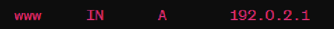

import useBaseUrl from '@docusaurus/useBaseUrl';
import ThemedImage from '@theme/ThemedImage';
import Tabs from '@theme/Tabs';
import TabItem from '@theme/TabItem';


# Cours 8

## Rappel des notions vues précédemment

1. Le service DNS est d'abord et avant tout un service de traduction. Il permet de convertir un nom de domaine complet (FQDN) en adresse IP. L'inverse est également vrai. 

2. Nous avons également pu constater que la résolution d'un nom de domaine était hiérarchisée et composée de différentes étapes.

3. Finalement, nous avons distingué les requêtes DNS itératives et récursives.

## Les enregistrements DNS

Pour qu'un serveur puisse traduire un nom en IP, celui-ci doit posséder les données qu'on lui demande de traduire, soit le nom concerné par la requête et l'adresse IP correspondante. Cette correspondance, c'est ce que l'on nomme un enregistrement.

Voici un exemple d'enregistrement et une brève description des éléments:



|Élément|Contenu|Valeur|
|:-------:|-------|:-------:|
|Nom|Le nom d'un enregistrement correspond à ce que vous retrouverez devant le nom de domaine. S'il s'agit du domaine *patate.com* et que l'on retrouve un enregistrement au nom de *www*, cela signifie qu'il existe un ordinateur ou un serveur au nom de *www* dans le domaine *patate.com*|www|
|Classe|Les classes d'enregistrement sont un héritage de la structure originelle du système de noms de domaine. Elles ont été conçues à une époque pour supporter différents types de réseaux et d'infrastructures sur internet et au sein de systèmes informatiques. **Aujourd'hui, toutes les autres classes autres que « IN » (internet) sont devenues obsolètes.**|IN|
|Type|Les types d'enregistrement déterminent l'information que l'on retrouvera dans la valeur d'un enregistrement. Dans l'exemple ci-dessus, le type d'enregistrement « A » nous indique que la valeur sera une adresse IP, laquelle sera associée au nom « www ».|A|
|Valeur|Finalement, la valeur constitue la donnée que l'on désire sauvegarder et associer au nom de l'enregistrement.|192.0.2.1|

Bien qu'il existe plusieurs types d'enregistrement DNS, je vous répertorie ici les plus populaires:

|Type|Explication|
|:----:|-----------|
|A|Ce type d’enregistrement permet d’associer un nom de domaine à une IP.|
|AAAA| C'est exactement la même chose que l'enregistrement A, mais pour la technologie IPv6. |
|CNAME| Ce type d'enregistrement permet de définir un alias pour un nom de domaine existant.|
|MX| Spécifie les serveurs de messagerie utilisés pour les courriels d'un domaine particulier.|
|SOA| Contiens plusieurs informations essentielles au fonctionnement d'une zone DNS. Nous l'analyserons en détail un peu plus loin.|
|SRV| Permets de spécifier l'adresse IP pour des services spécifiques.|
|TXT| C'est un enregistrement contenant du texte, ni plus ni moins. Ces enregistrements sont souvent utilisés dans les politiques d'envoi de courriels par exemple.|

## Les zones de recherche

Les enregistrements sont stockés dans des zones de recherche. On pourrait comparer ces zones à des bases de données dans lesquelles on retrouve différents champs et différentes valeurs. Une zone de recherche contient tous les enregistrements d'un domaine particulier. Par exemple, le fichier de zone concernant le domaine *patate.com* contiendra tous les enregistrements concernant *patate.com*.

Il existe deux types de zone de recherche:

 <span class="red-text">**-Principal:**</span>
 Une zone principale est ouverte en écriture. Les enregistrements qu'elle contient sont donc <u>modifiables.</u>

 <span class="cyan-text">**-Secondaire:**</span>
 C'est une copie de la zone principale et elle n'est disponible qu'en lecture seule. Les zones secondaires permettent de distribuer la charge de travail entre les serveurs DNS.

Voici ce à quoi peut ressembler un fichier de zone de recherche avec Bind:

```yaml title='/etc/bind/db.exemple.com' showLineNumbers
$TTL    86400
@       IN      SOA   ns1.exemple.com. admin.exemple.com. (
                      2025012801 ; Serial
                      3600       ; Refresh
                      1800       ; Retry
                      1209600    ; Expire
                      86400 )    ; Negative Cache TTL

        IN      NS      ns1.exemple.com.
        IN      NS      ns2.exemple.com.

ns1     IN      A       192.168.1.1
ns2     IN      A       192.168.1.2
www     IN      A       192.168.1.10
```

Analysons ce fichier de zone ensemble. Pour y arriver, nous le découperons en section:

### $TTL ou *Time To Live*

```yaml
$TTL    86400
```

La première qui constitue le fichier de zone est celle qui concerne le *Time To Live*. C'est d'abord une valeur exprimée en secondes. Ici, 86400 est l'équivalent de 24h. C'est la durée de vie qu'auront les enregistrements dans les différentes mémoires caches des clients.

### L'enregistrement SOA ou *Start of authority*

```yaml
@       IN      SOA   ns1.exemple.com. admin.exemple.com. (
                      2025012801 ; Serial
                      3600       ; Refresh
                      1800       ; Retry
                      1209600    ; Expire
                      86400 )    ; Negative Cache TTL
```

L'enregistrement SOA est <u>obligatoire</u> à toute zone de recherche. Cet enregistrement contient des informations importantes concernant la zone. Commençons par analyser la ligne supérieure, celle qui débute par un « @ ». Il faut d'abord savoir que dans les fichiers de zone, le caractère « @ » est un alias qui correspond au nom du domaine. Dans l'exemple ci-dessus, je pourrais très bien changer le caractère « @ » par *exemple.com*, cela reviendrait exactement au même.

|Données|Informations|
|:-------:|------------|
| @ | Alias du nom de domaine. Tout enregistrement doit posséder un nom. L'enregistrement SOA n'échappe pas à cette règle. En lui donnant le caractère « @ » à titre de nom, c'est comme si nous lui donnions le nom de domaine comme nom, ici *exemple.com*|
| IN | C'est la classe de l'enregistrement, tout simplement. Comme pour tout enregistrement, nous utilisons toujours « IN » |
| SOA | C'est le type d'enregistrement, ici « SOA » *(Start of authority)*.|
| ns1.exemple.com.| <span class="red-text">**C'est le serveur qui a autorité sur la zone.**</span> C'est donc le seul serveur qui a l'autorisation de modifier ou d'ajouter des enregistrements.|
|admin.exemple.com.| C'est l'adresse courriel de l'administrateur du serveur DNS. Étant donné que le caractère « @ » a une signification particulière, nous l'avons remplacé par un point. La véritable adresse courriel de l'administrateur est donc « admin@exemple.com. »
| Serial | Il s'agit du numéro de série de la zone. <span class="red-text">Ce numéro est incrémenté à chaque modification.</span> Cela permet aux serveurs secondaires de savoir s'ils possèdent toujours une copie à jour de la zone. |
| Refresh | C'est le temps, en secondes, que les serveurs secondaires doivent attendre avant de <span class="red-text">vérifier si des modifications ont été apportées à la zone (1h)</span> |
| Retry | C'est le temps, en secondes, que les serveurs secondaires doivent attendre avant de <span class="red-text">réessayer de se mettre à jour suite à un échec de la requête initial. (15 min) </span>|
| Expire | Il s'agit du temps, en secondes, après lequel une copie de <span class="red-text">la zone est considérée obsolète si aucune communication avec le serveur qui a autorité n'a pu être établie. (7 jours) </span>|
| Negative Cache TTL | Le temps, en secondes, pour la <span class="red-text">mise en cache des domaines non trouvés </span>dans les ordinateurs clients. Cela permet d'éviter le trop grand trafic que pourraient générer des requêtes répétées pour des domaines inexistants. <span class="red-text">(1 jour)</span>

## Schéma de concept

<div style={{textAlign: 'center'}}>
    <ThemedImage
        alt="Schéma"
        sources={{
            light: useBaseUrl('/img/Serveurs1/Concept_Zone_W.gif'),
            dark: useBaseUrl('/img/Serveurs1/Concept_Zone_D.gif'),
        }}
    />
</div>

## Référence(s)

- [Présentation du cours](../Assets/08/08-420-2X5-H26%20(DNS-Zones%20et%20enregistrements).pdf)