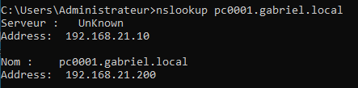

import useBaseUrl from '@docusaurus/useBaseUrl';
import ThemedImage from '@theme/ThemedImage';
import Tabs from '@theme/Tabs';
import TabItem from '@theme/TabItem';

# Laboratoire 8
* * *
## Configuration d'une zone de recherche directe

## Préalable(s)

- Avoir complété le laboratoire # 7

:::caution
Nous repartirons du laboratoire précédent pour réaliser celui-ci. Assurez-vous donc que votre laboratoire 7 soit 100% fonctionnel.
:::

## Objectif(s)
- Mettre en place une zone de recherche directe
- Configurer des enregistrements DNS statiques

* * *
## Schéma

<div style={{textAlign: 'center'}}>
    <ThemedImage
        alt="Schéma"
        sources={{
            light: useBaseUrl('/img/Serveurs1/Laboratoire8_W.svg'),
            dark: useBaseUrl('/img/Serveurs1/Laboratoire8_D.svg'),
        }}
    />
</div>

* * *

## Étapes de réalisation

Lors du dernier laboratoire, vous avez créé un premier serveur DNS. Cela dit, ce serveur ne possédait aucune zone de recherche, il se contentait simplement de traiter les requêtes à l'aide de redirecteurs puis il stockait les réponses dans sa mémoire cache.

Aujourd'hui nous modifierons ce serveur DNS pour qu'il gère une zone d'enregistrements. Avant toute chose, il faudra déterminer le nom de domaine que vous utiliserez. Dans mes différents exemples, j'utiliserai le nom : gabriel.local. Vous devez utiliser <mark>votre propre nom de domaine!</mark>

### Retour sur le fichier hosts

Commencez d'abord par éditer le fichier `/etc/hosts` de votre serveur sous Linux afin de <span class="red-text">supprimer l'entrée concernant votre premier client Windows 10.</span> Normalement, votre fichier `/etc/hosts` devrait être similaire à celui-ci:

```bash title='/etc/hosts' showLineNumbers
127.0.0.1 localhost
127.0.1.1 ubserver.gabriel.local ubserver
#highlight-next-line
192.168.21.200 clientw10.gabriel.local clientw10 # <---Ligne à supprimer

# The following are desirable for IPv6 capable hosts
::1 ip6-localhost ip6-loopback
fe00::0 ip6-localnet
ff00::0 ip6mcastprefix
ff02::1 ip6-allnodes
ff02::2 ip6-allrouters
```
Enregistrez votre fichier une fois l'entrée supprimée.

### Modification de la configuration réseau

Normalement, la carte réseau de votre serveur Ubuntu possède une configuration statique. Cependant, vous avez probablement configuré votre passerelle en tant que serveur DNS (ou peut-être utilisez-vous les DNS publics de Google, peu importe). Dans tous les cas, vous devrez indiquer que le serveur Ubuntu sera dorénavant, lui-même, son propre serveur DNS.

```yaml title='/etc/netplan/60-maconfig.yaml' showLineNumbers
network:
    ethernets:
        ens192:
            dhcp4: false
            addresses:
                - 192.168.21.30/24
            routes:
                - to: default
                  via: 192.168.21.1
            #highlight-start
            nameservers:
                addresses: [127.0.0.1] # <--- Assurez-vous d'avoir cette adresse DNS
            #highlight-end
    version: 2
```
:::tip
N'oubliez pas d'appliquer vos modifications avec la commande Netplan appropriée 😉
:::
### Modification du résolveur DNS

Bien que je vous ai fait modifier l'adresse du serveur DNS dans votre configuration Netplan, il faudra faire quelques modifications supplémentaires. Ubuntu possède un service de résolution DNS de base qui se nomme «systemd-resolve». Or, le service Bind9 que nous avons récemment installé peut également faire office de résolveur DNS. Ceci étant dit, Bind9 ne fonctionne pas de la même façon que «systemd-resolve». Éditez le fichier /etc/systemd/resolved.conf tel qu'indiqué ci-dessous:

```yam title='/etc/systemd/resolved.conf' showLineNumbers
# This file is part of systemd.
#
# systemd is free software; you can redistribute it and/or modify it under the
# terms of the GNU Lesser General Public License as published by the Free
# Software Foundation; either version 2.1 of the License, or (at your option)
# any later version.
#
# Entries in this file show the compile time defaults. Local configuration
# should be created by either modifying this file (or a copy of it placed in
# the /etc/ if the original file is shipped in /usr), or by creating "drop-ins" in
# the /etc/systemd/resolved.conf.d/ directory. The latter is generally
# recommended. Defaults can be restored by simply deleting the main
# configuration file and all drop-ins located in /etc/.
#
# Use 'systemd-analyze cat-config systemd/resolved.conf' to display the full config.
#
# See resolved.conf(5) for details.

[Resolve]
# Some examples of DNS servers which may be used for DNS= ans FallbackDNS=:
# Cloudflare:   1.1.1.1#cloudflare-dns.com 1.0.0.1#cloudflare-dns.com 2606:4700:4700::1111#cloudflare-dns.com 2606:4700:4700::1001#cloudflare-dns.com
# Google:       8.8.8.8#dns.google 8.8.4.4#dns.google 2001:4860:4860::8888#dns.google 2001:4860:4860::8844#dns.google
# Quad9:        9.9.9.9#dns.quad9.net 149.112.112.112#dns.quad9.net 2620:fe::fe#dns.quad9.net 2620:fe::9#dns.quad9.net
#highlight-start
DNS=127.0.0.1           # <---Modifiez cette ligne
FallbackDNS=8.8.8.8     # <---Modifiez cette ligne
Domains=gabriel.local   # <---Modifiez cette ligne
#highlight-end
#DNSSEC=no
#DNSOverTLS=no
#MulticastDNS=no
#LLMNR=no
#Cache=no-negative
#CacheFromLocalhost=no
#highlight-next-line    
DNSStubListener=no      # <---Modifiez cette ligne
#DNSStubListenerExtra=
#ReadEtcHosts=yes
#ResolveUnicastSingleLabel=no
#StaleRetentionSec=0
```
### Modification de la configuration de BIND

Il nous faut modifier le comportement de notre serveur DNS sous Bind9. Actuellement, notre serveur ne fait que rediriger systématiquement toutes les requêtes DNS. Or, dorénavant nous voulons que Bind9 vérifie s'il possède certains enregistrements. Nous allons ajouter également quelques instructions pour le service DNS. J'explique chacune de ces instructions ci-dessous:

```yaml title='/etc/bind/named.conf.options' showLineNumbers
options {
    directory "/var/cache/bind";

    //highlight-start
    recursion yes;                                  # Nous autorisons la résolution de requêtes récursives.
    allow-recursion { 192.168.21.0/24;localhost; }; # Nous répondrons aux requêtes de ce sous-réseau seulement.
    listen-on { any; };                             # Nous écouterons les requêtes reçues sur n'importe quelle interface réseau.
    allow-transfer { none; };                       # Nous désactivons le tranfert de zone. Nous en reparlerons très bientôt.
    //highlight-end
    
    // if there is a firewall between you and nameservers you want
    // to talk to, you may need to fix the firewall to allow multiple
    // ports to talk. See http://www.kb.cert.org/vuls/id/800113

    // If your ISP provided one or more IP addresses for stable
    // nameservers, you probably want to use them as forwarders.
    // Uncomment the following block, and insert the addresses replacing
    // the all-0's placeholder.

    forwarders {
          8.8.8.8;
          8.8.4.4;
    };
    //highlight-start
    forward only; # <---Retirez cette ligne
    //highlight-end

    //=======================================================================
    // If BIND logs error messages about the root key being expired,
    // you will need to update your keys. See https://www.isc.org/bind-keys
    //=======================================================================
    dnssec-validation auto;

    listen-on-v6 { any; };
};
```
:::caution
N'oubliez pas de valider la bonne syntaxe de votre fichier en utilisant la commande:
```bash
sudo named-checkconf /etc/bind/named.conf.options
```
:::

### Déclaration de zone

Bien, il nous faut maintenant indiquer au service Bind9 qu'il est responsable d'une zone contenant des enregistrements DNS. Pour ce faire, nous éditerons un second fichier, soit `/etc/bind/named.conf.local`:

```yaml title='/etc/bind/named.conf.local' showLineNumbers
//
// Do any local configuration here
//

// Consider adding the 1918 zones here, if they are not used in your
// organization
// include "/etc/bind/zones.rfc1918";

#highlight-start
zone "gabriel.local" IN {                       # Déclaration de ma zone qui contiendra des enregistrements de classe IN.
    type master;                                # Il s'agit d'une zone principale.
    file "/etc/bind/zones/db.gabriel.local";    # Emplacement du fichier contenant les enregistrements de la zone.
    allow-update { none; };                     # Désactivation des mises à jour dynamiques. Nous y reviendrons bientôt.
};                                              # Fin de la déclaration
#highlight-end
```
Sauvegardez vos modifications et quittez l'éditeur de texte.

### Création du fichier de zone et des enregistrements

À présent, il nous faut créer le fichier de zone tel que nous l'avons déclaré dans les configurations de Bind9. Commencez par créer un dossier nommé `zones` dans le dossier `/etc/bind`.

Lorsque vous installez Bind9, celui-ci a installé des fichiers de zone qu'il est possible d'utiliser en tant que modèle. Nous allons donc copier l'un de ces fichiers et l'éditer pour qu'il corresponde à nos besoins. Copiez le fichier `/etc/bind/db.local` dans le nouveau dossier que vous venez de créer:

```bash
sudo cp /etc/bind/db.local /etc/bind/zones/db.gabriel.local
```

À présent, ouvrez le fichier que vous venez de copier:

```yaml title='/etc/bind/zones/db.gabriel.local' showLineNumbers
;
; BIND data file for local loopback interface
;
$TTL    604800
@       IN      SOA     localhost.  root.localhost. (
                                 2      ; Serial
                            604800      ; Refresh
                             86400      ; Retry
                           2419200      ; Expire
                            604800 )    ; Negative Cache TTL
;
@       IN      NS      localhost
@       IN      A       127.0.0.1
@       IN      AAAA    ::1
```

Apportez les modifications décrites ci-dessous:

1. Modifiez le commentaire au haut du fichier qui indique qu'il s'agit du fichier de zone de l'interface de loopback. Indiquez plutôt qu'il s'agit du fichier de zone correspondant la zone que vous avec créé.

2. Éditez la ligne supérieure de l'enregistrement SOA:
    - Changez localhost pour le FQDN de votre serveur.
    - Changez le courriel de l'administrateur pour admin sur votre domaine.

        

3. Réinitialisez le numéro de série de la zone à « 1 ». Après tout, il s'agit d'une première version de cette zone.

4. Changez la valeur du « refresh » dans l'entrée SOA pour 1h.

5. Changez la valeur du « retry » dans l'entrée SOA pour 15 minutes.

6. Changez la valeur du « expire » dans l'entrée SOA pour 48h.

7. Changez la valeur du « Negative Cache TTL » dans l'entrée SOA pour 24h.

8. Modifiez l'entrée « NS » pour y inscrire votre serveur DNS.

9. Faites un enregistrement A pour votre serveur Ubuntu ainsi que pour vos deux ordinateurs sous Windows.

    :::caution
    Attention, vos enregistrements A doivent correspondre aux IP des ordinateurs concernés.
    :::

Voici un exemple de ce quoi à quoi devrait ressembler votre fichier une fois modifié:

```yaml title='/etc/bind/zones/db.gabriel.local' showLineNumbers
;
; Fichier pour la zone gabriel.local
;
$TTL    604800
@       IN      SOA     ubserver.gabriel.local.  admin.gabriel.local. (
                                 1      ; Serial
                              3600      ; Refresh
                               900      ; Retry
                            172800      ; Expire
                             86400 )    ; Negative Cache TTL
;
@              IN      NS      ubserver.gabriel.local.
@              IN      A       192.168.21.10
ubserver       IN      A       192.168.21.10
pc0001         IN      A       192.168.21.200
pc0002         IN      A       192.168.21.201
```

Nous allons vérifier la syntaxe de notre fichier avec l'utilitaire `named-checkzone`. Pour ce faire, entrez la commande comme suit:

```bash
sudo named-checkzone gabriel.local /etc/bind/zones/db.gabriel.local
```

Une fois la vérification effectuée, redémarrez le service bind.

### Renommez les clients Windows 10

Récemment, nous avons vu comment renommer les ordinateurs sous Windows 10. Utilisez la commande PowerShell appropriée pour renommer les clients pc0001 et pc0002 respectivement.

:::caution
N'oubliez pas de vérifier que les adresses IP de chaque poste de travail sous Windows correspondent bien au nom de machine que vous avez utilisé lors de la création de vos enregistrements.
:::

### Validations et vérifications

*A priori* vous devriez être en mesure de naviguer sur internet depuis n'importe lequel des deux clients sous Windows 10.

Sur l'ordinateur pc0001, ouvrez une fenêtre PowerShell et entrez la commande suivante:

<div className="tabsborder">
    <Tabs>
        <TabItem value="DNSResolve" label="Commande" default>
        ```Powershell
        Resolve-DnsName -Name pc0002.gabriel.local
        ```
        </TabItem>
        <TabItem value="ResultatDNSResolve" label="Résultat">
           
        </TabItem>
    </Tabs>
</div><br/>

Sur l'ordinateur pc0002, ouvrez une fenêtre de commande et entrez la commande suivante:

<div className="tabsborder">
    <Tabs>
        <TabItem value="Nslookup" label="Commande" default>
        ```batch
        nslookup pc0001.gabriel.local
        ```
        </TabItem>
        <TabItem value="ResultatNslookup" label="Résultat">
           
        </TabItem>
    </Tabs>
</div><br/>
