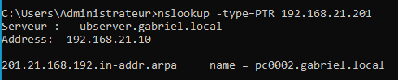
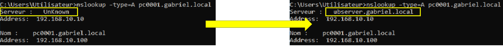
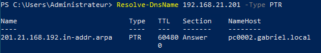
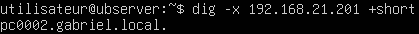

import useBaseUrl from '@docusaurus/useBaseUrl';
import ThemedImage from '@theme/ThemedImage';
import Tabs from '@theme/Tabs';
import TabItem from '@theme/TabItem';


# Cours 9

## Similarités et différences

La zone de recherche direct nous permet de résoudre un nom de domaine en adresse IP. La zone de recherche inversée, elle, nous permet de faire le contraire: résoudre une adresse IP en nom de domaine. Ce second type de zone est moins populaire mais il n'en demeure pas moins très pratique dans différents contextes.

## Enregistrements A versus PTR

L'enregistrement PTR (Pointeur) de la zone de recherche inversée est un peu l'équivalent de l'enregistrement A dans la zone de recherche direct. Si l'enregistrement A associe un nom à une adresse IP, l'enregistrement PTR associe une adresse IP à un nom de domaine.

Voici à quoi ressemble une zone de recherche inversée:

```yaml
;
; Zone file for reverse lookup zone 192.0.2.in-addr.arpa
;
$TTL 86400
@       IN      SOA     ns1.example.com.  admin.example.com. (
                               221      ; Serial
                              3600      ; Refresh
                              1800      ; Retry
                            604800      ; Expire
                             86400 )    ; Negative Cache TTL
;
@              IN      NS      ns1.example.com.
10             IN      PTR     host1.example.com.      
```

Tout comme la zone de recherche directe, l’enregistrement SOA et NS sont nécessaires au bon fonctionnement de la zone. Dans un enregistrement PTR, on remplace le nom de domaine par
le dernier octet de l’adresse IP du client. La valeur de l’enregistrement, quant à elle, contient le FQDN du PC concerné.

## Interroger des enregistrements PTR

La commande nslookup fonctionne très bien avec des enregistrements PTR:

<div className="tabsborder">
    <Tabs>
        <TabItem value="ReverseNsLookup" label="Commande" default>
            ```batch
            nslookup -type=PTR 192.168.21.201
            ```
        </TabItem>
        <TabItem value="ResultatReverseNsLookup" label="Résultat">
           
        </TabItem>
    </Tabs>
</div><br/>

Le fait d'avoir une zone de recherche inversée permettra également d'obtenir le nom du serveur lorsque vous faites des requêtes sur une zone de recherche directe:



La commande `resolve-dnsname` permet, elle aussi, d'interroger la zone de recherche inversée:

<div className="tabsborder">
    <Tabs>
        <TabItem value="ReverseResolveDNSName" label="Commande" default>
            ```Powershell
            resolve-dnsname 192.168.21.201 -type PTR
            ```
        </TabItem>
        <TabItem value="ResultatReverseResolveDNSName" label="Résultat">
           
        </TabItem>
    </Tabs>
</div><br/>

Finalement, vous pourrez également interroger la zone de recherche inversée sous Linux avec la commande `dig`:

<div className="tabsborder">
    <Tabs>
        <TabItem value="ReverseDig" label="Commande" default>
            ```bash
            dig -x 192.168.21.201 +short
            ```
        </TabItem>
        <TabItem value="ResultatReverseDig" label="Résultat">
           
        </TabItem>
    </Tabs>
</div><br/>

## Référence(s)

- [Présentation du cours](../Assets/09/09-420-2X5-H26%20(DNS-Zones%20inverses).pdf)