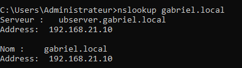

import useBaseUrl from '@docusaurus/useBaseUrl';
import ThemedImage from '@theme/ThemedImage';
import Tabs from '@theme/Tabs';
import TabItem from '@theme/TabItem';

# Laboratoire 9
* * *
## Configuration d'une zone de recherche inversée

## Préalable(s)

- Avoir complété le laboratoire # 8

:::caution
Nous repartirons du laboratoire précédent pour réaliser celui-ci. Assurez-vous donc que votre laboratoire 8 soit 100% fonctionnel.
:::

## Objectif(s)
- Mettre en place une zone de recherche inversée
- Configurer des enregistrements DNS inversés

* * *
## Schéma

<div style={{textAlign: 'center'}}>
    <ThemedImage
        alt="Schéma"
        sources={{
            light: useBaseUrl('/img/Serveurs1/Laboratoire8_W.svg'),
            dark: useBaseUrl('/img/Serveurs1/Laboratoire8_D.svg'),
        }}
    />
</div>

* * *

## Étapes de réalisation

Dans le laboratoire précédent, vous avez mis en place un serveur DNS capable de traduire les noms de domaine d'une zone déterminée en adresse IP. Or, votre serveur DNS n'est actuellement pas capable de faire l'inverse, soit de traduire une IP en nom. C'est donc à cet aspect que nous allons nous intéresser dans ce laboratoire.

### Déclaration de la zone inversée

Tout comme pour la zone de recherche standard, il nous faudra déclarer l'existence de cette nouvelle zone dans le fichier `/etc/bind/named.conf.local` tel que présenté dans l'exemple ci-dessous:

```yaml title='/etc/bind/named.conf.local' showLineNumbers
//
// Do any local configuration here
//

// Consider adding the 1918 zones here, if they are not used in your
// organization
// include "/etc/bind/zones.rfc1918";

zone "gabriel.local" IN {
    type master;
    file "/etc/bind/zones/db.gabriel.local";
    allow-update { none; };
};

#highlight-start
zone "21.168.192.in-addr.arpa" IN {         # Déclaration de ma zone qui contiendra des enregistrements de classe IN.
    type master;                            # Il s'agit d'une zone principale.
    file "/etc/bind/zones/db.21.168.192";   # Emplacement du fichier contenant les enregistrements de la zone.  
    allow-update { none; };                 # Désactivation des mises à jour dynamiques. Nous y reviendrons bientôt.
};                                          # Fin de la déclaration
#highlight-end
```

:::tip[Le saviez-vous ?]
La terminaison ".in-addr.arpa" utilisée pour les zones de recherche inversée DNS a une origine particulière. Le suffixe "arpa" provient de l'Advanced Research Projects Agency (ARPA), une agence américaine pionnière dans le développement d'Internet dans les années 1960. Lors de la mise en place du système de noms de domaine (DNS) dans les années 1980, cette organisation a joué un rôle clé dans la gestion des premières infrastructures du réseau. Le préfixe "in-addr" fait référence à "Internet Address", désignant les adresses IP. Ainsi, ".in-addr.arpa" désigne la zone utilisée pour effectuer la résolution inverse des adresses IPv4.
:::

### Création de la zone et des enregistrements

Tout comme nous l'avons fait avec notre zone de recherche direct, nous allons copier un modèle de zone de recherche inversé qui est fourni avec Bind9 pour l'éditer par la suite. Copiez donc le fichier `/etc/bind/db.127` dans le dossier `/etc/bind/zones`.

```bash
sudo cp /etc/bind/db.127 /etc/bind/zones/db.21.168.192
```

Éditez maintenant le fichier que vous venez de copier pour y modifier l'enregistrement SOA ainsi qu'y inscrire vos enregistrements:

1. Modifiez le commentaire au haut du fichier qui indique qu'il s'agit du fichier de zone de l'interface de loopback. Indiquez plutôt qu'il s'agit du fichier de zone correspondant la zone que vous avec créé.

2. Éditez la ligne supérieur de l'enregistrement SOA:
    - Changez localhost pour le FQDN de votre serveur.
    - Changez le courriel de l'administrateur pour admin sur votre domaine.

3. Changez la valeur du "refresh" dans l'entrée SOA pour 1h.

4. Changez la valeur du "retry" dans l'entrée SOA pour 15 minutes.

5. Changez la valeur du "expire" dans l'entrée SOA pour 48h.

6. Changez la valeur du "Negative Cache TTL" dans l'entrée SOA pour 24h.

7. Modifiez l'entrée "NS" pour y inscrire votre serveur DNS.

8. Créez des enregistrements de type "PTR" pour votre serveur Ubuntu ainsi que vos deux ordinateurs sous Windows 10.

Voici ce à quoi votre fichier devrait ressembler une fois les modifications apportées:

```yaml title='/etc/bind/zones/db.21.168.192' showLineNumbers
;
; Zone de recherche inversée pour le sous-réseau 192.168.21.0/24
;
$TTL    604800
@       IN      SOA     ubserver.gabriel.local.  admin.gabriel.local. (
                                 1      ; Serial
                              3600      ; Refresh
                               900      ; Retry
                            172800      ; Expire
                             86400 )    ; Negative Cache TTL
;
@       IN      NS      ubserver.gabriel.local.
10      IN      PTR     ubserver.gabriel.local.
200     IN      PTR     pc0001.gabriel.local.
201     IN      PTR     pc0002.gabriel.local.
```

Vérifiez la syntaxe de votre fichier de zone avec l'utilitaire `named-checkzone`:

```bash
sudo named-checkzone 21.168.192.in-addr.arpa /etc/bind/zones/db.21.168.192
```

Si aucune erreur n'est renvoyée, redémarrez le service Bind9.

### Vérifications

Sur le poste pc0001, entrez la commande suivante et vérifiez le résultat:

<div className="tabsborder">
    <Tabs>
        <TabItem value="NslookupReverse" label="Commande" default>
            ```batch
            nslookup -type=PTR 192.168.21.201
            ```
        </TabItem>
        <TabItem value="ResultatNslookupReverse" label="Résultat">
           
        </TabItem>
    </Tabs>
</div><br/>

Ensuite, entrez cette commande et validez également le résultat:

<div className="tabsborder">
    <Tabs>
        <TabItem value="NslookupDom" label="Commande" default>
            ```batch
            nslookup gabriel.local
            ```
        </TabItem>
        <TabItem value="ResultatNslookupDom" label="Résultat">
           
        </TabItem>
    </Tabs>
</div><br/>