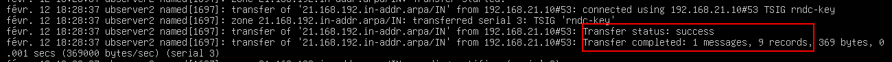
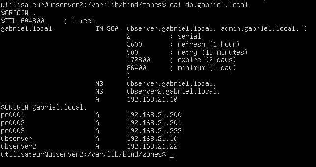
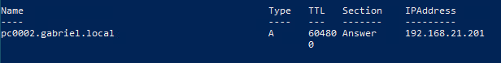

import useBaseUrl from '@docusaurus/useBaseUrl';
import ThemedImage from '@theme/ThemedImage';
import Tabs from '@theme/Tabs';
import TabItem from '@theme/TabItem';

# Laboratoire 10
* * *

## Mise en place d'un second serveur DNS

## Préalable(s)

- Avoir complété le laboratoire # 9

:::caution
Nous repartirons du laboratoire précédent pour réaliser celui-ci. Assurez-vous donc que votre laboratoire 9 soit 100% fonctionnel.
:::

## Objectif(s)
- Mettre en place un serveur DNS Secondaire
- Configurer les notifications et les transferts de zone.

* * *
## Schéma

<div style={{textAlign: 'center'}}>
    <ThemedImage
        alt="Schéma"
        sources={{
            light: useBaseUrl('/img/Serveurs1/Laboratoire10_W.svg'),
            dark: useBaseUrl('/img/Serveurs1/Laboratoire10_D.svg'),
        }}
    />
</div>

* * *

## Étapes de réalisation

Dans ce laboratoire, nous mettrons en place un second serveur DNS. Il nous faudra donc prévoir des transferts de zones afin que le serveur secondaire possède toujours une copie valide de vos zones de recherches.

### Mise en place d'un deuxième serveur sous Ubuntu

Évidemment, il nous faut d'abord et avant tout un second serveur Ubuntu pour en faire un serveur secondaire. N'installez pas un deuxième serveur depuis zéro. Utilisez plutôt un modèle sous Labinfo. N'oubliez pas de:

- Renommez votre serveur
- Lui configurer une adresse IP statique
- Le configurer pour être son propre serveur DNS ([Besoin d'un rappel ?](../09%20-%20Cours%208%20-%20Zones%20et%20enregistrements/01-Laboratoire8.md#modification-de-la-configuration-réseau))

#### Installation de Bind9

Procédez à l'installation des paquets nécessaires à Bind9

```bash
sudo apt install bind9 bind9utils bind9-doc -y
```

### Modification du serveur DNS primaire

#### Ajout d'enregistrements

Au sein de votre serveur DNS primaire, il vous faudra ajouter les enregistrements A, NS et PTR de votre serveur secondaire dans les fichiers de zone correpondants.

#### Modification de la configuration générale

Il faudra désormais effectuer des transferts de zone entre les deux serveurs DNS. L'objectif est de faire en sorte que lorsqu'une mise-à-jour est effectué sur le DNS primaire, ce-dernier en avise le serveur secondaire et effectue un transfert de zone afin que le serveur secondaire puisse bénéficier des enregistrements à jour.

Éditez donc le fichier `/etc/bind/named.conf.options` pour y ajouter les éléments surlignés ci-dessous:

```yaml title='/etc/bind/named.conf.options' showLineNumbers
options {
    directory "/var/cache/bind";

    recursion yes;
    allow-recursion { 192.168.21.0/24;localhost; };
    listen-on { any; };
    //highlight-start
    allow-transfer { key "rndc-key"; }; #<------Modifiez cette ligne
    notify yes;   #<------Ajoutez cette ligne
    //highlight-end

    // if there is a firewall between you and nameservers you want
    // to talk to, you may need to fix the firewall to allow multiple
    // ports to talk. See http://www.kb.cert.org/vuls/id/800113

    // If your ISP provided one or more IP addresses for stable
    // nameservers, you probably want to use them as forwarders.
    // Uncomment the following block, and insert the addresses replacing
    // the all-0's placeholder.

    forwarders {
          8.8.8.8;
          8.8.4.4;
    };

    //=======================================================================
    // If BIND logs error messages about the root key being expired,
    // you will need to update your keys. See https://www.isc.org/bind-keys
    //=======================================================================
    dnssec-validation auto;

    listen-on-v6 { any; };
};
```
La ligne `allow-transfer { key "rndc-key"; };` stipule, quant à elle, que nous autorisons les transferts de zone seulement pour les détenteurs de la clé de chiffrement.

La ligne `notify yes;` a pour effet d'activer les notifications. Lorsqu'une modification sera apportée à une zone, le serveur en avisera automatiquement les serveurs secondaires.

#### Modification des déclarations de zone

Nous devons modifier les déclarations de zone dans le serveur DNS primaire pour autoriser les transferts de celles-ci ainsi l'envoi de notifications. Dans le fichier `/etc/bind/named.conf.local`, modifiez les lignes suivantes:

```yaml title='/etc/bind/named.conf.local' showLineNumbers
//
// Do any local configuration here
//

// Consider adding the 1918 zones here, if they are not used in your
// organization
// include "/etc/bind/zones.rfc1918";

//highlight-start
include "/etc/bind/rndc.key";
server 192.168.21.10 { keys rndc-key; };
//highlight-end

zone "gabriel.local" IN {
    type master;
    file "/etc/bind/zones/db.gabriel.local";
    allow-update { none; };
    //highlight-start
    allow-transfer { key "rndc-key"; };     #<---Ajoutez cette ligne
    notify yes;                             #<---Ajoutez cette ligne
    //highlight-end
};

zone "21.168.192.in-addr.arpa" IN {
    type master;
    file "/etc/bind/zones/db.21.168.192";
    allow-update { none; };
    //highlight-start
    allow-transfer { key "rndc-key"; };     #<---Ajoutez cette ligne
    notify yes;                             #<---Ajoutez cette ligne
    //highlight-end
};
```
La ligne `include "/etc/bind/rndc.key";` indique a Bind9 qu'il doit prendre en compte ce fichier dans sa configuration. Ce fichier (rndc.key) contient une clé de chiffrement que nous utiliserons pour signer nos transferts de zone et ainsi, garantir une sécurité supplémentaire. Cette clé de chiffrement est générée automatiquement à l'installation de Bind9.

#### Envoi de la clé au serveur secondaire

Comme mentionné plus tôt, seuls les détenteurs de la clé de chiffrement (rndc-key) pourront demander un transfert de zone. Il faudra donc s'assurer de transférer celle-ci sur votre serveur secondaire. Pour ce faire, nous utiliseront le protocole SCP depuis le serveur DNS primaire. Voici la commande à utiliser:

```bash
sudo scp /etc/bind/rndc.key utilisateur@192.168.21.20:/home/utilisateur
```

:::caution
Vous devez évidemment remplacer les éléments de la commande concernés par ceux qui correspondent à votre configuration:

- **utilisateur** : Il s'agit du compte d'utilisateur sur le serveur DNS secondaire.

- **192.168.21.20** : Il s'agit de l'adresse IP du serveur DNS secondaire.

- **/home/utilisateur** : C'est l'emplacement où vous envoyez le fichier sur le serveur secondaire.
:::

Lorsque votre fichier sera bel et bien envoyé, n'oubliez pas de confirmer la bonne réception de celui-ci sur votre serveur secondaire.

### Configuration du serveur DNS secondaire

Comme nous avons installé Bind9 sur le serveur secondaire également, on y retrouvera un fichier `rndc.key` également. Cependant, nous devons utiliser celui du **serveur primaire** et non pas celui-ci. Nous allons donc renommer ce fichier pour éviter qu'il nuise à notre configuration. Entrez la commande suivante sur votre serveur secondaire:

```bash
sudo mv /etc/bind/rndc.key /etc/bind/rndc.key.bak
```

Maitenant, déplacez le fichier `rndc.key` que vous avez envoyé depuis le serveur primaire dans le dossier "/etc/bind" du serveur secondaire. Puis, modifiez en le propriétaire et le groupe propriétaire pour Bind:


#### Modification de la configuration générale

Ouvrez le fichier `/etc/bind/named.conf.options` et éditez le comme suit:

```yaml title='/etc/bind/named.conf.options' showLineNumbers
options {
    directory "/var/cache/bind";
    //highlight-next-line
    recursion no;
    listen-on { any; };
    //highlight-next-line
    allow-notify { 192.168.21.10; };

    //highlight-next-line
    masterfile-format text;

    // if there is a firewall between you and nameservers you want
    // to talk to, you may need to fix the firewall to allow multiple
    // ports to talk. See http://www.kb.cert.org/vuls/id/800113

    // If your ISP provided one or more IP addresses for stable
    // nameservers, you probably want to use them as forwarders.
    // Uncomment the following block, and insert the addresses replacing
    // the all-0's placeholder.
    //highlight-start
    //forwarders {
    //      8.8.8.8;
    //      8.8.4.4;
    //};
    //highlight-end

    //=======================================================================
    // If BIND logs error messages about the root key being expired,
    // you will need to update your keys. See https://www.isc.org/bind-keys
    //=======================================================================
    dnssec-validation auto;

    listen-on-v6 { any; };
};
```

:::caution
Je vous invite à identifier les différences qu'il y a entre la configuration d'un serveur DNS primaire et un serveur DNS secondaire. 
    
Généralement, la redirection des requêtes vers l'extérieur et la récursivité sont réservées aux serveurs primaires. À moins de situation de particulière,  il est de bonne pratique de désactiver ces deux éléments sur les serveurs secondaires. 
:::

#### Déclaration des zones

Nous allons à présent déclarer nos zones de recherche sur le serveur DNS secondaire. Éditez donc le fichier `/etc/bind/named.conf.local` pour y spécifier les configurations des zones:

```yaml title='/etc/bind/named.conf.local' showLineNumbers
//
// Do any local configuration here
//

// Consider adding the 1918 zones here, if they are not used in your
// organization
// include "/etc/bind/zones.rfc1918";

//highlight-start
include "/etc/bind/rndc.key";
server 192.168.21.10 { keys rndc-key; };

zone "gabriel.local" IN {
    type slave;
    file "/var/lib/bind/zones/db.gabriel.local";
    masters { 192.168.21.10; };
};

zone "21.168.192.in-addr.arpa" IN {
    type slave;
    file "/var/lib/bind/zones/db.21.168.192";
    masters { 192.168.21.10; };
};
//highlight-end
```

:::info
Vous aurez remarqué que l'on précise qu'il s'agit d'un serveur secondaire : `type slave;` et que l'on précise également l'adresse du ou des serveurs primaires : `masters`.

Remarquez l'emplacement des fichiers de zone. Cet emplacement diffère du serveur principal, mais pourquoi ? C'est une question de droit, tout simplement. Nous devons stocker nos fichiers de zone dans un emplacement ouvert en écriture puisque ceux-ci seront régulièrement mis à jour.
:::

#### Création des fichiers de zone

Créez le dossier `zones` à l'emplacement `/var/lib/bind`. Assurez-vous que le propriétaire et le groupe-propriétaire soient Bind.

```bash
sudo mkdir /var/lib/bind/zones && sudo chown bind:bind /var/lib/bind/zones
```

### Validation et tests

Redémarrez les services DNS sur le serveur primaire et secondaire.

#### Preuves de fonctionnement dans les journaux

Consultez les journaux sur votre serveur DNS secondaire à l'aide de la commande suivante:

```bash
sudo journalctl -u named.service | tail -50
```

Vous devriez être en mesure de repérez des événements de transfert de zone réussis:



#### Preuves de transferts fonctionnels

Au sein de votre serveur secondaire, vous devriez aussi être en mesure de consulter les fichiers de zone. La présence de ceux-ci signifie donc qu'ils ont bel et bien été transférés depuis le serveur primaire. Ouvrez vos fichiers de zone avec la commande `cat` par exemple et inspectez-les:



#### Preuves de réponses valides

À partir de l'un de vos clients sous Windows, interrogez le second serveur DNS. Par exemple:

<div className="tabsborder">
    <Tabs>
        <TabItem value="TestDNSSecondaire" label="Commande" default>
            ```Powershell
            Resolve-DnsName -Name pc0002.gabriel.local -Server ubserver2.gabriel.local
            ```
        </TabItem>
        <TabItem value="ResultatTestDNSSecondaire" label="Résultat">
           
        </TabItem>
    </Tabs>
</div><br/>