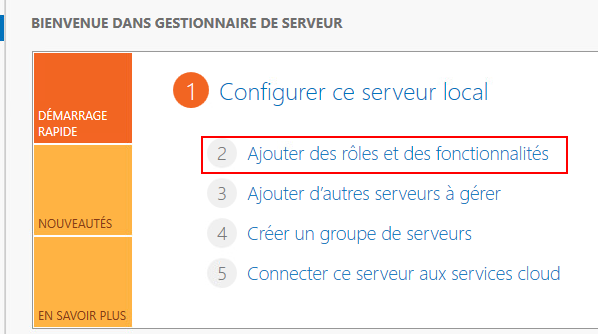
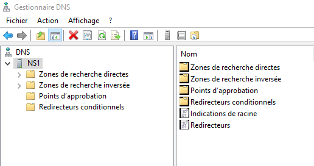
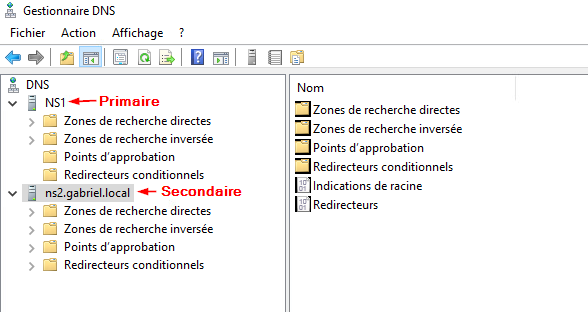
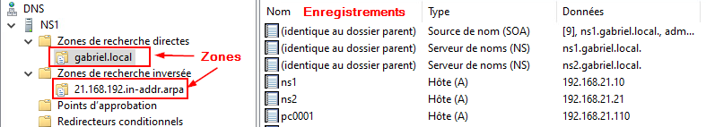

import useBaseUrl from '@docusaurus/useBaseUrl';
import ThemedImage from '@theme/ThemedImage';
import Tabs from '@theme/Tabs';
import TabItem from '@theme/TabItem';

# Cours 11

## Similarités et différences

Les concepts du service DNS restent les mêmes, et ce, peu importe le système d'exploitation qui héberge le service. Ce qui différera principalement, c'est la méthode de configuration du service.

La théorie de ce cours est donc assez limité puisqu'évidemment, les notions relatives au service DNS restent exactement les mêmes. Je vous ai tout de même répertorié quelques éléments qui valaient la peine d'être nommés.

## Installation du service

Comme la grande majorité de services ou des rôles sous le serveur Windows, l'installation devra se faire via le gestionnaire de serveur en cliquant sur « Ajouter des rôles et des fonctionnalités ».

## Console du service DNS

Évidemment, sous Windows, nous bénéficions de l'interface graphique pour nous aider. À moins que vous ayez décidé d'utiliser un serveur en mode core 😎

### Serveurs multiples

La console DNS peut accueillir plus d'un serveur DNS. En effet, si vous faites un clic à l'aide du bouton de droite de la souris sur le mot **DNS** au haut de la console, vous pourrez établir une connexion à un autre serveur DNS et ainsi gérer tous vos serveurs à partir de la même console.

### Zones et enregistrements

Dans la console DNS, les zones sont séparées par type (directe et inversée). Vous pourrez évidemment gérer vos zones respectives dans la console et créer des enregistrements dans chacune d'elle:

:::important[Zone de stub]
Dans le laboratoire en lien avec ce cours, vous verrez apparaitre un nouveau type de zone: Les zones de stub. Nous n'avons pas abordé ce type de zone en classe. La raison en est fort simple, les zones de stub sont particulières car elles ne possèdent pas tous les enregistrements d'une zone. Les zones de stub ne contiennent que quelques enregistrements permettant de retrouver un serveur DNS, qui lui, possédera tous les enregistrements d'une zone déterminée. On met ce genre de zone en place dans des contextes particuliers où l'on souhaite simplifier la gestion de multiples serveurs DNS.
:::

## Gestion du pare-feu

Contrairement à Linux et UFW, Windows Serveur ajustera son pare-feu lorsque vous installez un service. Par exemple, lorsque vous installez un service DNS sur le serveur, Windows ajustera automatiquement les règles de son pare-feu automatiquement pour être en mesure de bien recevoir les requêtes qui lui sont envoyées.

**Vous n'avez donc aucune modification à apporter au pare-feu Windows suite à l'installation des services DNS**