import useBaseUrl from '@docusaurus/useBaseUrl';
import ThemedImage from '@theme/ThemedImage';
import Tabs from '@theme/Tabs';
import TabItem from '@theme/TabItem';

# Laboratoire 11
* * *

## Mise en place de serveurs DNS Windows

## Préalable(s)

- Avoir complété le laboratoire # 10

## Objectif(s)
- Mettre en place deux serveurs DNS sous Windows
- Configurer les notifications et les transferts de zone.

* * *
## Schéma

    <ThemedImage
        alt="Schéma"
        sources={{
            light: useBaseUrl('/img/Serveurs1/Laboratoire10_W.svg'),
            dark: useBaseUrl('/img/Serveurs1/Laboratoire10_D.svg'),
        }}
    />

* * *

## Étapes de réalisation

N'installez pas des serveurs Windows depuis zéro. Utilisez plutôt le modèle de Windows Serveur disponible dans Labinfo pour vous créer deux serveurs distincts.

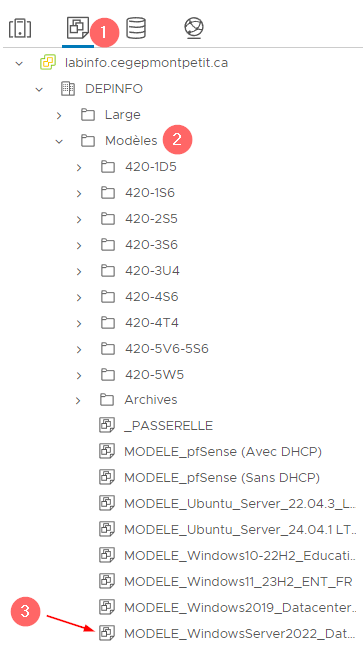

## Serveur DNS principal

### Installation du rôle DNS

Identifiez l'un de vos deux serveurs comme étant le serveur DNS principal. Renommez-le « **ns1** » et attribuez lui l'adresse statique **192.168.21.10**.

:::caution
L'adresse du serveur DNS doit être 127.0.0.1. Pour rappel, il s'agit d'une adresse IP de type alias qui signifier « moi-même ». Notre serveur Windows sera donc, lui-même, son propre serveur DNS.
:::

Dans votre gestionnaire de serveur, cliquez sur « **Ajouter des rôles et des fonctionnalités** ».

Vous pouvez ignorer la page « Avant de commencer ».

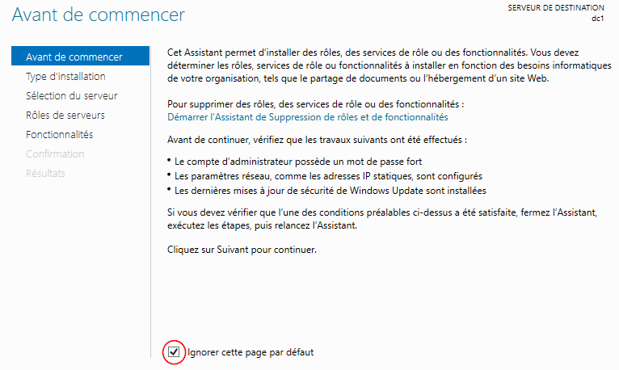

Sélectionnez « Installation basée sur un rôle ou une fonctionnalité »

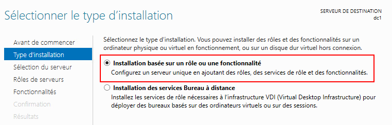

Le serveur de destination ne peut être que le seul que vous avez installé. Sélectionnez-le et cliquez sur suivant

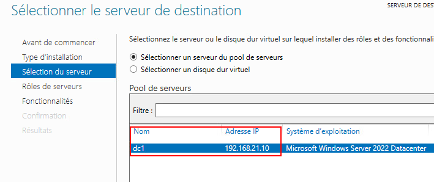

Dans la liste des rôles disponibles, sélectionnez « Serveur DNS » et cliquez sur « suivant »

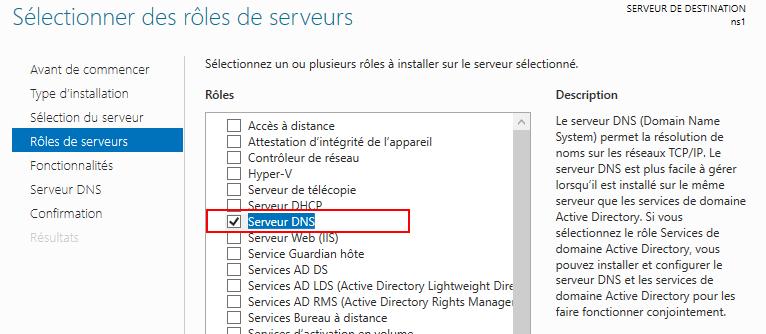

Cliquez sur suivant à la page vous expliquant le rôle du DNS, puis cliquez sur « Installer ».

### Configuration d'un redirecteur

L'un des premiers éléments auquel il faut penser à mettre en place est un redirecteur. Notre serveur DNS devra rediriger les requêtes DNS dont il ne connait pas la réponse. Pour configurer le redirecteur, ouvrez le menu **outils** du gestionnaire de serveur puis cliquez sur **DNS**. La console **« Gestionnaire DNS »** s'ouvrira. 

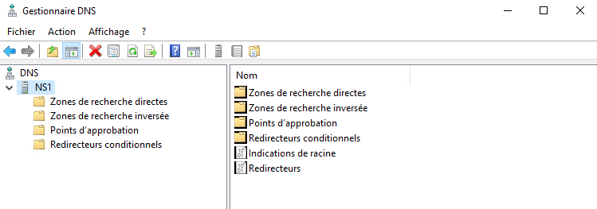

Faites un clic à l'aide du bouton de droite de la souris sur votre serveur et dirigez-vous dans les propriétés:

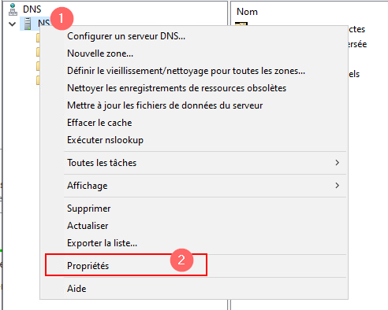

Une fois dans les propriétés de votre serveur DNS, cliquez sur l'onglet **« Redirecteurs »** puis sur le bouton **« Modifier »**:

Inscrivez l'adresse du service DNS public de Google comme redirecteur:

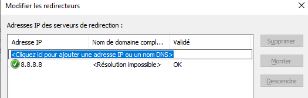

Appliquez vos configurations et fermez les propriétés du serveur.

### Configuration d'une zone de recherche directe

Pour créer une zone de recherche direct, faites un clic à l'aide du bouton de droite de la souris sur **« Zones de recherche directes »** et sélectionnez **« Nouvelle zone »** :

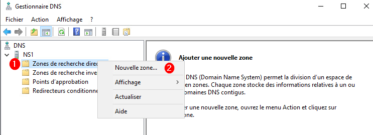

Dans l'assistant de nouvelle zone, précisez que vous désirez créer une zone principale. C'est-à-dire une zone hébergée sur un serveur principal.

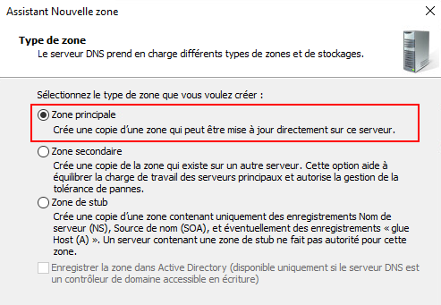

Indiquez le nom de votre nouvelle zone : *votreprénom.local*

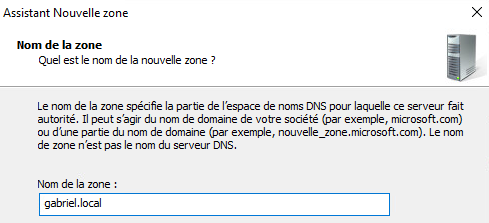

Un fichier de zone sera alors créé pour votre nouvelle zone:

:::tip[Le saviez vous ?]
Le serveur DNS de Windows est le même que sous Linux: il s'agit de Bind9. Vous pouvez même retrouver les mêmes fichiers de configuration sous Windows. Ceux-ci se retrouvent dans C:\Windows\System32\DNS\\*nom_de_zone.dns*:

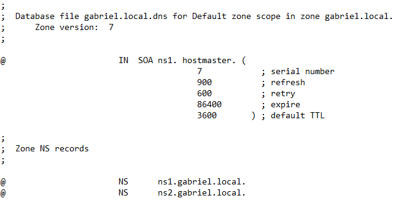
:::

Les mises à jour dynamiques des enregistrements permettent de maintenir les associations nom de domaine : adresse IP à jour lorsqu'un client voit son adresse IP être modifiée. Dans le cas ou ces mises à jour ne sont pas configurées, c'est l'administrateur qui doit modifier les associations lorsqu'une adresse IP est modifiée. Pour l'instant, c'est ainsi que nous fonctionnerons (sans mise à jour dynamique). Cela dit, vous ferez un laboratoire, sous peu, pour explorer les mises à jour dynamiques. En attendant, indiquez que vous désactiver cette fonctionnalité:

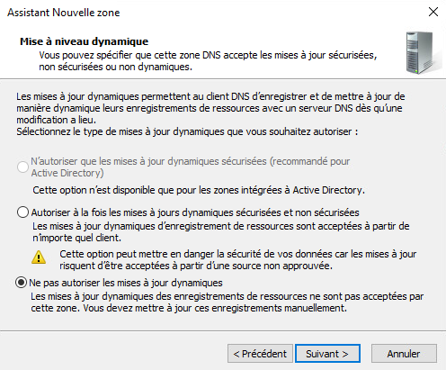

### Configuration des enregistrements 

Lorsque votre zone de recherche directe sera bel et bien créée, nous devrons mettre à jour quelques enregistrements et en créer de nouveaux.

Le premier enregistrement qu'il vous faudra créer est un enregistrement de type **A** pour le serveur lui-même. Cliquez donc sur la zone que vous venez de créer à l'aide du bouton de droite de la souris et cliquez sur **« Nouvel hôte (A ou AAAA)...»**

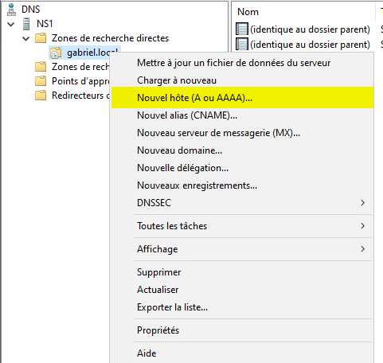

Remplissez les informations nécessaires à la création de l'enregistrement:

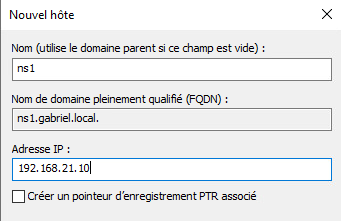

Une fois cet enregistrement créé, vous devrez modifier l'enregistrement ns1 que le serveur a lui-même créé lorsque vous avez fait la zone. Double-cliquez sur l'enregistrement NS et apportez les modifications telles que présentées ci-dessous:

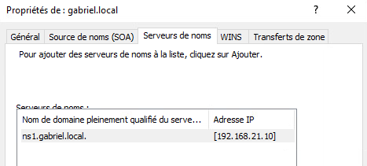

Créez les enregistrements suivants dans votre zone de recherche directe:

|Nom|Type|Valeur|
|:---:|:----:|:------:|
|pc0001|A|192.168.21.110|
|pc0002|A|192.168.21.120|
|ns2|A|192.168.21.20|
|@|NS|ns2.*votreprenom.local*|

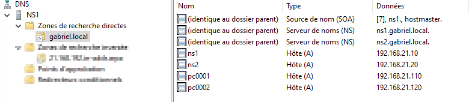

### Configuration d'une zone de recherche inverse

De la même façon que vous avez créé votre zone de recherche directe, créez une zone de recherche inversée pour le sous-réseau 192.168.21.0/24. Faites donc une zone principal sans mise à jour dynamique.

### Configuration des enregistrements

Créez un enregistrement **PTR** pour chaque enregistrement **A** que vous avez créé dans votre zone de recherche directe. Modifiez l'enregistrement ns1 comme vous l'avez également fait dans la zone de recherche directe:

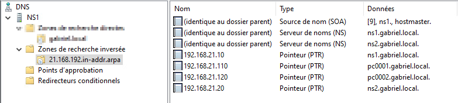

### Préparation des transferts de zone

Dans le cadre de ce laboratoire, nous allons mettre en place un second serveur DNS afin de sécuriser le service et d'assurer une redondance. Avant de déployer le second serveur DNS, nous devons autoriser et préparer nos zones à être transférées.

<mark>Répétez chacune des étapes suivantes sur vos deux zones : directe et inversée:</mark>

- Faites un clic à l'aide du bouton de droite de la souris sur la zone concernée, puis sélectionnez **« Propriétés »**
- Dirigez-vous dans l'onglet **« Transfert de zones »** et assurez vous que les transferts de zone soient autorisés vers les serveurs listés dans l'onglet « Serveurs de noms » :

    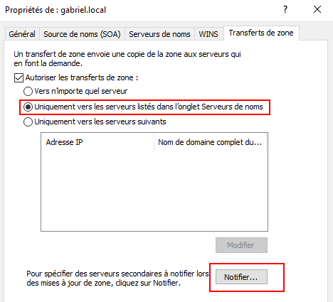

- Au bas de la fenêtre, cliquez sur « Notifier... » et assurez vous que les serveurs listés dans l'onglet « Serveurs de noms » soient bien notifiés lorsque des changements ont lieu:

    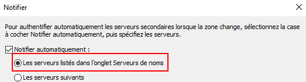

- Confirmez que vos deux serveurs DNS apparaissent bien dans l'onglet « Serveurs de noms ».

## Serveur DNS secondaire

### Installation du rôle DNS

Comme vous l'avez fait pour votre serveur DNS principal, configurez convenablement l'adresse IP statique du serveur et renommez le serveur ns2.

:::caution
Alors que pour le serveur principal, nous avions configuré **127.0.0.1** en tant que serveur DNS, ici nous allons configurer l'adresse de ns1 en tant que serveur DNS principal, c'est à dire **192.168.21.10**.
:::

Suivez les mêmes instructions que ci-dessus pour la mise en place du service DNS sur le serveur secondaire.

### Configuration de la zone de recherche directe secondaire

Créez une nouvelle zone de recherche directe comme vous l'avez fait dans votre serveur DNS principal. Lorsque viendra le temps de choisir votre type de zone, choisissez **« zone secondaire »**

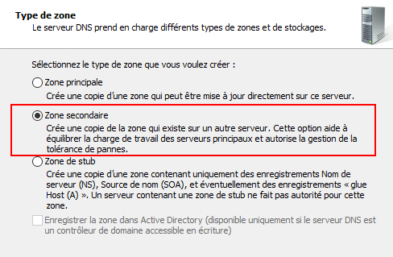

Entrez le nom de votre zone lorsque demandé (*votreprenom.local*)

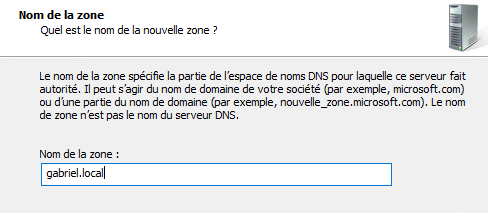

À la prochaine étape, on vous demandera d'entrer l'adresse IP ou le nom de domaine des serveurs DNS principaux. Comme nous n'avons qu'un seul serveur DNS principal, entrez son nom:

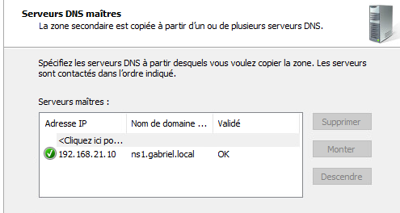

:::caution
Si vous utilisez le nom de domaine du serveur DNS principal, il se peut que vous ayez deux informations qui semblent contradictoires. Un nom de domaine validé et l'autre non-reconnu (voir l'image). L'hôte inconnu correspond à l'adresse IPv6 que nous n'avons pas configuré. Supprimez-la afin de pouvoir continuer l'assistant.

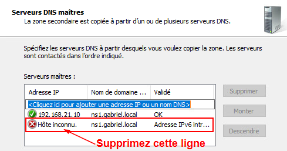

:::

Confirmez vos configurations et terminez l'assistant.

Laissez quelques minutes à votre serveur DNS secondaire pour recevoir les informations de la zone. Après 1 minute ou 2, vous devriez retoruver tous les enregistrements que vous avec créé dans le serveur DNS principal.

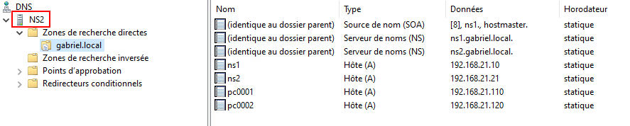

:::danger[Échec du transfert de la zone]
Il se peut que dans les premiers instants après la configuration de votre zone secondaire, vous ayez un message d'erreur stipulant que le transfert a échoué. C'est généralement un « faux-positif », votre transfert de zone n'a probablement pas terminé encore. Attendez encore quelques minutes et rafraichissez la page à l'aide de la touche **f5** de votre clavier. Les enregistrements finiront par apparaitre.
:::

### Configuration de la zone de recherche inversée secondaire

Suivez les mêmes étapes que pour la configuration de votre zone de recherche directe secondaire afin de configurer la zone inversée secondaire.

## Mise en place des clients

Ce laboratoire implique deux postes de travail sous Windows 10. Vous devez évidemment configurer chacun de ces postes avec le bon nom et l'adresse IP correspondante.

|Nom du poste|Adresse IP|Masque|Passerelle|DNS Primaire|DNS Auxiliaire|
|------------|----------|-----------|-----------|------------|--------------|
|pc0001.votredomaine.local|192.168.21.110|255.255.255.0|192.168.21.1|192.168.21.10|192.168.21.20|
|pc0002.votredomaine.local|192.168.21.120|255.255.255.0|192.168.21.1|192.168.21.10|192.168.21.20|

## Validations et vérifications

Déjà, avec les configurations IP statiques sur les postes de travail, vous devriez avoir accès à internet. Si c'est le cas, c'est très bon signe.

