import useBaseUrl from '@docusaurus/useBaseUrl';
import ThemedImage from '@theme/ThemedImage';
import Tabs from '@theme/Tabs';
import TabItem from '@theme/TabItem';

# Laboratoire 12
* * *
## Ajout d'un serveur DHCP dans votre infrastructure

## Préalable(s)

- Avoir complété le laboratoire # 11
- <mark>Utiliser la passerelle MODELE_pfSense (Sans DHCP)</mark>

## Objectif(s)
- Mettre en place un service DHCP aux côtés de vos serveurs DNS

* * *
## Schéma

<div style={{textAlign: 'center'}}>
    <ThemedImage
        alt="Schéma"
        sources={{
            light: useBaseUrl('/img/Serveurs1/Laboratoire12_W.svg'),
            dark: useBaseUrl('/img/Serveurs1/Laboratoire12_D.svg'),
        }}
    />
</div>

## Étapes de réalisation

Ce laboratoire implique plusieurs étapes. Il nous faudra d'abord procéder au remplacement de la passerelle puisque celle-ci offre actuellement un service DHCP. Ensuite, nous devrons mettre en place le nouveau serveur qui fera office de service DHCP. Puis nous effectuerons les configurations nécessaires.

Voici le plan d'adressage IP de l'infrastructure. Vous pouvez utiliser les mêmes adresses que moi ou votre propre configuration si vous le désirez:

|Machine|Adresse IP|
|:-----------:|:-----------:|
|Passerelle|192.168.21.1|
|ns1.mondomaine.local| 192.168.21.10|
|ns2.mondomaine.local| 192.168.21.20|
|dhcp.mondomaine.local| 192.168.21.30|
|pc0001.mondomaine.local| 192.168.21.101|
|pc0002.mondomaine.local| 192.168.21.102|


### Remplacement de la passerelle

Vous n'êtes pas obliger de supprimer votre passerelle actuelle. Vous pouvez vous contenter de la fermer. Importer le modèle « MODELE_pfSense (Sans DHCP) » depuis la section « Modèles » sous Labinfo. 

Ce modèle possède évidemment deux cartes réseaux puisque c'est une passerelle. La première est configuré sur le réseau « Accès Internet 1 » et vous devez la laisser ainsi. En ce qui concerne la deuxième carte réseau, configurez la pour qu'elle soit relié au même réseau privé que vos deux serveurs DNS.

Une fois la passerelle remplacé, démarrez la et démarrez vos deux serveurs DNS. **Confirmez que vous avez toujours un accès au web depuis vos serveurs DNS avant d'aller plus loin.**

### Mise en place du serveur DHCP

Tout comme vous l'avez fait lors du laboratoire précédent, créez un nouveau serveur sous Windows Serveur 2022 à l'aide du modèle sous Labinfo.

#### Installation du rôle DHCP

Dans votre gestionnaire de serveur, cliquez sur « **Ajouter des rôles et des fonctionnalités** ».

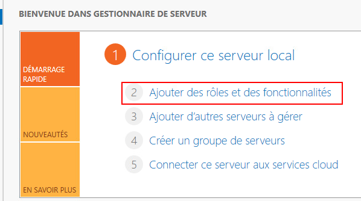

Vous pouvez ignorer la page « Avant de commencer ».

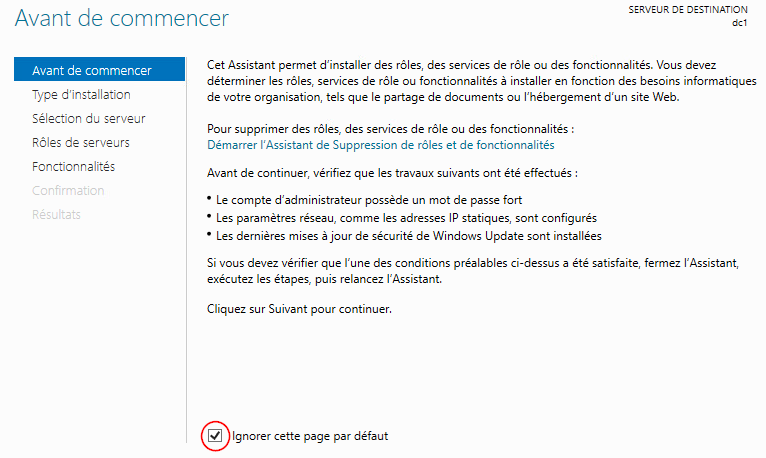

Sélectionnez « Installation basée sur un rôle ou une fonctionnalité »

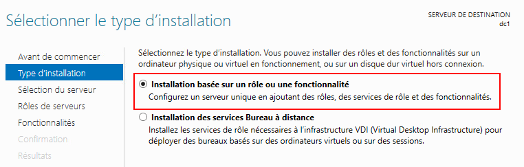

Dans la liste des rôles disponibles, sélectionnez « Serveur DHCP » et cliquez sur « suivant »

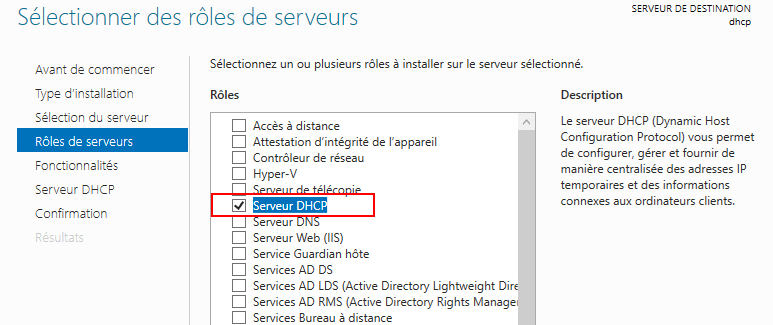

Cliquez sur suivant sur les prochaines pages jusqu'à ce que vous puissiez cliquer sur « installer ».

#### Terminer la configuration DHCP

Bien que le rôle DHCP soit installé, vous remarquerez qu'une notification d'avertissement apparait dans votre gestionnaire de serveur:


Si vous cliquez sur la notification en question, vous verrez qu'il s'agit de lancer un assistant de configuration post-installation DHCP. Cette étape consiste à créer des groupes d'utilisateurs pour l'administration du service DHCP. Bien que cette étape puisse peut-être vous paraître futile pour le moment, cette étape sera cruciale lorsque nous utiliserons les services d'*Active Directory*. 👇

En effet, avec *Active Directory*, le service DHCP doit être autorisé à agir sur le domaine. Si vous oubliez cette étape dans un infrastructure comportant *AD*, votre service DHCP ne fonctionnera tout simplement pas.

Pour l'instant, vous n'avez qu'à cliquer sur « Valider » dans l'assistant.

#### Création d'une étendue

Le premier élément à définir pour que notre service DHCP puisse opérer, c'est l'étendue (sous-réseau) sur lequel il doit opérer. Ouvrez le menu **outils** du gestionnaire de serveur puis cliquez sur **DHCP**. La console **« DHCP »** s'ouvrira:

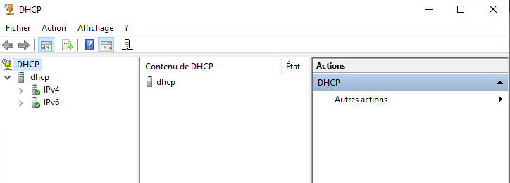

Cliquez sur votre serveur, puis faites un clic à l'aide du bouton de droite de la souris sur **« IPv4 »**. Sélectionnez **« Nouvelle étendue ».**

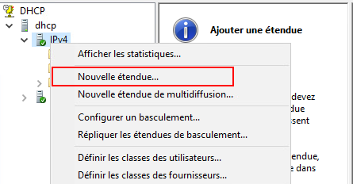

L'assistant « Nouvelle Étendue » démarrera et vous demandera un nom d'étendue et une description:

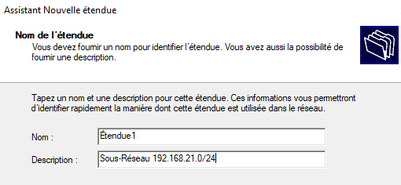

##### Plage d'adresses IP

La plage d'adresses IP est en fait le bassin d'adresses dont le serveur disposera pour sa distribution. Dans notre cas, nous disposons d'une passerelle avec l'adresse 192.168.21.1 jumelé à un masque de sous-réseau allant comme suit: 255.255.255.0. Il serait donc logique d'utilisé les adresses situés dans le même sous-réseau.

:::tip[Bien planifier son adressage]
Lorsque l'on conçoit un réseau ou une infrastructure Ti, il est important de planifier l'adressage IP comme il se doit. On crée alors un plan d'adressage selon les besoins de l'entreprise. Un exemple de plan d'adressage pourrait être semblable à ceci:

192.168.21.1 à 192.168.21.30    👉 Serveurs<br/>
192.168.21.31 à 192.168.21.100  👉 Périphériques (*imprimantes et autres*)<br/>
192.168.21.101 à 192.168.21.200 👉 Postes de travail fixes<br/>
192.168.21.201 à 192.168.21.230 👉 Appareils mobiles<br/>
192.168.21.231 à 192.168.21.254 👉 Routeurs et commutateurs<br/>

Évidemment, ce n'est qu'un exemple, rien ne vous oblige à respecter le plan présenté ici. L'objectif est simplement de vous démontrer qu'il importe de faire une bonne planification des adresses IP
:::

Revenons-en à notre plage d'adresse DHCP, si je désir respecter le plan d'adressage présenté ci-dessus, je pourrais créer une plage d'adresse allant de 192.168.21.31 à 192.168.21.230. Ainsi, les adresses IP des serveurs, des commutateurs et des routeurs devront obligatoirement être configuré manuellement:

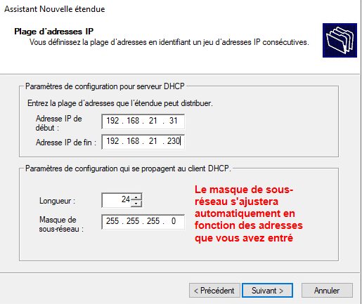

##### Exclusions et retard

Les exclusions correspondent aux adresses IP de la plage que vous ne désirez pas distribuer. Par exemple, je pourrais exclure les adresses 192.168.21.40 à 192.168.21.60 au besoin et ce, peu importe la raison. Quant au retard, il s'agit d'un délai de réponse que l'on peut configurer sur le serveur DHCP comme nous en avons parlé lorsque nous avons parlé du [fractionnement de l'étendue.](./00-cours12.md#le-fractionnement-de-létendue)

En ce qui concerne notre laboratoire, vous pouvez tout simplement cliquer sur « Suivant ». Nous ne configurerons pas d'exclusion ni de retard.

##### Durée du bail

Nous en avons abordé la durée du bail dans la théorie en lien avec le DHCP. Pour cet exercice, un bail d'une durée de 2 jours est amplement suffisant:

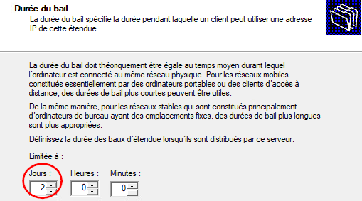

##### Configuration des options DHCP

Les options DHCP sont importantes et doivent être configurées rapidement. Parmi ces options, nous retrouverons l'adresse de la passerelle par défaut ainsi que les adresses des serveurs DNS à distribuer à nos clients. Ces informations sont essentielles si nous tenons à ce que nos clients puissent obtenir une connexion internet.

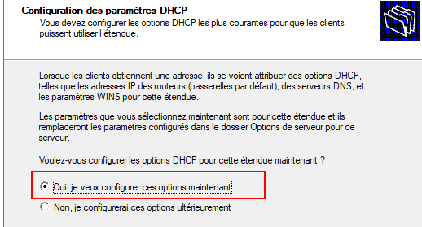

##### Option 3 - Routeur

La première option que vous aurez à configurer est l'adresse de la passerelle par défaut que le serveur distribuera aux clients. Entrez donc l'adresse de la passerelle, puis cliquez sur « Ajouter »:

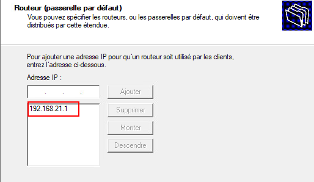

##### Option 6 & 15 - DNS

Dans cette fenêtre, vous serez appelé à configurer les adresses IP des serveurs DNS que le DHCP devra distribuer. Vous aurez également la possibilité de définir le suffixe DNS à fournir aux clients:

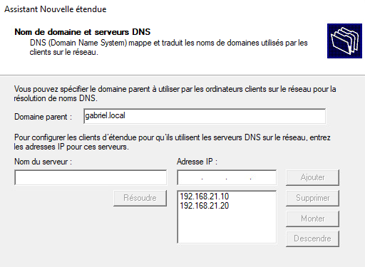

##### Serveurs WINS

Les serveurs WINS peuvent permettre la résolution de nom NetBIOS plus efficacement. Or, il s'agit d'une vieille technologie que nous n'avons pas abordé dans le cours et que nous n'aborderons pas non plus. Vous pouvez donc vous contenter de cliquer sur « Suivant » dans cette fenêtre.

Vous serez alors amené à activer votre étendue, ce qui activera votre service DHCP.

#### Tests et validations

À ce stade, tous nos services sont en place pour effectuer un premier test. Utilisez donc un poste de travail sous Windows 10, soit votre pc0001.domaine.local ou pc0002.domaine.local et passez sa configuration IP en mode automatique:

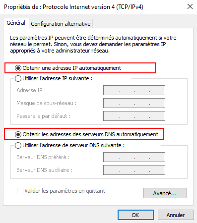

Une fois la configuration appliquée, ouvrez un terminal Powershell et entrez la commande suivante:

<div className="tabsborder">
    <Tabs>
        <TabItem value="GetNetIPConfig" label="Commande" default>
            ```Powershell
            Get-NetIPConfiguration -Detailed
            ```
        </TabItem>
        <TabItem value="ResultatGetNetIPConfig" label="Résultat">
           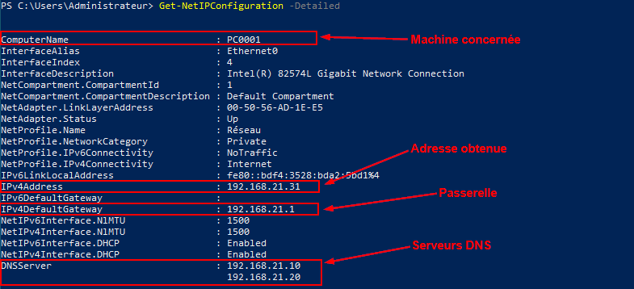
        </TabItem>
    </Tabs>
</div><br/>

Lorsque votre configuration IP automatique sera appliquée, vous devriez avoir accès à internet et être en mesure d'interroger les serveurs DNS.

### Mise à jour des DNS

> *Gabriel, j'ai bien obtenu une adresse IP, mais mon enregistrement DNS ne correspond plus!*
>
> *-Les étudiants*

C'est vrai! Si vous vous souvenez, on avait inscrit dans le serveur DNS que [pc0001](../12%20-%20Cours%2011%20-%20Serveurs%20DNS%20sous%20Windows/01-Laboratoire11.md#mise-en-place-des-clients) correspondait à 192.168.21.110 lors du laboratoire 11. Or, dans ce laboratoire le serveur DHCP lui a attriubué l'adresse 192.168.21.31, ce qui ne correspond plus à l'enregistrement DNS.

Quelques solutions pourraient s'offrir à nous pour mettre à jour automatiquement nos enregistrements DNS. 

1. Nous pourrions rapatrier nos services sous un seul serveur qui s'occuperait à la fois du service DNS et DHCP. Ainsi, ce serveur aurait accès aux base de données DHCP et DNS et pourrait les manipuler.

2. Mettre en place les services d'Active Directory qui, grâce à une centralisation de l'authentification, nous permettrait de créer un compte qui pourrait autant administrer la base de données DHCP que la base de données DNS.

Pour l'instant, laissez votre laboratoire tel quel. Vous aurez besoin de la théorie sur *Active Directory* pour le poursuivre.