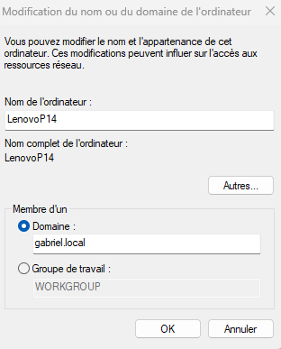
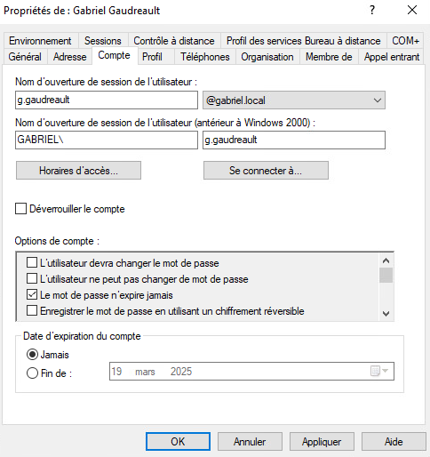
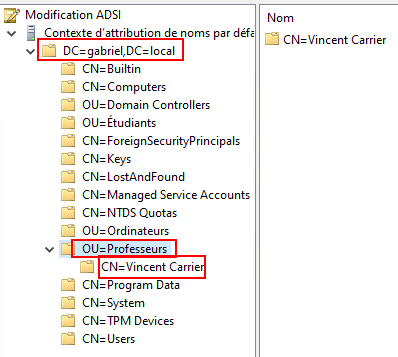

import useBaseUrl from '@docusaurus/useBaseUrl';
import ThemedImage from '@theme/ThemedImage';
import Tabs from '@theme/Tabs';
import TabItem from '@theme/TabItem';

# Cours 13

## Le DNS jusqu'ici
Jusqu'ici nous avons abordé les DNS sans *Active Directory*. En outre, nous avons appris qu'un domaine était un ensemble d'ordinateurs et de périphériques interconnectés les uns aux autres via un réseau local et représenté par une délimitation logique. Chaque appareil possède un nom qui lui est propre sur le domaine, constitué de son nom, suivi du nom de domaine.

**Par exemple:**

**pc0001.****gabriel.local.**

 

En jaune, nous avons le nom de l'appareil et en bleu, le nom du domaine. L'ensemble du nom est ce que l'on nomme le FQDN.

## Active Directory

Les services de Domaine Active Directory de Microsoft utilisent les délimitations d'un domaine pour faire l'administration de son contenu. Au-delà des ordinateurs, plusieurs autres objets peuvent faire partie d'un domaine Active Directory (utilisateurs, ordinateurs, imprimantes, etc). Active Directory offre un service centralisé de gestion d'identité, d'autorisation et d'authentification dans un réseau.

### Comment ça marche ?

AD répertorie, dans un annuaire, divers éléments composant le domaine, afin d'en faciliter la recherche:
- Ordinateurs (serveurs et postes de travail)
- Utilisateurs et groupes d'utilisateurs
- Imprimantes
- Dossiers partagés sur le réseau

Cet annuaire est stocké dans une base de données distribuée et répliquée.

### Historique

Active Directory est apparu pour la première fois sous Windows 2000. À l'époque, le leader du produit le plus similaire était Novell Directory. Le fait qu'Active Directory soit directement intégré à Windows a mené à la perte de Novell Directory. Aujourd'hui plus de 90% des organisations et des entreprises utilisent Active Directory pour l'authentification et l'identification de ses utilisateurs.

### Principaux services

|LDAP|DNS|Kerberos|DFS|NTP|
|:--:|:-:|:------:|:-:|:-:|
|Organisation et interrogation des objets (utilisateurs, ordinateurs, groupes, etc.) et leurs attributs dans une base de données de type annuaire.|Résolution de noms des ordinateurs du réseau. Essentiel pour localiser les contrôleurs de domaine et autres serveurs.| Authentification centralisée pour gérer l'accès aux ressources du domaine | Partage de fichiers distribués et répliqués entre plusieurs serveurs mais disposant d'un lien commun.|Synchronisation des horloges système de tous les hôtes du réseau.|

### Qu'est-ce qu'un domaine AD

- Un domaine (zone DNS)
- Un ou plusieurs contrôleurs de domaine
- Des objets de divers types:
    - Utilisateurs
    - Ordinateurs
    - Groupes
    - Stratégies de groupe (GPO)
    - Unités d'organisation (OU)
    - Autres (imprimantes, partage de fichiers...)

    <ThemedImage
        alt="Schéma"
        sources={{
            light: useBaseUrl('/img/Serveurs1/AD_W.svg'),
            dark: useBaseUrl('/img/Serveurs1/AD_D.svg'),
        }}
    />

### Architecture multi-domaines

Dans certaines entreprises ou organisations, il est possible de créer des infrastructures contenant des domaines et des sous-domaines. Il existe tout un vocabulaire pour décrire ces structures organisationnelles. Pour s'assurer de parler le même langage, il importe de définir quelques termes.

#### Le domaine (racine)

Peut-être l'avez vous déjà remarqué, mais si ce n'est pas le cas, sachez qu'un domaine est toujours représenté par la forme d'un triangle. L'infrastructure AD la plus simple possible est donc représenté par un triangle unique. Il s'agit d'un domaine, une zone DNS, unique dans laquelle nous ferons la gestion de différents objets.

    <ThemedImage
        alt="Schéma"
        sources={{
            light: useBaseUrl('/img/Serveurs1/Domain_W.svg'),
            dark: useBaseUrl('/img/Serveurs1/Domain_D.svg'),
        }}
    />

:::important
Le premier domaine créé dans une infrastructure Active Directory est appelé: **Le domaine racine.** Ce domaine particulier possède une importance capitale. En effet, le domaine racine est un point central pour la gestion de la sécurité et la structure de la forêt.
:::

#### Le sous-domaine (arbre)

Un sous-domaine est ni plus ni moins qu'un domaine dans un domaine. Dans le cas de *patate.net* par exemple, je pourrais créer un sous-domaine au nom de *quebec.patate.net*. Il existe quelques raisons pour créer un sous-domaine Active Directory:

- La séparation des rôles et des responsabilités.
- La délégation d'administration
- Le contrôle de la sécurité et des stratégies de groupe (GPO)
- Répartition géographique ou organisationnelle
- etc.

    <ThemedImage
        alt="Schéma"
        sources={{
            light: useBaseUrl('/img/Serveurs1/SousDomaine_W.svg'),
            dark: useBaseUrl('/img/Serveurs1/SousDomaine_D.svg'),
        }}
    />

:::important
On appelle un domaine parent ainsi que tout ses sous-domaines: **un arbre**
:::

#### La forêt

La forêt est l'ensemble des domaines et sous-domaines sous une même administration Active Directory. Elle comprend donc le domaine racine, tous les domaines parents ainsi que leurs domaines enfants.

    <ThemedImage
        alt="Schéma"
        sources={{
            light: useBaseUrl('/img/Serveurs1/InfraAD_W.svg'),
            dark: useBaseUrl('/img/Serveurs1/InfraAD_D.svg'),
        }}
    />

### Nom du domaine

Un domaine Active Directory possède deux noms:

- Un nom **NETBIOS**:
    - 15 caractères maximum
    - Typiquement en majuscules
    - Sert principalement à assurer une rétrocompatibilité
    - Exemple: LABO

- Nom **DNS**:
    - Zone DNS dédiée au domaine Active Directory
    - Typiquement un sous-domaine de la zone principale
    - Maximum de 253 caractères
    - Exemple: labo.gabriel.local

### Utilisateurs et groupes AD

Le domaine possède sa propre liste d'utilisateurs et de groupes. Ils peuvent être utilisés sur toutes les machines du domaine. Les utilisateurs ont, eux-aussi, plus d'un nom:

- Nom SAM (SamAccountName)
    - Maximum de 19 caractères
    - Préfixé avec le nom NetBIOS du domaine
    - Exemple : GABRIEL\Utilisateur

- Nom UPN (UserPrincipalName)
    - Maximum de 1024 caractères
    - Porte le nom du domaine en suffixe
    - Ressemble à une adresse courriel
    - Exemple: utilisateur@gabriel.local

### Joindre un domaine

Pour être pris en charge, on doit joindre les ordinateurs au domaine. On dit alors qu'ils sont des membres du domaine. Les administrateurs du domaine ont ainsi une autorité sur toutes les machines du domaine.

Il y a deux façons de joindre le domaine, soit par l'interface graphique (sysdm.cpl) ou via PowerShell (Add-Computer).

:::caution
Pour joindre un domaine AD, il faut impérativement que les machines membres soient en mesure de résoudre le nom du domaine dans leur configuration DNS. Autrement dit, les machines doivent utiliser le serveur DNS fournit par le contrôleur du domaine.
:::

### Enregistrements dynamiques

Lorsqu'un ordinateur est ajouté au domaine, un enregistrement **A** est automatiquement ajouté dans la zone DNS. Ce qui est réellement intéressant, c'est que les enregistrements sont automatiquement dynamiques, c'est-à-dire que si l'ordinateur change d'adresse IP, l'enregistrement sera automatiquement mis à jour dans la zone DNS.

### Le contrôleur de domaine

Le contrôleur de domaine est le point central d'Active Directory. Il est l'autorité de gestion du domaine. En outre il
- Conserve une copie de tout le contenu de la base de données et permet d'y accéder via le protocole LDAP.
- Traite les authentifications.
- Réplique les informations avec les autres contrôleurs de domaine.
- **Doit être protégé!** S'il est compromis, l'attaquant a tout pouvoir sur les systèmes de l'entreprise.

### Les outils d'administration

Plusieurs outils sont accessibles à partir du gestionnaire de serveur sur un contrôleur de domaine, mais peuvent être installés sur n'importe quelle machine Windows.

- Centre d'administration Active Directory
- Gestion des stratégies de groupe
- Utilisateurs et ordinateurs Active Directory
- Sites et services Active Directory
- Domaines et approbations Active Directory
- Modification ADSI

### Les objets

Nous avons vu ensemble qu'un domaine Active Directory était constitué de plusieurs objets. Nous allons nous attarder à ceux-ci, leur organisation, leurs attributs, etc.

#### Organisation des objets

Les objets AD sont organisés dans une arborescence similaire à un système de fichiers, composée de conteneurs et d'unités organisationnelles (OU).

:::caution
Les unités d'organisation et les conteneurs sont représentés par un icône de dossier. Cela dit, faites bien attention de ne pas confondre les dossiers du système et les objets d'Active Directory.
:::

#### Objet : Utilisateur

L'objet utilisateur représente un compte pouvant s'authentifier sur le domaine. On pourra généralement attribuer l'accès à différentes ressources à ce compte.

#### Objet : Groupe

L'objet groupe représente un regroupement de plusieurs objets de type utilisateur.

- On peut attribuer un accès à une ressource à un groupe pour donner accès à tous ses membres.
- Un groupe peut contenir d'autres groupes (*nesting*)

    <ThemedImage
        alt="Schéma"
        sources={{
            light: useBaseUrl('/img/Serveurs1/Groupes_W.svg'),
            dark: useBaseUrl('/img/Serveurs1/Groupes_D.svg'),
        }}
    />

#### Objet : Ordinateur

Les objets de type ordinateur sont l'équivalent d'un compte d'utilisateur mais spécifiques aux ordinateurs.

- La jonction au domaine crée un compte pour l'ordinateur membre.
- Les mots de passe sont négociés régulièrement et automatiquement.
- Les ordinateurs peuvent être membre d'un groupe.

#### Le DN (*Distinguished Name*)

Selon le protocole LDAP, les objets AD sont identifiés par un DN qui décrit sa position dans l’annuaire.

Dans le cas de l'utilisateur Vincent Carrier, son **DN** irait comme suit:

<u>Distinguished Name:</u> 
CN=Vincent Carrier,OU=Professeurs,DC=gabriel,DC=local

:::note
Remarquez bien comment on décortique le nom de domaine dans un DN
:::

#### Attributs d'objets

Les objets possèdent des attributs. Certains de ces attributs sont exposés dans les consoles graphiques, d'autres non. Ces attributs sont définis dans le schéma d'Active Directory. Vous en apprendrez davantage à ce sujet dans le cours *Serveurs 3*.

### Admins du domaine

Le groupe des admins du domaine est le plus puissant du domaine, car il permet de contrôler tout l’AD. Par défaut, dans Active Directory, tous les admins du domaine sont aussi admins locaux de tous les ordinateurs membres du domaine.

## Références

- [Présentation du cours](../Assets/13/13-420-2S5-H25%20(Intro-Active%20Directory).pdf)