import useBaseUrl from '@docusaurus/useBaseUrl';
import ThemedImage from '@theme/ThemedImage';
import Tabs from '@theme/Tabs';
import TabItem from '@theme/TabItem';

# Laboratoire 14
* * *

## Installation et configuration d'un domaine Active Directory

## Préalable(s)

- Avoir complété le laboratoire # 12

:::caution
Nous repartirons du laboratoire #12 pour réaliser ce laboratoire. Assurez-vous donc d'avoir complété ce dernier laboratoire avant d'entreprendre celui-ci.
:::

## Objectif(s)
- Déployer un premier contrôleur de domaine Active Directory

* * *
## Schéma

<div style={{textAlign: 'center'}}>
    <ThemedImage
        alt="Schéma"
        sources={{
            light: useBaseUrl('/img/Serveurs1/Laboratoire12_W.svg'),
            dark: useBaseUrl('/img/Serveurs1/Laboratoire12_D.svg'),
        }}
    />
</div>

* * *

## Étapes de réalisation

Dans le cadre de ce laboratoire, nous utiliserons nos deux serveurs DNS actuels pour mettre en place les services de domaine Active Directory.

### Installation du rôle ADDS su NS1

Commençons par le serveur DNS principal, soit ns1.domaine.local. Dirigez-vous dans le gestionnaire de serveur et cliquez sur « Ajouter des rôles et des fonctionnalités »

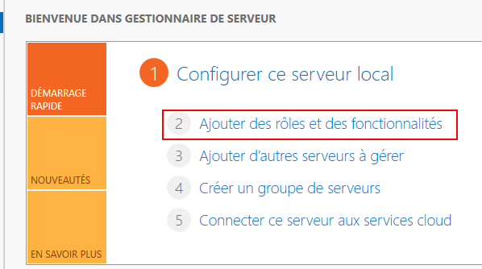

Vous pouvez ignorer la page « Avant de commencer ».

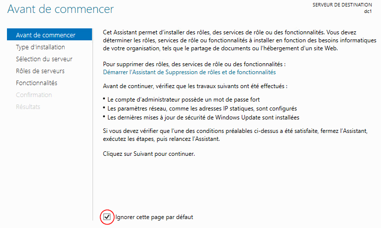

Sélectionnez « Installation basée sur un rôle ou une fonctionnalité »

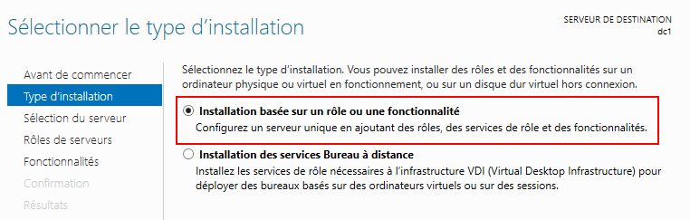

Sélectionnez votre serveur de destination et cliquez sur suivant

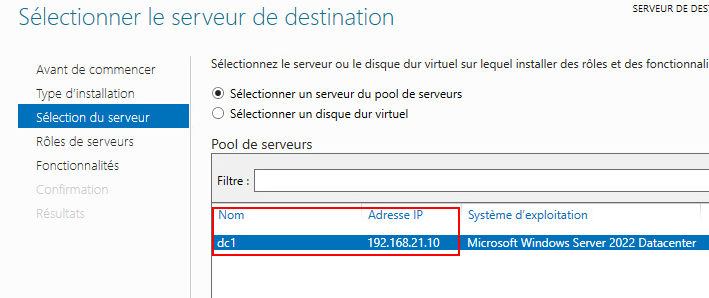

Dans la liste des rôles disponibles, sélectionnez les services ADDS et cliquez sur « suivant »

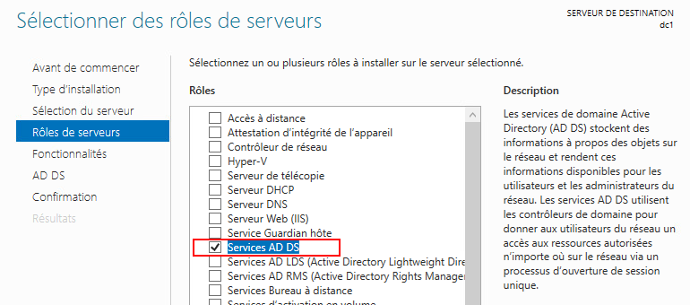

Dans la liste des fonctionnalités, vous n'avez rien à cocher. Contentez vous de cliquer sur « suivant »

Cliquez sur suivant à la page vous expliquant les services Active Directory, puis cliquez sur « Installer ».

Une fois l'installation terminée, cliquez sur « Fermer ».

### Promotion du serveur en contrôleur de domaine

Installer le rôle ADDS (*Active Directory Domain Services*) ne transforme pas, systématiquement, notre serveur en contrôleur de domaine. En effet, la mise en place d'un domaine racine ainsi l'initialisation du premier contrôleur de domaine est une étape que l'on nomme : La promotion vers le rôle de contrôleur de domaine.

Suite à l'installation du rôle, vous remarquerez sans doute un point d'exclamation jaune près du menu « Outils ». Cliquez sur celui-ci afin de pouvoir entreprendre la promotion du serveur.

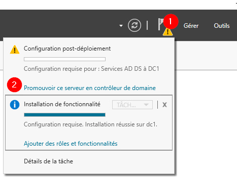

#### Configuration du déploiement

Vous aurez **3** possibilités de déploiement:

**Ajouter un contrôleur de domaine à un domaine existant**<br/>
Cette option vous permet de déployer un contrôleur supplémentaire dans une infrastructure AD déjà existante. Ce qui n'est pas notre cas ici.

**Ajouter un nouveau domaine à une forêt existante**<br/> 
Comme elle le mentionne bien, cette option permet d'ajouter un domaine supplémentaire. Cela dit, il nous faudrait déjà une forêt, ce que nous n'avons pas ici.

**Ajouter une nouvelle forêt**<br/>
Il s'agit de l'option à utiliser lorsque nous n'avons aucun élément d'Active Directory en place. C'est notre cas. Choisissez cette option.


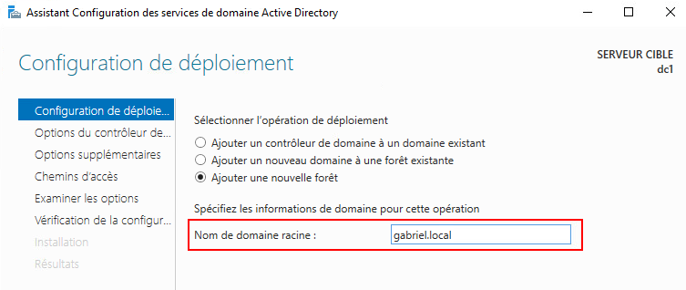

:::danger
Le nom d'un domaine, et c'est encore plus vrai dans le cas du domaine racine, est à peu près **inchangeable.** Vous ne pouvez donc pas vous permettre une erreur ici, sans quoi, vous devrez réinstaller toute la strucuture de l'AD.
:::

#### Options du contrôleur de domaine

##### Les niveaux fonctionnels

Les niveaux fonctionnels (forêt et domaine racine), permettent d'adapter le fonctionnement de votre infrastructure en fonction de possibles autres contrôleurs de domaine que vous pourriez avoir sur votre réseau. Cela permet, par exemple, de faire fonctionner un contrôleur de domaine sous Windows Serveur 2008 avec un contrôleur de domaine sous Windows 2022 sans problème.

Or, nous n'avons aucune infrastructure pour le moment et tout reste à construire. Vous pouvez donc laisser les niveaux fonctionnels ainsi.

##### Les fonctionnalités de contrôleur de domaine

Il vous faudra spécifier les fonctionnalités du contrôleur de domaine que vous voulez mette en place:

**Serveur DNS:**<br/>
Il s'agit d'une fonctionnalité obligatoire pour être en mesure d'utiliser Active Directory. Comme nous ne l'avons pas installé jusqu'à présent, nous n'avons guère le choix que de l'installer dès maintenant avec AD.

**Catalogue global (GC):**<br/>
Le catalogue global contient toutes les définitions d'objets ainsi que leurs attributs respectifs. Il est essentiel au fonctionnement de l'Active Directory. Il doit y avoir au moins un catalogue global dans une forêt. Vous l'aurez donc compris, nous devons laisser cette option cochée puisqu'à l'heure actuelle, nous n'avons aucune infrastructure.

**Contrôleur de domaine en lecture seule (RODC):**<br/>
Ce type de contrôleur de domaine est utilisé dans des cas bien particuliers. Vous aurez l'occasion de le mettre en place dans le cadre du cours Serveurs 3. Pour l'instant, cette fonctionnalité ne nous intéresse pas.

##### Mot de passe DSRM

Le mode de restauration des services d'annuaire est un mode spécial qui permet de restaurer ou de réparer une base de données Active Directory en cas de corruption ou de problème majeur. Définir un mot de passe permet de sécuriser ce mode et d'empêcher une restauration involontaire ou malveillante.

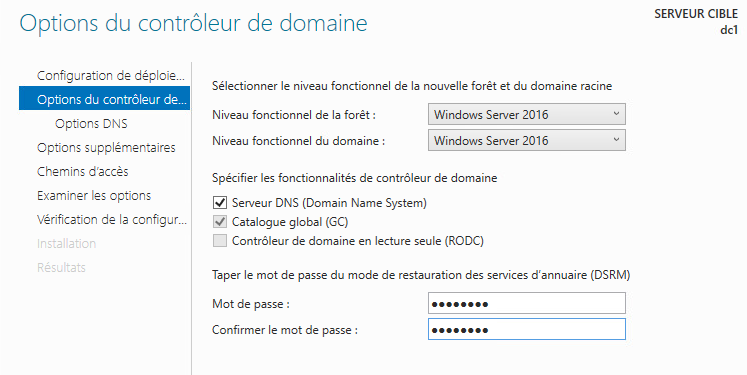

#### Options DNS

Les options DNS permettent de créer une délégation DNS. Ce type de délégation permet de déléguer le contrôle d'un sous-domaine à un serveur DNS précis. Or dans notre cas, nous souhaitons que le contrôleur de domaine soit également DNS. Il est donc inutile de créer une délégation DNS.

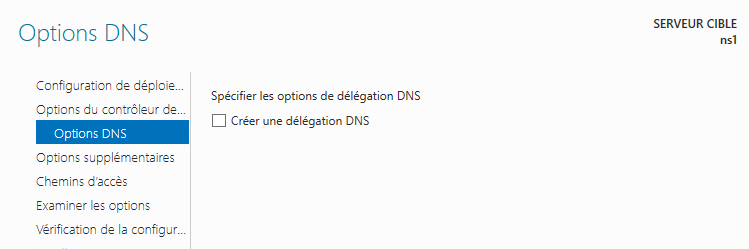

#### Options supplémentaires

Le nom de domaine NETBIOS est configuré pour assurer une rétrocompatibilité avec de vieux systèmes. Il n'est que très peu utilisé. Je vous recommande de laisser la configuration par défaut, qui correspond normalement à votre nom de domaine, en majuscules, sans suffixe.

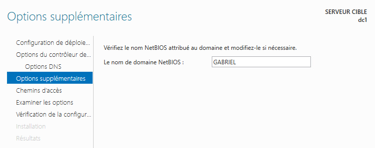

#### Chemin d'accès

Les chemins d'accès de la base de données, des fichiers journaux et du dossier SYSVOL ne devraient jamais être modifiés à moins de configurations ou de circonstances exceptionnelles. Laissez-les donc tels quels pour le moment.

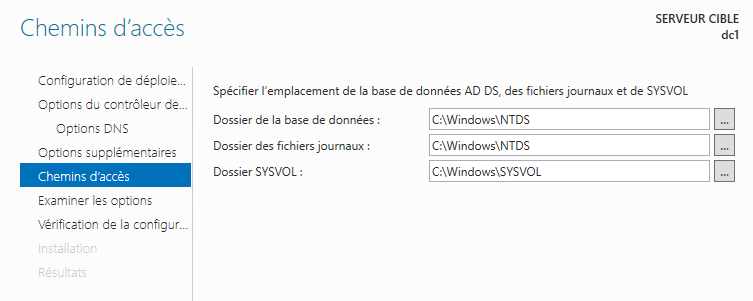

#### Examiner les options & Vérifications

Les deux dernières étapes consistent à repasser vos propres configurations et à procéder à une validation de celles-ci. Lors de la vérification, il n'est pas rare de voir quelques avertissement apparaitre. Les deux avertissements les plus fréquents sont les suivants:

:::caution[1er avertissement]
<br/>
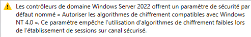

Cet avertissement nous fait savoir que le contrôleur de domaine de Windows Server 2022 prend des mesures pour empêcher l'utilisation de méthodes de chiffrement faibles tout en permettant une compatibilité avec les anciennes versions de Windows. Cela renforce la sécurité tout en préservant l'interopérabilité avec des systèmes plus anciens. C'est une information intéressante plus qu'un réel avertissement.
:::

#### Installation

Voilà, il ne nous reste qu'à cliquer sur « Installer ». Les services ADDS sont assez lourds. L'installation engendrera un redémarrage du serveur et cela peut vous demander de patienter un peu.

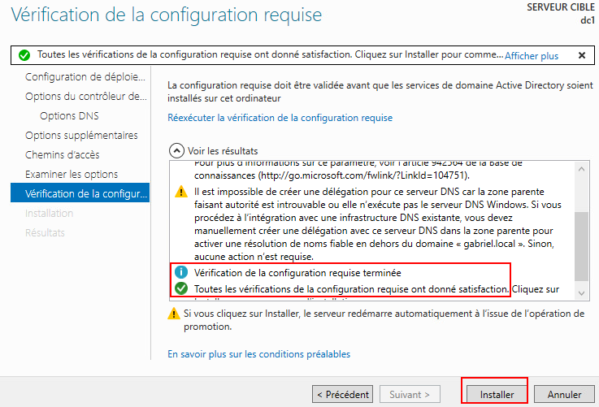

### Première ouverture de session

Lorsque le serveur aura terminé son redémarrage, il sera officiellement devenu un contrôleur de domaine Active Directory. Vous ouvrirez alors votre session non pas en tant qu'administrateur du serveur mais en tant qu'administrateur du domaine. Les administrateurs du domaine ont non seulement des privilèges d'administration sur les contrôleurs du domaine mais également sur tous les postes qui sont reliés au domaine.

Appuyez donc sur les touches <kbd>Ctrl</kbd>+<kbd>Alt</kbd>+<kbd>Del</kbd> pour faire apparaitre l'écran d'ouverture de session et vous identifier:

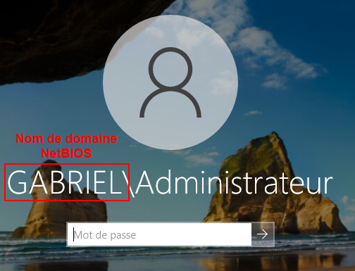

### Modifications des zones DNS

Avant de procéder à la promotion du second serveur en contrôleur de domaine *Active Directory*, nous allons devoir procéder à quelques modifications sur nos zones DNS dans le contrôleur de domaine principal. Ouvrez donc la console DNS de votre serveur **NS1**.

:::caution[Pourquoi ces modifications?]
L'installation et la promotion du serveur en contrôleur de domaine suivent généralement des étapes relativement simples. Ici, nous sommes dans un cas un peu plus particulier puisque nous avons installé des serveurs DNS (labo 11) avant de procéder à l'installation AD. Il est plus simple (et conseillé) d'installer le toute en même temps.
:::

Dans votre console DNS du serveur **<mark>primaire</mark>**, faites un clic à l'aide du bouton de droite sur votre zone de recherche directe, puis cliquez sur `propriétés`.

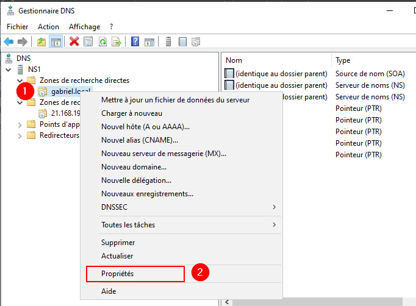

Une fois dans les propriétés de votre zone de recherche directe, cliquez sur `Modifier...`, puis dans le fenêtre qui s'ouvre cochez la case correspondant à l'option *Enregistrer la zone dans Active Directory (disponible uniquement si le serveur DNS est un contrôleur de domaine).* Cliquez sur `Ok`.

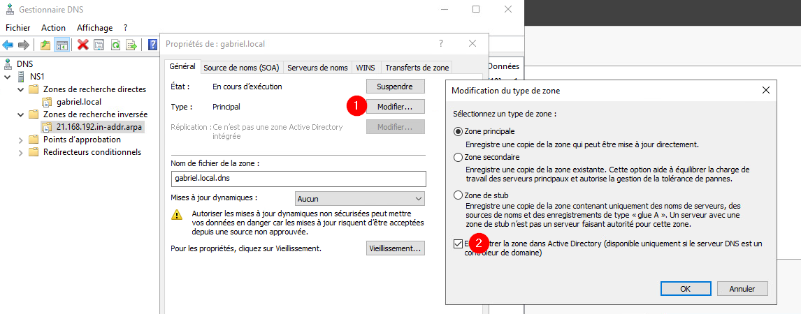

Toujours dans le propriétés de la zone, changez l'otpion des mises à jour dynamiques à : `Sécurisé uniquement`. Cliquez ensuite sur `Appliquer` et `OK`.

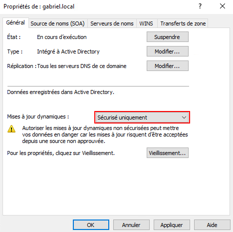

<u>**Répétez ces dernières étapes pour la zone de recherche inverse! Intégrez la zone à *Active Directory* et autorisez les mises à jour sécurisées.**</u>

Une fois vos zones intégrées à *Active Directory*, il nous faut maintenant créer un sous-domaine qui dans lequel *Active Directory* fera ses propres enregistrements. Créez donc une nouvelle de zone de recherche directe (comme vous l'avez fait lors du laboratoire 11) avec les paramètres suivants:

- **Type de zone:** Principale (Enregistrer la zone dans *Active Directory*)
- **Étendue de la zone de réplication:** Vers tous les serveurs DNS exécutés sur des contrôleurs de domaine dans ce domaine: gabriel.local
- **Nom de la zone:** _msdcs.*votredomaine.lan*
- **Mise à niveau dynamique:** N'autoriser que les mises à jour dynamiques sécurisées

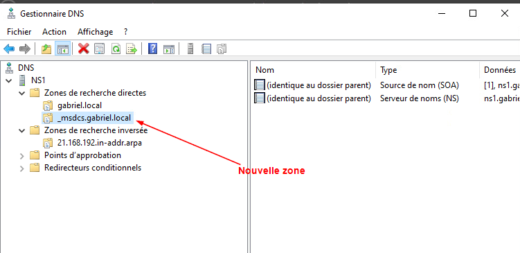

Finalement, pour permettre à *Active Directory* d'aller créer ses premiers enregistrements, nous allons redémarrer un service bien précis à l'aide de la commande PowerShell suivante:

```powershell
Get-Service -Name Netlogon | Restart-Service
```

Une fois cette dernière commande entrée, appuyez sur le bouton *refresh* dans votre console DNS (ou la touche <kbd>f5</kbd> tout simplement) et validez que vous avez bien de nouveaux enregistrements dans la zone _msdcs.*votredomaine.lan*

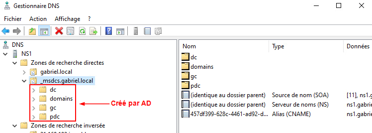

Voilà, vous êtes désormais prêt à promouvoir votre second serveur DNS en contrôleur de domaine. Suivez les instructions ci-dessous 👇

### Installation du rôle ADDS su NS2

Installez le rôle *Active Directory* sur NS2 également. <mark>**Attention toutefois**</mark>, vous n'installez pas une nouvelle forêt cette fois. Vous ajoutez plutôt un contrôleur de domaine à un domaine existant:

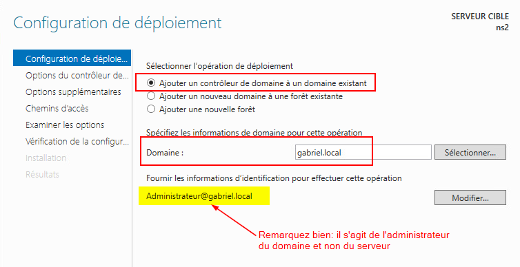

Une fois votre deuxième contrôleur de domaine sera en place, les notions primaires et secondaire des DNS ne seront plus valables car <u>**tous les contrôleurs de domaines sont autorisés à modifier les enregistrements dans les zones intégérées à Active Directory.**</u>

### Création d'objets
Depuis votre contrôleur de domaine NS1 ou NS2 (ça n'a guère d'importance...), ouvrez le menu `Outils` du gestionnaire de serveur et cliquez sur `Utilisateurs et ordinateurs Active Directory`. Vous vous retrouverez dans une console similaire à celle-ci:

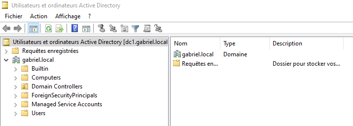

C'est dans cette console que nous créerons nos utilisateurs, nos groupes ainsi que nos unités d'organisation. 

#### Création d'unités d'organisation

Pour créer un nouvel objet dans la structure, il vous suffit d'utiliser le bouton de droite de la souris. Par exemple, pour créer une unité d'organisation nommé « patate » à la racine du domaine, je ferai un clic à l'aide du bouton de droite de la souris sur la racine de mon domaine:

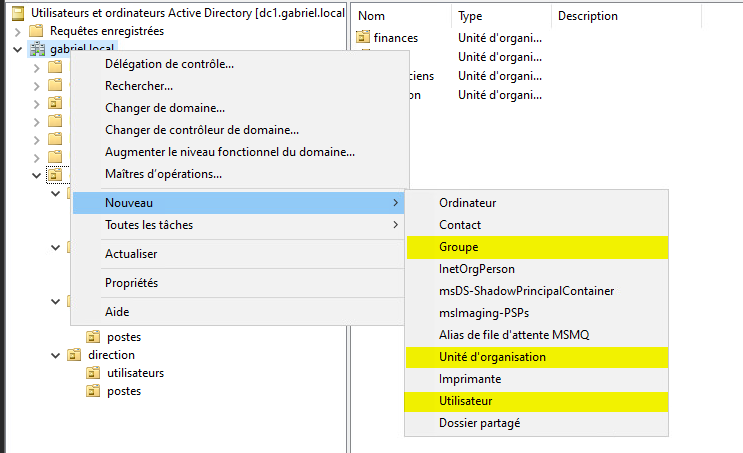

#### Création des utilisateurs

Les utilisateurs sont des objets relativement complexes car ils comportent un lot d'attributs importants. Pour créer un utilisateur, faites un clic à l'aide du bouton de droite de la souris sur l'unité d'organisation où vous désirez créer celui-ci. Sélectionnez « Nouveau », puis « Utilisateur ». Vous vous retrouverez avec une fenêtre comportant plusieurs champs à remplir:

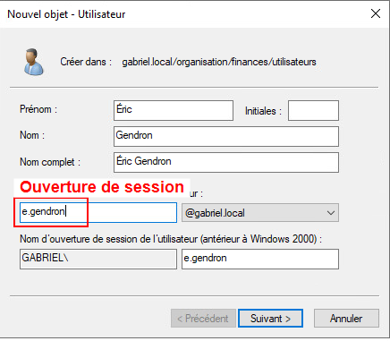

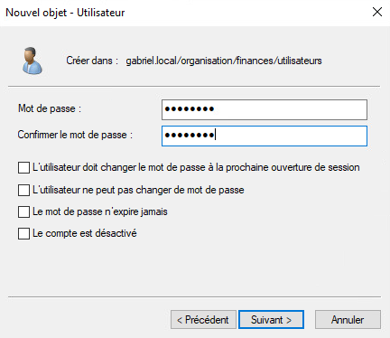

Une fois le mot de passe entré, vous pourrez confirmer la création de l'utilisateur et l'opération sera terminée.

#### Création des groupes

Les groupes sont plutôt rapides à créer­. Lorsque vous créez un nouveau groupe, il ne suffit que de lui octroyer un nom pour procéder à sa création. Cela dit, vous remarquerez également deux éléments à configurer: L'étendue et le type de groupe.
|Élément|Description|
|:------:|-------------------|
| **Étendue** | L'étendue d'un groupe détermine sa portée. L'étendue spécifie où peut être utilisé un groupe. Vous aurez l'occasion d'explorer ces concepts en profondeur dans le cours Serveurs 3. Dans le cadre de ce cours, vous pouvez utiliser des groupes globaux sans problème. |
| **Type** | Le type de groupe spécifie ce que nous avons l'intention de faire avec ce groupe. Le groupe de sécurité permet de donner des permissions ou des privilèges aux utilisateurs membre du groupe tandis que le groupe de type distribution est surtout utilisé dans le cadre d'envoi de messages électroniques à l'aide d'un serveur exchange par exemple. |

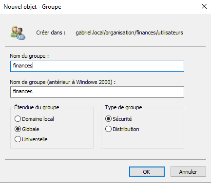

#### Création des ordinateurs

Les ordinateurs diffèrent des autres objets dans Active Directory. <mark>**Vous ne devez pas les créer manuellement.**</mark> Pour intégrer un ordinateur dans la strucutre des objets de l'AD, nous devons joindre ce dernier au domaine. Nous verrons un peu plus loin comment procéder pour effectuer cette action.

- - - 

Maintenant que nous avons vu ensemble comment créer les objets les plus communs dans Active Directory, créez la structure d'unités d'organisation, d'utilisateurs et de groupes suivante:

<div style={{textAlign: 'center'}}>
    <ThemedImage
        alt="Schéma"
        sources={{
            light: useBaseUrl('/img/Serveurs1/AD_Users_W.svg'),
            dark: useBaseUrl('/img/Serveurs1/AD_Users_D.svg'),
        }}
    />
</div>

### Intégration des serveurs et des ordinateurs

Lorsqu'on met en place un domaine *Active Directory*, toutes les machines doivent obligatoirement y être intégrées pour pouvoir bénéficier des services offerts sur le domaine.

#### Intégration du serveur DHCP

Dirigez-vous sur votre serveur DHCP et appuyez simultanément sur les touches <kbd>&#8862; win</kbd>+<kbd>r</kbd>. Dans la fenêtre « Exécuter... », tapez la commande `sysdm.cpl` et appuyez sur la touche <kbd>Entrée</kbd>.

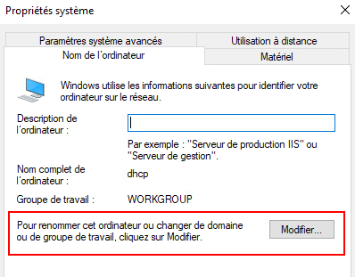

Cliquez sur « Modifier... » afin de pouvoir modifier le nom de domaine du serveur. Dans la fenêtre qui s'ouvrira, cochez l'option domaine et entrez votre nom domaine. Vous devrez vous identifier en tant qu'Administrateur du domaine ( *Administrateur@domaine.local* ).

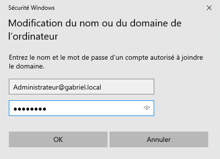

Si vous avez entré correctement vos informations, vous obtiendrez un message de bienvenue comme celui-ci:

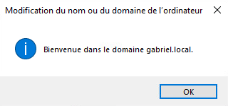

Une fois le serveur DHCP redémarré, vous devriez retrouver un objet ordinateur à son nom dans l'unité d'organisation « Computers » de la console « Utilissateurs et ordinateurs Active Directory » dans NS1 ou NS2 :

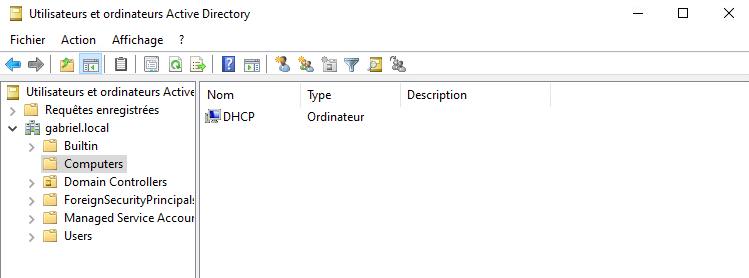

#### Autorisation du service sur le domaine

À l'heure actuel, votre service DHCP n'opère plus 😨. La raison en est fort simple: nous ne l'avons explicitement autorisé à opérer ce service sur notre domaine *Active Directory*.

Pour remettre le service opérationnel, il faudra utiliser le compte **Administrateur du domaine** et autoriser le serveur DHCP à opérer. Ouvrez donc votre session avec cet utilisateur sur le serveur dhcp.

Une fois votre session ouverte, dirigez-vous dans la console DHCP:

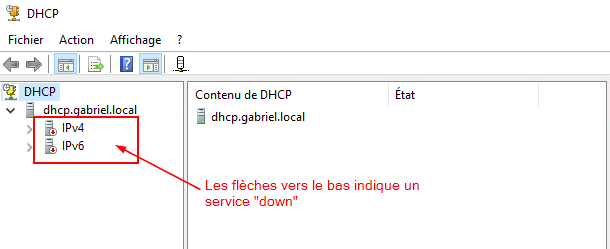

Faites un clic à l'aide du bouton de droite au haut de la console sur le petit icône DHCP et sélectionnez « Gérer les serveurs autorisés... »

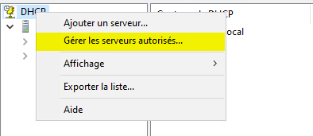

Dans la petite fenêtre qui s'ouvrira, cliquez sur « Autoriser...» et ajoutez le nom de domaine de votre serveur DHCP.

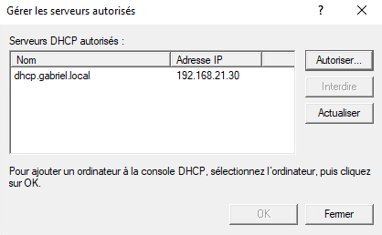

Une fois votre serveur ajouté dans la liste, redémarrez le service DHCP et celui-ci sera à nouveau opérationnel:

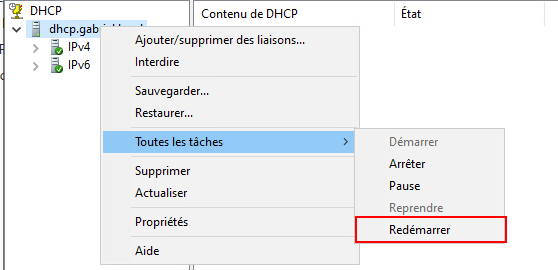

#### Intégration des ordinateurs (clients)

Intégrez vos ordinateurs, pc0001 et pc0002, au domaine comme vous l'avez fait pour intégrer votre serveur DHCP. Une fois qu'ils auront bien été ajoutés au domaine, tentez d'ouvrir une session avec l'un des utilisateurs que vous avez créé un peu plus tôt.

#### Mise à jour dynamique du DNS

Vous vous souvenez comment nous avions terminé le laboratoire 12 ? Nous avions en place deux serveurs DNS ainsi qu'un serveur DHCP. Cela dit, nous étions incapable de mettre en place des mises à jour dynamique des enregistrements DNS. Dans le laboratoire 12, nous avions statué que pc0001 aurait l'adresse 192.168.21.101 et que pc0002 aurait l'adresse 192.168.21.102.

Êtes-vous retourner voir vos enregistrements DNS ? Je crois que vous devriez 😉

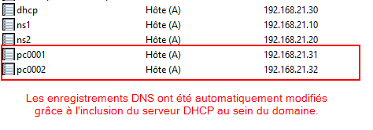

