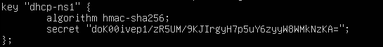
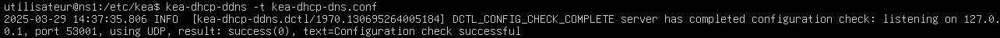
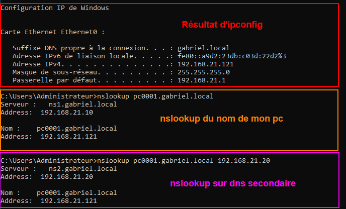

import useBaseUrl from '@docusaurus/useBaseUrl';
import ThemedImage from '@theme/ThemedImage';
import Tabs from '@theme/Tabs';
import TabItem from '@theme/TabItem';

# Laboratoire 15
* * *

## Ajout d'un service DNS dynamique à votre DHCP

## Préalable(s)

- Avoir complété le laboratoire # 14 (nous réutilisons les VM)

## Objectif(s)

- Jumeler un service DNS qui mettra à jour ses enregistrements lorsque le DHCP attribuera de nouvelles adresses..

* * *
## Schéma

<div style={{textAlign: 'center'}}>
    <ThemedImage
        alt="Schéma"
        sources={{
            light: useBaseUrl('/img/Serveurs1/Laboratoire15_W.svg'),
            dark: useBaseUrl('/img/Serveurs1/Laboratoire15_D.svg'),
        }}
    />
</div>

* * *

## Étapes de réalisation

Pour compléter ce laboratoire, vous aurez besoin d'un serveur DNS primaire et d'un serveur DNS secondaire sous Ubuntu. Comme vous avez déjà fait des laboratoires similaires, je ne reformulerai pas toutes les étapes nécessaires ici. Au besoin, consultez de nouveau le [laboratoire #10](../11%20-%2010%20-%20Serveurs%20DNS%20multiples/01-Laboratoire10.md) pour créer vos deux serveurs DNS. Assurez-vous de créer une zone de recherche directe (*prenom.local*) et une zone de recherche inverse.

## Ajustements sur le serveur DNS Primaire

**<span class='red-text'>Rappelez-vous: la modification des enregistrements DNS ne peut se faire que sur un seul serveur!</span>** En l'occurence, le serveur DNS primaire. Il nous faudra apporter quelques modifications à celui-ci pour que la modification des enregistrements puisse se faire de manière entièrement automatique.

### Créez une nouvelle clé

Encore !? Eh oui. On ne veut pas autoriser n'importe quel ordinateur à pouvoir effectuer des changements dans nos zones. Nous allons générer une nouvelle clé qui sera nécessaire pour toute entité qui voudrait modifier les enregistrements. C'est le même genre de clé que nous utilisons pour les transferts de zones. Dirigez-vous dans le dossier `/etc/bind/` et entrez la commande suivante pour générer une nouvelle clé:

:::danger
Vous n'aurez pas le choix d'exécuter cette commande en tant qu'utilisateur **ROOT**.
:::

```bash
tsig-keygen dhcp-ns1 > dhcp-ns1.key
```

Cela générera un fichier avec l'extension `.key` dans lequel vous trouverez un contenu similaire à ceci:



### Déplacement des zones

Normalement nous laissons les fichiers de zones dans le dossier `/etc/bind/zones` en ce qui concerne le serveur primaire. Par défaut, `Bind` n'est pas autorisé à écrire dans ce dossier pour des raisons de sécurité. Dans le cas où le service serait compromis, les zones et les enregistrements ne pourraient être modifiés. Le problème avec cette configuration, c'est que pour avoir un service DDNS, `Bind` devra être en mesure de modifier les enregistrements. Nous allons procéder de la même façon que nous le faisons avec un serveur secondaire, c'est-à-dire que nous allons déplacer les fichiers de zone dans `/var/lib/bind`.

Déplacez donc le dossier `/etc/bind/zones` dans `/var/lib/bind` en utilisant la commande suivante:

```bash
sudo mv /etc/bind/zones /var/lib/bind/zones
```

Retirez la permission « Setuid » au groupe `Bind` sur le dossier:

```bash
sudo chmod g-s /var/lib/bind/zones
```

:::note[Qu'est-ce que le setuid]
Le « setuid » est une permission un peu spécial que nous n'avons pas vu en système d'exploitation. En gros c'est une permission qui permet d'ouvrir un dossier ou un fichier en ayant la permission du propriétaire.
:::

Finalement, changez le propriétaire du dossier pour `Bind`:

```bash
sudo chown bind /var/lib/bind/zones
```

### Mise à jour des configurations DNS

Comme nous venons de déplacer nos fichiers de zone, notre configuration actuelle n'est plus valide, en particulier en ce qui concerne nos déclarations de zone. Ouvrez donc le fichier `/etc/bind/named.conf.local` pour en éditer les lignes suivantes:

```yaml title='/etc/bind/named.conf.local' showLineNumbers
//
// Do any local configuration here
//

// Consider adding the 1918 zones here, if they are not used in your
// organization
// include "/etc/bind/zones.rfc1918"

//highlight-next-line
include "/etc/bind/dhcp-ns1.key";
include "/etc/bind/rndc.key";
server 192.168.21.10 { keys rndc-key; };

zone "gabriel.local" IN {
    type master;
    //highlight-next-line
    file "/var/lib/bind/zones/db.gabriel.local";
    //highlight-next-line
    allow-update { none; }; <----------------------------- Retirez cette ligne
    allow-transfer { key "rndc-key"; };
    notify yes;
    //highlight-start
    update-policy {
        grant dhcp-ns1 wildcard *.gabriel.local A DHCID;
    };
    //highlight-end
};

zone "21.168.192.in-addr.arpa" IN {
    type master;
    //highlight-next-line
    file "/var/lib/bind/zones/db.21.168.192";
    //highlight-next-line
    allow-update { none; }; <------------------------------- Retirez cette ligne
    allow-transfer { key "rndc-key"; };
    notify yes;
    //highlight-start
    update-policy {
        grant dhcp-ns1 wildcard *.21.168.192.in-addr.arpa PTR DHCID;
    };
    //highlight-end
};
```

Plusieurs modifications que je vous ai fait effectuer nécessitent quelques explications.

- **Ligne 9 :**<br/>
    D'abord, nous ajoutons la clé nécessaire pour modifier les enregistrements à notre configuration Bind. C'est la clé que nous avons généré en début de laboratoire.

- **Lignes 15 et 26 :**<br/>
    Comme nous avons déplacé nos zones, il nous faut mettre à jour le chemin vers nos fichiers de zone.

- **Lignes 16 et 27 :**<br/>
    La mention `allow-update { none; };` stipule que la mises à jour des enregistrements est interdite. Évidemment, il nous faut supprimer cette ligne puisque c'est exactement ce que l'on souhaite faire: mettre à jour les enregistrements automatiquement.

- **Lignes 19 et 30 :**<br/>
    À partir de ces lignes, on définit la politique de mise à jour des enregistrements. Voici comment nous pourrions découper cette politique:
     - `grant dhcp-ns1` : On indique qu'on autorise les mises à jour seulement si cette clé est présentée
     - `wildcard *.gabriel­.local` : On indique qu'on autorise de mettre à jour tout ce qui concerne la zone *gabriel.local* et la zone *21.168.192.in-addr.arpa*
     - `A DHCID` : On mentionne que seuls les enregistrements A & DHCID peuvent être mis à jour. Un enregistrement NS, par exemple, ne pourra pas être modifié automatiquement. Il en va de même pour la zone de recherche inverse, nous n'accepterons les modifications automatiques que pour les enregistrements PTR & DHCID.

:::important[L'enregistrement DHCID]
L'enregistrement DHCID est un enregistrement qui indique tout simplement qui est le serveur DHCP sur le réseau.
:::

## Ajustements sur le serveur DHCP

Il nous faut maintenant configurer le serveur DHCP pour que ce-dernier envoie des mises à jour au serveur DNS.

### Installation du module DDNS

L'un des avantages principale du serveur dhcp KEA, c'est qu'il est modulaire. Autrement dit, il est possible d'installer seulement les morceaux dont nous avons besoin, sans nécessairement installer tous les paquets existants. Dans le laboratoire précédent, nous avons installer uniquement le serveur DHCP IPv4 de base. Comme nous voulons désormais informer les serveurs DNS de tout changement quant aux adresses octroyées via DHCP, nous avons besoin d'un module supplémentaire. Installez donc le paquet suivant:

```bash
sudo apt install kea-dhcp-ddns-server -y
```

Une fois ce module de logiciel installé, il nous faudra lui fournir la clé de chiffrement que nous avons créé un peu plus tôt. **<span class='red-text'>Souvenez-vous:</span>** Nous avons indiqué à notre serveur DNS que seul le détendeur de cette clé peut modifier les enregistrements. La clé étant une très longue série de caractères, je vous déconseille fortement de tenter de la copier manuellement. Nous allons procéder sensiblement de la même façon que nous l'avons fait avec la clé nécessaire aux transferts de zone. C'est-à-dire, nous allons transférer celle-ci via le protocole scp.

Depuis votre serveur DNS primaire, où nous avons créé le fichier `/etc/bind/dhcp-ns1.key`, entrez la commande suivante pour envoyer le fichier directement dans votre serveur dhcp. (*Cela implique qu'il y ait un service ssh fonctionnel sur le serveur DHCP*)

```bash
sudo scp /etc/bind/dhcp-ns1.key utilisateur@192.168.21.30:/home/utilisateur/
```
Une fois la clé transférée, il nous faudra renseigner le serveur DHCP quant à son existence à travers un fichier JSON. Utilisez la commande `cat` <u>en tant que root</u> pour transférer le contenu de la clé vers un nouveau fichier que vous nommerez `/etc/kea/tsig-keys.json`:

```bash
cat ­/home/utilisateur/dhcp-ns1.key > /etc/kea/tsig-keys.json
```

Une fois le nouveau fichier créé, vous pouvez vous départir de la clé original:

```bash
sudo rm ­/home/utilisateur/dhcp-ns1.key
```

Éditez maintenant le fichier `/etc/kea/tsig-keys.json` pour qu'il soit comme suit:

```json title='/etc/kea/tsig-keys.json' showLineNumbers
"tsig-keys": [
    {
        "name": "dhcp-ns1",
        "algorithm": "hmac-sha256",
        "secret": "Votre_clé_ici"
    }
],
```
Changez le propriétaire du fichier fraichement modifiée pour l'utilisateur `_kea`:

```bash
sudo chown _kea:root tsig-keys.json
```

### Configuration du DDNS

Par défaut, lorsque nous avons installer le paquet `kea-dhcp-ddns-server`, un fichier de configuration s'est automatiquement créé ( `/etc/kea/kea-dhcp-dns.conf` ). Ce fichier contient énormément d'informations mais il est un peu trop gros. Nous allons donc le renommer et en créer un nouveau.

Renommez le fichier initial:
```bash
sudo mv /etc/kea/kea-dhcp-ddns.conf /etc/kea/kea-dhcp-ddns.conf.bak
```

Créez ensuite un nouveau fichier du même nom avec les configurations suivantes ( **<span class='red-text'>N'écrivez pas de commentaires, ils ne sont pas supportés par les fichiers de type JSON. Cela dit, <u>prenez le temps de les lire!</u></span>**)
```json title='/etc/kea/kea-dhcp-ddns.conf' showLineNumbers
{
"DhcpDdns":
{
    "ip-address": "127.0.0.1",      // Adresse ip et port du serveur ayant la fonction DDNS.
    "port": 53001,                  // Dans ce cas-ci c'est notre serveur DNS primaire,
    "control-socket": {             // donc la machine elle-même.
        "socket-type": "unix",                      //Le socket UNIX permet à différents processus du 
        "socket-name": "/tmp/kea-ddns-ctrl-socket"  //système d’interagir avec le service Kea. Quant
    },                                              //au fichier, c’est un fichier spécial qui agit comme
                                                    //une interface pour les processus qui veulent se
                                                    //connecter au service sans avoir besoin d'un port
                                                    // réseau.
    
    <?include "/etc/kea/tsig-keys.json"?>   //On inclut notre clé de chiffrement

    "forward-ddns": {   // Ici on définit les zones de recherche directe que l'on souhaite mettre à jour
        "ddns-domains": [
            {
                "name": "gabriel.local.",
                "key-name": "dhcp-ns1",
                "dns-servers": [
                    { "ip-address": "192.168.21.10"},
                    { "ip-address": "192.168.21.20"}
                ]
            }
        ]
    },

    "reverse-ddns": {   // Ici on définit les zones de recherche inversées que l'on souhaite mettre à jour
        "ddns-domains": [
            {
                "name": "21.168.192.in-addr.arpa.",
                "key-name": "dhcp-ns1",
                "dns-servers": [
                    { "ip-address": "192.168.21.10"},
                    { "ip-address": "192.168.21.20"}
                ]
            }
        ]
    },

    "loggers": [  // Sans entrer dans les détails, cette section active la journalisation
        {
            "name": "kea-dhcp-ddns",
            "output_options": [
                {
                    "output": "stdout",
                    "pattern": "%-5p %m\n"
                }
            ],
            "severity": "INFO",
            "debuglevel": 0
        }
    ]
}
}
```

Nous allons changer le propriétaire de ce fichier également:

```bash
sudo chown _kea:root kea-dhcp-ddns.conf
```

Vérifiez également la syntaxe de votre configuration pour vous assurer que vous n'avez pas fait d'erreur(s):

<div className="tabsborder">
    <Tabs>
        <TabItem value="ValidationDDNS" label="Commande" default>
            ```bash
            kea-dhcp-ddns -t /etc/kea/kea-dhcp-ddns.conf
            ```
        </TabItem>
        <TabItem value="ResultatValidationDDNS" label="Résultat">
           
        </TabItem>
    </Tabs>
</div><br/>

Si votre configuration est valide, redémarrez le service kea-dhcp-ddns-server et vérifiez-en le statut:

```bash
sudo systemctl restart kea-dhcp-ddns-server && sudo systemctl status kea-dhcp-ddns-server
```

Il nous faut désormais modifier le fichier de configuration du serveur DHCP (le fichier contenant notre plage, nos options, etc...). Comme KEA dhcp est modulaire, il faut configurer les fichiers pour faire travailler les modules ensemble.

Éditez le fichier `/etc/kea/kea-dhcp4.conf` pour y ajouter les lignes ci-dessous:

```json title='/etc/kea/kea-dhcp4.conf' showLineNumbers
{
 "Dhcp4": {

    "interfaces-config": {
        "interfaces": [ "ens192" ]
    },

    "valid-lifetime": 259200,
    "renew-timer": 129600,
    "rebind-timer": 220320,
    "authoritative": true,

    //highlight-start
    "dhcp-ddns": {
        "enable-updates": true
    },

    "ddns-qualifying-suffix": "gabriel.local",
    "ddns-override-client-update": true,
    //highlight-end

    "lease-database": {
        "type": "memfile",
        "persist": true,
        "name": "/var/lib/kea/kea-leases4.csv",
        "lfc-interval": 3600
    },
            "subnet4": [
            {
                "subnet": "192.168.21.0/24",
                "pools": [ { "pool": "192.168.21.100 - 192.168.21.200" } ],
                "option-data": [
                    {
                        "name": "routeurs",
                        "data": "192.168.21.1"
                    },
                    {
                        "name": "domain-name-servers",
                        "data": "192.168.21.1"
                    },
                    {
                        "name": "domain-search",
                        "data": "gabriel.local"
                    }
                ]
            }
        ]
    }
}
```

Une fois les modifications effectuées, redémarrez le service kea-dhcp4:

```bash
sudo systemctl restart kea-dhcp4-server
```

## Tests et vérifications

À partir de maintenant, peu importe le nombre de clients que vous ajouterez sur votre réseau, son ip lui sera automatiquement attribué et un enregistrement DNS correspondra à son nom d'hôte.

:::caution
Si vous n'avez pas pris l'habitude changer les noms de vos PC, vous serez rattrapé ici. Comme les services DNS et DHCP sont entièrement automatisés dans ce laboratoire, ce n'est plus vous qui déterminez le nom d'un PC dans une zone. Le seul contrôle qu'il vous reste quant aux noms des PC, c'est de bien les nommer.
:::

Dans l'image ci-dessous, j'ai démarré un PC sous Windows que je me suis contenté de renommer **pc0001**. Une fois le pc redémarré, voici les résultats que j'obtiens à la ligne de commande:

