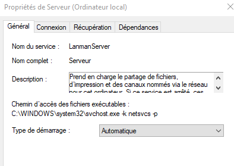
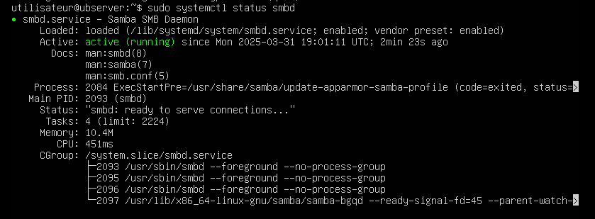
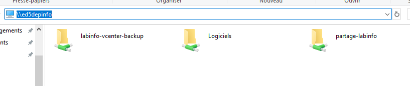
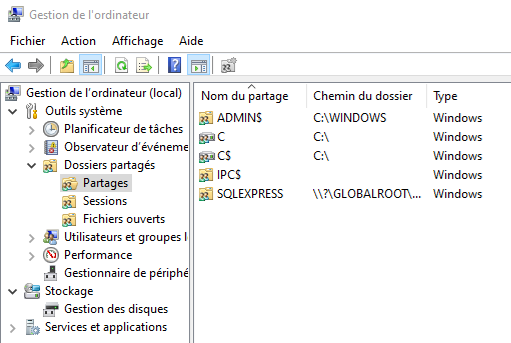

import useBaseUrl from '@docusaurus/useBaseUrl';
import ThemedImage from '@theme/ThemedImage';
import Tabs from '@theme/Tabs';
import TabItem from '@theme/TabItem';

# Cours 16

## Qu'est-ce que le serveur de fichiers ?  📂

Un serveur de fichiers est un dispositif ou un programme qui permet de stocker, organiser et partager des fichiers numériques sur un réseau. Il centralise les données afin que les utilisateurs ou d'autres machines puissent les consulter, les modifier ou même ajouter d'autres fichiers depuis n'importe quel appareil connecté.

## Comment ça fonctionne ?

- **Stockage centralisé** : Plutôt que de stocker des fichiers sur chaque ordinateur de manière locale, les fichiers sont centralisés sur un serveur. Cela facilite la gestion et la sauvegarde des données. 💾

- **Accès réseau** : Les utilisateurs accèdent aux fichiers via le réseau local. Ce qui implique forcémment que le réseau local doit être fonctionnel pour que l'accès aux fichiers soit garanti.

## Les différents protocoles de partage

Comme les serveurs de fichiers utilisent leur connexion réseau pour offrir un accès aux fichiers, différents protocoles peuvent être utilisés dans le cadre de leur fonction.

### FTP - *File Transfer Protocol*

Le protocole FTP a été créé en 1971 au *Massachussets Institute of Technology*. Sa dernière révision date de 1985. Son principal objectif était tout simplement de permettre le transfert de fichiers d'un ordinateur à un autre. Avec le temps, le protocole FTP a souvent été jumelé à des serveurs Web pour permettre la modification des fichiers du site web à distance.

#### Fonctionnement

Le protocole FTP utilise deux ports, soit les ports 20 & 21. Le port 21 est utiliser pour l'échange de commandes ou d'instructions entre les deux partis. Le port 20, quant à lui, est utilisé pour le transfert des données.

Le serveur FTP est offert en deux formats:

- Le serveur FTP en mode Actif
- Le serveur FTP en mode Passif

:::caution
Peu importe le mode utilisé, seul le flux de données en sera affecté. Il n'y aura aucune différence au niveau du canal des commandes (Port 21).
:::

#### Mode actif

- **Étape 1:** Le client se branche au port 21 du serveur à partir d'un port aléatoire et communique le port qu'il utilisera pour l'échange des données.

- **Étape 2:** Le serveur transmet alors un accusé de réception au port de commande du client.

- **Étape 3:** Le serveur FTP initie la connexion entre son canal de données et le port indiqué par le client. 

- **Étape 4:** : Le client envoie un accusé de réception

:::important
En mode actif, <u>c'est le serveur FTP qui initie l'échange de données</u>
:::

    <ThemedImage
        alt="Schéma"
        sources={{
            light: useBaseUrl('/img/Serveurs1/FtpActif_W.gif'),
            dark: useBaseUrl('/img/Serveurs1/FtpActif_D.gif'),
        }}
    />

#### Mode passif

- **Étape 1:** Le client se branche au port 21 du serveur à partir d'un port aléatoire et demande au serveur d'ouvrir un port de communication pour l'échange de données.

- **Étape 2:** Le serveur communique un accusé de réception au port de commande du client et lui transmet le numéro de port qu'il a ouvert pour l'échange de données.

- **Étape 3:** Le client établit une connexion entre son port de données et le port de données du serveur.

- **Étape 4:** Le serveur envoie un accusé de réception au client et l'échange démarre.

:::important
En mode actif, <u>c'est le client qui initie l'échange de données</u>
:::

    <ThemedImage
        alt="Schéma"
        sources={{
            light: useBaseUrl('/img/Serveurs1/FtpPassif_W.gif'),
            dark: useBaseUrl('/img/Serveurs1/FtpPassif_D.gif'),
        }}
    />

#### Quel mode privilégier ?

On aura tendance à privilégier le mode passif puisque la plupart des clients se trouvent derrière un NAT (souvent un routeur). Sans entrer dans le menu détail de ce qu'un NAT engendre comme modifications, ce-dernier nécessite souvent des configurations supplémentaires.

#### Sécurité du protocole FTP

Le protocole FTP original est aujourd'hui considéré comme non sécuritaire pour deux raisons majeures:

👉 Les données transmises sont non chiffrées. Cela rend le protocole vulnérable aux interceptions et peut compromettre les confidentialité des informations. 

👉 L'authentification est également effectuée en texte claire.

Avec le temps, un protocole FTP amélioré a vu le jour, le FTPS. Un second protocole un peu plus différent, le SFTP, peut également faire office de meilleure solution.

| **Caractéristiques**    | **FTP**                            | **SFTP**                           | **FTPS**                            |
|-------------------------|-----------------------------------|------------------------------------|-------------------------------------|
| **Sécurité**           | *Aucune* ❌                      | Très sécuritaire ✅               | Sécurisé si bien configuré ⚠️    |
| **Chiffrement**        | Aucun ❌                         | Chiffrement SSH ✅                | SSL/TLS ✅                        |
| **Ports par défaut**   | 20 (Données) / 21 (Commandes)     | 22                                 | 990 (Commandes) / 989 (Données)    |
| **Authentification**   | Utilisateur / Mot de passe       | Clés publiques / privées, Mot de passe | Certificats, utilisateur / mot de passe |
| **Mode(s)**           | Actif / Passif                    | Passif seulement                   | Actif / Passif                     |
| **Intégrer avec SSH**  | Non ❌                           | Oui ✅                            | Non ❌                            |
| **Compatibilité**      | Très répandue                     | Nécessite un serveur spécifique   | Nécessite un serveur spécifique    |
| **Firewall Friendly**  | Mode actif peut poser problème    | Plus convivial (Connexion unique) | Mode actif peut poser problème     |

### SMB - *Server Message Block*

Le protocole *SMB* est un autre protocole de partage de fichiers très populaire. Il permet non seulement le partage de fichiers, mais il supporte également le partage d'imprimantes et d'autres ressources. Autre avantage intéressant, il est supporté autant sous Windows que sous Linux.

#### Notions de vocabulaire

Détrompez-vous, nous ne sommes pas dans un cour de français 😂. Néanmoins, lorsque vient le temps d'aborder le protocole *SMB*, on entend toute sorte de chose dans le jargon de l'informatique. Pour être certain de bien se comprendre entre nous, il importe d'apporter quelques clarifications:

-  SMB est le protocole original (*server message block*). Comme mentionné précédemment, c'est un protocole pouvant être implémenté sur différents systèmes d'exploitation pour partager des fichiers, des imprimantes et des ressources.

- CIFS (*Common Internet File System*) se voulait une extension du protocole SMB historiquement. Ce protocole était une amélioration de SMB. Or, avec le temps, les gens se sont mis à confondre les deux. Aujourd'hui, les deux termes sont très synonymes.

- Samba, quant à lui, est une implémentation libre et open source du protocole SMB/CIFS. En d'autres mots, c'est un ensemble logiciel permettant l'interopérabilité du protocole SMB avec les ordinateurs sous Microsoft. Samba permet beaucoup plus que le simple partage de fichiers. Il peut agir à titre de contrôleur de domaine Active Directory.

#### Versions et rétrocompatibilité SMB

La négociation du protocole se fait automatiquement entre les machines:

|                | **Windows XP** | **Windows 7** | **Windows 10** | **Windows 11** | **Ubuntu 16.04** | **Ubuntu 18.04** | **Ubuntu 20.04** | **Ubuntu 22.04** |
|--------------|--------------|--------------|---------------|---------------|----------------|----------------|----------------|----------------|
| **Windows XP**   | SMB 1.0 | SMB 1.0 | SMB 1.0 (si activé) | ❌ (SMB1 désactivé) | SMB 1.0 | SMB 1.0 | SMB 1.0 | SMB 1.0 |
| **Windows 7**    | SMB 1.0 | SMB 2.1 | SMB 2.1 | SMB 2.1 | SMB 1.0 | SMB 2.1 | SMB 2.1 | SMB 2.1 |
| **Windows 10**   | SMB 1.0 (si activé) | SMB 2.1 | SMB 3.1.1 | SMB 3.1.1 | SMB 1.0 (si activé) | SMB 2.1 | SMB 3.0 | SMB 3.0 |
| **Windows 11**   | ❌ (SMB1 désactivé) | SMB 2.1 | SMB 3.1.1 | SMB 3.1.1 | ❌ (SMB1 désactivé) | SMB 2.1 | SMB 3.0 | SMB 3.0 |
| **Ubuntu 16.04** | SMB 1.0 | SMB 1.0 | SMB 1.0 (si activé) | ❌ (SMB1 désactivé) | SMB 1.0 | SMB 1.0 | SMB 1.0 | SMB 1.0 |
| **Ubuntu 18.04** | SMB 1.0 | SMB 2.1 | SMB 2.1 | SMB 2.1 | SMB 1.0 | SMB 2.1 | SMB 2.1 | SMB 2.1 |
| **Ubuntu 20.04** | SMB 1.0 | SMB 2.1 | SMB 3.0 | SMB 3.0 | SMB 1.0 | SMB 2.1 | SMB 3.0 | SMB 3.0 |
| **Ubuntu 22.04** | SMB 1.0 | SMB 2.1 | SMB 3.0 | SMB 3.0 | SMB 1.0 | SMB 2.1 | SMB 3.0 | SMB 3.0 |

#### SMB v1 (Eternal Blue)

La version 1 du protocole SMB a été au coeur de l'exploitation d'une faille de sécurité majeure chez Microsoft. L'exploitation de cette faille a été baptisé « Eternal Blue ». Son numéro de vulnérabilité officiel est le [CVE-2017-0144](https://en.wikipedia.org/wiki/EternalBlue)

Depuis que cette faille de sécurité a été découverte, celle-ci a été « patché » à travers les différentes mises à jour de Windows. Cela dit, Microsoft ne s'est pas arrêté là et l'entreprise a désactivé la version 1 du protocole SMB par défaut dans toutes les versions Windows depuis Windows 10 (1709) et Windows Serveur (1709).

#### Service de partage SMB

Le service du serveur de fichiers de Windows se nomme **Lanmanserver** (Ou serveur, tel qu'affiché dans le gestionnaire de services).

Sous Linux, le protocole SMB faisant parti intégrante de Samba, vous devrez redémarrez les services associé à Samba, soit SMBD et NMBD.

#### Chemins UNC (*Universal Naming Convention*)

Sous Windows, on utilisera un chemin UNC pour accéder à un partage SMB :

    <ThemedImage
        alt="Schéma"
        sources={{
            light: useBaseUrl('/img/Serveurs1/UNC_W.svg'),
            dark: useBaseUrl('/img/Serveurs1/UNC_D.svg'),
        }}
    />

:::caution[Nom de partage]
Faites bien attention de distinguer le nom d'un dossier et le nom du partage de celui-ci. Je peux très bien posséder un dossier tel que `C:\Users\Administrateur\Patate` et le partager sous le nom `\\SERVEUR\travaux`. Le nom d'un item n'a pas forcémment de lien avec le nom de son partage.
:::

#### Dans l'explorateur Windows

En inscrivant seulement le nom du serveur au format UNC dans l'explorateur Windows, vous serez en mesure de consulter les partages disponibles. Notez cependant que les noms de partage se terminant par le caractère « $ » sont invisibles. Vous n'aurez d'autre choix que de connaître leur nom pour accéder à leur contenu.

#### Console de partages sous Windows

Sous Windows, vous aurez accès à la console des partages. Celle-ci est disponible dans la console de gestion de l'ordinateur ou entrant la commande `fsmgmt.msc` directement dans l'invite de commande. Cette console vous permettra d'administrer vos partages, d'en changer les permissions, de les supprimer ou même d'en créer de nouveau.

Dans l'image ci-dessus, vous pouvez voir certains partages créés par Windows lui-même. Ce sont des **partages administratifs**. Ces partages permettent d'accéder au système à travers le réseau, à condition d'y être autorisé. Voici les partages administratifs que vous repérerez régulièrement ainsi qu'une brève description:

| Partage      | Description |
|-------------|------------|
| `C$`, `D$`, etc. | Partages cachés des lecteurs locaux, accessibles uniquement aux administrateurs. |
| `ADMIN$`    | Utilisé pour la gestion à distance de l'ordinateur via des outils comme la console MMC ou PowerShell. Il pointe vers le dossier `C:\Windows`. |
| `IPC$`      | Permet la communication entre processus pour la gestion des connexions réseau et l'administration à distance. |
| `PRINT$`    | Utilisé pour partager des fichiers liés aux pilotes d'imprimantes sur le réseau. |

#### Permissions

Pour accéder à un dossier partagé à distance, un utilisateur devra y être autorisé dans deux types de permissions distinctes:

1. Les permissions du partage.
2. Les permissions du système de fichier.

Prenons l'exemple de Bob:

**Exemple 1: Bob tente d'accéder à un dossier à distance sans droit de partage ni permissions locales:**

    <ThemedImage
        alt="Schéma"
        sources={{
            light: useBaseUrl('/img/Serveurs1/AucunDroitDistant_W.gif'),
            dark: useBaseUrl('/img/Serveurs1/AucunDroitDistant_D.gif'),
        }}
    />

* * *
 

**Exemple 2: Bob tente d'accéder à un dossier localement sans droit de partage ni permissions locales:**
 

    <ThemedImage
        alt="Schéma"
        sources={{
            light: useBaseUrl('/img/Serveurs1/AucunDroitLocal_W.gif'),
            dark: useBaseUrl('/img/Serveurs1/AucunDroitLocal_D.gif'),
        }}
    />

* * *
 

**Exemple 3: Bob tente d'accéder à un dossier à distance sans droit de partage mais avec des permissions locales:**
 

    <ThemedImage
        alt="Schéma"
        sources={{
            light: useBaseUrl('/img/Serveurs1/DroitLocalDistant_W.gif'),
            dark: useBaseUrl('/img/Serveurs1/DroitLocalDistant_D.gif'),
        }}
    />

* * *
 

**Exemple 4: Bob tente d'accéder à un dossier à localement sans droit de partage mais avec des permissions locales:**
 

    <ThemedImage
        alt="Schéma"
        sources={{
            light: useBaseUrl('/img/Serveurs1/DroitLocalLocal_W.gif'),
            dark: useBaseUrl('/img/Serveurs1/DroitLocalLocal_D.gif'),
        }}
    />

* * *
 

**Exemple 5: Bob tente d'accéder à un dossier à distance avec des droits de partage mais sans permissions locales:**
 

    <ThemedImage
        alt="Schéma"
        sources={{
            light: useBaseUrl('/img/Serveurs1/DroitDistantDistant_W.gif'),
            dark: useBaseUrl('/img/Serveurs1/DroitDistantDistant_D.gif'),
        }}
    />

* * *
 

**Exemple 6: Bob tente d'accéder à un dossier localement avec des droits de partage mais sans permissions locales:**
 

    <ThemedImage
        alt="Schéma"
        sources={{
            light: useBaseUrl('/img/Serveurs1/DroitDistantLocal_W.gif'),
            dark: useBaseUrl('/img/Serveurs1/DroitDistantLocal_D.gif'),
        }}
    />

* * *
 

**Exemple 7: Bob tente d'accéder à un dossier à distance avec des droits de partage et des permissions locales:**
 

    <ThemedImage
        alt="Schéma"
        sources={{
            light: useBaseUrl('/img/Serveurs1/AccesDistantDistant_W.gif'),
            dark: useBaseUrl('/img/Serveurs1/AccesDistantDistant_D.gif'),
        }}
    />

* * *
 

**Exemple 8: Bob tente d'accéder à un dossier localement avec des droits de partage et des permissions locales:**
 

    <ThemedImage
        alt="Schéma"
        sources={{
            light: useBaseUrl('/img/Serveurs1/AccesLocalLocal_W.gif'),
            dark: useBaseUrl('/img/Serveurs1/AccesLocalLocal_D.gif'),
        }}
    />

### Conclusion

La seule façon d'accéder à un partage à distance est de posséder des permissions locales **ET** de posséder des permissions sur le partage. Si l'un ou l'autre des éléments est manquant, l'item ne sera pas accessible à distance.