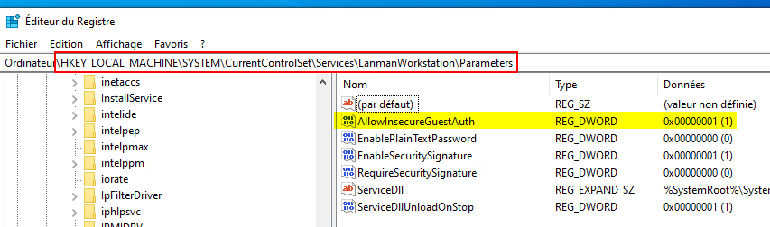
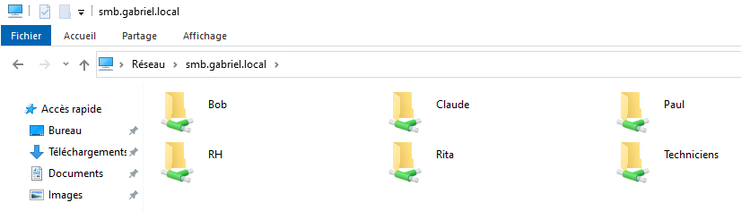
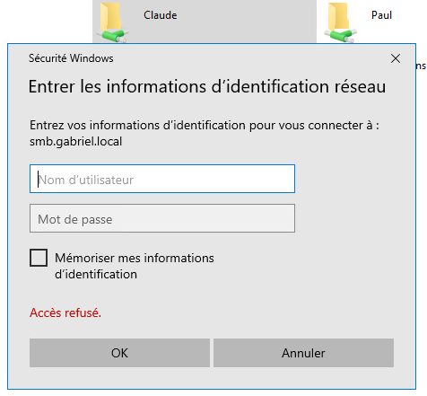
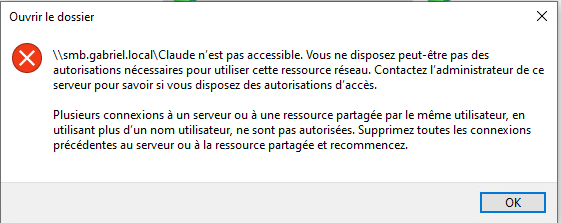

import useBaseUrl from '@docusaurus/useBaseUrl';
import ThemedImage from '@theme/ThemedImage';
import Tabs from '@theme/Tabs';
import TabItem from '@theme/TabItem';

# Laboratoire 16
* * *

## Ajout d'un serveur de fichiers (linux) à votre infrastructure

## Préalable(s)

- Avoir complété le laboratoire # 15 (nous réutilisons les VM)

## Objectif(s)

- Ajouter un serveur de fichier linux afin de centraliser les données

* * *
## Schéma

<div style={{textAlign: 'center'}}>
    <ThemedImage
        alt="Schéma"
        sources={{
            light: useBaseUrl('/img/Serveurs1/Laboratoire16_W.svg'),
            dark: useBaseUrl('/img/Serveurs1/Laboratoire16_D.svg'),
        }}
    />
</div>

* * *

## Étapes de réalisation

Pour ce laboratoire, je prendrai pour acquis que vous avez importé votre nouveau serveur Linux, que vous lui avez octroyé un nom pertinent et que vous avez bien configuré son adresse IP statique.

:::tip
C'est une bonne pratique de créer des enregistrements DNS pour toutes les machines, incluant les serveurs, sur le réseau. Pour créer un enregistrement DNS pour votre serveur de fichiers, votre adresse statique doit être fournie par le serveur DHCP. Autrement dit, vous devez créer une réservation dans votre serveur DHCP. [Voici comment procéder.](https://kea.readthedocs.io/en/kea-2.2.0/arm/dhcp4-srv.html#host-reservations-in-dhcpv4).
:::

## Création d'utilisateurs et de dossiers

Avant de partager des dossiers à la volée, il nous faut d'abord deux éléments:

1. Des utilisateurs et des groupes à qui donner des accès
2. Des dossiers sur lesquels nous gérerons les permissions de partage.

### Utilisateurs & groupes

Créer donc les utilisateurs et les groupes suivants sur votre serveur de fichiers (*Rappel: Commandes `adduser` ,`addgroup` & `usermod`*) :

|Utilisateur|Membre de|
|-----------|---------|
|Bob|Techniciens|
|Paul|Techniciens|
|Rita|RH|
|Claude|Direction|

### Création des dossiers

Créer les dossiers suivants:

|Nom du dossier|Emplacement|Propriétaire|Groupe-Propriétaire|
|---------|--------|----------|----------|
|Bob|/Labo16/Utilisateurs|Bob|Direction|
|Paul|/Labo16/Utilisateurs|Paul|Direction|
|Techniciens|/Labo16/Groupes|Claude|Techniciens|
|Rita|/Labo16/Utilisateurs|Rita|Direction|
|RH|/Labo16/Groupes|Claude|RH|
|Claude|/Labo16/Utilisateurs|Claude|Root|

:::caution[Permissions locales]
Attention de bien régler les permissions locales sur vos dosssiers:

**Dossier des utilisateurs :** Tous les droits à l'utilisateur concerné et Claude. Rien aux autres.<br/>
**Dossier des groupes :** Tous les droits à Claude, lecture & exécution au groupe concerné. Rien aux autres.
:::

## Installation de Samba

Samba est une suite de logiciels qui comprend plusieurs éléments, dont le protocole *SMB* permettant le partage de fichiers et de dossiers avec Windows. Vous avez eu l'occasion d'expérimenter Samba dans le cours de système d'exploitation 1. Or, nous irons un peu plus loin dans le cadre de ce cours. Commencez donc par installer Samba:

```bash
sudo apt install samba -y
```
### Configurations du service

Le fichier de configuration par défaut de Samba est énorme! Néanmoins, il nous faut y apporter quelques modifications. Ouvrez le fichier modifiez **les lignes 39 et 46** comme suit:

```yaml title='/etc/samba/smb.conf'
#### Networking ####

# The specific set of interfaces / networks to bind to
# This can be either the interface name or an IP address/netmask;
# interface names are normally preferred
#highlight-next-line
   interfaces = ens192


# Only bind to the named interfaces and/or networks; you must use the
# 'interfaces' option above to use this.
# It is recommended that you enable this feature if your Samba machine is
# not protected by a firewall or is a firewall itself.  However, this
# option cannot handle dynamic or non-broadcast interfaces correctly.
#highlight-next-line
   bind interfaces only = yes
```

### Configuration des partages

Dirigez-vous à la toute fin du fichier `/etc/samba/smb.conf`. Vous devrez ajouter un paragraphe comme celui qui vous est présenté ci-dessous <u>**pour chacun des dossiers que vous avez créé:**</u>

```yaml title='/etc/samba/smb.conf'
[Bob]
    comment = Partage du dossier de Bob # Un descriptif du partage
    path = /Labo16/Utilisateurs/Bob     # L'emplacement du dossier à partager
    browseable = yes                    # Autoriser la navigation dans le dossier
    guest ok = no                       # Autoriser les connexions anonymes ?
    valid users = bob,@direction        # Utilisateurs autorisés (droits de partage). Les groupes débutent avec @
    read only = no                      # En lecture seule ?
    writable = yes                      # Peut-on écrire ?
    create mask = 0750                  # Permissions des nouveaux fichiers créés
    force create mask = 0750            # Ignore les permissions Windows et utilise le masque (fichier)
    security mask = 0750                # Permissions des nouveaux répertoires créés
    force security mode = 0750          # Ignore les permissions Windows et utilise le masque (répertoire)
```

:::tip
Vim est très utile pour copier et coller du texte 😉
:::


Une fois que vous aurez terminé la modification du fichier de configuration, n'oubliez pas de redémarrer les deux services en lien avec Samba, sois `smbd` et `nmbd`.


### Authentification samba

Le système Ubuntu et Samba n'utilisent pas la même base de données pour identifier les utilisateurs. Il faudra donc prendre la peine de définir les mots de passe Samba de nos utilisateurs Bob, Paul, Rita et Claude. Pour ce faire, entrez la commande suivante pour chaque utilisateur et définissez le mot de passe:

```bash
sudo smbpasswd -a bob
```

## Accéder aux partages que vous avez créé

Si vous tentez de vous connecter au serveur Samba depuis le poste de travail Windows, cela ne fonctionnera pas, pour l'instant. Lorsqu'on essaie de se connecter à un partage SMB sous Linux, Windows attend normalement que l'authentification soit effectuée avec des informations valides. Or, nos utilisateurs n'existent pas sous Windows, car nous ne les avons créés que dans Ubuntu Serveur.

Nous allons donc utiliser un mode un peu moins sécuritaire, mais suffisant pour notre laboratoire: le mode invité. Pour utiliser cette fonctionnalité, il vous faudra modifier le registre de votre client sous Windows. Ouvrez donc le registre de Windows à l'aide de la commande `regedit` puis dirigez vous dans:

`HKEY_LOCAL_MACHINE\SYSTEM\CurrentControlSet\Services\LanmanWorkstation\Parameters`

À cet endroit, créez la valeur DWORD-32 `AllowInsecureGuestAuth` et double-cliquez sur celle-ci pour définir la valeur à 1.



Une fois cette modification apportée, ouvrez l'explorateur Windows et entrez le nom de votre serveur Samba (ou son adresse IP, cela dépend de si vous avez créé l'enregistrement DNS au début de ce laboratoire 😉) sous forme de chemin UNC. Vos répertoires partagés devraient apparaitre tel que présenté ci-dessous:



### Validez les permissions

Essayez d'ouvrir le dossier d'un utilisateur parmi ceux que vous avez créé. Normalement, vous devriez avoir à vous identifier à l'aide du compte d'utilisateur Linux correspondant:



Assurez-vous que les utilisateurs ont bel et bien accès à leur dossier personnel ainsi qu'à leur dossier de groupe. De plus, l'utilisateur Claude devrait avoir accès à tous les partages.

### Erreurs Windows possible ⚠️

Entre différents essaies d'accès aux dossiers partagés, il se peut que vous apperceviez ce message, et ce même si vous vous êtes bien identifiés:



Il arrive que Windows stocke les identifiants que vous avez entré dans sa mémoire cache. Lorsque cela se produit, il faut vider cette mémoire cache. Redémarrer le service `LanmanWorkstation` pour y arriver:

```Powershell
Restart-Service LanmanWorkstation
```