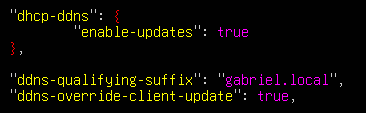
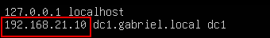
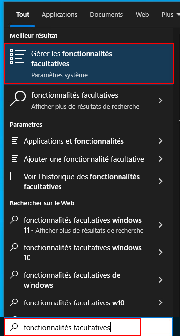
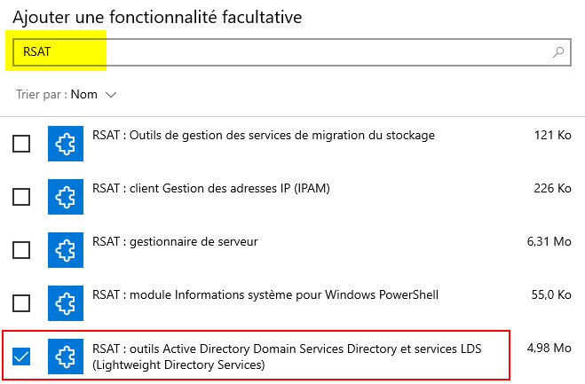
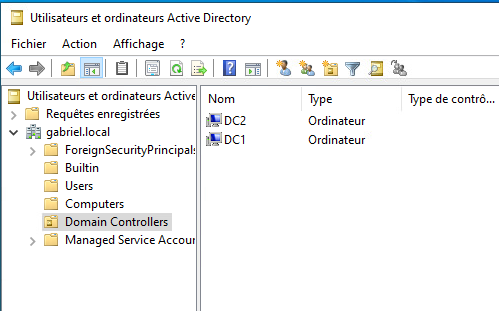
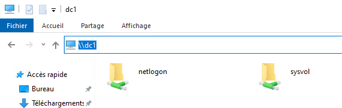
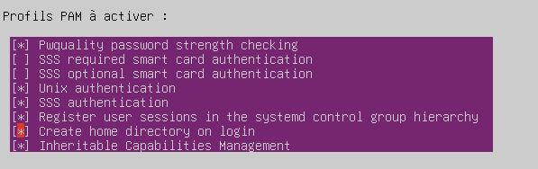

import useBaseUrl from '@docusaurus/useBaseUrl';
import ThemedImage from '@theme/ThemedImage';
import Tabs from '@theme/Tabs';
import TabItem from '@theme/TabItem';

# Laboratoire 19

* * *

## Samba en tant que contrôleur de domaine AD

## Préalable(s)

- Avoir complété le laboratoire # 17 (nous réutilisons les VM)

## Objectif(s)

- Remplacer les serveurs DNS sous Bind9 pour des contrôleurs de domaine Samba.

* * *
## Schéma

<div style={{textAlign: 'center'}}>
    <ThemedImage
        alt="Schéma"
        sources={{
            light: useBaseUrl('/img/Serveurs1/Laboratoire17_W.svg'),
            dark: useBaseUrl('/img/Serveurs1/Laboratoire17_D.svg'),
        }}
    />
</div>

* * *

## Étapes de réalisation

Dans le cadre de ce laboratoire, nous remplacerons les deux serveurs DNS en place par des contrôleurs de domaine Active Directory sous Samba. **Souvenez-vous:** Active Directory est un ensemble de services, dont le DNS fait partie intégrante.

## Désactivation des mises à jour automatiques des enregistrements DNS

Commençons par désactiver les mises à jour des enregistrements DNS sur notre serveur DHCP. La première étape consistera à arrêter le service `kea-dhcp-ddns-server.service` avec la commande suivante:

```bash
sudo systemctl stop kea-dhcp-ddns-server.service
```

Nous pourrons ensuite désinstaller ce logiciel puisque nous ne nous en servirons plus:

```bash
sudo apt autoremove kea-dhcp-ddns-server -y
```

Nous pourrons également modifier la configuration de notre serveur DHCP pour lui indiquer qu'il n'aura plus à ce soucier de ces mises à jour. Éditez donc votre fichier de configuration `/etc/kea/kea-dhcp4.conf` pour y supprimer les lignes suivantes:



Redémarrez ensuite votre service DHCP et assurez-vous que celui-ci fonctionne bien.

## Suppression de vos deux serveur DNS

Eh oui! Il faut maintenant supprimer vos deux serveurs DNS que vous avez mis tant d'efforts à monter (je m'en excuse...). Ne vous en faites pas, c'est pour en créer de meilleurs. 😉

## Mise en place d'un premier contrôleur de domaine

Comme vous l'avez dans plusieurs de vos laboratoires, importez un serveur Ubuntu 24.04, renommez-le convenablement (dc1 par exemple) et octroyez-lui une adresse IP statique. Vous pouvez réutiliser les mêmes adresses IP que vous aviez attribué à vos serveurs DNS.

:::important
Dans le fichier `/etc/hosts`, remplacez l'adresse 127.0.1.1 par la véritable IP du serveur (ex: 192.168.21.10). L'adresse 127.0.1.1 est un alias créé par le résolveur DNS par défaut sous Ubuntu. Or, ce résolveur sera désactivé plus tard:


:::

### Désactivation du résolveur DNS intégré à Ubuntu

Comme nous configurerons Samba en tant que contrôleur de domaine, celui-ci aura son propre service de résolution DNS. Nous allons donc désactiver la résolution DNS d'Ubuntu pour éviter qu’il y ait des conflits entre ces deux services:

```bash
sudo systemctl disable systemd-resolved
```

Supprimez également le raccourci vers le fichier `/etc/resolv.conf` avec la commande:

```bash
sudo unlink /etc/resolv.conf
```

Nous allons ensuitre mettre en place un fichier `/etc/resolv.conf` (après tout, il nous faut encore être en mesure de résoudre des noms de domaine). Inscrivez ce contenu à l'intérieur:

```yaml title='/etc/resolv.conf' showLineNumbers
nameserver 192.168.21.10 #Nous-mêmes, car nous serons éventuellement un serveur DNS
nameserver 8.8.8.8 #Google, au cas où nous aurions besoin de résoudre des noms externes
search gabriel.local #Notre nom de domaine
```

### Installation des paquets nécessaires

Plusieurs paquets sont nécessaires pour faire de notre serveur un contrôleur de domaine Active Directory. Heureusement, nous pouvons les installer tous en une seule commande:

```bash
sudo apt install samba winbind libnss-winbind krb5-user smbclient ldb-tools python3-cryptography -y
```

Lorsque vous lancerez l'installation de ces paquets, le service Kerberos vous posera quelques questions:

- Le nom du royaume Kerberos: Il s'agit de votre nom de domaine **EN MAJUSCULES** (*Oui, les majuscules sont importantes*)
- Le nom des serveurs Kerberos du royaume: Pour l'instant, n'inscrivez que le *FQDN* de votre contrôleur de domaine.
- Même chose pour le serveur administratif.

### Promotion du contrôleur de domaine principal

Commencez par renommer le fichier de configuration du service Kerberos:

```bash
sudo mv /etc/krb5.conf /etc/krb5.conf.bak
```

Créez un nouveau fichier du même nom dans lequel vous inscrirez ces 4 lignes:

```yaml title='/etc/krb5.conf' showLineNumbers
[libdefaults]
    default_realm = GABRIEL.LOCAL  #Votre nom de domaine en MAJUSCULES
    dns_lookup_kdc = true
    dns_lookup_realm = false
```

Renommez également le fichier de configuration par défaut de samba. Un nouveau fichier sera généré lors de la promotion du contrôleur de domaine:

```bash
sudo mv /etc/samba/smb.conf /etc/samba/smb.conf.bak
```

Arrêtez également tous les services en lien avec le serveur de fichier Samba (comportement par défaut à l'installation):

```bash
sudo systemctl stop samba winbind nmbd smbd
```

Lancez la promotion du serveur en contrôleur de domaine avec la commande suivante:

```bash
sudo samba-tool domain provision --realm=GABRIEL.LOCAL --domain GABRIEL --server-role=dc
```

:::caution
Cette dernière commande vous générera plusieurs lignes de texte en sortie. C'est normal.
:::

Votre serveur est désormais un contrôleur de domaine Active Directory, Félicitations. L'une des premières étapes assez prioritaire à réaliser est la définition du mot de passe de l'administrateur du domaine. Définissez donc le mot de passe avec la commande suivante:

```bash
sudo samba-tool user setpassword administrator
```

### Modification de la configuration DNS

Nous allons intégrer au moins un redirecteur à notre configuration DNS, de sorte que notre serveur rediriger vers l'extérieur les requêtes qui ne concerne pas le domaine. Éditez donc le fichier de configuration `/etc/samba/smb.conf` et repérez la ligne `dns forwarder` pour y mettre l'adresse d'un serveur DNS externe (Google, Cloudflare, etc.).

Une fois cette modification appliquée, retournez éditer le fichier `/etc/resolv.conf` et supprimez la ligne `nameserver 8.8.8.8`.

### Finalisation

Lorsque nous avons fait la promotion du contrôleur de domaine, le processus a généré inutilement un fichier de configuration kerberos. Nous devons supprimer ce fichier et créer un raccourci vers notre fichier de configuration kerberos. Supprimez donc le fichier généré par le processus avec cette commande:

```bash
sudo rm -f /var/lib/samba/private/krb5.conf
```

Créez maintenant le raccourci vers notre fichier de configuration comme suit:

```bash
sudo ln -s /etc/krb5.conf /var/lib/samba/private/krb5.conf
```

Maintenant, il ne nous reste plus qu'à activer les bons services Samba pour que ceux-ci démarrent automatiquement au démarrage et désactiver ceux dont nous n'aurons plus besoin:

```bash
sudo systemctl disable samba winbind nmbd smbd
sudo systemctl mask samba winbind nmbd smbd
sudo systemctl unmask samba-ad-dc
sudo systemctl enable samba-ad-dc #Possible que le service soit déjà activé au démarrage
```

**<u>Redémarrez votre serveur.</u>**

### Tests & validations

À l'aide d'un client sous Windows, tentez de joindre le domaine Active Directory que vous venez tout juste de créer.

## Mise en place du second contrôleur de domaine

Importez un deuxième serveur Ubuntu, configurez lui une adresse IP statique et donnez-lui un nom pertinent (dc2 par exemple). N'oubliez pas de configurer convenablement le fichier `/etc/hosts`.

### Installation des paquets nécessaires

Les mêmes paquets que nous avons installé sur le premier contrôleur de domaine seront nécessaires sur celui-ci. Veillez donc à les installer:

```bash
sudo apt install samba winbind libnss-winbind krb5-user smbclient ldb-tools python3-cryptography -y
```

Lorsque Kerberos vous en fera la demande, entrez les adresses IP des deux serveurs séparé par un espace en tant que serveurs du royaume. En ce qui concerne le serveur administratif, il s'agit de l'adresse IP du contrôleur de domaine principal.

### Préparation à la promotion du serveur

Renommer le fichier de configuration du service Kerberos:

```bash
sudo mv /etc/krb5.conf /etc/krb5.conf.bak
```

Créez un nouveau fichier du même nom dans lequel vous inscrirez ces lignes:

```yaml title='/etc/krb5.conf' showLineNumbers
[libdefaults]
    default_realm = GABRIEL.LOCAL  #Votre nom de domaine en MAJUSCULES
    dns_lookup_kdc = false
    dns_lookup_realm = false
[realms]
    GABRIEL.LOCAL = {
    kdc = 127.0.0.1
    kdc = 192.168.21.10 # Premier dc
    }
```

**Redémarrez votre serveur**

### Désactivation du résolveur DNS intégré à Ubuntu

Comme nous l'avons fait pour le contrôleur de domaine primaire, nous devons désactiver le résolveur DNS par défaut d'Ubuntu.

```bash
sudo systemctl disable --nom systemd-resolved
```

Supprimez également le raccourci vers le fichier `/etc/resolv.conf` avec la commande:

```bash
sudo unlink /etc/resolv.conf
```

Nous allons ensuitre mettre en place un fichier `/etc/resolv.conf` (après tout, il nous faut encore être en mesure de résoudre des noms de domaine). Inscrivez ce contenu à l'intérieur:

```yaml title='/etc/resolv.conf' showLineNumbers
nameserver 192.168.21.10 #Le DNS primaire
nameserver 192.168.21.20 #Nous-mêmes, car nous serons éventuellement un serveur DNS
search gabriel.local #Notre nom de domaine
```

### Promotion du contrôleur de domaine secondaire

Commencez par renommer le fichier de configuration original de Samba car un nouveau fichier sera automatiquement créé lors de la promotion.

```bash
sudo mv /etc/samba/smb.conf /etc/samba/smb.conf.bak
```

Nous allons maintenant joindre le domaine principal. Utilisez la commande suivante:

```bash
samba-tool domain join gabriel.local DC -U administrator --realm=GABRIEL.LOCAL -W GABRIEL
```

:::caution
Cette dernière commande vous générera plusieurs lignes de texte en sortie. C'est normal.
:::

Une fois la promotion complétée, vous pourrez éditer le fichier `/etc/samba/smb.conf` qui a été créé par le processus. Dans les paramètres globaux, ajoutez l'adresse d'un redirecteur comme suit:

```yaml title='/etc/samba/smb.conf' showLineNumbers
[global]
    dns forwarder = 1.1.1.1
    ...
    ...
    ...
```

### Finalisation

Faites-en sorte que les services nécessaires à AD démarrent automatiquement au démarrage et désactiver les services qui ne nous seront d'aucune utilité.

```bash
sudo systemctl disable samba winbind nmbd smbd
sudo systemctl mask samba winbind nmbd smbd
sudo systemctl unmask samba-ad-dc
sudo systemctl enable samba-ad-dc #Possible que le service soit déjà activé au démarrage
```

Tout comme pour le contrôleur de domaine primaire, la promotion du contrôleur de domaine secondaire a généré un fichier `/var/lib/samba/private/krb5.conf` dont nous n'aurons pas besoin. Nous supprimerons donc ce fichier tout en créant un raccourci vers celui que nous avons préparé nous-mêmes.

```bash
sudo rm -f /var/lib/samba/private/krb5.conf
sudo ln -s /etc/krb5.conf /var/lib/samba/private/krb5.conf
```

**<u>Redémarrez votre serveur.</u>**

## Intégration des clients Windows au domaine

Il est temps de faire quelques tests avec nos clients Windows. Dans un premier temps, tentez d'intégrer vos ordinateurs dans le domaine Active Directory que vous venez de créer. Normalement, vous ne devriez rencontrer aucune difficulté.

Une fois que vos machines seront intégrées au domaine, utilisez le compte administrateur (*ou administrator*) du domaine pour ouvrir une session sur l'un des clients.

### Installation des outils RSAT

Comme les serveurs Ubuntu n'ont pas d'interface graphique, il est impossible d'accéder à la console *Utilisateurs et groupes Active Directory* à laquelle nous aurions normalement accès avec Windows Serveur. Heureusement, les outils RSAT nous permettent d'accéder à différentes consoles de gestion à distance. Vous ne vous en rappeler peut-être pas, mais vous avez expérimenter ces outils lors du laboratoire 2 ( [juste ici!](../03%20-%202%20-%20Windows%20mode%20core/01-Laboratoire2.md#gestion-du-serveur-à-distance) 😉).

Dans la barre de recherche de votre PC Windows, tapez *fonctionnalités facultatives* et cliquez sur *Gérer les fonctionnalités facultatives*:



Dans la fenêtre qui s'ouvrira, cliquez sur *Ajouter une fonctionnalité* et tapez *RSAT* dans la barre de recherche. Cochez l'outil suivant : *RSAT: outils Active Directory Domain Services Directory et services LDS*



<u>**Cliquez sur installer**</u>

Une fois le produit installé, dirigez-vous dans le Panneau de configuration > Outils d'administration > Utilisateurs et ordinateurs Active Directory. Est-ce que ça vous dit quelque chose ?



## Synchronisation du partage SYSVOL

Le partage SYSVOL des contrôleurs de domaine est critique. Vous aurez l'occasion d'en apprendre davantage sur SYSVOL lors de votre cours de Serveurs 3. Néanmoins, sachez pour l'instant que plusieurs politiques et stratégies nécessaires au fonctionnement du domaine sont partagés à l'aide de SYSVOL. Lorsque nous créons de serveurs ADDS avec Windows Serveur, SYSVOL est automatiquement synchronisé. Or, ici nous avons installer AD sous Linux. 

Ouvrez un explorateur Windows et tapez le chemin UNC pour accéder aux partages de votre contrôleur de domaine primaire:



double-cliquez sur `SYSVOL`. Dans une nouvelle fenêtre de l'explorateur Windows, tapez le chemin UNC pour accéder aux partages de votre contrôleur de domaine secondaire puis double-cliquez encore une fois sur `SYSVOL`. Copiez le dossier au nom de votre domaine du contrôleur de domaine primaire vers le contrôleur de domaine secondaire, de sorte que les deux contrôleurs de domaine possèdent exactement la même chose.

Finalement, directement dans votre contrôleur de domaine secondaire, entrez ces deux lignes consécutives:

```bash
sudo samba-tool ntacl sysvolreset
sudo samba-tool ntacl sysvolcheck
```

Cette dernière opération assure que les deux contrôleurs de domaine possèdent exactement les mêmes stratégies et politiques de gestion du domaine.

## Intégration des serveurs Linux au domaine

Le serveur DHCP sous KEA ainsi que notre serveur de fichier SAMBA ne sont toujours pas intégrés au domaine. Nous allons donc les intégrer pour bénéficier des avantages provenant de cette intégration.

Commençons avec le serveur DHCP. D'abord éditez le fichier `/etc/systemd/resolved.conf` comme suit:

```yaml title='/etc/systemd/resolved.conf' showLineNumbers
# This file is part of systemd.
#
# systemd is free software; you can redistribute it and/or modify it under the
# terms of the GNU Lesser General Public License as published by the Free
# Software Foundation; either version 2.1 of the License, or (at your option)
# any later version.
#
# Entries in this file show the compile time defaults. Local configuration
# should be created by either modifying this file (or a copy of it placed in
# /etc/ if the original file is shipped in /usr/), or by creating "drop-ins" in
# the /etc/systemd/resolved.conf.d/ directory. The latter is generally
# recommended. Defaults can be restored by simply deleting the main
# configuration file and all drop-ins located in /etc/.
#
# Use 'systemd-analyze cat-config systemd/resolved.conf' to display the full config.
#
# See resolved.conf(5) for details.

[Resolve]
# Some examples of DNS servers which may be used for DNS= and FallbackDNS=:
# Cloudflare: 1.1.1.1#cloudflare-dns.com 1.0.0.1#cloudflare-dns.com 2606:4700:4700::1111#cloudflare-dns.com 2606:4700:4700::1001#cloudflare-dns.com
# Google:     8.8.8.8#dns.google 8.8.4.4#dns.google 2001:4860:4860::8888#dns.google 2001:4860:4860::8844#dns.google
# Quad9:      9.9.9.9#dns.quad9.net 149.112.112.112#dns.quad9.net 2620:fe::fe#dns.quad9.net 2620:fe::9#dns.quad9.net
#highlight-start
DNS=192.168.21.10
FallbackDNS=192.168.21.20
Domains=gabriel.local
#highlight-end
#DNSSEC=no
#DNSOverTLS=no
#MulticastDNS=no
#LLMNR=no
#Cache=no-negative
#CacheFromLocalhost=no
#highlight-next-line
DNSStubListener=no
#DNSStubListenerExtra=
#DNSStubListenerExtra=
#ReadEtcHosts=yes
#ResolveUnicastSingleLabel=no
#StableRetainSec=0
```

Redémarrez le résolveur DNS en entrant la commande suivante:

```bash
sudo systemctl-restart systemd-resolved.service
```

Procédez maintenant à l'installation des paquets suivants:

```bash
sudo apt install realmd sssd oddjob oddjob-mkhomedir adcli samba-common packagekit sssd-tools -y
```

Une fois les paquets installés, lancez la commande d'intégration au domaine:

```bash
sudo realm join --user=Administrator gabriel.local
```

Finalement, nous indiquerons à Linux qu'il doit créer un profil lorsqu'un utilisateur du domaine ouvre une session. Pour ce faire, entrez la commande:

```bash
sudo pam-auth-update
```

et cochez la case `Create home directory on login`.



### Testez l'ouverture de session

Fermez votre session sur votre serveur DHCP (*Commande exit*) et tentez d'ouvrir une session avec l'administrateur du domaine par exemple:

- Login: Administrator@gabriel.local
- Password: Passw0rd


**Répétez les mêmes étapes pour intégrer votre serveur de fichiers SAMBA au domaine.**