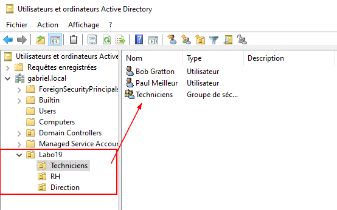
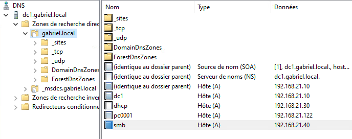
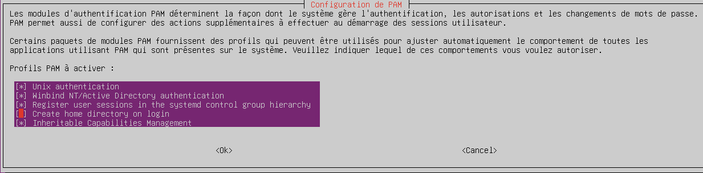

import useBaseUrl from '@docusaurus/useBaseUrl';
import ThemedImage from '@theme/ThemedImage';
import Tabs from '@theme/Tabs';
import TabItem from '@theme/TabItem';

# Laboratoire 19

* * *

## Intégration du serveur de fichiers à AD

## Préalable(s)

- Avoir complété le Laboratoire #17 (nous réutilisons les VM)

## Objectif(s)

- Centraliser les utilisateurs dans AD

* * *

## Schéma

<div style={{textAlign: 'center'}}>
    <ThemedImage
        alt="Schéma"
        sources={{
            light: useBaseUrl('/img/Serveurs1/Laboratoire19_W.svg'),
            dark: useBaseUrl('/img/Serveurs1/Laboratoire19_D.svg'),
        }}
    />
</div>

* * *

## Étapes de réalisation

Dans le cadre de ce laboratoire, nous utiliserons des comptes *Active Directory* afin d'administrer nos partages sur notre serveur de fichiers. Dans un second temps, (le prochain laboratoire) nous utiliserons ce même serveur pour en faire un serveur d'impression.

### Création des utilisateurs dans l'annuaire AD

La première étape consistera à reprendre la liste des utilisateurs et des groupes du laboratoire 16 et de créer ces derniers dans votre annuaire. 

:::tip[Conseil]
Organisez vos utilisateurs et vos groupes avec des unités d'organisation.


:::

### Remplacement du serveur de fichiers

Il serait tout à fait possible d'apporter des modifications à notre serveur de fichiers pour qu'il puisse utiliser nos comptes Active Directory afin de gérer des accès, mais ce serait plus complexe que de partir depuis un serveur neuf. Éteignez donc votre serveur de fichiers et procédez à la suppression de la machine virtuelle 😭.

Si vous aviez intégré ce serveur à l'annuaire *Active Directory*, n'oubliez pas de le supprimer également dans le panneau *Utilisateurs et ordinateurs Active Directory*.

Créez ensuite une nouvelle machine virtuelle depuis le modèle MODELE_Ubuntu_Server_24.04.2_LTS_x64_FR. Une fois ce serveur démarré:

- Donnez-lui l'adresse IP statique 192.168.21.40
- Renommez-la convenablement (/etc/hosts & /etc/hostname)
- Effectuez les mises-à-jour

#### Ajustemement du résolveur DNS

Éditez le fichier `/etc/systemd/resolved.conf` comme suit:

```yaml Title='/etc/systemd/resolved.conf' showLineNumbers
# This file is part of systemd.
#
# systemd is free software; you can redistribute it and/or modify it under the
# terms of the GNU Lesser General Public License as published by the Free
# Software Foundation; either version 2.1 of the License, or (at your option)
# any later version.
#
# Entries in this file show the compile time defaults. Local configuration
# should be created by either modifying this file (or a copy of it placed in
# /etc/ if the original file is shipped in /usr/), or by creating drop-ins in
# the /etc/systemd/resolved.conf.d/ directory. The latter is generally
# recommended. Defaults can be restored by simply deleting the main
# configuration file and all drop-ins located in /etc/.
#
# Use 'systemd-analyze cat-config systemd/resolved.conf' to display the full config.
#
# See resolved.conf(5) for details.

[Resolve]
# Some examples of DNS servers which may be used for DNS= and FallbackDNS=:
# Cloudflare: 1.1.1.1#cloudflare-dns.com 1.0.0.1#cloudflare-dns.com 2606:4700:4700::1111#cloudflare-dns.com 2606:4700:4700::1001#cloudflare-dns.com
# Google: 8.8.8.8#dns.google 8.8.4.4#dns.google 2001:4860:4860::8888#dns.google 2001:4860:4860::8844#dns.google
# Quad9: 9.9.9.9#dns.quad9.net 149.112.112.112#dns.quad9.net 2620:fe::fe#dns.quad9.net 2620:fe::9#dns.quad9.net
DNS=192.168.21.10
FallbackDNS=192.168.21.20
Domains=exemple.local
#DNSSEC=no
#DNSOverTLS=no
#MulticastDNS=no
#LLMNR=no
#Cache=no-negative
#CacheFromLocalhost=no
DNSStubListener=no
#DNSStubListenerExtra=
#ReadEtcHosts=yes
#MulticastDNSLabel=no
#Cache=no-negative
#MaxCacheTTL=0
#MaxCacheSize=
#DNSCacheSplit=auto
#TTL=60
#DefaultRoute=no
```

Redémarrez ensuite votre service de résolution DNS:
```bash
sudo systemctl restart systemd-resolved.service
```

#### Installation des *packages* nécessaires

Installez les paquets suivants:

```bash
sudo apt install samba winbind libpam-winbind libnss-winbind krb5-user
```
Lors de l'installation de krb5-user, vous serez peut-être appelé à entrer les informations suivantes:

- Le nom du royaume Kerberos : EXEMPLE.LOCAL
- Les serveurs Kerberos du royaume : 192.168.21.10 192.168.21.20
- Le serveur administratif du royaume: 192.168.21.10

#### Modification du fichier /etc/krb5.conf

Renommez votre fichier de configuration `/etc/krb5.conf` en `/etc/krb5.bak` puis créez un nouveau fichier `/etc/krb5.conf` comme suit:

```yaml title='/etc/krb5.conf' showLineNumbers
[libdefaults]
    default_realm = EXEMPLE.LOCAL
    dns_lookup_realm = true
    dns_lookup_kdc = true

[realms]
    EXEMPLE.LOCAL = {
        kdc = dc1.exemple.local
        admin_server = dc1.exemple.local
    }

[domain_realm]
    .exemple.local = EXEMPLE.LOCAL
    exemple.local = EXEMPLE.LOCAL

```

#### Fichier de configuration de Samba

Renommez votre fichier de configuration `/etc/samba/smb.conf` en `/etc/samba/smb.bak` puis créez un nouveau fichier `/etc/samba/smb.conf` comme suit:

```yaml title='/etc/samba/smb.conf' showLineNumbers
[global]
   workgroup = EXEMPLE                     # Nom NetBIOS du domaine (doit correspondre à celui défini dans le contrôleur AD)
   security = ADS                          # Active le mode "Active Directory" pour l’authentification
   realm = EXEMPLE.LOCAL                   # Nom complet du domaine AD en MAJUSCULES (le "REALM" Kerberos)

   winbind use default domain = yes        # Permet d’omettre le préfixe DOMAINE\ dans les logins (ex: user au lieu de EXEMPLE\user)
   winbind enum users = yes                # Permet d’énumérer les utilisateurs AD via getent/wbinfo
   winbind enum groups = yes               # Permet d’énumérer les groupes AD via getent/wbinfo
   winbind refresh tickets = yes           # Rafraîchit automatiquement les tickets Kerberos pour les sessions Winbind

   idmap config * : backend = tdb          # Les configurations idmap consiste en des configutrations avancées pour la 
   idmap config * : range = 3000-7999      # gestion des utilisateurs AD. Vous les expliquez nécessiterait beaucoup de temps
   idmap config EXEMPLE : backend = rid         # ces notions ne sont pas abordées dans le cours. Je vais donc vous demander
   idmap config EXEMPLE : range = 10000-999999  # de simplement me faire confiance pour ces lignes de configurations.

   template shell = /bin/bash              # Shell par défaut attribué aux utilisateurs AD lors de leur connexion
   template homedir = /home/%U             # Répertoire personnel mappé automatiquement à /home/nom_utilisateur

   vfs objects = acl_xattr                 # Utilise les attributs étendus pour stocker les ACL de type Windows
   map acl inherit = yes                   # Les permissions héritées se propagent aux sous-dossiers/fichiers
   store dos attributes = yes              # Active la compatibilité avec les attributs DOS (lecture seule, caché, etc.)
```

Ne créez pas de partage pour l'instant, nous y reviendrons.

Redémarrez les services de Samba et de Winbind:

```bash
sudo systemctl restart smbd nmbd winbind
```

#### Jonction au domaine

Utilisez la commande suivante pour vous joindre au domaine:

```bash
sudo net ads join -U administrator
```

:::caution[DNS UPDATE FAILED]
Il se peut que vous obteniez deux messages contradictoires lors de la jonction au domaine. Le premier message vous indiquera que la jonction a fonctionné alors que le second message vous indiquera que la mise à jour des enregistrements DNS n'a pas fonctionné. Ce deuxième message est généralement faux. Vous pouvez même valider que l'enregistrement DNS est bien valide en interrogeant le serveur DNS à l'aide de `nslookup` ou même à travers une autre fonctionnalité facultative à installer sur votre client Windows : Outils de Gestion du serveur DNS.


:::

#### Vérifier l'intégration

Utilisez les commandes suivantes pour vous assurez que votre intégration au domaine est valide.

Lister les utilisateurs AD:
```bash
wbinfo -u
```

Lister les groupes AD:
```bash
wbinfo -g
```

Interroger 1 utilisateur AD:
```bash
getent bob@exemple.local
```

#### Activer l'authentification avec AD

Entrez la commande suivante `sudo pam-auth-update` et cochez la cas *Create home directory on login*. Confirmez également que la case *Winbind NT/Active Directory Authentication* est bien coché.




### Création des dossiers à partager

Comme nous sommes sur un nouveau serveur, nous devrons créer à nouveau nos dossiers pour nos utilisateurs. N'oubliez pas de définir les propriétaires et les permissions sur vos dossiers.

[Retrouvez la structure des dossiers ici.](../17%20-%2016%20-%20Serveurs%20de%20fichiers/01-Laboratoire16.md#création-des-dossiers)


### Création des partages

Maintenant, il ne nous reste plus qu'à créer les partages de nos utilisateurs et de nos groupes dans notre fichier `/etc/samba/smb.conf`. Je vous présente ici un exemple pour un dossier d'utilisateur et un exemple pour un dossier de groupe:

```yaml title='/etc/samba/smb.conf'
[Bob]
    comment = partage de Bob
    path = /Labo16/Utilisateurs/Bob
    browseable = yes
    guest ok = no
    valid users = @"GABRIEL\Direction" "GABRIEL\bob"
    read only = no
    writable = yes

[Techniciens]
    comment = partage des techniciens
    path = /Labo16/Groupes/Techniciens
    browseable = yes
    guest ok = no
    valid users = @"GABRIEL\Techniciens" "GABRIEL\claude"
    read only = no
    writable = yes
```

Les autres partages doivent être fait sur le même modèle. 

### Conclusion

Au final, vos utilisateurs devraient être en mesure d'ouvrir une session à l'aide de leur compte Active Directory sur un poste client Windows. Une fois dans Windows, ils pourront utiliser le chemin UNC pour accéder aux partages du serveur samba. Le plus gros avantage quant à cette façon de procéder c'est que les utilisateurs n'auront pas de s'identifier lorsqu'ils double-cliqueront sur un partage. Leurs identifiants AD seront transmis au serveur de fichiers Samba qui déterminera alors si, oui ou non, l'utilisateur doit avoir accès au partage auquel il tente d'accéder.