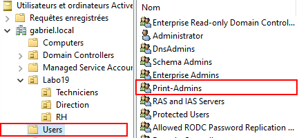
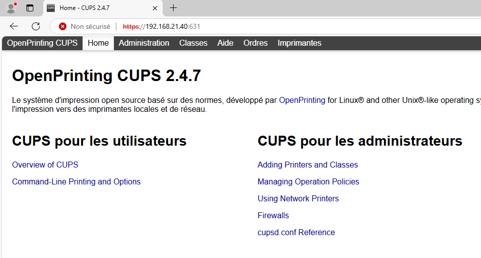
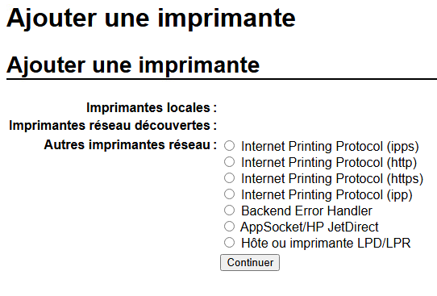
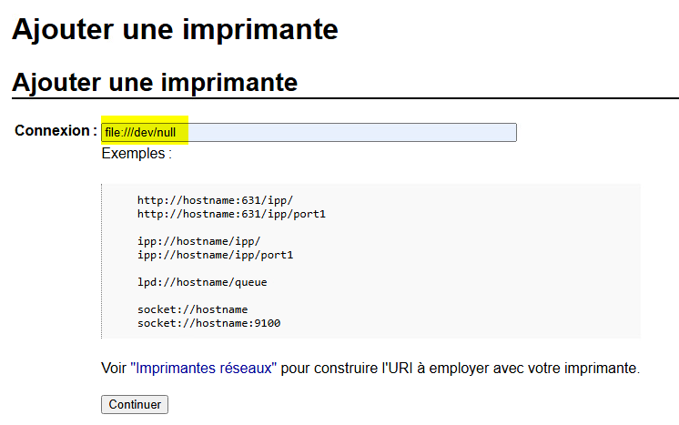
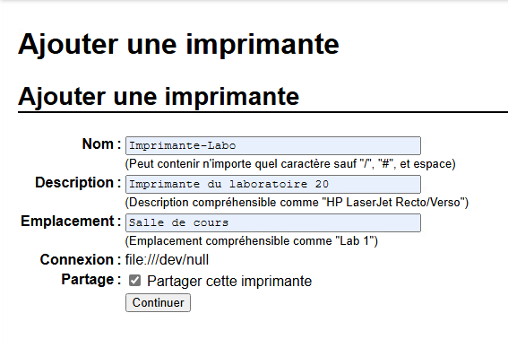
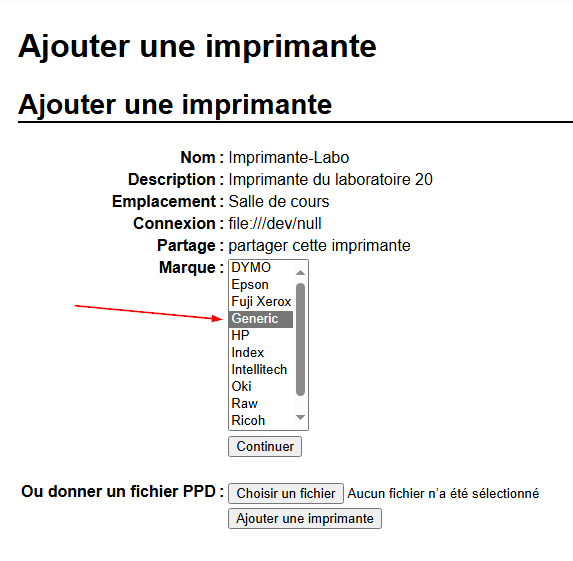
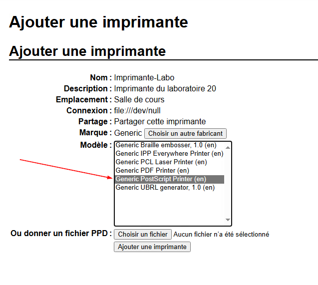
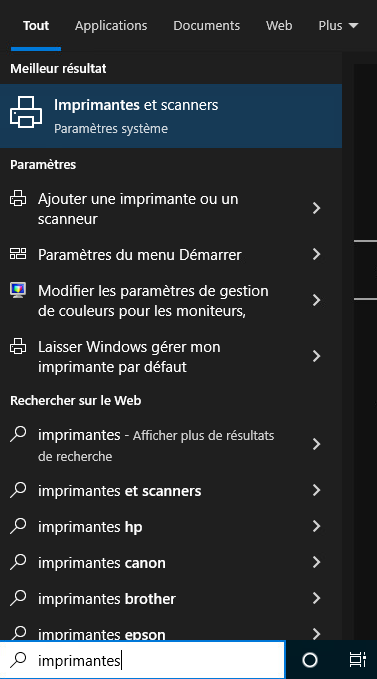
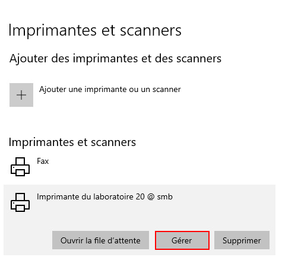
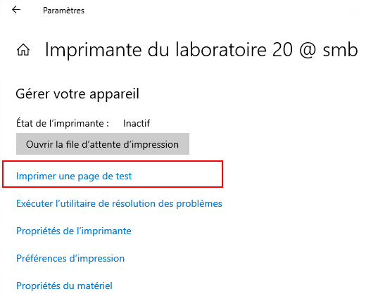

import useBaseUrl from '@docusaurus/useBaseUrl';
import ThemedImage from '@theme/ThemedImage';
import Tabs from '@theme/Tabs';
import TabItem from '@theme/TabItem';

# Laboratoire 20

* * *

## Préalable(s)

- Avoir complété le Laboratoire #19 (nous réutilisons les VM et leur service respectif)

## Objectif(s)

- Déployer le serveur d'impression CUPS 🍵

* * *

## Schéma

<div style={{textAlign: 'center'}}>
    <ThemedImage
        alt="Schéma"
        sources={{
            light: useBaseUrl('/img/Serveurs1/Laboratoire19_W.svg'),
            dark: useBaseUrl('/img/Serveurs1/Laboratoire19_D.svg'),
        }}
    />
</div>

* * *

## Étapes de réalisation

Ça y est, nous y sommes! Nous allons mettre en place notre serveur d'impression avec CUPS. D'abord, avant de modifier quoi que ce soit à notre serveur de fihciers SAMBA, nous allons créer un nouveau groupe nommé `Print-Admins` dans notre annuaire *Active Directory*. Les utilisateurs ajoutés dans ce groupe possèderont les droits d'administration sur le serveur d'impression.

À partir d'un client Windows (PC0001 ou PC0002), utilisez le panneau `Utilisateurs et Ordinateurs Active Directory` pour ajouter le groupe `Print-Admins`. Pour rappel, ce panneau de gestion doit s'installer via les fonctionnalités facultatives de Windows si vous ne l'avez pas déjà fait:



Dans le groupe `Print-Admins`, ajoutez l'utilisateur `Administrator` de votre domaine.

### Installation et configuration de CUPS 🍵

Sur votre serveur de fichiers, procédez à l'installation de CUPS.

```bash
sudo apt install cups -y
```

Une fois les paquets bien en place, renommez le fichier de configuration original comme suit:

```bash
sudo mv /etc/cups/cupsd.conf /etc/cups/cupsd.bak
```

Créez maintenant un nouveau fichier de configuration /etc/cups/cupsd.conf et éditez le comme suit:

```yaml title='/etc/cups/cupsd.conf' showLineNumbers
# Niveau de détails des logs
LogLevel warn

# Activer la découverte des imprimantes sur le réseau local
Browsing On
BrowseLocalProtocols dnssd

# Type d'authentification par défaut (nom d'utilisateur / mot de passe de base)
DefaultAuthType Basic

# Activer l'interface Web de CUPS (http://ip:631)
WebInterface Yes

# Écouter sur toutes les interfaces réseau, sur le port 631
Listen *:631

# ----------------------------
# Contrôle d'accès global
# ----------------------------

# Autoriser tout le réseau local à accéder au serveur CUPS (lecture seule)
<Location />
  Order allow,deny
  Allow @LOCAL
</Location>

# ----------------------------
# Accès aux pages d'administration de CUPS
# ----------------------------

# Autoriser uniquement les membres du groupe Active Directory "Print-Admins" à accéder à l'administration
<Location /admin>
  AuthType Basic
  AuthClass Group
  Require group Print-Admins
  Order allow,deny
  Allow @LOCAL
</Location>

# Même chose pour la configuration avancée
<Location /admin/conf>
  AuthType Basic
  AuthClass Group
  Require group Print-Admins
  Order allow,deny
  Allow @LOCAL
</Location>

# Même chose pour l'accès aux logs via l'interface Web
<Location /admin/log>
  AuthType Basic
  AuthClass Group
  Require group Print-Admins
  Order allow,deny
  Allow @LOCAL
</Location>

# Même chose pour l'administration des travaux d'impression
<Location /admin/jobs>
  AuthType Basic
  AuthClass Group
  Require group Print-Admins
  Order allow,deny
  Allow @LOCAL
</Location>

# Même chose pour l'administration des imprimantes
<Location /admin/printers>
  AuthType Basic
  AuthClass Group
  Require group Print-Admins
  Order allow,deny
  Allow @LOCAL
</Location>

# ----------------------------
# Politique par défaut pour la gestion des impressions
# ----------------------------

<Policy default>

  # Autoriser tout le monde à créer des travaux d'impression sans authentification
  <Limit Create-Job Print-Job Print-URI Validate-Job>
    Order deny,allow
  </Limit>

  # Restreindre certaines actions sur les travaux (comme suspendre ou relancer) aux propriétaires des travaux ou aux administrateurs
  <Limit Send-Document Send-URI Hold-Job Release-Job Restart-Job Purge-Jobs Set-Job-Attributes Create-Job-Subscription Renew-Subscription Cancel-Subscription Get-Notifications Reprocess-Job Cancel-Current-Job Suspend-Current-Job Resume-Job Cancel-My-Jobs Close-Job CUPS-Move-Job>
    Require user @OWNER @SYSTEM
    Order deny,allow
  </Limit>

  # Restreindre la gestion des imprimantes (ajout, suppression, modification) aux membres de "Print-Admins"
  <Limit CUPS-Add-Modify-Printer CUPS-Delete-Printer CUPS-Add-Modify-Class CUPS-Delete-Class CUPS-Set-Default CUPS-Get-Devices>
    AuthType Basic
    Require group Print-Admins
    Order deny,allow
  </Limit>

  # Restreindre la gestion des statuts des imprimantes aux membres de "Print-Admins"
  <Limit Pause-Printer Resume-Printer Enable-Printer Disable-Printer Pause-Printer-After-Current-Job Hold-New-Jobs Release-Held-New-Jobs Deactivate-Printer Activate-Printer Restart-Printer Shutdown-Printer Startup-Printer Promote-Job Schedule-Job-After Cancel-Jobs CUPS-Accept-Jobs CUPS-Reject-Jobs>
    AuthType Basic
    Require group Print-Admins
    Order deny,allow
  </Limit>

  # Autoriser uniquement le propriétaire d'un travail ou un administrateur à annuler ou authentifier un travail
  <Limit Cancel-Job CUPS-Authenticate-Job>
    Require user @OWNER @SYSTEM
    Order deny,allow
  </Limit>

  # Par défaut, autoriser toutes les autres opérations
  <Limit All>
    Order deny,allow
  </Limit>

</Policy>

```

Redémarrez le service `CUPS` par la suite:

```bash
sudo systemctl restart cups
```

### Mise en place d'une imprimante 🖨️

Évidemment, nous n'avons pas d'imprimante physique à mettre en place, d'autant plus que notre infrastructure est virtuelle. Nous allons donc configurer une imprimante logique qui renverra tout simplement nos travaux d'impression vers le néant. Ainsi, vous aurez quand la même possibilité d'expérimenter la configuration d'imprimante dans CUPS.

Sur l'un des postes Windows, ouvrez un navigateur web et tapez l'adresse de votre serveur d'impression suivi du numéro de port 631:

*`http://192.168.21.40:631`*

Vous atteindrez la page d'accueil de CUPS:



Dans la barre supérieur, cliquez sur **Administration**. Vous devrez sans doute vous identifier pour accéder à la section. Les utilisateurs du groupe `Print-Admins` sont autorisés à administrer le serveur. Utilisez donc un membre de ce groupe (exemple : `Administrator` que nous avons ajouté à l'intérieur un peu plus tôt.)

Dans la section `Administration`, cliquez sur `Ajouter une imprimante`. Vous arriverez sur cette page:



Sélectionnez `AppSocket/HP Jet Direct`. Ça n'a pas vraiment d'importance ici, car nous n'avons aucune imprimante physique. Cliquez sur `Continuer`.

À la page suivante, dans le champs `Connexion:`, inscrivez le texte suivant: *file:///dev/null*. Cela indique que l'on souhaite que l'imprimante renvoie un fichier plutôt qu'une véritable impression. Ce fichier est envoyé vers `/dev/null`, un espèce de *trou noir* qui avalera tout ce qu'on lui envoi.



Cliquez ensuite sur `Continuer`.

À la page suivante, vous aurez à définir différentes propriétés de l'imprimante comme:

- Son nom (Exemple: *Imprimante-Labo*)
- Une description (Exemple: *Imprimante du laboratoire 20*)
- Son emplacement (Exemple: *Salle de cours*)
- Son partage (Exemple: *Partagé*)

:::caution
Le partage de l'imprimante est obligatoire si vous désirez imprimer à distance, ce qui est notre cas!
:::



Cliquez ensuite sur `Continuer`.

À la page suivante, vous devrez sélectionner la marque de l'imprimante. Comme nous n'avons pas d'imprimante physique, choisissez simplement `Generic`. Cela correspond tout simplement à spécifier à `CUPS` que nous installons une imprimante générique.



Cliquez ensuite sur `Continuer`.

À la page suivante, vous devrez sélectionner le modèle de l'imprimante. Choisissez `Generic PostScript Printer` qui correspond simplement à un pilote d'impression PostScript de base.



Finalement, cliquez sur `Ajouter une imprimante`.

### Impression d'une page test 📑

Vous avez désormais une imprimante disponible pour répondre aux travaux d'impression qui seront envoyés vers le serveur. Il nous ne reste plus qu'à la branché sur nos clients. Sur vos clients Windows, recherchez `Imprimantes` dans la barre de recherche et ouvrez le panneau `Imprimantes et scanners`:



Cliquez ensuite sur `Ajouter une imprimante ou un scanner`. Windows lancera une recherche de périphériques sur le réseau et vous devriez voir apparaitre l'imprimante logique que nous avons configuré sur notre serveur d'impression. Ajoutez-la. (Cela peut prendre une minute ou deux).

Une fois l'imprimante ajouté à Windows. Sélectionnez-la et cliquez sur `Gérer`:



Dans la page de gestion de l'imprimante, cliquez sur `Imprimer une page de test`:



Si vous ne recevez aucun message d'erreur, cela signifie que votre demande d'impression a bien fonctionné!

### Validation 💯

Comme nous n'avons pas d'imprimante physique, nous ne pouvons pas observer une véritable page sortir de l'imprimante. Néanmoins, il est tout à fait possible de s'assurer que la page test que nous avons envoyé un peu plus tôt à l'impression a bel et bien été traitée. Pour ce faire, ouvrez de nouveau l'interface web du serveur d'impression depuis un client Windows. Dans le menu supérieur, cliquez sur `Ordres` (C'est une mauvaise traduction).


Vous serez alors sur la page de gestion des tâches. Cliquez sur `Affichage des tâches terminées`, vous devriez alors voir la tâche d'impression de la page test qui a bel et bien été traitée:


:::tip
N'hésitez pas à aller plus loin et à explorer l'interface graphique de CUPS. Par exemple; vous pourriez vous renseignez sur ce que sont les classes d'impression 😉.
:::