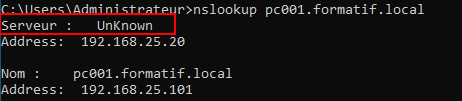
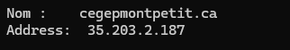
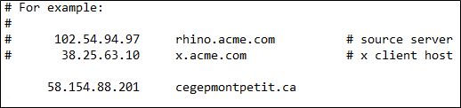

import useBaseUrl from '@docusaurus/useBaseUrl';
import ThemedImage from '@theme/ThemedImage';
import Tabs from '@theme/Tabs';
import TabItem from '@theme/TabItem';

# Cours 24

## Formatif en vue de l'évaluation

Cet exercice formatif vous permettra de vous préparer en vue de l'évaluation finale sur deux éléments précis:

1. Le format de l'évaluation sera identique à celui-ci: Le type de question ainsi que leur nombre seront très similaires.
2. Cet exercice formatif vous permettra également de valider votre bonne compréhension de la matière.

* * *

## Schéma de l'infrastructure

À l'aide des machines virtuelles disponibles sur Labinfo (Modèles \> 420-2S5 \> Formatif), déployez cette infrastructure.  <mark>**Aucune installation n'est requise, les machines n'ont seulement qu'à être déployées. Les services nécessaires (dhcp, dns, etc.) sont déjà en place.**</mark>

    <ThemedImage
        alt="Schéma"
        sources={{
            light: useBaseUrl('/img/Serveurs1/Formatif_W.svg'),
            dark: useBaseUrl('/img/Serveurs1/Formatif_D.svg'),
        }}
    />

* * *

## Informations sur le réseau

| Nom de la VM | FQDN | Adresse IP | Nom d'utilisateur | Mot de passe |
|--------------|------|------------|-------------------|--------------|
| 2S5-Formatif-Passerelle | passerelle.formatif.local | 192.168.25.1 | *N/A* | *N/A* |
| 2S5-Formatif-DHCP | dhcp.formatif.local | 192.168.25.10 | utilisateur | formatifh25 |
| 2S5-Formatif-DNS | ns1.formatif.local | 192.168.25.20 | utilisateur | formatifh25 |
| 2S5-Formatif-PC001 | pc001.formatif.local | *Via DHCP* | Administrateur | formatifh25 |
| 2S5-Formatif-PC002 | pc002.formatif.local | *Via DHCP* | Administrateur | formatifh25 |

* * *

## Partie A : Pratique

Dans cette partie, vous devez opérer des changements dans l'infrastructure.

1. Les employés de la firme où vous êtes employés vous ont contactés pour vous mentionner qu'ils sont incapables de naviguer sur internet. Votre première tâche consiste donc à poser un diagnostique sur l'état de la situation et remédier à celle-ci. Assurez-vous d'être en mesure de **prouver** (captures d'écran) et d'**expliquer** avec aisance la problématique ainsi que les étapes que vous avez empruntés pour résoudre le ou les problèmes.

2. La résolution DNS n'est pas complète lorsqu'on lance la commande `nslookup` depuis l'un des clients sous Windows. Pour une raison étrange, la mention `UnKnown` est indiqué aux côtés de « serveur: »

    

    Votre seconde tâche consiste donc à trouver pourquoi ce comportement a lieu, puis de corriger cette situation. Assurez-vous d'être en mesure de **prouver** (captures d'écran) et d'**expliquer** avec aisance la problématique ainsi que les étapes que vous avez empruntés pour résoudre le ou les problèmes.

## Partie B : Théorie

Pour cette partie, vous devez répondre aux questions demandées à partir des informations récoltées dans votre infrastructure.

* * *
- Votre collègue de travail vous mentionne que le patron de l'entreprise l'a mandaté pour mettre en place un serveur DNS secondaire. Si votre collègue configure le serveur secondaire pour recevoir les mises-à-jour des zones DNS sur la base du temps, combien de temps le serveur DNS secondaire attendra-t-il avant d'interroger le serveur primaire pour savoir si les zones ont besoin d'être mises à jour ?
    - 15 minutes 
    - 1 heure
    - 2 jours
    - 1 jour
    - 8 heures
* * *
- Quelle est la durée du bail proposé par le serveur DHCP de cette infrastructure ?
    - 8 heures
    - 12 heures
    - 24 heures
    - 48 heures
    - 5 jours
    - 7 jours
* * *
- Lorsque j'interroge un serveur DNS concernant `cegepmontpetit.ca`, il me retourne la réponse suivante:

    

    Si j'ajoutais l'inscription suivante dans le fichier `hosts` de mon client :

    

    Que se passera-t-il lorsque j'entrerais cegepmontpetit.ca dans la barre d'adresse de mon navigateur ?

    - J'atteindrai simplement la page web du cégep
    - J'obtiendrai une erreur concernant un conflit d'adresse
    - Je serai redirigé vers l'adresse 58.154.88.201
    - Je serai redirigé vers l'adresse 35.203.2.187
    - Je serai dirigé vers l'adresse qui répond la plus rapidement
* * *

- À l'aide de votre poste de travail du cégep (pas les VMs), trouvez l'adresse courriel du responsable de la zone `ubuntu.com`.
    - `dnsmaster@ubuntu.com`
    - `dnsadmin@ubuntu.com`
    - `support@canonical.com`
    - `hostadmin@canonical.com`
    - `hostmaster@canonical.com`
