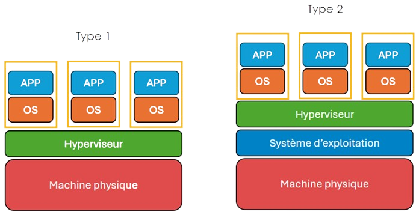
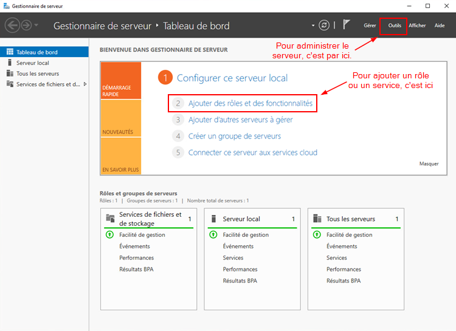

# Cours 1

  
  ## Qu'est-ce qu'un serveur ?

  Vous avez probablement déjà entendu ce terme à plusieurs reprises, mais concrètement, c'est quoi un serveur ? Est-ce que c'est une machine super puissante ? Est-ce que c'est un ordinateur comme les autres ? Reconnait-on les serveurs simplement en les regardant ? Toutes ces questions sont légitimes.

  ### Définition

  Un serveur offre des services accessibles via un réseau. Il peut être matériel ou logiciel, c'est un ordinateur qui exécute des opérations suivant les requêtes effectués par un autre ordinateur appelé « client ». C'est pourquoi on entend souvent parler de relation « client/serveur ». Par exemple, un utilisateur (client) va rechercher un site internet en utilisant un navugateur web, pour que ce dernier puisse afficher le site en question, il effectuera une demande (requête) au serveur web hébergant le site.

  :::caution[Le mythe de la grosse machine]
  Un serveur, ce n'est donc pas forcémment une machine super-puissante. Ça n'a même rien à voir. C'est malheureusement un mythe qui court chez *monsieur et madame tout le monde*. Évidemment qu'il existe des serveurs qui sont très puissants, tout comme il existe des ordinateurs très puissant et qu'il existe des voitures très puissantes. Le point c'est qu'il ne faut pas obligatoirement un moteur puissant pour qualifier un objet de voiture. C'est la même chose pour les serveurs. Nous nous attarderons aux différentes formes que peuvent avoir les serveurs dans un cours ultérieur.
  :::

  ### Les caractéristiques d'un serveur

  Un serveur répond toujours à certaines caractéristiques:

  - Un serveur offre un ou des services via le réseau.
  - Un serveur peut être logiciel ou matériel. (*eh oui!*)
  - Un serveur nécessite peu d'interventions humaines.
  - Les serveurs sont généralement installé dans une salle dédiée, où l'accès est restreint et contrôlé.
  - Les serveurs possèdent essentiellement les mêmes caractéristiques matérielles qu'un pc.

  Un serveur peut être virtuel ou physique. Il peut fonctionner avec du matériel très performant, un vieux pc ou même sur un [Raspberry PI](https://www.raspberrypi.com/).

  ### Particularités des serveurs physiques

  Les serveurs physiques impliqueront certaines particularités à prendre en considération. Il faudra considérer les éléments suivants:

  - Les impacts d'une panne possible (criticité du ou des services).
  - La gestion de données sensibles ou confientielles.
  - L'accès physique restreint.
  - La gestion de l'énergie et de la chaleur.
  - L'économie d'espace.

  ## Retour sur la virtualisation

  La virtualisation est une technologie permettant de faire fonctionner plusieurs systèmes d'exploitation simultanément sur un même équipement physique. Pour fonctionner, la virtualisation a besoin des éléments suivants:

  - Une machine physique (hôte)
  - Un hyperviseur (gère les machines virtuelles)

  ### Hyperviseur de type 1
  Ces hyperviseurs sont aussi appelés « hyperviseur *baremetal* ». Ce type d'hyperviseur s'exécute directement sur le matériel de la machine hôte. C'est ce type d'hyperviseur qu'on utilisera le plus fréquemment dans les « datacenters » commerciaux ou les entreprises d'envergures.

  ### Hyperviseur de type 2
  Ces hyperviseurs sont aussi appelés « hyperviseur hébergés ». Ce type d'hyperviseur s'exécute via un logiciel installé sur un hôte qui possède son propose système d'exploitation. On utilise plus souvent ce type d'hyperviseur sur les machines clientes.

  

  ### Quelques logiciels de virtualisation connus

  - Microsoft Hyper-V
  - VmWare (Workstation, Vsphere, ESXi, etc.)
  - Citrix XenServer
  - Oracle VirtualBox
  - KVM (linux)
  - Qemu (linux)
  - Proxmox
  - etc.

  ## Windows Serveur

  La version serveur de Windows a été conçu pour offrir différents services sur le réseau. Nous aurons évidemment l'occasion d'expérimenter ce système d'exploitation dans le cadre du cours. Généralement, Microsoft a l'habitude de sortir une nouvelle version de Windows Serveur pour chaque nouvelle version de Windows standard.

  ### Versions de Windows Serveur

  |Version Serveur|Version Poste de travail|
  |:---------------:|:------------------------:|
  | Windows Serveur 2008 R2 | Windows 7 |
  | Windows Serveur 2012 | Windows 8 |
  | Windows Serveur 2012 R2 | Windows 8.1 |
  | Windows Serveur 2016 | Windows 10 (1607) |
  | Windows Serveur 2019 | Windows 10 (1809)
  | Windows Serveur 2022 | Windows 11 |

  :::tip[Le saviez-vous ?]
  En janvier 2024, Microsoft annonçait la sortie de Windows Serveur 2025 pour les gens inscrits à son programme « Windows Insider ». Il est désormais accessible au grand public. Cependant, en matière de système d'exploitation serveur, il est peu recommandable d'utiliser la dernière version sortie et en vogue, celle-ci comporte généralement un lot de problèmes qui n'ont pas été détectés encores. Cela dit, rien ne vous empêche d'essayer Windows Serveur 2025 à la maison afin de tester ses nouveautés.

  Vous voulez en savoir davantage ? [Cliquez ici](https://www.bleepingcomputer.com/news/microsoft/windows-server-2025-released-here-are-the-new-features/?fbclid=IwY2xjawGWcetleHRuA2FlbQIxMQABHcvLEqFi18w_N4umRyu5jhIqf3_uYAvwyFtUlm2vTTsMCRbM8HdBbpRW8Q_aem_7EwV9hteDZWbBE8yuT9f8w)
  :::

  ### Éditions de Windows Serveur

  Outre les versions de Windows Serveur, il existe également plusieurs éditions:

  - **Datacenter:** C'est l'édition' la plus complète (et la plus dispendieuse 💲) de Windows Serveur. Cette édition répond aux besoins des grandes entreprises avec des besoins infonuagiques et des besoins de virtualisation. Cette licence de Windows Serveur permet un nombre illimité de machines virtuelles et offre des fonctionnalités avancées.

  - **Standard:** Elle comprend la grande majorité des fonctionnalités de Windows Serveur. Elle a été conçu pour des entreprises ayant des besoins (ou un budget) plus modeste. Cette licence limite la virtualisation à deux ordinateurs virtuelles. Elle offre des fonctionnalités bien connues telle que le service DHCP, le DNS et Active Directory par exemple. 

  - **Essentiel:** Cette édition est sans doute la moins connu car peu populaire. Sa licence vous autorise un maximum de 25 utilisateurs et de 50 pc. Elle n'offre aucune possibilité de virtualisation ni de gestion de domaine comme Active Directory.

  :::tip[Le saviez-vous ?]
  Windows Serveur offre une installation de son système sans interface graphique (le mode *core*). Autrement dit, vous installez Windows Serveur, mais vous n'avez ni bureau, ni souris, ni fenêtre. *Pourquoi ferais-je une telle chose* me demanderez-vous ? Eh bien, comme les serveurs sont généralement administrés à distance, à quoi boi utiliser des ressources (mémoire, cpu, hdd) pour faire tourner une interface graphique ? Le mode *core* permet donc d'économiser les ressources du système pour les utiliser à des meilleurs fins.
  :::
  
  ### Interface graphique

  L'interface graphique de Windows Serveur est très similaire à celle d'un poste client. On y retrouve l'explorateur Windows, le bureau, le menu démarrer, tout y est. La différence majeure est la présence du gestionnaire de serveur.

  #### Le gestionnaire de serveur

  Il s'agit du poste de commandement de Windows Serveur. De là, vous pouvez installer de nouveaux rôles et services, en administrer ou même consulter les journaux du serveur. Bref, il s'agit de l'endroit où vous vous dirigerez plus souvent qu'autrement lorsque vous aurez à faire avec le serveur.

  

  ### Configuration du réseau

  La (ou les) carte réseau de Windows Serveur se configure exactement de la même façon que dans Windows standard. Par défaut, Windows Serveur est configurer pour recevoir une adresse IP automatiquement via un serveur DHCP. Si le serveur n'arrive pas à communiquer avec un serveur DHCP sur le réseau, celui-ci s'auto-configurera une adresse IP grâce au protocole APIPA (169.254.0.0/16).

  :::danger[Adresse IP statique!]
  Un serveur doit <u>**toujours**</u> être configuré pour utiliser une adresse IP statique, c'est-à-dire qui ne change <u>**jamais!**</u>. Peu importe si vous configurez cette adresse IP manuellement dans le serveur ou si vous passer par un serveur pour y arriver, le résultat doit être le même. Un serveur possède <u>**toujours**</u> la même adresse IP!
  :::

  ### Mises à jour et sécurité

  Windows Serveur ne se met pas à jour automatiquement pour éviter les impacts sur la production, il faut donc penser à les faire. La protection antivirale, quant à elle, est relativement efficace. Cela dit, les mises à jour de l'antivirus se fait en même temps que les mises à jour du système. Il est donc doublement important de les faire. Un pare-feu est également intégré à Windows Serveur afin de restreindre certains types de trafic sur le réseau.

