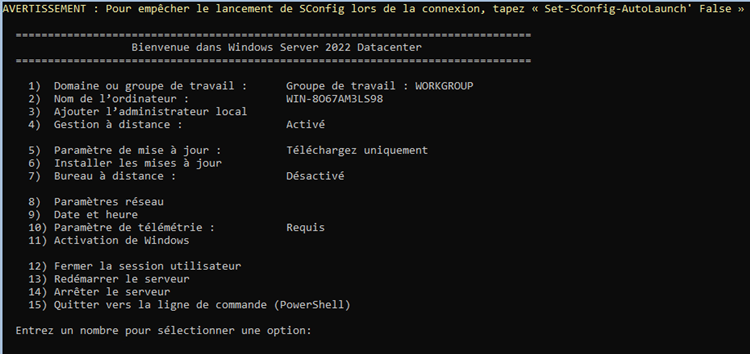
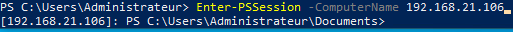
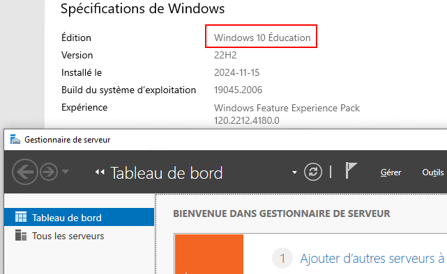
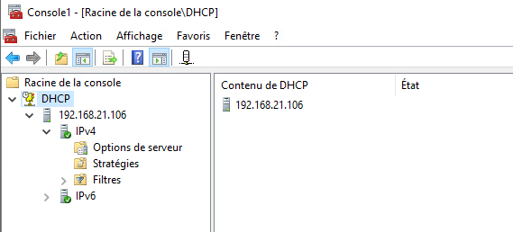
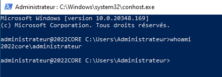

# Cours 2

## L'interface graphique (GUI)
Au dernier cours, vous avez installé votre premier serveur sous Windows. Cela dit, vous aviez une interface graphique pour vous aider. La réalité est que, la plupart du temps, cette interface graphique ne nous ait pas vraiment utile. En outre, elle consomme des ressources et pose un risque de « bogue 🐛 » supplémentaire. Vous l'aurez donc compris, aujourd'hui nous nous attaquerons au mode « core » de Windows Serveur.

 
*Écran de démarrage de Windows Serveur Core*

## Le mode « Core »
Le mode « core » de Windows Serveur consiste en une installation minimale, qui ne comprend pas l'interface graphique traditionnelle 😨. Ce mode permet de déployer un serveur avec uniquement les fonctionnalités essentielles, ce qui offre plusieurs avantages en termes de performance, de sécurité et de gestion. Il est principalement utilisé dans des environnements où la gestion à distance ou via Powershell est privilégiée.

### Avantages du mode « Core »

- **Moins de surface d'attaque:** L'absence d'interface graphique réduit certaines vulnérabilités potentielles, ce qui améliore la sécurité du serveur.

- **Meilleure performance:** Moins de ressources sont nécessaires pour faire fonctionner l'interface graphique, ce qui permet de libérer une certaine quantité de mémoire vive (RAM) ainsi que de la puissance de calcul (CPU) pour les services essentiels.

- **Moins de maintenance:** Ce mode possède moins de composants à mettre à jour ou à sécuriser, réduisant ainsi la charge de la maintenance pour les administrateurs.

- **Installation rapide:** Grâce à l'absence de l'interface graphique et des services qui y sont associés, l'installation est accélérée.

- **Réduction de la consommation énergétique:** Moins de ressources utilisées et moins d'opérations signifient forcément une réduction de l'empreinte sur la consommation d'énergie.

### Inconvénients du mode « Core »

- **Complexité de gestion:** Étant donné qu'il n'y a ni bureau, ni fenêtre, ni explorateur Windows, l'administration du serveur doit être faite via Powershell, l'invite de commande standard ou via les outils d'administration à distance telle que RSAT ( *Remote Server Administration Tool* ).

- **Apprentissage et adaptation:** Pour les administrateurs habitués à l'interface graphique, une courbe d'apprentissage et d'adaptation est nécessaire pour maîtriser les commandes et les outils à distance.

- **Limitations pour certains rôles:** Certaines applications ou rôles nécessitent une interface graphique pour l'installation et la configuration initiale.

- **Dépendance au réseau:** Bien qu'il soit possible d'utiliser des outils de gestion à distance, une connexion réseau est nécessaire pour que ces outils fonctionnent, ce qui peut poser un réel problème si le serveur devient inaccessible depuis le réseau.

## Administration d'un serveur en mode « core »

### Powershell à distance

Powershell est l'outil qui est généralement privilégié pour gérer Windows Serveur Core, car il offre une interface puissante et flexible permettant d'automatiser la gestion et l'administration de serveurs à distance. Il est possible d'exécuter des commandes Powershell sur des serveurs via *PowerShell Remoting*, une fonctionnalité permettant l'exécution de commandes sur un serveur distant.

 
*Ouverture d'une session Powershell à distance*

### Les outils RSAT

Les outils d'administration de serveur à distance sont un ensemble d'outils et de fonctionnalités qui permettent aux administrateurs système de gérer et de configurer à distance des serveurs Windows à partir d'un poste de travail standard. Ces outils sont particulièrement utiles dans des environnements où les serveurs sont déployés sans interface graphique ou lorsqu'on préfère une gestion centralisée.

 
*Le gestionnaire de serveur installé sous Windows 10 grâce à RSAT*

### Les consoles MMC

La *Microsoft Management Console* permet de gérer de nombreux rôles et fonctionnalités de Windows Serveur via des *snap-ins* spécifiques. Ces consoles peuvent être utilisées à distance pour gérer les rôles installés sur le serveur « Core ».

 
*La console MMC branchée sur le serveur DHCP à distance*

### Via SSH

Le SSH ( *Secure Shell* ) est une autre méthode efficace pour administrer à distance Windows Serveur « Core ». Depuis Windows Serveur 2019 et Windows Serveur 2022, Microsoft a intégré la possibilité d'installer et d'utiliser le serveur SSH natif dans le système d'exploitation, ce qui permet aux administrateurs de se connecter à distance en utilisant le protocole SSH, une méthode largement utilisée sur les systèmes Linux et macOS.

 
*Connexion SSH établit avec le serveur Windows « Core »*