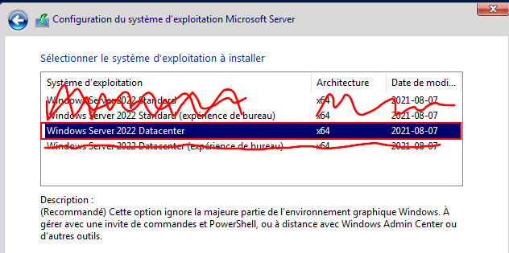
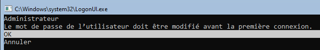
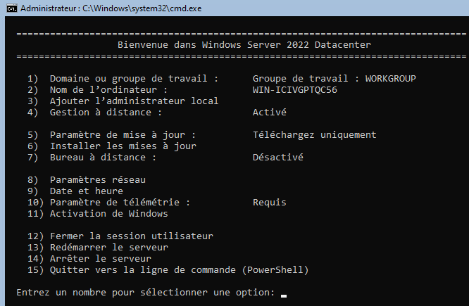
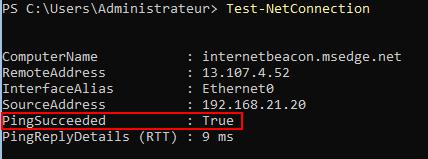
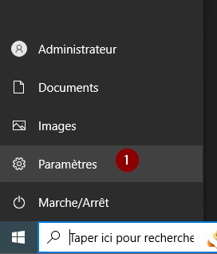
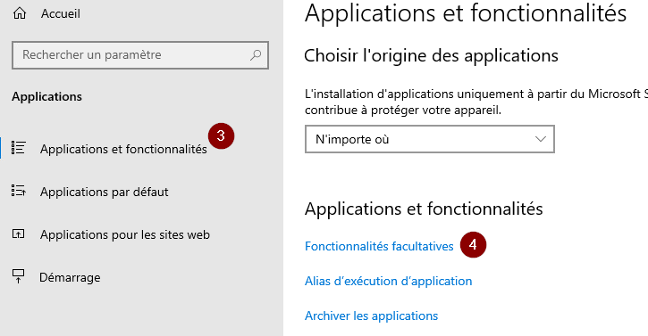
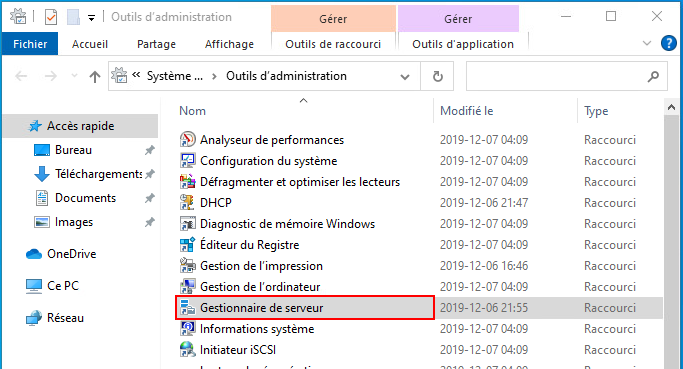
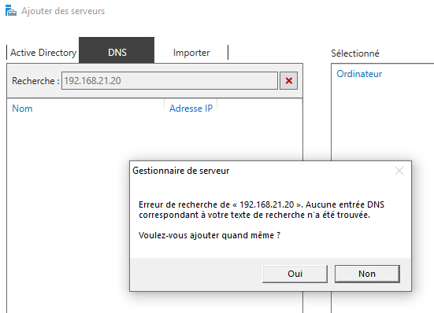
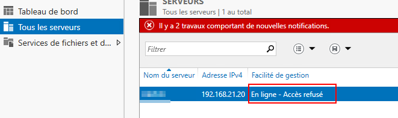
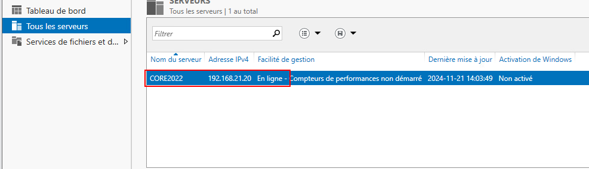

import useBaseUrl from '@docusaurus/useBaseUrl';
import ThemedImage from '@theme/ThemedImage';

# Laboratoire 2

* * *
## Installation de Windows Serveur 2022 mode « Core »

## Préalable(s)

- Avoir complété le laboratoire # 1

## Objectif(s)
- Installer et administrer Windows Serveur 2022 en mode « Core »

* * *
## Schéma

<ThemedImage
    alt="Schéma"
    sources={{
        light: useBaseUrl('/img/Serveurs1/Laboratoire2_W.svg'),
        dark: useBaseUrl('/img/Serveurs1/Laboratoire2_D.svg'),
    }}
/>
* * *

## Étapes de réalisation

### Installation de Windows Serveur en mode « Core »

1. Il n'y a malheureusement pas de modèle prêt à l'usage dans Labinfo de Windows Serveur 2022 en mode « Core », il faudra procéder à son installation depuis l'image du DVD. Commencez par vous diriger dans Labinfo puis créez une nouvelle machine virtuelle suivant les caractéristiques suivantes:<br/>

    |Matériel|Spécifications|
    |:------:|:------------:|
    | CPU | 2 |
    | RAM | 4 Go |
    | HDD | 60 Go |
    | Réseau | Votre réseau virtuel ( *L-NNN-01* )
    | Lecteur DVD | iso de Serveur 2022 |


2. Démarrez votre machine virtuelle et appuyez sur une touche pour lancer l'installation de Windows Serveur. Le temps venu, sélectionnez l'option *Windows Server 2022 Datacenter* <u>**sans l'option (expérience de bureau)**</u><br/><br/>


3. Laissez le processus d'installation s'exécuter jusqu'à ce que vous ayez une console vous demandant de définir un mot de passe pour le compte `Administrateur`. Définissez le mot de passe <mark>Passw0rd</mark> comme mot de passe pour le compte.<br/><br/>


4. Une fois que vous verrez ce menu, votre installation sera complétée.<br/><br/>


### Attribution d'un nom cohérent au serveur

1. Renommez votre serveur convenablement. Pour ce faire, vous pouvez passer directement par le menu qui est affiché à l'écran (option #2) ou en utilisant la commande Powershell appropriée (option #15).

    :::tip[Renommer un ordinateur en Powershell]
    Pour renommer un ordinateur à l'aide de PowerShell, vous pouvez utiliser la commande suivante:
    ```Powershell
    Rename-Computer -NewName NouveauNom
    ```
    :::

### Configuration d'une adresse IP Statique

1. Un serveur possède <u>**toujours**</u> une adresse IP statique. Ce serveur ne fera donc pas exception, utilisez l'option #8 du menu sconfig pour configurer une adresse IP statique au serveur. Utilisez les configurations suivantes:

    |Paramètre|Valeur|
    |:-------:|:----:|
    | Adresse IP | 192.168.21.20 |
    | Masque de sous-réseau | 255.255.255.0 |
    | Passerelle | 192.168.21.1 |
    | Serveur DNS | 192.168.21.1 |
    | Serveur DNS auxiliaire | 8.8.8.8 |

    :::caution
    Les informations que vous avez à configurer ci-dessus vous demanderont d'entrer plusieurs fois dans le même menu de configuration du réseau (option #8) : <u>**C'est normal**</u>
    :::

    Une fois votre configuration statique complété, testez votre configuration en utilisant la commande `Test-NetConnection` dans la console Powershell de votre Serveur.

    ```Powershell
    Test-NetConnection
    ```

    <br/>
    *Résultat positif d'un test de connexion*

### Gestion du serveur à distance

À présent nous allons installer les outils « RSAT » sur votre poste de travail Windows 10 afin de faire la gestion de notre serveur « Core » à distance.

1. Sur votre poste de travail Windows 10, ouvrez le panneau des paramètres puis cliquez sur « Applications ».

    
    

2. Dans le menu des applications, cliquez sur « Applications et fonctionnalités », puis sur « Fonctionnalités facultatives ».

    

3. Dans la fenêtre des fonctionnalités facultatives, sélectionnez « Ajouter une fonctionnalité », sélectionnez « RSAT : gestionnaire de serveur » puis cliquez sur « Installer ».

4. Une fois la fonctionnalité installée, vous devriez être en mesure de retrouver le gestionnaire sur votre PC Windows 10 dans les outils d'administration Windows. (Menu démarrer > Outils d'administration Windows)

    

5. Démarrez le gestionnaire de serveur et cliquez sur « Ajouter d'autres serveurs à gérer ».

    

6. Dans l'onglet « DNS », entrez l'adresse IP de votre serveur Windows 2022 « Core » et cliquez sur rechercher.

    

    :::caution[Erreur de recherche]
    Si vous obtenez une erreur de recherche dût à l'absence d'entrée DNS, vous pouvez ignorer le message. Nous nous attarderons au fonctionnement des DNS dans les cours à venir. Vous pouvez ajouter le serveur quand même.
    :::

7. Une fois votre serveur ajouté, vous aurez sans doute un message d'erreur dans le gestionnaire de serveur vous indiquant « Échec de l'actualisation ». Ce message apparait pour des raisons de sécurité. En effet, votre PC ne reconnait pas le serveur car ils ne se sont jamais croisés sur le réseau auparavant. Il nous faudra donc indiquer à notre PC qu'il s'agit bien d'un serveur légitime et qu'il peut lui faire confiance pour s'y connecter à distance. Pour ce faire, nous devrons ajouter le serveur sur une liste spéciale: la « TrustedHosts List ». À l'aide d'une interface Powershell en mode Administrateur, entrez la ligne de commande suivante:

    ```Powershell
    Set-Item WSMan:\localhost\Client\TrustedHosts 192.168.21.20 -Concatenate
    ```
    :::danger[En ligne - Accès refusé]
    Certains étudiants ont rencontrés cette erreur durant le laboratoire:

    
    
    Il s'agit d'une erreur d'authentification causé par le fait que votre PC tente de se connecter avec votre utilisateur et votre mot de passe actuel. Or, ces informations diffèrent parfois entre les deux machines. Pour résoudre ce problème, effectuez les étapes suivantes:

    1. Faites un clic à l'aide du bouton de droite de la souris sur l'adresse IP affichée et sléectionnez « Gérer en tant que... »

    2. Dans la fenêtre d'authentification, dans le champ utilisateur, entrez l'adresse IP du serveur, suivi du nom d'utilisateur du serveur, séparé par une barre oblique inverse. Exemple: 1.2.3.4\Administrateur

    3. Entrez le mot de passe du compte Administrateur (généralement *Passw0rd*)
    
    4. Confirmez le tout, l'erreur devrait disparaitre au bout de quelques secondes.
    :::

    Une fois cette commande validée, cliquez sur le bouton « rafraîchir » dans votre gestionnaire de serveur. Vous devriez être en mesure de gérer votre serveur à distance, c'est-à-dire y ajouter des rôles et entreprendre tout action comme si vous étiez directement sur celui-ci.

    