import useBaseUrl from '@docusaurus/useBaseUrl';
import ThemedImage from '@theme/ThemedImage';

# Laboratoire 3

* * *
## Installation d'Ubuntu Serveur 24.04 LTS

## Préalable(s)

- Avoir complété le laboratoire # 2

## Objectif(s)
- Installer Ubuntu Serveur 24.04 LTS
- Configurer l'adresse IP du serveur via Netplan
- Se brancher au terminal à distance via SSH

* * *
## Schéma

<ThemedImage
    alt="Schéma"
    sources={{
        light: useBaseUrl('/img/Serveurs1/Laboratoire3_W.svg'),
        dark: useBaseUrl('/img/Serveurs1/Laboratoire3_D.svg'),
    }}
/>

* * *

## Étapes de réalisation

### Installation de Ubuntu Serveur 24.04 LTS

* * *

#### Création de la machine virtuelle
Éventuellement, je vous fournirai un modèle pour créer de nouveaux serveurs Ubuntu. Cela dit, vous vous devez d'expérimenter l'installation au moins une fois. Commencez par vous diriger dans Labinfo puis créez une nouvelle machine virtuelle suivant les caractéristiques suivantes:<br/>

    |Matériel|Spécifications|
    |:------:|:------------:|
    | CPU | 2 |
    | RAM | 4 Go |
    | HDD | 60 Go |
    | Réseau | Votre réseau virtuel ( *L-NNN-01* )
    | Lecteur DVD | iso de Ubuntu Server 24.04.1 |

#### Lancement de l'installation
Démarrez votre machine virtuelle, lorsque vous verrez le menu ci-dessous apparaître, sélectionnez « Try or Install Ubuntu Server »

    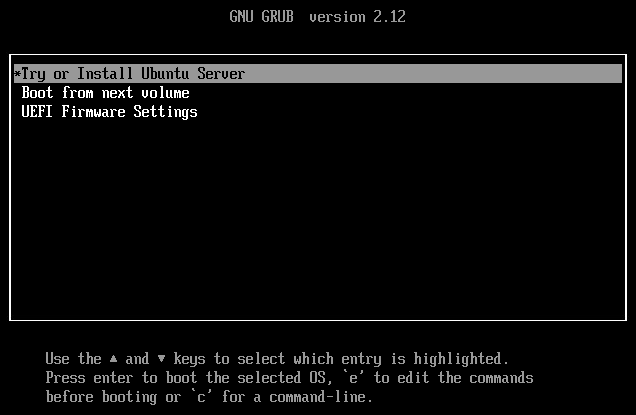

#### Langue du système
Une fois le chargement de l'installateur terminé, vous serez amené à choisir la langue de votre système. Utilisez la langue de votre choix. En ce qui me concerne, je vais choisir la langue française pour m'assurer de la compréhension de tous.

    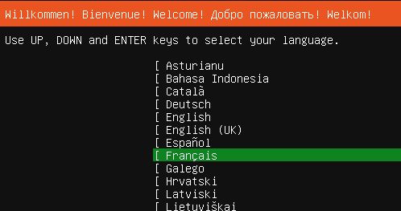

#### Mise à jour du programme d'installation
À l'étape suivante, il se peut qu'Ubuntu vous mentionne l'existance d'un programme d'installation plus récent. Il n'est **pas** obligatoire de procéder à cette mise à jour du programme d'installation. Néanmoins, elle reste recommandable.

    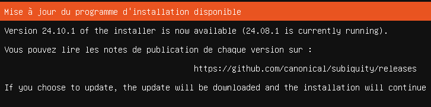

    :::info
    Ce qui déterminera si Ubuntu vous proposera une mise à jour du programme d'installation, c'est:
    - Est-ce qu'une connexion à internet a été détecté par votre serveur.
    - Possédez-vous déjà la dernière version du programme d'installation.
    :::

#### Configuration du clavier
À l'étape suivante, vous serez amené à configurer la disposition de votre clavier.<mark>Prenez le temps de le configurer comme il se doit!</mark> La configuration peut se changer par la suite, mais ce n'est pas une procédure agréable à faire. Si, comme moi, vous choisissez d'opter pour un clavier canadien français, vous devez modifier le *layout* pour *French (Canada)*

    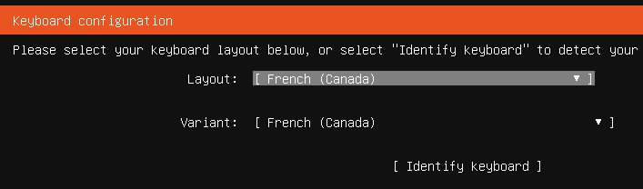

#### Version à installer
À l'étape suivante, vous devrez choisir quelle version d'Ubuntu vous désirez installer. Sélectionnez la version standard (pas minimized). La version *minimized* possède très peu d'outil et ne nous permet pas de gérer le serveur directement depuis sa console.

    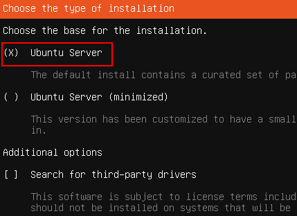

#### Configuration du réseau
Cette étape vous permet de configurer le réseau de votre serveur via différents champs à compléter. Cela dit, nous ne passerons pas par ici pour effectuer cette configuration car nous mettrons en pratique ce que nous avons appris avec *Netplan*. Laissez donc les configurations comme elles sont pour le moment. Il en va de même pour les configurations du proxy à l'écran suivant.

    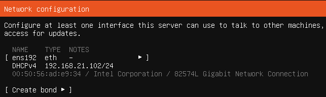

#### Configuration du *repo* par défaut 
Une fois ici, Ubuntu tentera de communiquer avec son dépôt par défaut. Pour rappel, un dépôt (*repository* en anglais) est un serveur sur lequel un système d'exploitation peut se connecter pour télécharger divers paquets, comme des mises à jour ou des logiciels par exemple. La particularité pour Ubuntu Serveur, c'est que nous pourrions utiliser un autre dépôt que celui qui est configuré par défaut. À titre d'exemple, il est tout à fait possible d'avoir un dépôt sur son réseau local, à ce moment, il est plus pratique et surtout, plus rapide, d'utiliser le dépôt à l'interne. Pour l'instant, nous utiliserons le dépôt par défaut. Nous verrons comment nous pouvons le modifier ultérieurement.

    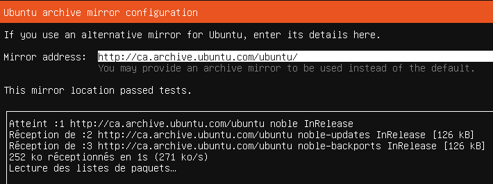

#### Configuration du disque dur
Ubuntu vous proposera alors de configurer votre disque dur. Je vous <u>recommande fortement</u> de déselectionner « Set up this disk as an LVM group ». La technologie LVM ajoute une couche logique supplémentaire pour gérer nos stockages. Bien que cette technologie soit très intéressante, elle demeure hors des limites de ce cours. Dans l'objectif de gérer nos stockages le plus simplement possible, je vous suggère donc de désactiver LVM.

    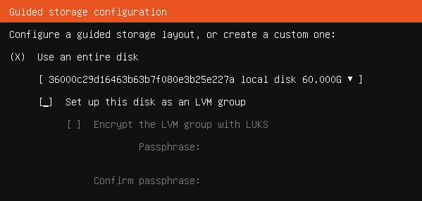

#### Configuration de votre profile
À partir d'ici, l'installation du système est officiellement commencée. Pendant la copie et la configuration des fichiers, Ubuntu vous proposera d'entrer les informations nécessaires à la création d'un profil utilisateur.

    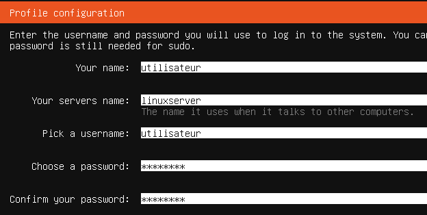

#### Ubuntu Pro
Ubuntu Pro est une nouvelle offre de Canonical pour les entreprises utilisant Ubuntu. En gros, Ubuntu Pro offre du support pour une plus longue durée (10 ans), en plus d'offrir un support 24/7 en cas de problème. Évidemment, tout cela pour une coquette somme. C'est pourquoi nous ne l'utiliserons pas.

    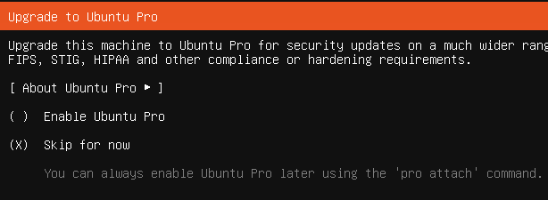

#### Configuration SSH
Nous pourrions, dès maintenant, installer un service SSH nous permettant d'accéder à notre serveur à distance. <mark>Ne le faites pas!</mark> Nous installerons bien ce service mais nous le ferons d'une autre façon un peu plus tard. Ignorez cette offre pour le moment.

    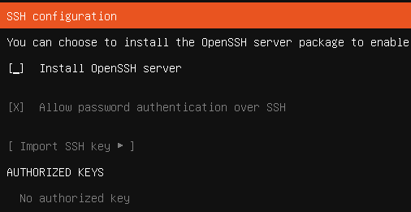

#### Offre d'applications snaps
Les applications SNAPS permettent d'installer différents logiciels un peu comme on le ferait sur un Windows Store ou un Apps Store. Ubuntu vous offre quelques-unes des applications les plus populaires sur son système d'exploitation. N'en cochez aucune et poursuivez plutôt votre installation.

    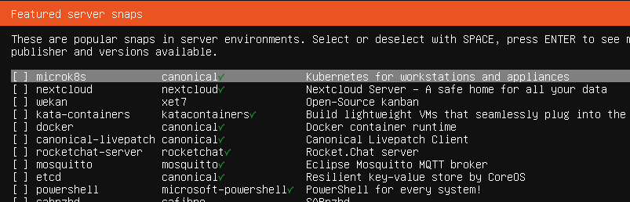

### Configuration de votre carte réseau
Vous avez présentemment une configuration réseau en mode dynamique. C'est-à-dire que votre adresse IP vous est attribué par le biais de votre passerelle. Nous allons à présent changer cela afin que votre serveur utilise plutôt une adresse IP statique (toujours la même).

#### Ajout d'un fichier YAML pour Netplan
Créez un fichier supplémentaire dans le dossier `/etc/netplan`. Utilisez le nombre 60 pour commencer le nom de ce fichier. Par exemple: `60-maconfig.yaml`. [Référez-vous à la théorie](00-Cours3.md#créer-votre-config-yaml) sur la création d'un fichier de configuration réseau pour bien configurer l'adressage de votre serveur.

### Configuration du service SSH
Le service SSH vous permettra de vous connecter à la ligne de commande de votre serveur à distance. Pour ce faire, vous devez installer le paquet `openssh-server` comme suit:

```bash
sudo apt install openssh-server -y
```

Une fois le service installé, vous pourrez le démarrer:

```bash
sudo systemctl start ssh.service
```

Si vous désirez que ce service démarre automatiquement avec le démarrage du serveur, vous pouvez autoriser son démarrage automatique avec la ligne de commande suivante:

```bash
sudo systemctl enable ssh.service
```

#### Se connecter depuis Windows
Depuis un poste de travail Windows, vous pouvez vous connecter à votre serveur en utilisant l'invite de commandes. Ouvrez l'invite de commandes sous Windows et tapez la commande suivante:

```bash
ssh utilisateur@192.168.21.20 #Utilisez vos informations personnelles: Nom d'utilisateur et ip du serveur
```