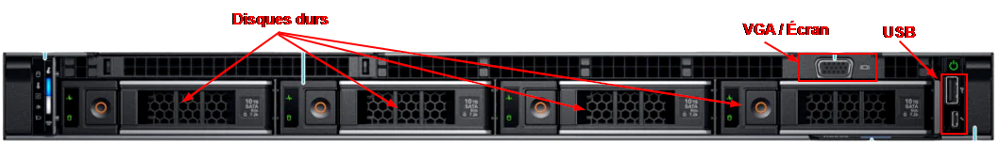
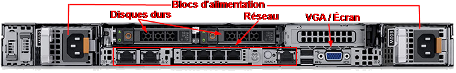
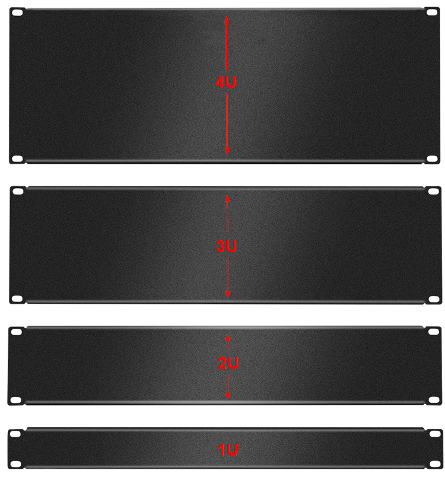
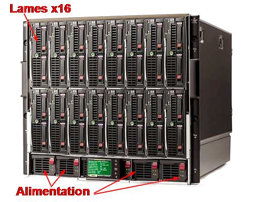
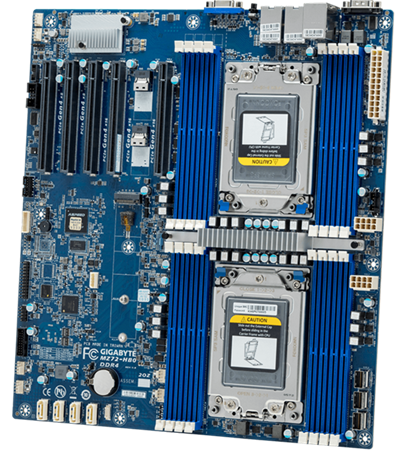
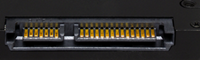
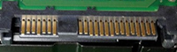
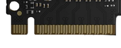
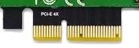
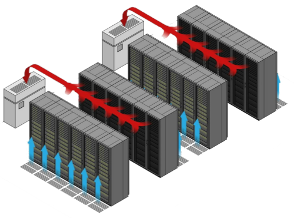

import useBaseUrl from '@docusaurus/useBaseUrl';
import ThemedImage from '@theme/ThemedImage';

# Cours 4

## Les serveurs physiques <FAIcon icon="fa-solid fa-server" size="1x"/>

Nous avons récemment défini ce qu'était un serveur informatique en classe. Pour rappel, il s'agit d'un ordinateur offrant un ou plusieurs services sur le réseau. Ce n'est pas plus compliqué que cela.

> *« Mais Gabriel, les serveurs informatiques c'est aussi de grosses machines puissantes et performantes non ? »*
>
> -Les étudiants

Oui, et non! Le besoin de puissance dépend directement de la charge de travail du serveur. Un serveur desservant 5 à 25 clients n'a pas besoin d'être ultra-performant. En revanche, un serveur desservant plusieurs centaines de clients, voire des milliers de clients, devra posséder la capacité d'y arriver. Cela passera, évidemment, par la quantité de mémoire, la puissance de calcul et la quantité de stockage. Certaines entreprises ont même besoin de plusieurs de ces machines puissantes pour opérer. Ces machines hautement performantes, on les appelle des serveurs physiques.

### R.A.S

Lorsque vous mettez en place un, ou des serveurs pour répondre aux différents besoins d'une entreprise, gardez toujours en tête ces trois lettres: R-A-S

- **R**eliability ( *Fiabilité* ) 
    Le ou les serveurs que vous mettez en place doivent être en mesure d'opérer de façon continue et en minimisant le risque d'erreur. L'intégrité des données et des services offerts doit être protégée à tout prix.

- **A**vailability ( *Disponibilité* ) 
    Les conséquences d'un service en échec doivent être minimes ou inexistantes aux yeux des clients.

- **S**erviceability ( *Entretien* ) 
    Le temps d'intervention pour corriger un problème et remettre le serveur opérationnel doit être minime.

### Formats des serveurs physiques

On retrouve principalement trois formats de serveur physique sur le marché.

#### Serveurs de type tour

Le serveur de type « tour » ou « tower » est sans doute qui ressemble le plus à un PC standard. Il possède l'avantage de pouvoir accueillir plusieurs composantes d'extension (carte réseau supplémentaire, carte raid, etc.). Cela dit, le matériel dédié aux serveurs physiques est généralement plus dispendieux que le matériel pour les PC standards.

 *Représentation d'un serveur de type tour*

#### Serveurs en « rack »

Le serveur en « rack », parfois appelé « rackmount » sert principalement à économiser de l'espace (au pied carré). Ce type de serveur physique est facilement reconnaissable de par sa forme de boîte à pizza. Ce type de serveur physique est sans doute le plus populaire dans les entreprises et les centres de données. Ils sont installés dans des armoires métalliques standardisées de 19 pouces de large. Ces armoires sont conçues pour favoriser le passage des câbles, la ventilation et l'alimentation électrique.

 *Représentation d'un serveur « rackmount » (face avant)*

 *Représentation d'un serveur « rackmount » (face arrière)*

:::tip[Le saviez-vous ?]
Avez-vous remarqué que le serveur de l'image ci-dessus possède deux blocs d'alimentation ? Vous l'aurez deviné, c'est pour éviter un arrêt de service si un bloc d'alimentation devient défectueux. On parlera donc de redondance électrique. 
> *Oui mais Gabriel, s'il y a une panne d'électricité, on ne sera pas plus avancé non ?*
>
Effectivement! C'est pourquoi les entreprises ont généralement des alimentations électriques secondaires telles que des batteries de secours (ondulateurs) et parfois même des génératrices qui prendront le relais en cas de panne électrique.
:::

##### Dimensions
Les serveurs en « rack » ont toujours la même largeur (19 pouces), mais leur hauteur ainsi que leur profondeur peuvent varier en fonction des composantes qu'ils comportent. Même si la hauteur des serveurs en « rack » peut varier, celle-ci est tout de même normée. En effet, la hauteur d'un serveur de ce type est calculée en **U** ( *Rack Unit* ). 1U correspond à une hauteur de 1,75 pouce. Un serveur de 2U aura donc une hauteur de 3,5 pouces, ainsi de suite.

#### Serveurs en lame (blade)

Les serveurs en lame (blade) sont des serveurs conçus pour limiter au maximum l'encombrement physique que causent les câbles, les systèmes de refroidissement, les stockages, etc. Les serveurs sont enfichables dans un châssis qui regroupe certains éléments communs à tous les serveurs:
 - Alimentation
 - Refroidissement
 - Connexions réseau
 - Stockage

 

### Composantes internes

Les composantes internes d'un serveur sont *grosso modo* les mêmes que dans un PC standard. Cela dit, il y a certaines différences qu'il faut tout de même aborder.

#### Carte mère

La carte mère d'un serveur se distinguera de la carte mère de PC par les éléments suivants:

- Elle possède parfois plus d'un socle pour les processeurs.
- Elle comporte <u>beaucoup</u> de baies pour la mémoire vive (8 ou +)
- Elle n'a que des ports de bases. Oubliez le port HDMI ou même la sortie audio.

 *Représentation d'une carte mère de serveur physique*

#### Processeur

Généralement, les fabricants de processeurs (Intel et AMD) possèdent une classe de processeur réservé aux serveurs physiques. Chez Intel, la série de processeurs [Xeon](https://www.intel.com/content/www/us/en/products/details/processors/xeon.html) est généralement réservée à l'utilisation au sein de serveurs physiques. Quant à AMD, c'est la série [EPYC](https://www.amd.com/en/products/processors/server/epyc.html) qui est utilisée pour les serveurs. Il serait assez facile de croire que les processeurs dédiés aux serveurs physiques sont les plus puissants qui soient, mais ce n'est pas le cas. Pourquoi ? Parce qu'on veut de la performance dans nos serveurs, mais pas au prix de la stabilité du système. N'oubliez pas, les serveurs sont d'abord et avant tout là pour offrir un service de manière stable et régulière.

#### Mémoire vive

La mémoire vive utilisée au sein des serveurs physiques bénéficie généralement de la technologie **ECC** (Error Correcting Code). C'est un type de mémoire capable de détecter et corriger les erreurs les plus courantes de corruption de données. Même si cette mémoire peut être légèrement plus lente quant au traitement des données, on la préférera pour sa fiabilité.

:::tip[Le saviez-vous ?]
On reconnait généralement la mémoire ECC simplement en la regardant puisqu'elle comporte une puce supplémentaire:

:::

#### Stockage interne

La grande majorité des serveurs physiques possèdent des baies de disque dur (emplacement à l'intérieur du serveur) pour y installer du stockage. Les serveurs physiques peuvent posséder des disques durs standards et des disques durs électroniques à travers une panoplie d'interfaces. Voici un tableau récapitulant les différentes interfaces possibles pour les stockages internes des serveurs physiques:

| **Interface** | **Type de périphérique**             | **Vitesse maximale**             | **Utilisation principale**                                     | **Caractéristiques**                                                                 | **Image**       |
|---------------|--------------------------------------|----------------------------------|-----------------------------------------------------------------|---------------------------------------------------------------------------------------|-----------------|
| **SATA**      | Disques durs (HDD), SSD              | Jusqu'à 6 Gb/s (SATA III)        | Stockage de masse, serveurs standards, environnements non critiques | Facile à utiliser, bon rapport qualité/prix, plus lent que SAS et NVMe.               |     |
| **SAS**       | Disques durs (HDD), SSD professionnels | Jusqu'à 12 Gb/s (SAS-3), 24 Gb/s (SAS-4) | Serveurs professionnels, stockage RAID, environnements exigeants | Plus rapide et fiable que SATA, topologie en chaîne pour plusieurs périphériques.    |      |
| **NVMe**      | SSD haute performance                | Jusqu'à 32 Gb/s (PCIe 4.0), 64 Gb/s (PCIe 5.0) | Applications haute performance, bases de données, virtualisation | Très faible latence, performances extrêmement rapides, utilise le bus PCIe.           |     |
| **PCIe**      | SSD, cartes d'extension (RAID, NVMe) | Jusqu'à 64 Gb/s (PCIe 5.0)       | Stockage haute performance, ajout de cartes SSD ou RAID         | Utilisé pour ajouter des périphériques à un serveur, offre des vitesses ultrarapides. |     |

#### RAID

RAID est un acronyme qui signifie *Redundant Array of Independent Disks*. C'est une technologie qui a été créé à l'origine pour assurer une redondance des données et augmenter les performances des disques durs. Pour arriver à ses fins, le raid fera l'étalonnage des données, des copies ainsi qu'un calcul de vérification.

##### RAID 0 - *Striping*

En RAID0, les données sont étalonnées sur le disque. Cette façon de procéder accélère la vitesse de lecture et d'écriture des données. Cependant, ce RAID n'assure aucune sécurité quant à la possible perte de données. Dans l'éventualité où l'un des disques durs tomberait en panne, toutes les données seraient perdues. 😱

    <ThemedImage
        alt="Schéma"
        sources={{
            light: useBaseUrl('/img/Serveurs1/Raid0_W.gif'),
            dark: useBaseUrl('/img/Serveurs1/Raid0_D.gif'),
        }}
    />

##### RAID 1 - *Mirroring*
En RAID1, les données sont simplement copiées sur un second disque dur. Il n'y a absolument aucun gain au niveau des performances en lecture et écriture, cependant comme les données sont conservées en double, celles-ci peuvent survivre à la perte d'un disque dur.

    <ThemedImage
        alt="Schéma"
        sources={{
            light: useBaseUrl('/img/Serveurs1/Raid1_W.gif'),
            dark: useBaseUrl('/img/Serveurs1/Raid1_D.gif'),
        }}
    />

##### RAID 1 + 0 - *Mirroring + Striping*
Avec le RAID0 et le RAID1, on dirait qu'il faut choisir entre performances et sécurité. Un choix que beaucoup redoutent puisque chacun de ces choix pourrait engendrer des conséquences désagréables. Alors, pourquoi ne pas tenter de bénéficier des deux technologies en même temps ? C'est exactement ce à quoi le RAID 1 + 0 ( aussi appelé RAID10 ).

    <ThemedImage
        alt="Schéma"
        sources={{
            light: useBaseUrl('/img/Serveurs1/Raid10_W.gif'),
            dark: useBaseUrl('/img/Serveurs1/Raid10_D.gif'),
        }}
    />

On crée une grappe entre les disques 1 & 2 ainsi qu'une grappe entre les disques 3 & 4. Chacune de ces grappes utilisera la technologie RAID1. Puis on créera un RAID0 entre les deux grappes précédentes. Les données seront donc traitées dans l'ordre suivant:
- Les données sont d'abord étalonnées entre les deux grappes. 
- Les données sont ensuite copiées au sein de chaque grappe.

##### RAID 5 - *Striping avec parité*
Le RAID5 permet de bénéficier aussi de l'étalonnage des données tout en les sécurisant. Cela dit, le RAID 5 a sa propre méthodologie de fonctionnement. Au lieu d'effectuer une copie intégrale des données, le RAID 5 utilise plutôt ce que l'on nommera *la parité*. Cette technologie utilise un algorithme mathématique et en étalonne le résultat sur les disques durs. Ainsi, en cas de perte de l'un des disques durs, nous n'aurons qu'à insérer un nouveau disque dur et le RAID sera en mesure de se reconstruire de par lui-même.

    <ThemedImage
        alt="Schéma"
        sources={{
            light: useBaseUrl('/img/Serveurs1/Raid5_W.gif'),
            dark: useBaseUrl('/img/Serveurs1/Raid5_D.gif'),
        }}
    />

##### Différences entre RAID 5 et 10

| Critère                 | RAID 5                            | RAID 10                           |
|-------------------------|-----------------------------------|-----------------------------------|
| **Nombre de disques**    | Minimum 3                        | Minimum 4                        |
| **Redondance**           | Parité répartie                  | Mirroring (dupliqué)             |
| **Capacité utilisable**      | (n - 1) * taille d'un disque     | 50% de la capacité totale        |
| **Performance en lecture**| Très bonne                       | Excellente                       |
| **Performance en écriture**| Moyenne (calcul de parité)       | Excellente (pas de parité)       |
| **Tolérance aux pannes** | 1 disque                         | 1 disque par miroir              |
| **Coût**                 | Moins cher (moins de disques)     | Plus cher (plus de disques)      |
| **Complexité**           | Modéré (calcul de parité)        | Simple (duplication)             |
| **Idéal pour**           | Stockage de données avec lecture intensive | Applications nécessitant haute performance et sécurité |

#### LVM - *Logical Volume Manager*

Le gestionnaire de volume logique est une technologie d'abstraction qui se situe entre les stockages physiques et ce que le système nous présentera en termes de stockage. L'objectif ultime d'une structure LVM est d'apporter une plus grande flexibilité aux administrateurs dans la gestion des stockages sous Linux.

:::caution[RAID vs LVM]
La technologie RAID & LVM sont complètement distinctes. Elles ne répondent pas aux mêmes besoins et ne sont donc pas comparables. D'ailleurs, elles peuvent même être complémentaire. Il est tout à fait possible d'utiliser à la fois RAID & LVM.
:::

##### Comment ça fonctionne ?

Pour expliquer le fonctionne de LVM, il faut d'abord définir certains éléments. Ensuite, je vous présenterai un schéma visuel pour que vous puissiez assembler les pièces du casse-tête.

- PV ( *Physical Volume* ):
Il s'agit des partitions physiques présentes sur votre ou vos disques durs. Le terme *physical* décrit bien l'aspect bas-niveau de cet élément.

- VG ( *Volume Group* ):
Les *Volume Groups* permettent d'assembler plusieurs partitions physiques ensemble, et ce, même si ces partitions se trouvent sur des disques durs distincts. Cela permet par exemple, de rassembler deux disques durs de 60Go dans un seul et même volume de 120Go.

- LV ( *Logical Volume* ):
C'est un espace que l'on peut définir dans le groupe de volume sur lequel nous installerons un système de fichiers. Vous pouvez vous imaginer cet endroit comme l'équivalent d'une partition physique sans l'utilisation de LVM.

Voici un schéma qui vous permettra de mieux saisir comment le tout fonctionne:

    <ThemedImage
        alt="Schéma"
        sources={{
            light: useBaseUrl('/img/Serveurs1/LVM_W.png'),
            dark: useBaseUrl('/img/Serveurs1/LVM_D.png'),
        }}
    />

### Stockage externe

Outre les différents stockages internes qu'un serveur physique peut posséder, il existe également des technologies lui permettant d'exploiter des stockages externes. Attention, on ne parle pas simplement d'un disque dur USB mais bien de technologie plus avancée.

#### NAS

Le NAS ou *Network Attached Storage* est un type de serveur de fichiers sur lequel on y retrouve habituellement de la redondance, des sauvegardes programmées ainsi que des disques durs performants. Il présente certains avantages intéréssants comme la centralisation des données ainsi que des moyens de sécuriser ces dernières. Néanmoins, le NAS présente certains inconvénients également. Les données envoyées au NAS doivent transiger par le réseau, ce qui peut provoquer de l'achanladage sur celui-ci. De plus, la vitesse de transfert des données à travers un réseau est souvent limité.

#### SAN

Le SAN ou *Storage Area Network* procure un accès de bas niveau aux disques durs. Contrairement au NAS, où l'accès aux fichiers passent par des partages de dossier et nécessite des services en place, le SAN est un accès directe aux disques durs. Les serveurs sont reliés à l'espace de stockage via un lien fibré, ce qui assure un accès pratiquement instantanné. Le SAN est plus performant que le NAS pratiquement en tout point. Cela dit, c'est un dispositif très dispendieux.

### Conditions d'opération

Les serveurs physiques ne sont généralement pas entreposés n'importe où car ils ont besoin que certaines conditions soient respectés. En effet, les serveurs physiques auront des exigences en matière de:

- Température
- Ventilation
- Taux d'humidité
- Sécurité de l'accès

#### Température
Les serveurs physiques sont des ordinateurs très puissants. Conséquemment, ils peuvent générer une grande quantité de chaleur. Il est primordiale de gérer cette chaleur puisqu'une température trop élevé provoquera des erreurs et des risques importants de surchauffe 🥵. *A contrario*, si nous conservons les serveurs dans un environnement trop froid, il risque d'y avoir de la condensation 💧 lorsque l'air froid entrera en contact avec l'air chaud produit par les serveurs. La clé se situe donc dans l'équilibre. Généralement, les salles où les serveurs physiques sont entreposés sont maintenues entre 18 et 27 degrés celsius.

#### Ventilation
Maintenir la température est une première étape, il faut aussi assurer une circulation d'air. Les serveurs en *rack* sont empilés les uns par dessus les autres, les ventiler comme il se doit peut donc s'avérer un défi. Ce type de serveur expulse l'air chaud à l'arrière. On essaiera donc d'amener de l'air frais à l'avant et de récupérer l'air plus chaud à l'arrière.

#### Humidité
L'humidité de l'air influe aussi sur le fonctionnement et l'usure des serveurs. Un air trop humide peut engendrer de la corrosion et créer des court-circuits. Au contraire, un air trop sec encourage la création d'électricité statique, ce qui peut évidemment endommager les équipements. Dans la salle où les serveurs opérent, on essaiera de conserver une humidité relative en 40% et 60%.

#### Accès et sécurité
La salle où sont stockés les serveurs doit posséder un accès contrôlé. Plusieurs serveurs hébergent des services et des données critiques à l'entreprise. Certainent entreprises dépendent littéralement de leurs services informatiques. L'accès au serveur doit être limité aux gens qualifiés. Un employé inconsciemment des risques pourrait s'enfargé dans des câbles et provoques des dommages considérables sans nécessairement le vouloir.