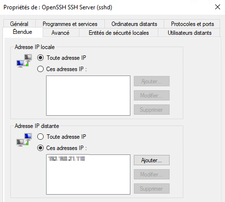

import useBaseUrl from '@docusaurus/useBaseUrl';
import ThemedImage from '@theme/ThemedImage';

# Laboratoire 6
* * *
## Configuration de pare-feu

## Préalable(s)

- Avoir complété le laboratoire # 4

## Objectif(s)
- Octroyer un accès SSH au serveur Ubuntu **seulement** au poste de travail Windows 10.
- Octroyer un accès SSH au serveur Windows **seulement** au poste de travail Windows 10.
- Permettre aux clients du réseau local d'envoyer des *pings* aux serveurs.

* * *
## Schéma

<ThemedImage
    alt="Schéma"
    sources={{
        light: useBaseUrl('/img/Serveurs1/Laboratoire6_W.svg'),
        dark: useBaseUrl('/img/Serveurs1/Laboratoire6_D.svg'),
    }}
/>

* * *

## Étapes de réalisation

Dans ce laboratoire, nous tiendrons pour acquis le poste de travail sous Windows 10 est celui de l'administrateur des serveurs. Ce poste de travail <mark>doit posséder une adresse IP fixe.</mark>

À titre d'exemple, voici les adresses IP que j'utiliserai pour mes exemples dans le cadre de ce laboratoire:

| Machine | Adresse IPv4 |
|:---------:|:--------------:|
| Windows Serveur 2022 | 192.168.21.20 |
| Ubuntu Serveur 24.04 LTS | 192.168.21.10 |
| Windows 10 | 192.168.21.110 (statique) |

### Windows Serveur

#### Préparation du serveur

- Si ce n'est pas déjà fait, assurez-vous que votre serveur Windows ait bien une adresse IP statique ainsi qu'un nom convenable (Pas WIN-8JHL1J92)

- Assurez-vous que votre serveur soit sur un profil de connexion privé.

#### Installation du service SSH sous Windows

- Nous allons à présent installer un service SSH sur notre serveur Windows. Cela dit, ce service ne devra être accessible que par le poste de travail Windows 10 (le poste de l'administrateur). Ouvrez le panneau des paramètres Windows et dirigez-vous dans la section « Applications ». De là, cliquez sur « Fonctionnalités facultatives » puis « Ajouter une fonctionnalité ».


- Dans la liste des fonctionnalités qui sont disponibles, installez la fonctionnalité « Serveur OpenSSH ». Une fois installé, ce service nous permettra d'atteindre la ligne de commande du serveur à distance.

#### Ajustement des règles du pare-feu (SSH)

- Si vous ne faites aucune modification, quiconque possédant un compte et un mot de passe sur le serveur pourrait s'y connecter en utilisant le protocole SSH, et ce, depuis n'importe quel poste. Ce que nous souhaitons faire ici, c'est non seulement autoriser la connexion seulement aux gens possédant un compte et un mot de passe, mais en plus, limiter l'accès depuis un seul poste.

- Ouvrez les règles du pare-feu Windows en tapant la commande `wf.msc` depuis la fenêtre « Exécuter » que vous pouvez ouvrir à l'aide du raccourci clavier <kbd>&#8862; win</kbd>+<kbd>r</kbd>. Dans les règles de trafic entrant, repérez cette règle:

    

    Ouvrez les propriétés de la règle en effectuant un clic à l'aide du bouton de droite de votre souris sur celle-ci et en sélectionnant « propriétés ».

- Dans les propriétés, sélectionnez l'onglet « Étendue » et modifiez la section « Adresse IP distante » pour n'autoriser que l'adresse IP du poste de travail sous Windows 10.

    

    > *Oui, mais Gabriel, qu'en est-il des Adresses IP locales dans l'onglet étendue ? Doit-on également mettre une adresse IP particulière ici ?*
    >
    > *-Les étudiants*

    Cette fenêtre réfère aux adresses IP impliquées lors de la connexion à travers le pare-feu. Il y a l'adresse IP qui tente de se connecter, l'adresse IP distante (le pc distant si vous préférez) et il y a l'adresse IP locale, c'est-à-dire l'adresse IP concernée sur le serveur qui offre le service.

#### Ajustement des règles du pare-feu (Ping)

Ce que l'on nomme un « PING », c'est l'envoi d'un paquet très rudimentaire afin de valider la bonne connectivité entre deux éléments du réseau. Le « PING » utilise le protocole icmpv4 pour fonctionner. Le pare-feu de Windows Serveur bloque ce protocole par défaut. Il nous faut donc autoriser celui-ci:

- Ouvrez les règles du pare-feu Windows en tapant la commande `wf.msc` depuis la fenêtre « Exécuter » que vous pouvez ouvrir à l'aide du raccourci clavier <kbd>&#8862; win</kbd>+<kbd>r</kbd>. Dans les règles de trafic entrant, repérez cette règle:

    

    Ouvrez les propriétés de la règle en effectuant un clic à l'aide du bouton de droite de votre souris sur celle-ci et en sélectionnant « propriétés ».

- Dans les propriétés, sélectionnez l'onglet « Étendue » et modifiez la section « Adresse IP distante » pour autoriser le sous-réseau local en entrant l'adresse `192.168.21.0/24`

- Appliquez vos modifications et activez la règle. 

#### Démarrage du service SSH

Bien que vous ayez installé la fonctionnalité nécessaire à l'utilisation du protocole SSH, le service lui, n'est pas démarré. Pour démarrer le service, utilisez la commande Powershell suivante:

```Powershell
Get-Service sshd | Start-Service
```

Si vous désirez faire en sorte que le service démarre automatiquement lorsque le serveur démarre, passez le démarrage de celui-ci en mode automatique grâce à la commande suivante:

```Powershell
Get-Service sshd | Set-Service -StartupType Automatic
```

#### Tentative de connexion

La première étape avant de vous connecter au serveur à l'aide du protocole SSH consiste à vérifier si vous êtes en mesure de communiquer avec ce dernier. C'est exactement l'utilité de la commande `Test-NetConnection`: vérifier la capacité de deux hôtes de communiquer entre eux via le réseau.

Ouvrez donc un terminal sous votre poste de travail Windows 10 et tapez la commande suivante:

```Powershell
Test-NetConnection 192.168.21.20
```

Si tout est fonctionnel, vous devriez obtenir un résultat similaire à celui-ci:


Une fois que vous aurez confirmé que la communication entre les deux hôtes fonctionne bien, tentez d'ouvrir une session SSH, depuis votre poste de travail sous Windows 10, vers votre serveur 2022. Pour ce faire, entrez la commande suivante:

```Powershell
ssh Administrateur@192.168.21.20
```
:::important
<u>Si vous vous branchez au serveur à distance pour la première fois, vous obtiendrez ce message:</u><br/><br/>


Ce message stipule que l'ordinateur auquel vous vous connectez n'est pas reconnu. C'est normal dans ce cas-ci puisque nous ne nous y sommes jamais connectés. Vous devez donc confirmer que vous désirez bien vous y connecter en entrant la réponse `yes` à la question. Sachez cependant que si vous obtenez ce message alors que ce n'est pas la première fois que vous vous connectez au serveur, il pourrait y avoir un enjeu de sécurité.
:::

Lorsque votre session SSH sera bien lancée, vous devriez obtenir une ligne de commande semblable à celle-ci:


Toutes les commandes lancées sur ce terminal seront exécutées sur le serveur à distance.

### Serveur Linux

#### Préparation du serveur
Avant de configurer le pare-feu de quelconque façon, vérifiez si vous possédez bien les paquets nécessaires à l'utilisation du protocole `ssh` sur votre serveur. Pour ce faire, nous utiliserons la commande `apt` pour lister les programmes installés. Nous passerons ensuite cette liste à travers la commande `grep` pour en récupérer le ou les paquets qui nous intéressent. Entrez donc la commande suivante:

```bash
sudo apt list --installed | grep 'openssh-server'
```

Si le paquet `openssh-server` n'est pas installé, procédez à son installation à l'aide de la commande `apt`.

#### Ajustement des règles du pare-feu (SSH)
*A prirori* le pare-feu est désactivé sous Ubuntu Serveur. Vous pouvez en avoir la confirmation en tapant la commande suivante:

```bash
sudo ufw status
```


Notre première tâche consistera donc à activer le pare-feu. Tel que nous l'avons abordé dans les notions du cours, la commande pour activer le pare-feu est:

```bash
sudo ufw enable
```

Une fois le pare-feu activé, aucune connexion entrante ne sera autorisée. Il faudra donc ajouter une règle au pare-feu, stipulant que nous autorisons les connexions entrantes sur le port 22 (SSH) si ces tentatives de connexions proviennent de notre poste de travail Windows. Pour ce faire, la règle à entrer sera la suivante:

```bash
sudo ufw allow from 192.168.21.110 to any port 22
```

Décortiquons cette règle:

- **ufw allow**: Stipule que nous ajoutons une règle de type « autorisé »

- **from 192.168.21.110**: La règle concerne seulement les paquets dont l'ip source est 192.168.21.110

- **to any**: Indique que la règle s'applique à n'importe quelle interface réseau du serveur.

- **22**: Il s'agit du numéro de port concerné par la règle.

**En résumé:** Nous autorisons les paquets arrivant de 192.168.21.110 à destination de n'importe quelle carte réseau sur le serveur, visant le port 22, à entrer dans le serveur.

:::important[Ubuntu Server et le PING]
Contrairement à Windows, les paquets de types « PING » sous Ubuntu Serveur sont automatiquement approuvés. *Pourquoi?* Tout simplement parce que le « PING » est très souvent utilisé dans le débogage de réseau ou de services sur un serveur. Canonical, l'entreprise derrière Ubuntu, a donc décidé d'autoriser automatiquement ce genre de paquet. Néanmoins, vous pouvez très bien changer ce comportement au besoin et refuser systématiquement tous les paquets de type « PING ».
:::

#### Démarrage du service SSH

Sous votre serveur Linux, assurez-vous que votre service `ssh` soit bien démarré et lancé automatiquement au démarrage du serveur. Il s'agit du service `ssh.service`. Vous avez besoin d'un rappel pour administrer les services ? Consultez [cette section.](/docs/OS/Linux/08-Services.md#administrer-les-services)

#### Tentative de connexion

Depuis votre poste de travail sous Windows 10, utilisez la commande `Test-NetConnection` pour valider la bonne communication entre le poste et votre serveur sous Ubuntu. Si tout se passe bien, tentez une connexion via SSH comme vous l'avez entrepris avec votre serveur Windows 10 plus tôt dans ce laboratoire.