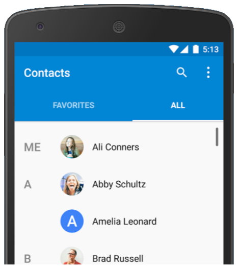
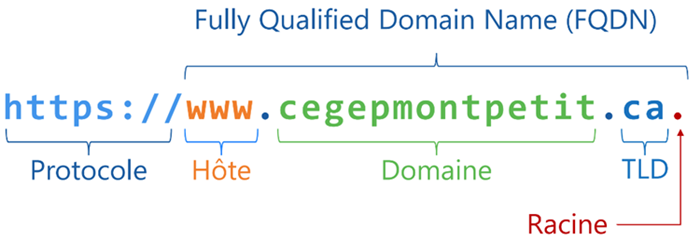
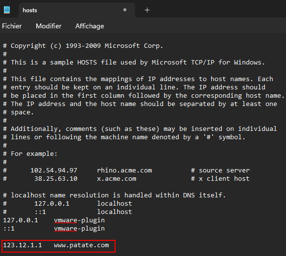

import useBaseUrl from '@docusaurus/useBaseUrl';
import ThemedImage from '@theme/ThemedImage';

# Cours 7

## Domain Name System

Depuis quelques cours maintenant, vous vous familiarisez avec l'utilisation d'adresses IP. Vous avez configuré des adresses IP sur vos serveurs par exemple. Cela dit, comment se fait-il que vous deviez utiliser des adresses IP pour envoyer un *ping* d'une machine à l'autre par exemple ? Ne serait-il pas plus facile d'envoyer un *ping* à une adresse comme `serveur.patate.com`?

Qu'en est-il lorsque vous naviguez sur le web ? Est-il plus facile de retenir www.cegepmontpetit.ca ou 35.203.2.187 ? La question est vite répondu. Imaginez un monde vous deviez vous souvenir de toutes les adresses IP des serveurs web que vous interrogez. Imaginez devoir vous souvenir des adresses IP suivantes:

- Vos réseaux sociaux (chacun d'entre eux ayant un IP différente)
- L'adresse IP d'Omnivox
- L'adresse IP de Spotify si vous écoutez de la musique
- L'adresse IP de YouTube
- L'adresse IP de Google
- L'adresse IP de ChatGPT
- Etc...

## Problématiques avec les adresses IP 🤔

Les adresses IP ne sont pas pratiques pour plusieurs raisons:

- Elles ne sont pas évidentes à retenir, du moins lorsque nous en avons plusieurs à retenir.
- Elles peuvent changer. Un serveur ou un ordinateur n'a pas toujours la même adresse IP.
- Une même adresse IP pourrait héberger plus d'un site web ou plus d'une application.

## La résolution de noms 💡
L'être humain étant ce qu'il est, il a plus de facilité à retenir les noms que les numéros. D'ailleurs, c'est pourquoi vous portez un nom et non pas un numéro (sauf si votre père est Elon Musk). Nous avons donc créé un mécanisme nous permettant de donner des noms à des ordinateurs (eh oui, on leur donne des noms...). Ce mécanisme, c'est le DNS ou le *Domain Name System*.

En analogie à ce principe, nous pourrions penser au répertoire téléphonique dans votre cellulaire. Aujourd'hui, je ne connais plus beaucoup de gens qui se souviennent du numéro de téléphone de leurs proches. On se contente plutôt d'appuyer sur leur nom dans notre répertoire téléphonique. C'est un peu comme cela que fonctionne la résolution de noms également.

## Un nom oui, mais de domaine !?

De quoi parle-t-on lorsqu'on parle de nom de domaine exactement ? Et puis c'est quoi un domaine ? Allons-y donc avec quelques définitions avant d'aller plus loin:

- **Domaine:**  Un domaine est un ensemble d'ordinateurs et de périphériques interconnectés les uns aux autres à travers un réseau local. Au cégep, par exemple, les ordinateurs et les imprimantes sont tous reliés entre eux grâce au réseau de l'établissement. Au lieu de simplement parler du réseau du cégep, on parlera du domaine du cégep. Ce domaine porte un nom: cegepmontpetit.ca. Le nom d'un domaine est généralement représentatif de l'entreprise ou l'institution qui le possède (mais pas obligatoirement).

- **FQDN (Fully Qualified Domain Name):**   Alors, le domaine porte un nom: cegepmontpetit.ca par exemple. Or, chaque appareil membre de ce domaine porte également un nom, que l'on appellera le nom d'hôte (*hostname*). Il y a généralement une logique dans la nomenclature des appareils. Un exemple parmi d'autres pourrait être d'inclure le numéro d'un local suivi d'un numéro associé à l'emplacement de l'ordinateur. Pour le poste 07 du local D-0226, on pourrait obtenir quelque chose comme d0226-07 comme nom d'hôte. Ensuite, on ajoutera le nom de domaine au nom de l'ordinateur pour un nom complet. Par exemple: d0226-07.cegepmontpetit.ca. Ce dernier exemple est ce que l'on nomme FQDN (*Fully Qualified Domain Name*). C'est le nom complet d'un poste dans un domaine. On pourrait facilement en faire l'analogie avec votre propre prénom et votre nom de famille. Votre prénom vous identifie en tant qu'individu unique, puis votre nom de famille indique votre appartenance à un groupe. C'est exactement le même principe avec les noms de domaine.

     
    *Chaque caractère d'un nom de domaine a une utilité et nous nous y attarderons très prochainement*

### Comment ça fonctionne ?

Une résolution de nom comporte un bon nombre d'étapes. Néanmoins, le processus a tellement bien été ficelé au fil du temps, que le processus prend moins de temps qu'il en faut pour cligner un oeil. Alors que se passe-t-il exactement lorsque vous tapez [www.patate.com](https://img.freepik.com/photos-gratuite/autocollant-drole-pomme-terre-visage_23-2148740793.jpg?t=st=1733952670~exp=1733956270~hmac=59caf559765b6cbfdec48d165d9b78632d30d6c9c08fcf3447ef69766d3d0e3d&w=1380) dans votre navigateur internet ? Analysons cela:

#### Étape 1 : Le fichier hosts

Votre ordinateur commencera par vérifier s'il possède l'adresse IP correspondante à l'adresse que vous avez tapé dans son fichier `hosts`. Le fichier `hosts` est présent dans **tous** les ordinateurs. Ce fichier possède des associations nom:adresse ip et il possède la priorité absolu lorsque vient le temps de résoudre un nom. Voici la représentation du fichier `hosts` sous Windows par exemple:

Vous vous en doutez surement, j'ai moi-même ajouté la ligne concernant patate.com. Quel en sera l'incidence ? Eh bien c'est assez simple, s'il vient un moment où je tente de joindre le site concerné, mon ordinateur communiquera immédiatement avec l'adresse IP qui lui est associé dans le fichier, c'est à dire `123.12.1.1`.

> *Mais Gabriel, pourquoi n'utilisons tout simplement pas le fichier hosts pour résoudre toutes nos adresses IP ?*
>
>-Les étudiants

En fait, ce serait très complexe de fonctionner ainsi. En 2022, on estimait à près de deux milliards le nombre de site web présent sur le web. On estimait également le nombre d'utilisateur à plus de cinq milliards. Si nous utilisions les fichiers `hosts` pour résoudre les noms de domaine, nous aurions plusieurs milliards de fichiers à mettre à jour régulièrement. Cela générerait un trafic épouvanatable sur les différents réseaux qui soutiennent internet, en plus de ne pas être efficace.

#### Étape 2 : Mémoire cache du client

Dans le cas ou le nom de domaine que vous tentez de résoudre ne fait pas parti du fichier `hosts`, l'ordinateur vérifiera si vous avez déjà visité le site web recherché par le passé. Par exemple, il n'est pas rare d'accéder au site de Google plusieurs fois par jour. Lorsqu'un nom de domaine est résolu, le client conservera en mémoire l'adresse IP qui est associé à ce nom de domaine durant un certain temps. Ce type de mémoire est appellé la mémoire cache. Ainsi, lorsque vous tenterez de résoudre une deuxième fois le même nom de domaine, la résolution du nom en adresse IP sera pratiquement instantannée.

:::caution[La mémoire qui joue des tours]
Bien qu'elle accélère grandemment la résolution de certains noms de domaine, la mémoire cache peut parfois nous jouer des tours. En effet, comme les adresses IP peuvent changer, l'association entre un nom et une IP peut être vraie à un certain moment et ne plus être valide quelques heures plus tard. Or, si la mémoire n'est pas mise à jour assez régulièrement, elle peut se retrouver avec une mauvaise association entre un nom et une adresse. C'est pourquoi il faudra parfois vidé la cache du navigateur et/ou du PC.
:::

#### Étape 3 : Votre propre serveur DNS

Après avoir vérifié dans son fichier `hosts` ainsi que dans sa mémoire cache, si votre ordinateur n'est toujours pas en mesure de traduire le nom de domaine en adresse IP, il enverra une requête à votre propre serveur DNS. 

:::tip[Le saviez-vous ?]
Nous avons tous un serveur DNS à la maison. À moins que vous en ayez configuré un spécifique, il s'agit de votre modem-routeur. En effet, c'est à lui que sont transférés les requêtes DNS que votre ordinateur n'arrive pas à résoudre par lui-même.
:::

    <ThemedImage
        alt="Schéma"
        sources={{
            light: useBaseUrl('/img/Serveurs1/3PremieresEtapes_W.gif'),
            dark: useBaseUrl('/img/Serveurs1/3PremieresEtapes_D.gif'),
        }}
    />

Que fera votre modem/routeur avec cette requête DNS ? Deux choses:
 
1. Votre modem/routeur possède, lui aussi, une mémoire cache. Il se peut que quelqu'un sur le réseau local ait déjà demandé à résoudre le nom de domaine que vous tentez de récupérer. Dans le cas échéant, le modem-routeur aura stocké le résultat de cette traduction dans sa mémoire et pourra donc vous fournir l'information adéquate.

2. Dans le cas où le modem-routeur n'aurait pas l'information recherchée dans sa mémoire. Il entâmera un processus de résolution complet. Processus auquel nous nous attarderons dès maintenant.