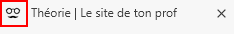

import CPen from '@site/src/components/CPen';

# Théorie

## Qu'est-ce que du HTML ? 🤔

Le langage **HTML** *(HyperText Markup Language)* constitue ce que l'on nommera un langage de programmation interprété. Ce type de langage de programmation ne nécessite aucune compilation. La machine lit le contenu du fichier tel que vous l'écrivez et entreprend les actions conséquentes (à la manière d'un script). D'ailleurs, les mots que vous lisez en ce moment même apparaissent dans le code **HTML** de ce site.

Tous les sites web, ultimement, utiliseront du code **HTML** pour leur site web. Voici un exemple basique de code **HTML**. 👇

<CPen id="PwzapdN" title="Demo" />

## Le serveur ? Obligatoire ?

Évidemment, lorsqu'on pense à différents sites web, on pense forcément aux salles de serveurs. Or, pour utiliser **HTML**, on n’a nullement besoin d'un serveur. On peut tout simplement créer un fichier **HTML** sur son pc et lorsque vous double-cliquerez sur celui-ci, le navigateur interprétera le code à l'intérieur de celui-ci.

> *Oui, mais Gabriel, comment on fait ça un fichier HTML?*
>
> *-Les étudiants* 

Comme on fait un fichier *.txt*, tout simplement. On ouvre le bloc-notes ou même vscode si vous préférez, puis vous tapez votre code. Lorsque vient le temps d'enregistrer, enregistrez votre fichier au format *.html*.

**Exemple:**

```html title='demo.html' showLineNumbers
<h1>Mon site web</h1>
<p>Bienvenue sur ma page web!</p>
```

## Comment ça fonctionne ? ⚙️

C'est plus simple qu'on pourrait le croire. Le langage **HTML** décrit la structure d'une page web à l'aide de mots clés. Ces mots clés, on les appelle des balises. Dans les exemples précédents, vous avez d'ailleurs vu les balises `<h1>` et `<p>`. Chaque balise précise des informations au navigateur qui les traitera.

Dans le cadre de cours, vous devrez apprendre les rudiments du **HTML**. 

:::caution[Il ne s'agit pas d'un cours de programmation]
Évidemment, il ne s'agit pas d'un cours de programmation. Or, vous devez tout de même être en mesure de repérer certains éléments clés d'une page web afin de vous y retrouver un peu. L'objectif est que vous puissiez vous créer vous-mêmes des repères spécifiques lorsque vous tentez de déboguer des services web et/ou internet.
:::

## Structure d'une page HTML 🩻

Le code au sein d'un fichier **HTML** doit respecter une structure précise. Cette structure constitue le squelette d'une page web. Sur ce squelette, on appuiera toutes les caractéristiques et le contenu la page web.

### Le document HTML

Tous les documents **HTML** doivent commencer avec la déclaration suivante : `<!DOCTYPE html>`. Cette balise indique au navigateur que les lignes qui suivent seront en **HTML**.

>*Oui mais Gabriel, dans tes exemples plus haut il n'y avait pas ça.*
>
>*-Les étudiants*

Vous marquez un point 💯. C'est qu'aujourd'hui, les navigateurs ont grandemment évolués et ils sont capable de détecter le code qu'on leur envoie. Néanmoins, nous parleront des bonnes pratiques à emprunter prochainement et cette balise en fait partie. Prenez donc l'habitude de l'inscrire, même si vous avez l'impression qu'elle ne sert à rien.

### La balise HTML

Tout le code **HTML** doit se retrouver entre les balises `<html>`. C'est ce qui indique au navigateur où débute et où se termine le code.

>*Les balises..?*

Oui, vous avez bien compris: **les** balises. Les balises doivent être ouvertes et fermées et, malheureusement, pas toujours de la même façon. Je vous explique ci-dessous. 👇

:::info[Ouverture et fermeture]
Une balise **HTML** doit <u>toujours</u> être ouverte ET fermée. Certaines balises, comme la balise `<html>` doivent être écrites à l'ouverture et à la fermeture.
```html title='Exemple' showLineNumbers
<html>
    [...]
</html>
```

D'autres balises, cependant, sont ouvertes et fermées dans la même déclaration, notamment la balise `` pour les images.
```html title='Exemple' showLineNumbers

                                                    ^ <!--Remarquez la barre oblique en fin de balise-->                                                    
```
:::

### La balise HEAD 💆

Le contenu de la balise `<head>` n'est jamais affiché. Cette balise contiendra d'autres balises qui permettront de définir certains comportements de la page web. À titre d'exemple, le petit icône qui apparait sur l'onglet du navigateur est définit dans la portion `<head>` de votre page web. Il en va de même pour l'affichage des accents de la langue française, etc. C'est aussi dans la balise `<head>` que l'on définira le titre de la page qui sera affiché sur l'onglet du navigateur web.

<div style={{textAlign: 'center'}}>
    
</div>

### La balise BODY 💪

Le contenu de la balise `<body>`, au contraire de la balise `<head>`, est affiché aux utilisateurs via le navigateur. Ce que vous y mettrez sera donc ce que vous voulez faire afficher. Si vous voulez faire afficher du texte, une image ou même un formulaire, ce dernier devra se trouver à l'intérieur des balises `<body>`. C'est la section dans laquelle vous travaillerez le plus souvent de votre temps.

## Comme des poupées russes 🪆

Ce système de balises, qui permet au navigateur de comprendre comment il doit structurer la page web, fonctionne à la manière de poupées russes. Les balises `<body>` et `<head>`, qui contiennent elles aussi d'autres balises, sont à l'intérieur de la balise `<html>`. Le tout dessine alors une structure. Comment peut-on, à l'aide de simples balises, faire comprendre au navigateur qu'une balise est à l'intérieur d'une autre ? **L'indentation!**

<CPen id="RNRJZWO" title="Structure" />

## Balises de base

Voici quelques balises qui vous permettront de commencer lentement votre apprentissage du code **HTML**

:::caution
Plusieurs de mes exemples ne vous présenteront que le code nécessaire à l'exemple (sans la section *head* et la déclaration *DOCTYPE*). Ceci étant dit, les balises obligatoires sont bien présentes, elles sont simplement cachées.
:::

### Les titres et les sous-titres 

En langage **HTML**, on utilisera les balises `<h1>` à `<h5>` pour créer des titres et des sous-titres.

<CPen id="dPXEjXz" title="Titres et sous-titres" />

### Les paragraphes 📰

Tôt ou tard, votre site web devra bel et bien contenir du texte. En **HTML**, on utilisera la balise `<p>` pour définir des paragraphes. C'est dans ces paragraphes que vous pourrez écrire votre texte.

<CPen id="KwMLBXP" title="Paragraphes" />

### Les liens 🖇️

Un lien permet à un utilisateur de cliquer sur du texte et d'être renvoyé vers une autre page de votre propre site web ou même carrément un autre site web. On utilisera la balise `<a>` pour créer un lien. Cette balise nous permettra d'apprendre ce que sont les **attributs**. Un attribut permet de préciser le comportement d'une balise dans un contexte précis. Dans le cas d'un lien, l'attribut nous permettra de définir vers où exactement on souhaite rediriger l'utilisateur. On reconnait les attributs, car elles sont placées au sein d'une balise et doivent être définies au même titre qu'une variable en programmation.

```html title='Exemple' showLineNumbers
<a href="mapage2.html">Cliquez ici</a>
    ^ <!--L'attribut href me permet de définir la destination du lien-->                                                    
```

### Les images 🖼️

Vous l'aurez sans doute deviné, la balise `` vous permettra de faire afficher des images sur votre site web. La balise `` est auto-fermante, vous n'avez donc pas à l'écrire deux fois. Néanmoins <u>**vous devez la fermer avec une barre oblique en fin de déclaration**</u>. Avec cette balise, vous serez amené à utiliser les attributs suivants:

- `src`: Le chemin vers l'image que vous voulez afficher.
- `alt`: Un texte de remplacement en cas de problème avec l'image (obligatoire pour satisfaire aux bonnes pratiques).
- `height`: Hauteur de l'image.
- `width`: Largeur de l'image.

```html title='Exemple' showLineNumbers
                                                  
```

<CPen id="xbONaZW" title="Liens et images" />