# Installation de VMware Workstation

L'entreprise VMware domine le marché de la virtualisation depuis quelques années maintenant. Il serait impensable de réaliser vos études en informatique sans prendre le temps de connaître et d'exploiter quelques-uns de leurs produits populaires.

Ce tutoriel vous offre les étapes à suivre afin de bénéficier du logiciel VMware Workstation Pro tout à fait gratuitement et surtout, **légalement.**

## Étape 1 - Création d'un compte Broadcom

Dirigez-vous sur [le site de broadcom](https://support.broadcom.com/), l'entreprise propriétaire de VMware. Cliquez sur le bouton `Register`, en haut à droite de la page.

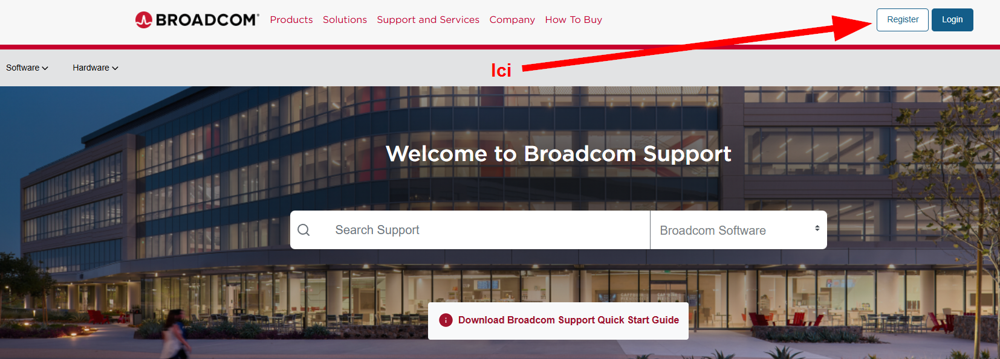

Utilisez votre courriel du cégep pour vous créer un compte sur le site de Broadcom. 👇

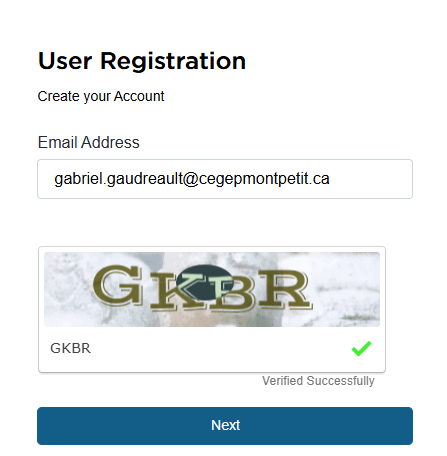

Un courriel avec un code de vérification vous sera alors envoyé sur votre courriel du Cégep pour confirmer la validité du courriel. Utilisez ce code pour valider la création de votre nouveau compte.

Prenez soins de remplir tout le formulaire 🙄. Les champs sont pratiquement tous obligatoires.

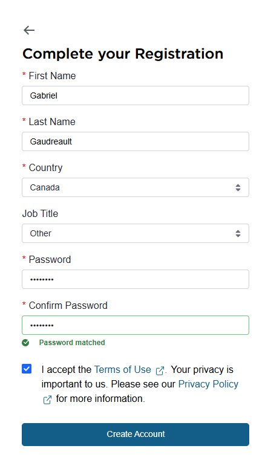

Cliquez alors sur `create account`. On vous proposera alors de compléter votre profil plus en profondeur pour permettre le déblocage de services supplémentaires. **Pas besoin!** Contentez-vous plutôt de cliquer sur `i'll do it later` (oops, un petit mensonge).

## Étape 2 - Ouvrez une session sur le site de Broadcom

Depuis [la page d'accueil de Broadcom](https://support.broadcom.com/), cliquez cette fois sur `Login`. Utilisez votre courriel du cégep pour vous identifier (ou celui que vous avez précédemment utilisé pour vous créer un compte).

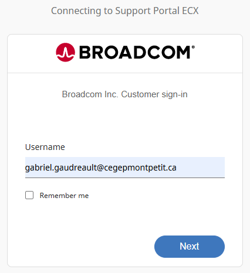

Une fois bien identifié, vous serez redirigé vers votre *Dashboard*.

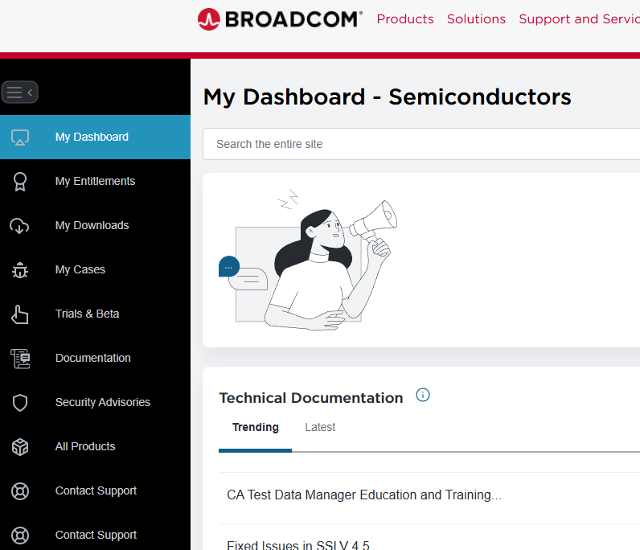

## Étape 3 - Téléchargez VMware Workstation Pro

Depuis votre *Dashboard*, cliquez sur `My Downloads` dans le volet de gauche (référez-vous à l'image ci-dessus au besoin). Dans la section où vous serez amené, un petit rectangle vert devrait apparaître et vous afficher le texte *Free Software Downloads available HERE*. Cliquez spécifiquement sur le mot *HERE*.

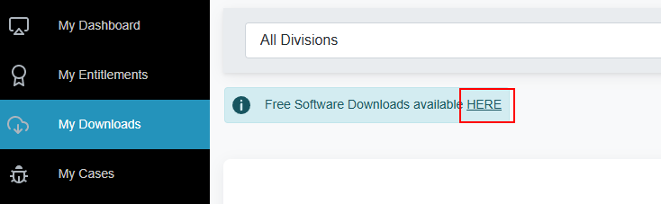

Une liste de logiciels complètement gratuits s'affichera, dont plusieurs produits VMware. Il ne vous reste qu'à repérer `VMware Workstation Pro` et cliquer sur ce-dernier.

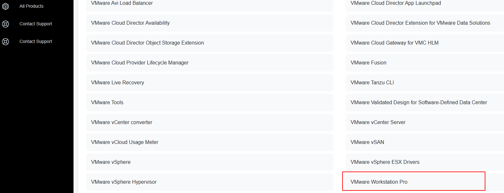

Sélectionnez alors le système d'exploitation qui vous concerne (fort probablement Windows) et cliquez sur la dernière version. Au jour où j'écris ce tutoriel, la version à jour est la 17.6.4

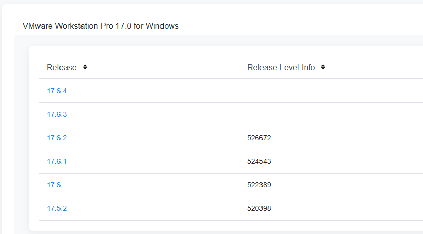

En cliquant sur le numéro de version, vous ferez apparaître la page de téléchargement. Pour lancer le téléchargement, vous devrez réaliser quelques étapes:

1. Cliquez sur le lien vers les termes et les conditions. <mark>Vous ne pourrez pas accepter les termes et les conditions sans d'abord ouvrir la page qui les contient.</mark>

2. Acceptez les termes et les conditions en cliquant dans la case correspondante.

3. Lancer le téléchargement (ENFIN!)

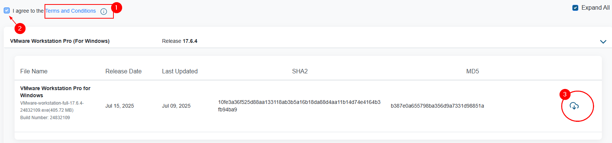

**SURPRISE!!! 😫**

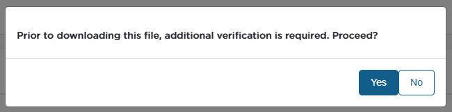

Comme vous pouvez le constater dans l'image précédente, Broadcom aime bien nous rendre la vie difficile. Malheureusement nous n'avons pas le choix de se soumettre aux vérifications supplémentaires, donc il vous faudra cliquer sur `Yes`. 

Vous arriverez alors sur un formulaire qui vous demandera des informations supplémentaires telles que votre adresse, votre code postal ainsi qu'un échantillon de sang. 😂 Bon, j'exagère, mais c'est presque ça. Remplissez l'ensemble du formulaire. À vous de décider si vous donner vos réelles informations personnelles à Broadcom. Personnellement, je mets une adresse bidon.

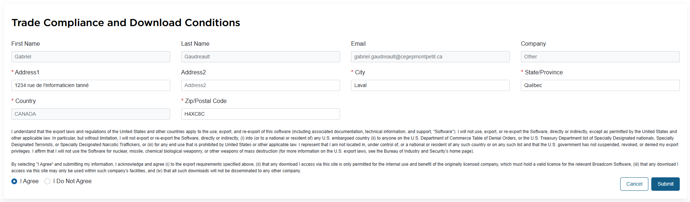

Cliquez sur `Submit` et faites une prière 🙏. Vous devriez revenir à la page de téléchargement initiale (celle avec le petit nuage). Cliquez sur ce-dernier et... Hallelujah! Un exécutable se télécharge enfin.

## Étape 4 - Installation

Le plus dur est dernière vous! Il ne reste qu'à installer. Il ne reste qu'à lancer l'installation en tant qu'administrateur et suivre les instructions. Allez, à vos *VMs*!

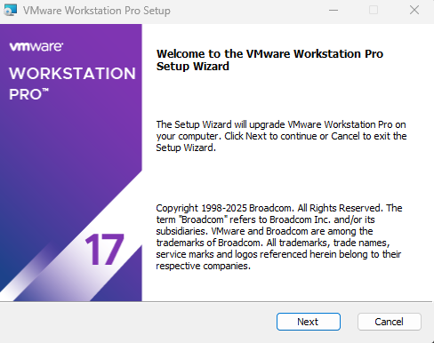