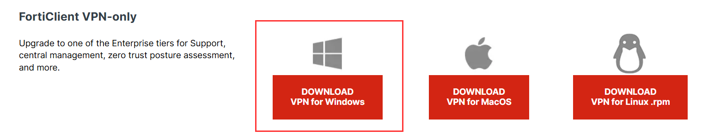
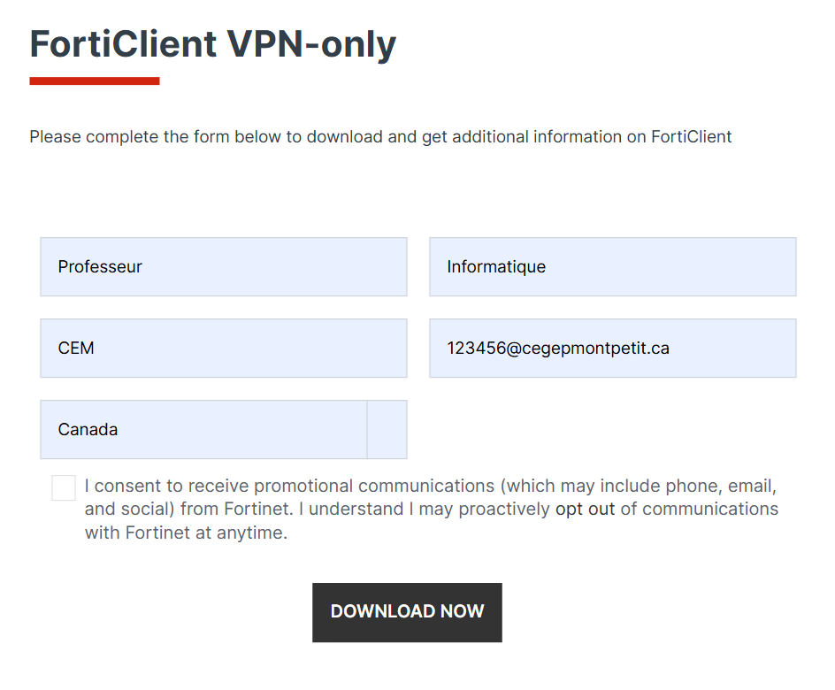
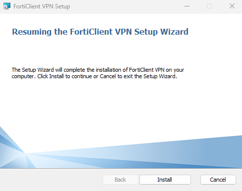
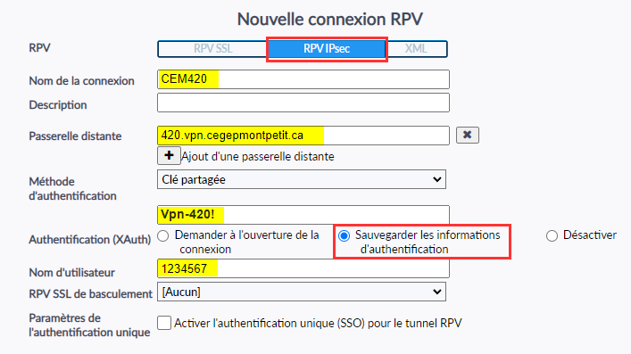
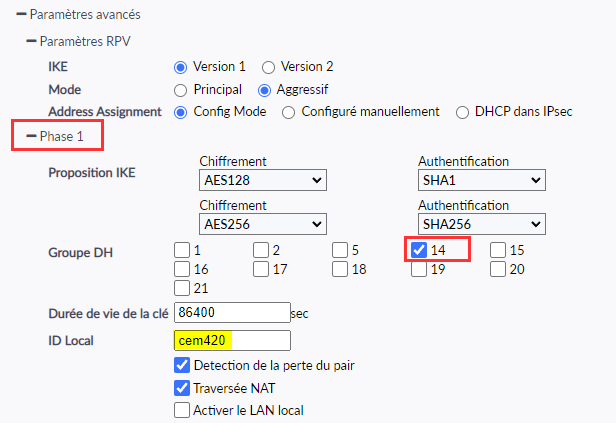
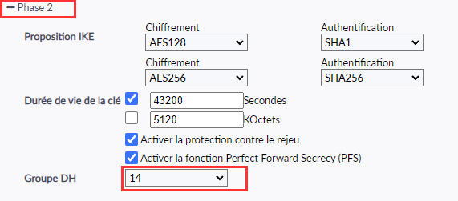
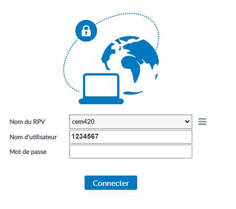

# Configuration du VPN pour les étudiants du CEM

Les étudiants de au programme « Techniques de l'informatique » bénéficient d'un accès externe à l'infrastructure virtuelle « LabInfo » par le biais d'une connexion privée et sécurisée. Cette page vous explique comment installer et configurer cet accès à l'aide du logiciel FortiClient.

## Téléchargement du logiciel ⬇️

Vous devez d'abord procéder au téléchargement du logiciel *FortiClient VPN-Only*. Pour ce faire:

1. Cliquez sur [ce lien](https://www.fortinet.com/support/product-downloads#vpn).
2. Sélectionnez votre système d'exploitation:
    
3. Répondez aux questions qui vous sont demandées **<mark>à l'aide de vos informations</mark>**
    
4. Cliquez sur *Download Now*
5. Sélectionnez de nouveau votre système d'exploitation:
    

## Installation du logiciel ⚙️

1. Lancez l'exécutable (fichier .exe) en double-cliquant sur celui-ci.
    
2. Cliquez sur *Install*
3. Il n'y a rien à faire durant le processus d'installation. Laissez ce-dernier s'exécuter jusqu'à ce que vous puissiez cliquer sur *finish*.
4. Une fois le programme d'installation terminé, <u>redémarrez votre poste de travail.</u>

## Configuration de la connexion 🌐

1. Lancez le logiciel *FortiClient VPN*
2. Ajoutez une nouvelle connexion et configurez la comme suit:
    - **RPV**: RPV IPsec
    - **Nom de la connexion**: CEM420
    - **Passerelle Distante**: 420.vpn.cegepmontpetit.ca
    - **Méthode d'authentification**: Clée partagée
        - **La clé est:** Vpn-420! (V majuscule et point d'exclamation à la fin)
    - **Authentification (XAuth)**: Sauvegarder les informations
        - **Nom d'utilisateur**: Votre identifiant du collège (matricule)

    

3. Dans les paramètres avancés:
    - **Phase 1**:
        - **Groupe DH**: 14
        - **ID Local**: cem420

    

    - **Phase 2**:
        - **Groupe DH**: 14

    

4. **Sauvegardez!**

## Ouvrez une session 👨‍🎓

Une fois que vous avez enregistré vos paramètres, ouvrez une session en entrant votre mot de passe et en cliquant `Connecter`.

    

Si l'authentification réussi, vous serez en mesure d'atteindre [LabInfo](https://labinfo.cegepmontpetit.ca).

:::caution
Prenez note que vous serez automatiquement déconnecté après 60 minutes d'inactivité. Autrement, vous devrez vous déconnecter vous-mêmes.
:::