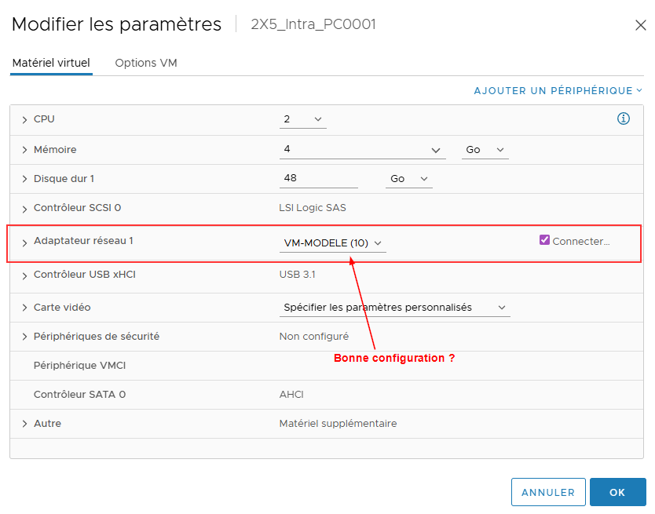
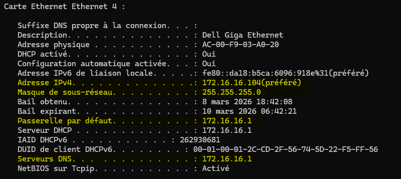
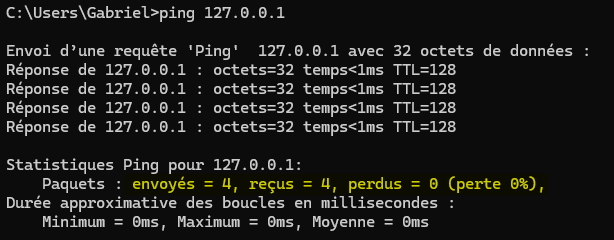
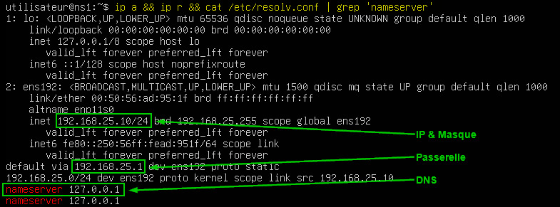

import Tabs from '@theme/Tabs';
import TabItem from '@theme/TabItem';

# Débogage : Perte d'accès réseau

À travers vos différents laboratoires et l'ensemble de vos études en informatique, plus précisément en réseautique, il ne sera pas rare que vous soyez confronté à toutes sortes de pannes. La plus commune d'entre elles est, sans doute, la perte de connexion réseau et/ou internet.

Sur cette page, je vous partage une marche à suivre pour vous aider à résoudre ce genre de situation. 

## Étape 0 : Ne supposez rien!

Une grande majorité des erreurs en réseau vient simplement du fait que les étudiants tiennent un certain nombre d'éléments pour acquis. Dans les 15 dernières années, en tant qu'enseignant, l'une des phrases que j'ai entendues le plus souvent dans ma vie est sans doute :

>*Je suis certain que ___________ est bien configuré, Monsieur.*
>
>*- Un étudiant trop sûr de lui*

<span class='red-text'>**Ne tenez jamais rien pour acquis et ne supposez jamais qu'un élément de base est bien configuré parce que vous l'avez configuré maintes fois.**</span> J'ai plusieurs années d'expérience en informatique et il m'arrive encore de faire des fautes de frappe dans mes adresses IP...

Revérifiez tout!

---

## Étape 1 : La couche physique (le câblage)

La couche physique correspond aux câbles qui relient vos ordinateurs aux différents commutateurs et routeurs. La plupart du temps, vous réaliserez vos laboratoires à l'aide de machines virtuelles. Dans cette situation, la couche physique représente la configuration de vos machines virtuelles dans vSphere, et plus particulièrement de vos cartes réseau. 

Durant cette étape, vérifiez la configuration de vos machines virtuelles et posez-vous les questions suivantes :

- La case **Connecter lors de la mise sous tension** est-elle bien cochée dans les paramètres de la carte réseau ? (C'est l'équivalent de brancher le câble !).
- Sur quel commutateur virtuel cette *VM* devrait-elle être reliée ?
- Est-ce que la configuration de ma *VM* correspond bien au schéma du laboratoire qui m'a été présenté ?



---

## Étape 2 : L'interface locale (la configuration IP du pc)

Vous avez fait les vérifications de l'étape précédente ? Les avez-vous vraiment faites ou simplement tenues pour acquises 😉 ? Bien, nous allons donc passer à la vérification de l'interface locale. Durant cette étape, vérifiez les éléments suivants :

- Votre configuration IP est statique ou dynamique ?
- Dans le cas d'une configuration IP statique, avez-vous configuré tous les éléments nécessaires ? (adresse, masque, passerelle, DNS...)
    - Dans le cas où la configuration est incomplète ou erronée (attention aux fautes de frappe), corrigez-la.
- Dans le cas d'une configuration dynamique, avez-vous reçu toutes les informations nécessaires ? (`ipconfig /all` ou `ip a`)
    - Dans le cas où la configuration est incomplète (ex. : adresse APIPA `169.254.x.x`), investiguez du côté du serveur DHCP.
- Êtes-vous capable d'envoyer un paquet `ping` à l'adresse de boucle locale `127.0.0.1` ? (Cela confirme que la carte réseau fonctionne et que le système d'exploitation n'a pas de problématique avec sa propre pile TCP/IP).

### 2.1 : Windows 

Sous Windows, vous pouvez effectuer les vérifications à l'aide des commandes ci-dessous :

Ex: `ipconfig /all`



Ex: `ping 127.0.0.1`



### 2.2 : Linux

Sous Linux (plus particulièrement sous l'édition serveur), vous devez utiliser une combinaison de commandes pour obtenir les mêmes informations. Cela dit, rien ne vous empêche d'entrer les commandes sur une même ligne comme suit :

```bash
ip a && ip r && cat /etc/resolv.conf | grep 'nameserver'
```


*Note : Sous Linux, la commande `ping` s'exécute à l'infini par défaut. Utilisez `ping -c 4 127.0.0.1` pour n'envoyer que 4 paquets, comme sous Windows.*

---

## Étape 3 : Le réseau local (communication à l'interne)

À cette étape, nous désirons vérifier que l'ordinateur peut communiquer avec son réseau immédiat (la plage IP dans laquelle il est configuré).

- Êtes-vous en mesure d'envoyer un paquet `ping` à la passerelle par défaut du réseau (votre routeur) ?
    - Si vous en êtes incapable, revérifiez votre masque de sous-réseau (êtes-vous vraiment dans le même réseau que la passerelle ?).
    - Vérifiez ensuite si la passerelle est bien démarrée et bien configurée.

---

## Étape 4 : L'accès externe (la passerelle fait-elle son travail ?)

Lors de cette étape, nous désirons confirmer que l'ordinateur peut communiquer au-delà de son réseau local, vers le réseau externe (internet).

- Êtes-vous en mesure d'envoyer un paquet `ping` à l'adresse IP `8.8.8.8` (serveur de Google) ?
    - Si vous en êtes incapable, le problème se situe au niveau du **routage**. Vérifiez les configurations de votre passerelle (NAT, règles de pare-feu, routes par défaut). 
- Êtes-vous en mesure d'envoyer un paquet `ping` vers le nom de domaine `google.com` ?
    - Si le ping `8.8.8.8` fonctionne, mais que le ping `google.com` échoue, vous venez de trouver le coupable : **c'est un problème de serveur DNS**. Vérifiez les configurations DNS de votre client.

## Pour conclure

:::danger La Base
**Ne supposez rien !** Vérifiez toujours que les adresses IP sont exactes et sans fautes de frappe avant de chercher un problème plus complexe.
:::

<Tabs groupId="os-choice">
  <TabItem value="windows" label="Environnement Windows" default>

  | Étape | Objectif | Commandes / Actions |
  | :--- | :--- | :--- |
  | **1. Physique** | Le câble est-il branché ? | **vSphere :** *Connect at power on* coché ? Le bon commutateur est sélectionné ? |
  | **2. Interface** | Ma carte réseau fonctionne-t-elle ? | `ipconfig /all` *(Vérifier si APIPA 169.254.x.x)* <br/> `ping 127.0.0.1` |
  | **3. Local** | Puis-je parler à mon routeur ? | `ping <IP_DE_LA_PASSERELLE>` |
  | **4. Externe** | Le routeur laisse-t-il sortir ? | `ping 8.8.8.8` <br/> *(Si échec = problème de routage/passerelle)* |
  | **5. Nom** | Le DNS fonctionne-t-il ? | `ping google.com` <br/> *(Si `8.8.8.8` fonctionne mais pas ça = problème DNS)* |

  </TabItem>
  <TabItem value="linux" label="Environnement Linux">

  | Étape | Objectif | Commandes / Actions |
  | :--- | :--- | :--- |
  | **1. Physique** | Le câble est-il branché ? | **vSphere :** *Connect at power on* coché ? Le bon commutateur est sélectionné ? |
  | **2. Interface** | Ma carte réseau fonctionne-t-elle ? | `ip a` <br/> `ping -c 4 127.0.0.1` |
  | **3. Local** | Puis-je parler à mon routeur ? | `ping -c 4 <IP_DE_LA_PASSERELLE>` |
  | **4. Externe** | Le routeur laisse-t-il sortir ? | `ping -c 4 8.8.8.8` <br/> *(Si échec = problème de routage/passerelle)* |
  | **5. Nom** | Le DNS fonctionne-t-il ? | `ping -c 4 google.com` <br/> *(Si `8.8.8.8` fonctionne mais pas ça = problème DNS)* |

  </TabItem>
</Tabs>